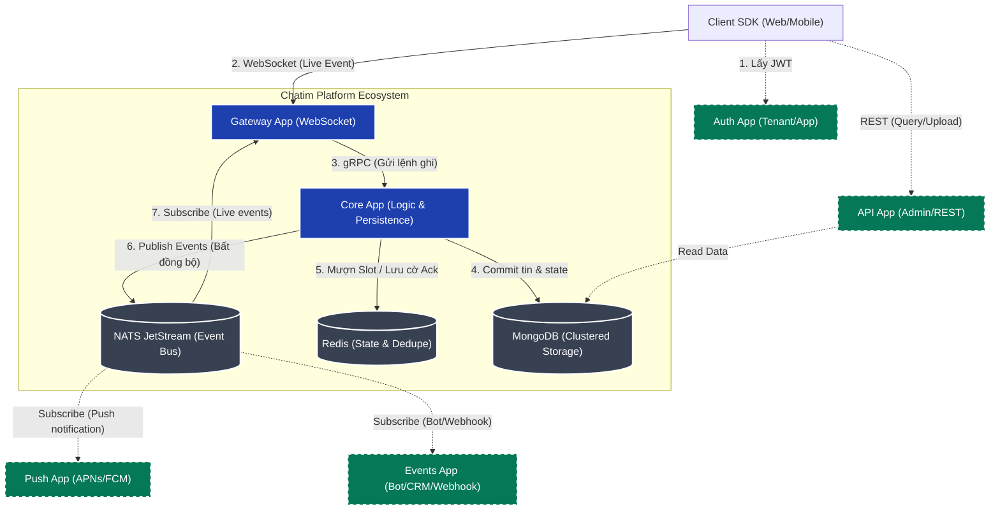
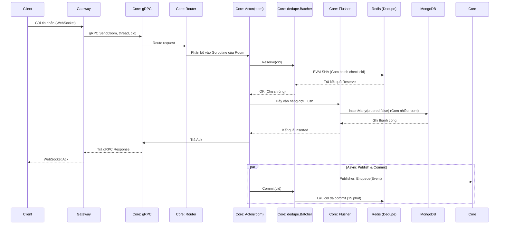
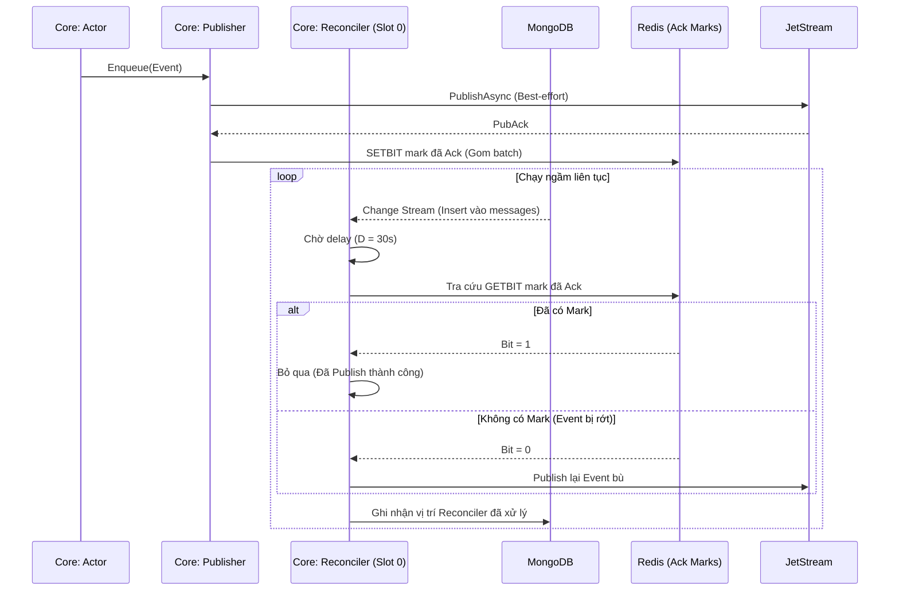
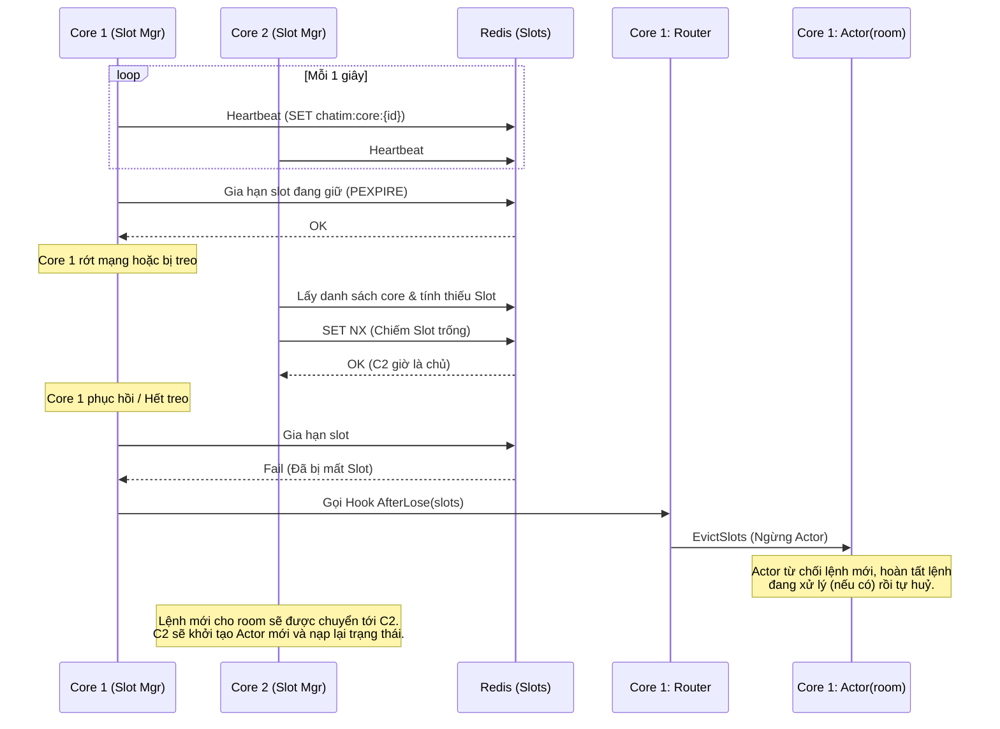

# Kiến trúc Components Hệ thống Chatim

> Ngày: 2026-10-04

Tài liệu này mô tả sơ đồ components ở tầng kiến trúc vĩ mô (Macro-Architecture) và cấu trúc module bên trong của hệ thống `chatim`, bổ sung cho tài liệu thiết kế gốc [260930-chat-core-gateway-design.md](./260930-chat-core-gateway-design.md).

## 1. Sơ đồ Concept Tổng quát (Macro-Architecture)

Sơ đồ này thể hiện `chatim` là một hạ tầng nền tảng (CPaaS). `core` chịu trách nhiệm ghi và xử lý logic nhất quán, kết hợp với `NATS JetStream` làm Event Bus để mở rộng khả năng phối hợp với các app khác.



## 2. Sơ đồ Tương tác Module Nội bộ (App-level Components)

Sơ đồ thể hiện luồng giao tiếp giữa các package nội bộ (internal modules) của 2 app chính là `core` và `gateway`.

```mermaid
flowchart TB
    %% Gateway Modules
    subgraph App_Gateway ["Gateway App (internal/*)"]
        WS["ws (WebSocket Server)"]
        Authn["authn (JWT Validator)"]
        Session["session (Client State)"]
        Interest["interest (NATS Routing)"]
        Fanout["fanout (Broadcaster)"]
    end

    %% Core Modules
    subgraph App_Core ["Core App (internal/*)"]
        GRPCSrv["grpcsrv (gRPC Server)"]
        Router["actor (Router)"]
        Actor["actor (Room Actor)"]
        Batcher["dedupe (Batcher)"]
        Flush["flush (Flusher)"]
        Publish["publish (Publisher)"]
        Slot["slot (Slot Manager)"]
        Reconcile["reconcile (Reconciler)"]
    end

    %% Infrastructure Data
    Infra_DB[("MongoDB (WiredTiger)")]
    Infra_Redis[("Redis")]
    Infra_NATS[("NATS JetStream")]

    %% --- Gateway flow ---
    WS --> Authn
    Authn --> Session
    Session --> Interest
    Interest -->|Sub/Unsub| Infra_NATS
    Infra_NATS -->|Live Event| Fanout
    Fanout -->|Encode 1 lần, Fan-out nhiều| Session
    Session -->|Send Command| GRPCSrv

    %% --- Core Flow ---
    Slot <-->|Heartbeat & Lease| Infra_Redis
    Slot -.->|Evict slots| Router
    
    GRPCSrv -->|Command| Router
    Router -->|1 Goroutine / Room| Actor
    
    Actor <-->|Reserve/Commit CID| Batcher
    Batcher <-->|EVALSHA| Infra_Redis
    
    Actor -->|Append Doc| Flush
    Flush -->|insertMany| Infra_DB
    
    Actor -->|1. Ack Client| GRPCSrv
    Actor -->|2. Enqueue Event| Publish
    
    Publish -->|PublishAsync| Infra_NATS
    Publish -->|Lưu cờ đã Ack| Infra_Redis
    
    %% --- Reconciler Flow ---
    Infra_DB -.->|Change Stream| Reconcile
    Infra_Redis -.->|Check cờ Ack| Reconcile
    Reconcile -.->|Publish bù (nếu rớt)| Infra_NATS

    %% Styling
    classDef module fill:#0f172a,stroke:#3b82f6,color:#e2e8f0,stroke-width:1px;
    classDef infra fill:#374151,stroke:#fff,color:#fff,stroke-width:2px;
    classDef highimpact fill:#7f1d1d,stroke:#f87171,color:#fff,stroke-width:2px;
    
    class WS,Authn,Session,Interest,Fanout,GRPCSrv,Router,Batcher,Publish,Slot module;
    class Infra_DB,Infra_Redis,Infra_NATS infra;
    class Actor,Flush,Reconcile highimpact;
```

## 3. Các Flow Kỹ Thuật Đặc Biệt Chú Ý

Từ sơ đồ module ở trên, có 3 flow chính mang tính quyết định đến kiến trúc và hiệu năng của hệ thống:

1. **Luồng Ghi & Chống Trùng (Write Path & Batcher)**
   - **Đường đi:** Client → Gateway (`session`) → Core (`grpcsrv`) → `actor` → `flush` → MongoDB.
   - **Đặc điểm:** Tối ưu hoá thông qua `dedupe.Batcher` (gom lệnh check Redis) và `flush` (gom lệnh ghi Mongo thành `insertMany`).

2. **Luồng Phát Sự Kiện & Đối Soát (Event Publisher & Reconciler)**
   - **Đường đi:** MongoDB Change Stream → `reconcile` (đối chiếu Redis mark) → NATS JetStream.
   - **Đặc điểm:** Tách biệt đường ghi và đường publish để giảm độ trễ (Ack client trước khi Publish). Reconciler đóng vai trò sửa sai, đảm bảo Eventual Consistency.

3. **Luồng Quản Lý Phân Mảnh (Slot Ownership & HA)**
   - **Đường đi:** Redis Lease ↔ `slot` → `actor` (Router).
   - **Đặc điểm:** Áp dụng Rendezvous Hash để chia tải (Slot). Đảm bảo mỗi room chỉ có đúng 1 Goroutine xử lý tại 1 thời điểm trên toàn Cluster để tránh Race Condition.

---

### Sơ đồ chi tiết: 1. Luồng Ghi & Chống Trùng (Write Path & Batcher)

Luồng này mô tả đường đi của một tin nhắn từ Client xuống tới DB, nhấn mạnh cách `core` ưu tiên chốt ghi thành công xuống Database nhanh nhất có thể bằng Batching (cả trên Redis dedupe lẫn MongoDB insert).



### Sơ đồ chi tiết: 2. Luồng Phát Sự Kiện & Đối Soát (M2a.2)

Flow này giải quyết bài toán "Publish Best-effort" để tốc độ Write Path không bị nghẽn bởi hạ tầng queue (NATS), trong khi Reconciler đảm bảo tỷ lệ chuyển phát là 100% (không rơi rớt event).



### Sơ đồ chi tiết: 3. Luồng Quản Lý Phân Mảnh (Slot Ownership & HA)

Cơ chế Lease (thuê) Slot qua Redis. Khi sự cố xảy ra, `Router` phải huỷ quyền quản lý cũ (Evict) để nhường đường cho Core mới tiếp quản, đảm bảo không có 2 Goroutine cùng xử lý 1 Room.


