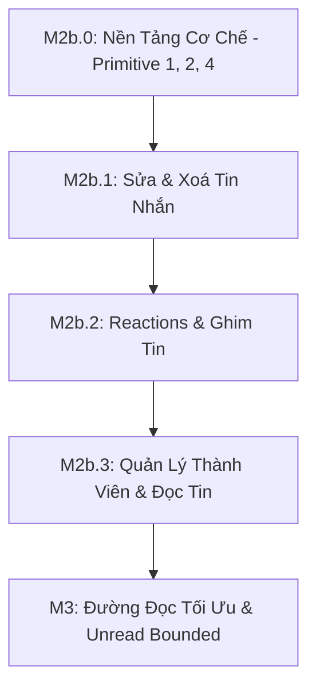

# chatim — Báo Cáo Phản Biện Cơ Chế Hệ Thống & Khung Kiến Trúc Thống Nhất

> **Ngày:** 2026-10-04 · **Trạng thái:** Bản phản biện & đề xuất thống nhất kiến trúc  
> **Tài liệu tham chiếu gốc:** `docs/research/261004-system-mechanisms-report.md` và `docs/designs/261004-system-mechanisms.md`  
> **Mục tiêu:** Phản biện chi tiết các nguyên tắc (P1–P8), các cơ chế (B1–B11, C1–C10); giải đáp 11 câu hỏi tại Section 9; đề xuất **4 Primitive Kiến Trúc Thống Nhất** để mọi task tương lai (M2b, M2c, M3,...) chỉ việc áp dụng mà không đẻ thêm cơ chế chắp vá.

---

## 1. Bối cảnh & Nhận định Tổng quan

Quyết định của Owner tạm hoãn M2b vào ngày 2026-10-04 để chuẩn hóa cơ chế hệ thống là **hoàn toàn chính xác và rất kịp thời**. Bản nháp M2b ban đầu có dấu hiệu điển hình của "architecture erosion" (mỗi tính năng đẻ ra một cơ chế phụ: actor cho mutation, marker `ap` cho reaction, batcher riêng cho read receipt, reconciler riêng).

Tuy nhiên, khi soi chiếu kỹ báo cáo hệ thống `261004-system-mechanisms-report.md`, **chính bản đề xuất mới này vẫn đang tiềm ẩn 4 "quả bom nổ chậm" về kiến trúc:**
1. **P4 & C3 (Commit log → Effect):** Chiến lược Reconciler chạy lại toàn bộ effect sau 30s đối với mọi mutation không có ack mark sẽ gây ra **bão duplicate event** trên NATS JetStream và tái thực thi effect liên tục.
2. **P5 & C4 (Counter bằng cách recount):** Đếm lại toàn bộ fact (recount) là giải pháp ngây thơ khi chịu tải thực tế. Với tin nhắn hot có hàng nghìn reaction hoặc phòng chat có 5.000 member cần tính unread, việc đếm tài liệu bằng `countDocuments` với `readConcern: majority` sẽ làm sập CPU MongoDB.
3. **Mâu thuẫn giữa P1, P6 và B3 (Send qua Actor vs Mutation đi thẳng DB):** Send đi qua actor (gom batch, cấp seq), còn Edit/Delete/Reaction đi thẳng DB. Điều này dẫn đến nguy cơ **vi phạm thứ tự nhân quả (causal order)**: sự kiện sửa tin nhắn v2 có thể tới trước cả sự kiện tạo tin nhắn v1, đẩy gánh nặng xử lý nghịch lý dữ liệu xuống SDK client.
4. **H5 (Reconciler đơn điểm trên Slot 0):** Một single process hứng change stream của toàn bộ database tại mức 10.000 msg/s sẽ không có khả năng bù lag khi có sự cố mạng.

---

## 2. Phản Biện Chuyên Sâu Các Nguyên Tắc (P1 – P8)

### P1. Any core handles any room correctly (Mọi core xử lý đúng mọi room)
- **Đánh giá:** Rất chuẩn cho tính sẵn sàng (HA) và triệt tiêu split-brain.
- **Điểm yếu / Phản biện:** 
  - Trong B3, việc cấp `seq` lại dựa trên actor in-memory. Khi 2 core cùng xử lý một room (lúc handover slot hoặc clock skew tick 1s), core B bị lỗi Duplicate Key và phải query DB `Find(from, cid)` rồi renumber tối đa 3 lần. Dưới tải cao, điều này gây ra **retry storm** và làm nổ p99 latency (> 270ms so với mục tiêu 30ms).
  - Đề xuất ở 5.2.6 cho phép Edit/Delete bỏ qua Actor để ghi thẳng DB. Nếu User A gửi tin (qua Actor ở Core 1, đang nằm trong queue flusher 2ms) và ngay lập tức gửi lệnh Sửa (Edit bay thẳng vào DB qua Core 2), DB sẽ nhận lệnh Sửa trước khi tin nhắn được tạo!
- **Khuyến nghị:** Duy trì P1 nhưng cần luật rõ ràng: **Mọi thao tác ghi trên một entity phải tôn trọng quan hệ phụ thuộc nhân quả (Causal Dependency)**.

### P2. DB là nguồn sự thật; mỗi thay đổi là một atomic fact (Không multi-doc transaction)
- **Đánh giá:** Nguyên tắc sống còn để sẵn sàng sharding theo room.
- **Điểm yếu / Phản biện:** 
  - Thực tế có những nghiệp vụ đòi hỏi tính nhất quán giữa 2 tài liệu: Ví dụ **Sửa tin nhắn kèm lịch sử (`messages` + `message_edits`)**. 
  - Nếu không dùng transaction, ghi cái nào trước?
    - Nếu ghi `message_edits` trước: nhỡ update `messages` thất bại (do version mismatch) thì `message_edits` bị mồ côi (phantom history).
    - Nếu update `messages` trước: nhỡ crash trước khi ghi `message_edits` thì mất lịch sử sửa.
    - Báo cáo đề xuất giải quyết bằng "Cleanup là effect" (C10) — tức dọn dẹp các bản ghi mồ côi. Nhưng đây chính là việc **lấy sự phức tạp của cơ chế dọn dẹp để bù đắp cho việc thiếu transaction**.
- **Khuyến nghị:**
  - Với MongoDB Sharded Cluster, transaction **trong cùng một shard key** (same room_id) có chi phí rất thấp (single-shard transaction không cần Two-Phase Commit 2PC)! 
  - Nếu giữ nguyên "No transaction", `message_edits` PHẢI là một Effect được sinh ra từ Change Stream của `messages` (yêu cầu Mongo Change Stream Full Document Lookup), chứ không để client hay API thực hiện 2 lệnh ghi rời rạc.

### P3. Mỗi thay đổi entity phát một domain event; delivery là việc của tầng khác
- **Đánh giá:** Tuyệt vời. Tách biệt hoàn toàn Core (lưu trữ + domain facts) với Gateway/Notification (phân phối, push, websocket).
- **Điểm yếu / Phản biện:** Cần phân định rõ giữa **Room-level event** (public cho mọi member) và **User-level event** (private, ví dụ: "ẩn tin nhắn phía tôi", "đánh dấu đã đọc").
- **Khuyến nghị:** Quy chuẩn hóa định dạng subject NATS ngay từ đầu:
  - `evt.{tenant}.room.{room_id}.{type}`: Phát tới toàn room.
  - `evt.{tenant}.user.{user_id}.{type}`: Phát riêng cho thiết bị của user đó (xem H8).

### P4. Mọi thứ suy ra từ fact là "Effect"; Reconciler là đường bảo đảm duy nhất
- **Đánh giá:** Mô hình Dual-Path (Fast Path best-effort + Slow Path CDC Reconciler) là mẫu chuẩn công nghiệp (tương tự Meta, Slack).
- **Điểm phản biện CHÍ MINH:**
  - **Độ trễ 30s là quá lớn cho Chat:** Nếu Fast Path rớt sự kiện (do NATS nghẽn hoặc queue đầy), người nhận sẽ bị chậm tin nhắn tới 30 giây đến 1 phút. Đối với trải nghiệm chat, chậm 30s tương đương với "tin nhắn bị mất".
  - **Nguy cơ Duplicate Storm:** Báo cáo nói chỉ `msg_created` mới có Ack Mark trên Redis, còn Edit, Delete, Reaction, Pins, Counters thì "luôn được Reconciler chạy lại". Sau 30s, Reconciler quét Change Stream và bắn lại **100%** các sự kiện Edit, Reaction, Pins lên NATS! Dù NATS có dedupe window 5 phút, nhưng các consumer downstream (Gateway, SysMsg) sẽ phải hứng một lượng duplicate khổng lồ.
- **Khuyến nghị:** Phải mở rộng Ack Mark Bitmap cho mọi effect và hạ độ trễ Reconciler xuống 3–5s (xem Primitive 2).

### P5. Đếm là bài toán Counter chung (Recount, không dùng $inc)
- **Đánh giá:** Nhận diện đúng nguy cơ trôi lệch (drift) của `$inc` khi không có distributed transaction.
- **Điểm phản biện CHÍ MINH (Nguy cơ sập DB):**
  - C4 đề xuất: Mỗi khi có sự kiện (ví dụ thả tim), ta `Touch` bằng cách chạy `db.collection.countDocuments(...)` với majority read rồi ghi đè `time < T`.
  - **Thực tế:** Một tin nhắn trong channel có 10.000 reaction. Cứ mỗi reaction lại đi scan index đếm lại 10.000 bản ghi? Kể cả có debounce 50ms, dưới tải 500 reaction/s, DB vẫn phải scan hàng triệu index entry liên tục.
  - **Với Unread Count (R17):** Nếu phòng có 5.000 member, có 1 tin nhắn mới, liệu hệ thống có chạy 5.000 lệnh count unread cho 5.000 member không? Nếu có, hệ thống sẽ chết ngay lập tức.
- **Khuyến nghị:** Phải phân tầng Counter thành:
  - **Bounded Counter** (Unread capped 99+): Luôn dùng query với `limit(101)` (chỉ tốn 0.02ms) và tính **Lazy trên Read Path**, tuyệt đối KHÔNG tính Eager trên Write Path.
  - **Aggregated Counter** (Reactions): Lưu summary trực tiếp trên Message document, cập nhật atomic bằng pipeline/CAS, và chỉ dùng Reconciler để heal định kỳ.

### P6. Natural Event ID & Version; Không dùng Global Sequence
- **Đánh giá:** Rất đúng đắn. Triệt tiêu bài toán phân tán khó nhất (gap-free atomic counter).
- **Điểm yếu:** Nếu mạng đảo thứ tự, client nhận được `msg_edited (v2)` trước khi nhận được `msg_created (v1)`. Nếu không có quy chuẩn payload, client không thể hiển thị nội dung vì thiếu `from_user`, `timestamp`, `room_id`.
- **Khuyến nghị:** Event `msg_edited` hoặc `msg_deleted` phải mang đủ snapshot tối thiểu (hoặc client SDK phải có cơ chế buffer chờ v1 trong 1-2 giây trước khi trigger resync).

### P7 & P8. System Messages ngoài Core & Reconnect lấy State mới nhất
- **P7:** Cực kỳ đúng. Để tránh duplicate system message, SysMsg worker sinh CID tất định: `cid = "sys:" + event_id`. Nhờ đó, tận dụng luôn cơ chế CID Dedupe (B4) của Core!
- **P8:** Đúng hướng nhưng thiếu cơ chế chống **Thundering Herd**. Khi một Gateway restart, 50.000 WebSocket reconnect đồng loạt gọi `GetRoomList` và `GetHistory` có thể làm tê liệt Core và Mongo. Cần một API **Sync gọn nhẹ (Lightweight State Hash / Sync Token)** thay vì fetch full state.

---

## 3. Phản Biện Các Cơ Chế Đã Dựng & Đang Đề Xuất (B1–B11, C1–C10)

| Cơ chế hiện tại | Vấn đề / Rủi ro | Hướng chuẩn hóa |
|---|---|---|
| **B3:** Send qua Actor<br>**C1:** Mutation đi tắt DB | Phân mảnh: Send qua Actor, Mutation đi tắt, mất thứ tự nhân quả giữa Send và Edit | Gom chung Flusher: BulkWrite chung cho cả Insert/CAS |
| **B4:** CID Dedupe (3 tier)<br>**C2:** Desired state | CID chỉ áp dụng cho Send. Desired state chưa rõ hợp đồng trả về lỗi/CAS | Phân loại command: Tạo mới = CID; Biến đổi = State CAS |
| **B6 & C3:** Reconciler CDC toàn database | Chậm 30s; Reconcile quét lại gây duplicate bão hòa NATS | Dual-Watermark + Ack Mark đa tầng; Partition feed theo slot |
| **C4:** Counter bằng Recount | Đếm lại toàn bộ fact gây sập Mongo CPU | Lazy cho Unread; Bounded `limit(101)`; Summary trên Doc |
| **C8 & C9:** Quyền & View theo người đọc | Chưa có; logic ẩn tin, xoá tin bị vá rải rác | Unified Pipeline: Read Interceptor dùng chung |

---

## 4. Giải Đáp 11 Câu Hỏi Của Reviewer (Section 9)

### 1. Soft ownership + Unique key CAS có đủ không, hay cần Fencing Token?
> **Đủ cho tầng Lưu Trữ (MongoDB), nhưng CHƯA ĐỦ cho tầng Bộ Nhớ (In-Memory Actor).**
> - Ở MongoDB: Unique key `_id` (`room|thread|seq`) hoạt động như một physical CAS hoàn hảo. Hai core ghi trùng `seq` thì một core chắc chắn bị reject. Không thể corrupt dữ liệu DB.
> - Tuy nhiên, với Soft Leases trên Redis, khi có clock skew hoặc pause GC, Core 1 tưởng mình còn giữ lease và tiếp tục nhận request vào mailbox. Nó sẽ liên tục sinh `seq` sai và bị reject ở Mongo, tạo ra chuỗi retry vô ích.
> - **Khuyến nghị:** Chưa cần distributed fencing token phức tạp (như Paxos/Raft epoch). Chỉ cần giữ nguyên cơ chế **Ownership Cutoff (B2.3)** kết hợp với **Monotonic Epoch per Slot** trong Redis (mỗi lần claim slot tăng 1 epoch). Core gửi epoch kèm theo write group; nếu epoch cũ hơn, tự hủy mailbox ngay lập tức mà không cần đợi Mongo báo lỗi.

### 2. Best-effort event + Commit-log reconciliation có trễ 30s chấp nhận được không?
> **Không thể chấp nhận 30s cho tin nhắn trực tiếp của người dùng.**
> - Nếu mạng NATS chập chờn 1 giây khiến 100 tin nhắn rớt Fast Path, 100 người dùng nhận tin chậm 30s sẽ tưởng ứng dụng bị đơ (lag).
> - **Giải pháp tối ưu:** 
>   1. Hạ `reconcile delay` xuống **3s - 5s** (thay vì 30s). 
>   2. Fast Path không được "bỏ rơi" quá dễ dãi: Nếu queue publish đầy, Core nên thử buffer ngắn (in-memory ring buffer) thay vì drop ngay lập tức.
>   3. Reconciler chỉ đóng vai trò "lưới vét an toàn" (safety net) cho các trường hợp Core crash bất đắc dĩ.

### 3. Chạy mọi Effect 2 lần (Fast path + Reconciler) từ doc hiện tại có đúng không?
> **Đúng về mặt hội tụ (Convergence), nhưng SAI về mặt hiệu năng và tính bảo toàn lịch sử.**
> - Khi dùng `fullDocument: updateLookup`, tại thời điểm đọc, tài liệu có thể đã ở Version 5 (trong khi change event đang xử lý là Version 2). 
> - Nếu effect đó là tạo bản ghi lịch sử sửa (`message_edits`), bạn sẽ ghi nội dung của Version 5 vào vị trí của Version 2! Điều này làm sai lệch dữ liệu lịch sử.
> - **Khuyến nghị:** Với các sự kiện cần tính toàn vẹn lịch sử (như Edit), **BẮT BUỘC** bật `changeStreamPreAndPostImages` trên collection `messages` (Mongo 6.0+ đã hỗ trợ rất tối ưu, chỉ lưu delta trên clustered collection).

### 4. Recount + Cluster time có an toàn khi failover? Có giải pháp nào tốt hơn?
> Cluster Time của Mongo là logical clock dựa trên Lamport timestamp kết hợp Raft term. Nó an toàn tuyệt đối qua failover của Replica Set.
> - Tuy nhiên, như đã phản biện ở P5, **Recount là một thảm họa hiệu năng**.
> - **Giải pháp tối ưu không cần transaction:**
>   - Với Reaction: Dùng cấu trúc **Embedded Counter Map** ngay trong `messages` doc: `reactions: { "thumb_up": 10, "heart": 2 }`. Khi user thả tim, thao tác là:
>     1. Upsert vào bảng `reactions` (Fact).
>     2. Fast path gửi lệnh `$inc: {"reactions.heart": 1}` vào `messages`.
>     3. Reconciler chỉ chạy recount nếu phát hiện cờ `recount_needed` hoặc theo chu kỳ ngầm, không recount theo từng lượt click.

### 5. Cho phép Mutation (Edit/Delete/Reaction) bỏ qua Actor có an toàn không?
> **An toàn cho tính toàn vẹn của document đó, nhưng vi phạm Causal Consistency của phòng chat.**
> - Như đã phân tích ở P1: Edit có thể vượt mặt Insert.
> - **Giải pháp:** Không cần bắt Mutation phải chạy qua In-memory Actor (để tránh nghẽn luồng send), nhưng **Gateway hoặc Client SDK phải đảm bảo không gửi Edit khi chưa nhận được ACK của Send**.

### 6. Single Reconciler Instance chịu tải được đến mức nào?
> Trên máy chủ production (8-16 vCPU), một tiến trình Go tối ưu change stream có thể parse và xử lý khoảng **8.000 – 15.000 changes/s**.
> - Tuy nhiên, tại mốc 10.000 msg/s của Phase 1, hệ thống không có "headroom" (dư địa) khi cần replay hoặc khi database bị dồn tích (backlog).
> - **Giải pháp:** Thiết kế sẵn cơ chế **Partitioned Reconciler theo Slot Range** (ví dụ 4 worker, mỗi worker watch với match filter: `{$expr: {$eq: [{$mod: ["$fullDocument.room_id", 4]}, worker_id]}}`). Đây là giải pháp chia để trị chuẩn mực của Mongo Change Streams.

### 7. Lỗ hổng CD2 (mất Redis dedupe) và CD3 (crash giữa ack và commit) có chấp nhận được?
> **Hoàn toàn chấp nhận được trong domain Chat.**
> - CD2 chỉ xảy ra khi cụm Redis Dedupe sập hoàn toàn (xác suất cực thấp với Sentinel/Cluster).
> - CD3 chỉ xảy ra trong cửa sổ vài mili-giây khi Core bị `kill -9` đúng giữa 2 dòng code.
> - Trong chat thương mại (Telegram, Slack, Discord), việc lọt một tin nhắn trùng lặp (duplicate) khi hạ tầng gặp thảm họa cấp độ crash-power-loss là hoàn toàn bình thường, người dùng chỉ cần xoá hoặc nhìn thấy 2 tin. Đánh đổi điều này để lấy latency ack < 30ms là hoàn toàn xứng đáng.

### 8. Unread capped 99+ có khả thi cho 100K users không?
> **Chỉ khả thi nếu làm LAZY trên READ PATH.**
> - Nếu làm Eager (mỗi tin nhắn đến đi update unread cho hàng nghìn người) -> Chắc chắn sập.
> - Nếu làm Lazy: Khi user mở app / gọi `ListMyRooms`:
>   ```js
>   db.messages.find({
>     room_id: R,
>     seq: { $gt: user_last_read_seq },
>     from: { $ne: user_id },
>     deleted: false
>   }).limit(101).count()
>   ```
>   Nhờ có Clustered Index trên `room_id | seq`, truy vấn này chỉ duyệt tối đa 101 keys trên RAM, tốn chưa đầy **0.05ms**! Cho dù 100K user cùng mở app, Mongo xử lý dễ dàng.

### 9. Lỗ hổng nào trong Section 6 (H1–H8) cần thiết kế đầu tiên?
> **Thứ tự ưu tiên bắt buộc:**
> 1. **H3 (Reader-specific view)** & **H4 (Permission hook)**: Phải có trước khi chạm vào M2b (Edit/Delete).
> 2. **H1 (Member management)**: Cần để xác thực quyền thành viên và sub event.
> 3. **H8 (Privacy of per-user events)**: Để không làm lộ dữ liệu riêng tư ra NATS.
> 4. Các mục H2, H5, H6, H7 để các milestone sau.

### 10. Database Choice: Có bị khóa chặt (lock-in) vào MongoDB không?
> **Có, ở 2 điểm: Clustered Collection theo Composite Key và Change Streams.**
> - Tuy nhiên, nếu chuyển sang **PostgreSQL**:
>   - Clustered Collection -> Index B-Tree / Partitioning theo Room (`BRIN` hoặc Composite Primary Key `(room_id, thread_root, seq)`).
>   - Change Streams -> PostgreSQL Logical Replication (pgoutput/wal2json).
> - Vì toàn bộ code DB đã nằm sau interface Port (`store.Messages`, `store.ChangeFeed`), mức độ gắn kết chỉ nằm ở adapter layer.

### 11. Xử lý Sequence Hole (5s hay 10s)?
> **BẮT BUỘC nâng ngưỡng sequence hole lên bằng thời gian timeout lớn nhất của retry client (ít nhất 12–15s).**
> - B3 quy định reservation TTL là 10s. Nếu coi hole là "void" sau 5s, trong khi một request retry đang chạy ở giây thứ 7 thành công chèn vào seq đó, Client SDK đã coi là void sẽ bị lỗi logic hiển thị hoặc bỏ qua tin nhắn đó vĩnh viễn.

---

## 5. Khung 4 Primitive Kiến Trúc Thống Nhất (Unified Primitives)

Để từ nay về sau, **mọi task mới không tự chế cơ chế riêng mà chỉ lắp ghép vào khung chuẩn**, toàn bộ hệ thống được quy về 4 Primitive:

```
                      YÊU CẦU TÍNH NĂNG MỚI
                                │
       ┌────────────────────────┴────────────────────────┐
       ▼                                                 ▼
[GHI FACT MỚI]                                    [ĐỌC / TRUY VẤN]
       │                                                 │
┌──────┴──────────────────────┐            ┌─────────────┴─────────────┐
│ PRIMITIVE 1:                │            │ PRIMITIVE 4:              │
│ Ingestion & Mutation Engine │            │ Reader Projection Pipeline│
│ - Type A: New Resource (CID)│            │ - Permission Check (H4)   │
│ - Type B: State CAS (Ver)   │            │ - Tombstone Masking       │
│ - Type C: Monotonic Max     │            │ - User-Specific Filters   │
└──────┬──────────────────────┘            └───────────────────────────┘
       │
       ▼
┌─────────────────────────────┐
│ PRIMITIVE 2:                │
│ Dual-Path Effect Pipeline   │
│ - Fast: Event immediate     │
│ - Slow: Reconciler (CDC)    │
│ - Ack-mark Bitmap Matrix    │
└──────┬──────────────────────┘
       │
       ▼
┌─────────────────────────────┐
│ PRIMITIVE 3:                │
│ Tiered Counter Architecture │
│ - Bounded Lazy (Unread 99+) │
│ - Embedded Summary (Reacts) │
└─────────────────────────────┘
```

### Primitive 1: Ingestion & Mutation Engine (Động cơ chuẩn hóa ghi Fact)
Mọi lệnh ghi trong hệ thống chỉ được thuộc 1 trong 3 loại:
1. **Type A - Resource Creation (Allocating):** Cần cấp phát số thứ tự hoặc tạo mới tài nguyên (`SendMessage`, `CreateRoom`). 
   - *Cơ chế:* Bắt buộc qua CID Dedupe (B4) + In-memory Slot Actor + Flusher Bulk Insert.
2. **Type B - State CAS Mutation:** Sửa đổi trạng thái một tài nguyên đã có (`EditMessage`, `DeleteForEveryone`, `PinMessage`, `ChangeRole`).
   - *Cơ chế:* Đi thẳng DB thông qua lệnh atomic `updateOne({_id, version: N}, {$set: {..., version: N+1}})`. Retry trả về trạng thái hiện tại. Không cần đi qua Actor.
3. **Type C - Monotonic Bookmark Mutation:** Cập nhật vị trí tăng tiến (`MarkRead`, `HideForMe`).
   - *Cơ chế:* Đi thẳng DB thông qua lệnh atomic `updateOne({_id}, {$max: {seq: N}})`. Tự nhiên mang tính idempotent.

### Primitive 2: Dual-Path Effect Pipeline (Chuỗi xử lý tác động kép chuẩn hóa)
- Thay vì chỉ có `msg_created` mới được tối ưu Ack Mark, ta mở rộng bảng **Ack Matrix**:
  - `AckKey = hash(entity_id) | effect_type`.
  - Fast Path: Sau khi commit DB, đẩy event sang NATS. Khi NATS trả lời `PubAck`, set 1 bit vào Redis Bitmap tương ứng với `(room_id, chunk_id, effect_type)`.
  - Slow Path (Reconciler): Lắng nghe Change Stream với độ trễ an toàn **3–5 giây**. Quét bit: nếu đã ack thì **bỏ qua ngay lập tức**, nếu chưa ack thì mới republish.
  - **Kết quả:** Triệt tiêu hoàn toàn hiện tượng Reconciler republish 100% các sự kiện Edit, Delete, Reaction!

### Primitive 3: Tiered Counter Architecture (Kiến trúc đếm phân tầng)
Chấm dứt việc dùng `countDocuments` bừa bãi. Mọi con số trong hệ thống thuộc 2 nhóm:
1. **Group 1 - Lazy Bounded Query (Ví dụ: Unread count 99+, Mention unread):**
   - Chỉ tính khi người dùng yêu cầu đọc (ListMyRooms / Open Room).
   - Truy vấn luôn đi kèm `.limit(CAP + 1)`. Tận dụng triệt để Clustered Key Index. Thời gian truy vấn luôn < 0.1ms.
2. **Group 2 - Embedded Atomic Aggregation (Ví dụ: Reaction count theo emoji, Reply count):**
   - Lưu trực tiếp trường tóm tắt trong tài liệu cha (`messages.reactions_summary = {"like": 12}`).
   - Cập nhật song song bằng `$inc` có bảo vệ hoặc cập nhật từ Change Stream.

### Primitive 4: Reader Projection Pipeline (Đường ống hiển thị theo ngữ cảnh người đọc)
Tạo ra một bộ **Read Interceptor** duy nhất cho mọi API đọc (`GetHistory`, `GetMessages`, `Search`):
```go
type ReaderPipeline interface {
    Apply(ctx context.Context, viewerID string, msgs []Message) []DecoratedMessage
}
```
Mọi bản ghi tin nhắn từ DB trước khi trả về client đều chạy qua pipeline này:
1. **Kiểm tra quyền (H4):** User có quyền đọc room không? Có được xem edit history không?
2. **Ẩn tin nhắn riêng:** Check nhanh trong cache/bộ nhớ user đã ẩn tin nào (`hidden_seq`). Thay nội dung bằng `Status: Hidden`.
3. **Mặt nạ xoá (Tombstone Masking):** Nếu tin có cờ `deleted: true`, xóa bỏ `text`, `attachments`, chỉ để lại `deleted_at` và `deleted_by`.
4. **Gắn trạng thái cá nhân:** Gắn cờ `is_unread`, `my_reaction` vào payload cho client.

---

## 6. Lộ Trình Triển Khai Điều Chỉnh (Adjusted Roadmap)



1. **M2b.0 — Hoàn thiện Bộ Khung Cơ Chế (Foundation):**
   - Thiết kế & cài đặt `ReaderPipeline` (Primitive 4) và `PermissionHook` (H4).
   - Thiết kế & cài đặt `Dual-Path Effect Registry` có Ack Bitmap cho mọi loại effect (Primitive 2).
   - Sửa lỗi Publisher đang mark nhầm event (`apps/core/internal/publish/publisher.go:130`).
2. **M2b.1 — Sửa & Xoá Tin Nhắn (Áp dụng Type B Mutation & ReaderPipeline):**
   - API Sửa tin (kèm `changeStreamPreAndPostImages` cho `message_edits`).
   - Xoá cho mọi người (Tombstone) & Xoá phía tôi (Hidden).
3. **M2b.2 — Reactions & Pins (Áp dụng Type B/C Mutation & Embedded Summary):**
   - Reaction facts & summary aggregation.
   - Ghim tin nhắn.
4. **M2b.3 — Quản lý Member (H1) & Read Receipts (Type C Mutation):**
   - Thêm/bớt/rời phòng, đổi quyền.
   - Nâng vị trí đọc `last_read_seq`.
5. **M3 — Đường Đọc Tối Ưu (Primitive 3 Lazy Bounded):**
   - `ListMyRooms` với unread 99+ tính toán siêu tốc bằng `limit(101)`.
