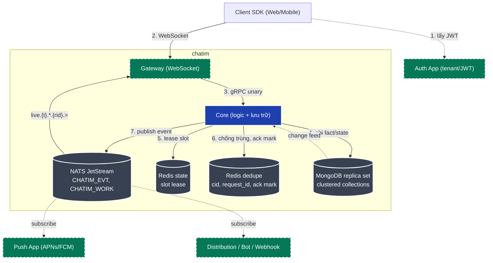
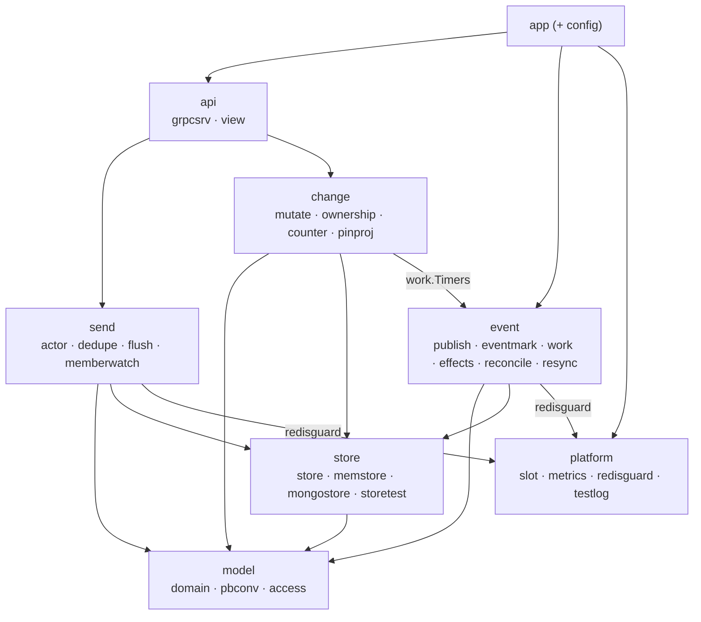
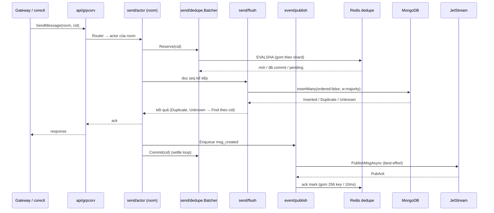
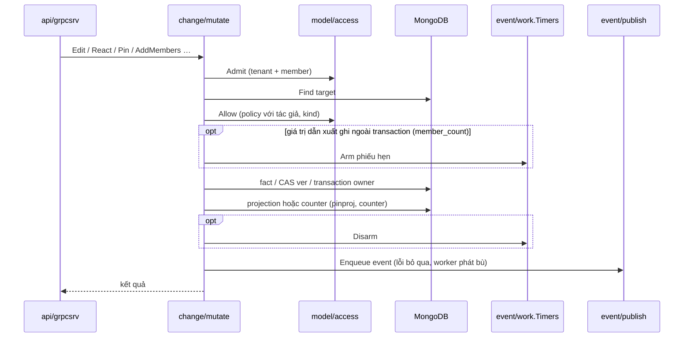
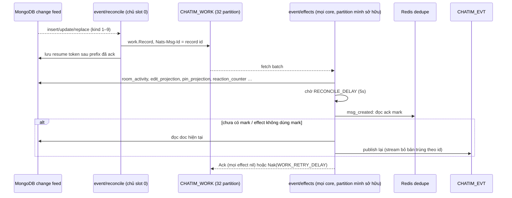
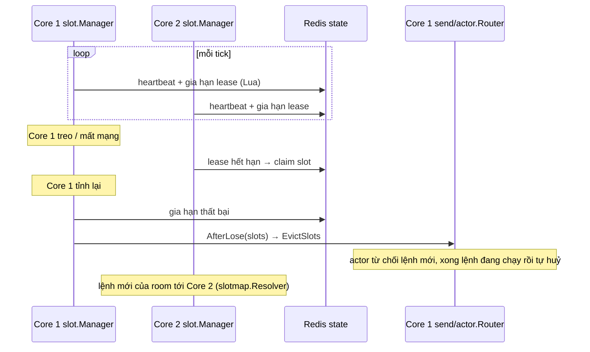

# Kiến trúc components hệ thống chatim

> Ngày: 2026-10-04 · Cập nhật: 2026-10-08 (bố cục package core trước M2c)

Tài liệu này vẽ components ở tầng vĩ mô và bố cục package bên trong `apps/core`. Nguồn sự thật vẫn là [261005-chatim-architecture.md](./261005-chatim-architecture.md); khi lệch, theo design.

## 1. Tổng quát (macro)

`core` giữ mọi lệnh ghi và tính nhất quán; NATS JetStream là event bus cho các app khác. Gateway và các app xanh lá chưa xây.



## 2. Bố cục package `apps/core`

Package giữ tên ngắn, gom thư mục theo luồng. Tên nhóm lấy từ design: `send` = §6.2 gửi tin, `change` = §6.3 lệnh đổi.

```
apps/core/
  main.go          os.Exit(app.Main(os.Args[1:]))
  itest/           test tích hợp cả core (app.Run, infra thật)
  internal/
    app/           wiring, vòng đời, lệnh serve/probe/resync/recount
    config/        đọc + kiểm config lúc boot
    api/           grpcsrv, view
    model/         domain, pbconv, access
    send/          actor, dedupe, flush, memberwatch
    change/        mutate, ownership, counter, pinproj
    event/         publish, eventmark, work, effects, reconcile, resync
    store/         store (port), memstore, mongostore, storetest
    platform/      slot, metrics, redisguard, testlog
```

Phụ thuộc đi xuống; ngoại lệ duy nhất là `change/mutate` → `event/work` (phiếu hẹn sinh tồn):



| Nhóm | Package | Vai trò | Design |
|---|---|---|---|
| `api` | `grpcsrv` | đọc metadata tenant/user, gọi actor/mutate/store, trả lỗi domain | §9 |
| | `view` | pipeline cho người đọc: gộp retry, che tin xoá/ẩn | §9.2 |
| `model` | `domain` | kiểu và lỗi nghiệp vụ, validate | §4–§5 |
| | `pbconv` | domain → proto, event id tự nhiên | §11 |
| | `access` | permission hook: tenant + membership rồi `Policy` | §9.2 |
| `send` | `actor` | một goroutine mỗi room, seq, write group | §6.2 |
| | `dedupe` | cid/`request_id` qua LRU + Redis, batcher | §6.2, D58 |
| | `flush` | gom `insertMany` theo shard | §6.2 |
| | `memberwatch` | nghe `member_removed`/`member_role_changed`, xoá cache member của actor | D106 |
| `change` | `mutate` | sửa/xoá/ẩn/clear/react/pin/member/read | §6.3–§6.5 |
| | `ownership` | kế nhiệm owner trong transaction | D100 |
| | `counter` | recount reaction có witness + CAS | §7, D90 |
| | `pinproj` | fold pin fact + CAS | D92 |
| `event` | `publish` | queue theo shard, `PublishMsgAsync`, ack mark | §8.1 |
| | `eventmark` | bitmap ack mark trên Redis dedupe | D52, D60 |
| | `work` | record, `CHATIM_WORK`, phiếu hẹn sinh tồn | §8.3, D111 |
| | `effects` | worker mỗi partition, registry effect theo kind | §8.3 |
| | `reconcile` | reader change feed trên chủ slot 0 | §8.2 |
| | `resync` | phát lại một khoảng feed bị mất | §14 |
| `store` | `store` | port + kiểu lưu trữ | §5 |
| | `memstore`, `mongostore` | adapter; cả hai qua `storetest` | §5.1 |
| `platform` | `slot` | lease slot qua Redis, hook evict | §6.1 |
| | `metrics` | registry Prometheus `/metrics` | §12 |
| | `redisguard` | cooldown khi Redis lỗi | D44 |
| | `testlog` | tắt log Redis trong test | — |

M2c: thread, reply/forward, mention đi qua `send`; bookmark (lớp tập) đi qua `change`; effect mới vào `event/effects`.

## 3. Luồng gửi tin (`send`)



## 4. Luồng lệnh đổi (`change`)



Không retry nội bộ: CAS hoặc transaction xung đột trả `UNAVAILABLE` ngay, client retry.

## 5. Effect engine (`event`)



Mất lịch sử feed: reader log lỗi và chạy từ hiện tại; vá khoảng hở bằng `/app resync`.

## 6. Slot ownership (`platform/slot`)



Ownership chỉ mua batching, thứ tự và cache. Đúng đắn đến từ `_id` unique làm CAS, nên hai chủ cùng lúc không làm mất hay nhân đôi tin. Effect worker chỉ fetch partition `n` khi `Owns(n)`; reader chạy khi `Owns(0)`.

## 7. Gateway (chưa xây)

Module dự kiến: `ws` (gws), `authn` (JWT theo JWKS tenant), `session`, `interest` (subscribe `live.{t}.*.{rid}.>`), `fanout` (encode một lần, gửi nhiều). Gateway gọi core qua gRPC và nhận event từ NATS; không đọc Mongo.
