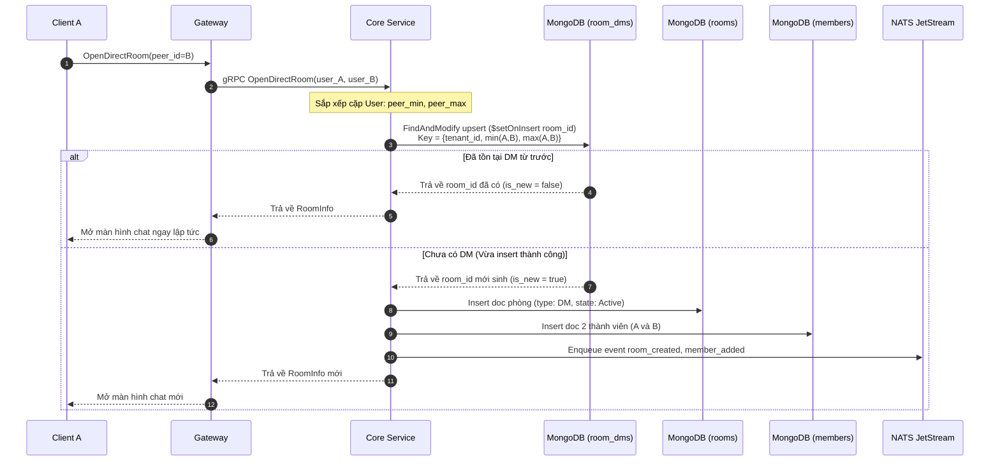

# Module 01: Hội thoại — Phòng chat, DM & Kênh phát sóng

> **Mục tiêu module:** Quản lý không gian giao tiếp giữa các người dùng, bao gồm trò chuyện cá nhân 1-1 (Direct Message), nhóm chat cộng tác (Group Chat ≤5,000 thành viên) và kênh thông báo quy mô lớn (Channel ~200,000 người theo dõi).

---

## 1. Các Use Case nghiệp vụ (Business Use Cases)

| Mã Use Case | Tên Use Case | Tác nhân | Mô tả & Kết quả kỳ vọng |
|---|---|---|---|
| **UC-ROOM-01** | **Mở trò chuyện 1-1 (Direct Message)** | Người dùng A | Mở cuộc trò chuyện với Người dùng B. Nếu phòng DM giữa hai người đã tồn tại từ trước, trả về phòng cũ; nếu chưa có, tạo phòng mới. Không bao giờ tạo thành 2 phòng riêng biệt cho cùng một cặp người dùng. |
| **UC-ROOM-02** | **Tạo nhóm chat (Group Chat)** | Người dùng A | Khởi tạo một nhóm làm việc mới với danh sách thành viên ban đầu, tên nhóm, ảnh đại diện và quyền hạn mặc định (Người tạo là Owner). Hỗ trợ quy mô nhóm lên tới 5,000 thành viên. |
| **UC-ROOM-03** | **Tạo kênh phát sóng (Channel)** | Quản trị viên | Tạo kênh tin tức/thông báo tập trung cho tổ chức. Hỗ trợ tới ~200,000 người theo dõi. Chỉ quản trị viên (Admin/Owner) được phép gửi tin; người theo dõi chỉ có quyền đọc. |
| **UC-ROOM-04** | **Cập nhật thông tin phòng** | Owner / Admin | Thay đổi tên phòng, mô tả, ảnh đại diện hoặc cấu hình chính sách của phòng (ví dụ: khoá sửa/xoá tin, giới hạn emoji reaction). |

---

## 2. Luồng hoạt động chi tiết (How It Works)

### 2.1. Luồng mở phòng chat 1-1 (OpenDirectRoom — Sổ nhận chỗ DM)

Trò chuyện 1-1 là trường hợp đặc biệt dễ xảy ra xung đột khi cả hai người dùng A và B cùng bấm "Nhắn tin" cho nhau tại cùng một thời điểm:



---

## 3. Cơ chế bảo đảm tính đúng đắn (Guarantees & Mechanisms)

### 3.1. Sổ nhận chỗ DM tất định (DM Deterministic Reservation)
- **Vấn đề cần giải quyết:** Nếu kiểm tra bằng câu lệnh `Find` rồi mới `Insert`, khi hai người cùng nhắn tin cho nhau ở 2 node Core khác nhau, cả hai đều thấy "chưa có phòng" và cùng tạo ra 2 phòng DM riêng biệt (Split-room).
- **Cơ chế bảo đảm:**
  - Chuẩn hoá cặp định danh: Luôn sắp xếp `min(user_a, user_b)` và `max(user_a, user_b)`.
  - Sử dụng collection sổ nhận chỗ `room_dms` với khoá unique duy nhất `_id: {tenant, min_user, max_user}`.
  - Áp dụng toán tử atomic `$setOnInsert` trong một lệnh `FindAndModify`:
    - Người tới trước: Insert thành công bản ghi đặt chỗ và nhận `is_new = true`.
    - Người tới sau: Bị chặn bởi unique key, câu lệnh không sửa đổi gì và lập tức trả về `room_id` mà người tới trước đã sinh.
  - **Khả năng tự hồi phục (Self-healing):** Nếu node Core bị sập nguồn ngay sau khi đặt chỗ trong `room_dms` mà chưa kịp tạo doc trong `rooms` hay `members`, lần gọi `OpenDirectRoom` tiếp theo của bất kỳ ai trong hai người sẽ phát hiện doc phòng bị thiếu và tự động thực hiện nốt bước khởi tạo dở dang (Idempotent repair).

### 3.2. Bỏ vòng thử lại nội bộ (No Internal Retries — Nguyên tắc R1)
- Khi tạo Group hoặc Channel với ID chỉ định, nếu phát hiện ID đã bị chiếm dụng hoặc xảy ra xung đột tương tranh (CAS trượt):
  - **Cơ chế:** Core **không bao giờ** chạy vòng lặp `for { retry... }` nội bộ.
  - **Hành vi:** Lập tức huỷ lệnh và trả mã lỗi gRPC `codes.Unavailable` (hoặc `codes.AlreadyExists`) kèm retry hint để client tự backoff và gọi lại. Điều này giúp ngăn chặn tình trạng goroutine bị kẹt, nghẽn thread pool của server dưới tải cao.

### 3.3. Phân bổ và định tuyến theo Slot (Slot Hashing & Routing)
- **Cơ chế:** Mọi phòng chat khi được tạo ra đều được gán cố định vào một trong 1024 Soft Slots:
  $$\text{SlotID} = \text{mix64}(\text{room\_id}) \pmod{1024}$$
- Quyền ghi của phòng thuộc về node Core đang nắm giữ hợp đồng thuê (Lease) của Slot đó. Gateway khi gửi các lệnh tạo tin nhắn hay thay đổi cấu hình phòng sẽ định tuyến thẳng đến Core đang sở hữu slot tương ứng.

---

## 4. Kỹ thuật & Công nghệ triển khai (Technologies)

### 4.1. Cấu trúc lưu trữ MongoDB

#### Collection `room_dms` (Sổ nhận chỗ DM)
```javascript
// Clustered collection hoặc indexed unique theo cặp user
{
  "_id": "t1:usr_1001:usr_2002", // tenant:min_user:max_user (luôn sắp xếp)
  "room_id": NumberLong("8492049201948201"),
  "created_at": ISODate("2026-10-10T10:00:00Z")
}
```

#### Collection `rooms` (Thông tin phòng chat)
```javascript
{
  "_id": NumberLong("8492049201948201"), // room_id (uint64 63-bit)
  "tenant_id": "t1",
  "type": 1,                            // 1: DM, 2: Group, 3: Channel
  "state": 1,                           // 1: Active, 2: Archived, 3: Deleted
  "name": "Đội ngũ Kỹ thuật",           // Đối với Group/Channel
  "avatar_url": "https://cdn.example.com/a.png",
  "owner_id": "usr_1001",
  "created_by": "usr_1001",
  "created_at": ISODate("2026-10-10T10:00:00Z"),
  "updated_at": ISODate("2026-10-10T10:00:00Z"),
  "ver": NumberLong(1),                 // Optimistic CAS version
  "pin_ver": NumberLong(0),             // Version danh sách ghim
  "member_count": 42,                   // Bộ đếm phái sinh
  "member_count_ver": NumberLong(42)    // Version bộ đếm thành viên
}
```

### 4.2. Giao thức gRPC & API
- `OpenDirectRoom(peer_id)`: Mở hoặc lấy phòng 1-1.
- `CreateRoom(type, name, initial_members, request_id)`: Tạo phòng nhóm hoặc channel kèm `request_id` để chống gửi lại (idempotent request).
- `GetRoom(room_id)`: Lấy thông tin phòng.
- `UpdateRoom(room_id, base_ver, name, avatar_url)`: Cập nhật thông tin phòng có điều kiện CAS `ver == base_ver`.

### 4.3. Hợp đồng Mã lỗi gRPC (Error Matrix)

| Mã lỗi gRPC | Tên lỗi domain | Tình huống kích hoạt | Hành vi Client SDK yêu cầu |
|---|---|---|---|
| `InvalidArgument` | `ERR_INVALID_PEER` | Cố tình mở DM với chính mình (`user_A == user_B`). | Không retry; hiển thị thông báo không thể tự nhắn tin. |
| `InvalidArgument` | `ERR_INVALID_ROOM_TYPE` | Loại phòng gửi lên không hợp lệ (không phải DM, Group, Channel). | Không retry; sửa mã nguồn client. |
| `AlreadyExists` | `ERR_ROOM_ID_TAKEN` | Mã `room_id` chỉ định đã bị tồn tại trước (hiếm gặp). | Có retry; Client tự động sinh ID ngẫu nhiên mới và gọi lại. |
| `Unavailable` | `ERR_DATABASE_UNAVAILABLE` | Cụm MongoDB đang bầu Primary mới hoặc mất kết nối. | Có retry; Client tự động backoff và gọi lại sau 1–2s. |

---

## 5. Hạn chế kỹ thuật & Đánh đổi (Limitations & Trade-offs)

1. **Kênh phát sóng (Channel ~200K):**
   - *Hạn chế:* Không hỗ trợ mọi người cùng thảo luận tự do như nhóm chat thông thường. Chỉ cho phép Admin/Owner gửi tin; người theo dõi chỉ nhận stream một chiều.
   - *Lý do đánh đổi:* Nhóm chat hai chiều 200,000 thành viên sẽ gây bùng nổ cấp số nhân (Write & Fanout Amplification) khi mỗi tin nhắn gửi đi phải tính toán unread và đẩy thông báo cho 200,000 kết nối đồng thời.
2. **Quy mô nhóm chat thông thường (Group Chat ≤5,000):**
   - *Hạn chế:* Giới hạn cứng tối đa 5,000 thành viên trong một nhóm chat hai chiều.
   - *Lý do đánh đổi:* Đảm bảo các tác vụ kiểm tra quyền hạn, đếm unread và phát sóng sự kiện thay đổi thành viên diễn ra trong ngân sách độ trễ p99 ≤100ms.
3. **Phân bổ Slot cố định (1024 Slots):**
   - *Hạn chế:* Số lượng slot là 1024 cố định từ khi boot hệ thống. Nếu có 1 phòng cực kỳ hot, tải của phòng đó sẽ dồn vào node Core giữ slot chứa phòng đó (không tự băm nhỏ 1 phòng ra nhiều Core).

---

## 6. Phụ thuộc kỹ thuật & Bán kính sự cố (Dependencies & Blast Radius)

| Thành phần phụ thuộc | Mục đích phụ thuộc | Ứng xử khi thành phần gặp sự cố (Failure Behavior) |
|---|---|---|
| **MongoDB Replica Set** | Lưu trữ chính (`rooms`, `room_dms`) | Nếu MongoDB failover hoặc mất kết nối: Lệnh tạo phòng trả `UNAVAILABLE` ngay lập tức. Client cần đợi 1–3s để cụm Mongo bầu Primary mới. |
| **Redis State (Slot Lease)** | Định tuyến và xác định quyền sở hữu phòng | Nếu Redis State sập: Core mất lease sẽ không nhận lệnh ghi phòng mới; chuyển sang chế độ an toàn (Safe mode) để chống split-brain. |
| **NATS JetStream** | Phát sự kiện `room_created` cho Gateway | Nếu NATS tạm thời quá tải: Lệnh tạo phòng trên MongoDB vẫn commit thành công (Fast-path); Reconciler sẽ phát bù sự kiện `room_created` sau 5s thông qua Oplog Change Stream. |

### 6.1. Chỉ số Sức khoẻ Vận hành & Cảnh báo SRE (Key Metrics & Alerts)

- **`chatim_rooms_created_total{type="dm|group|channel"}`:** Tốc độ tạo phòng mới theo từng loại hình.
- **`chatim_room_dms_collision_prevented_total`:** Số lần sổ nhận chỗ `room_dms` ngăn chặn thành công việc tạo trùng phòng DM giữa 2 người.
- **`chatim_slot_ownership_loss_total`:** Số lần Core bị mất quyền thuê slot do trễ heartbeat.
  - *Luật cảnh báo (`ChatimSlotFlapping`):* Cảnh báo nếu số lần mất slot `> 3 lần/phút`.
