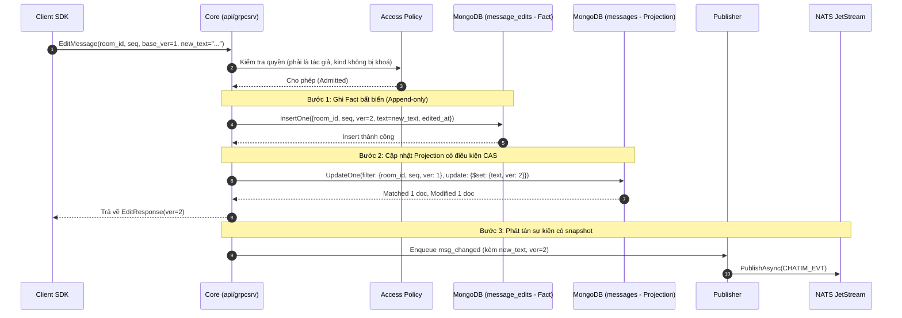

# Module 03: Tin nhắn — Chỉnh sửa, Thu hồi & Quyền riêng tư

> **Mục tiêu module:** Cho phép người dùng chỉnh sửa nội dung tin nhắn (lưu lại toàn bộ lịch sử sửa đổi để minh bạch), thu hồi/xoá tin nhắn đối với mọi người trong phòng, hoặc ẩn tin nhắn và xoá sạch lịch sử trò chuyện cục bộ chỉ cho riêng mình (bảo đảm quyền riêng tư).

---

## 1. Các Use Case nghiệp vụ (Business Use Cases)

| Mã Use Case | Tên Use Case | Tác nhân | Mô tả & Kết quả kỳ vọng |
|---|---|---|---|
| **UC-EDIT-01** | **Chỉnh sửa tin nhắn** | Tác giả tin nhắn | Sửa đổi nội dung văn bản của tin nhắn đã gửi. Mọi thành viên trong phòng đều nhận được nội dung mới và nhãn "(đã chỉnh sửa)". |
| **UC-EDIT-02** | **Xem lịch sử chỉnh sửa** | Thành viên trong phòng | Xem lại các phiên bản nội dung trước đây của tin nhắn kèm mốc thời gian sửa đổi (Audit Trail), ngăn chặn hành vi sửa tin để gian lận thông tin. |
| **UC-EDIT-03** | **Xoá tin nhắn cho mọi người (Thu hồi)** | Tác giả / Admin | Thu hồi tin nhắn khỏi phòng chat. Tin nhắn hiển thị thành "Tin nhắn đã bị xoá" đối với tất cả thành viên trong phòng. |
| **UC-EDIT-04** | **Ẩn tin nhắn phía tôi (Hide for me)** | Thành viên bất kỳ | Ẩn một tin nhắn cụ thể trên thiết bị của tôi (chỉ tôi không thấy, những người khác trong phòng vẫn thấy bình thường). |
| **UC-EDIT-05** | **Xoá lịch sử trò chuyện phía tôi (Clear history)** | Thành viên bất kỳ | Xoá toàn bộ tin nhắn từ một thời điểm trở về trước trên giao diện của tôi. Các tin nhắn mới gửi sau đó vẫn hiển thị bình thường. |

---

## 2. Luồng hoạt động chi tiết (How It Works)

### 2.1. Luồng Sửa tin nhắn (Fact & Projection Pattern)

Hệ thống tách biệt việc **Ghi nhận sự thật (Fact)** và **Chiếu ra bản hiển thị (Projection)**:



---

## 3. Cơ chế bảo đảm tính đúng đắn (Guarantees & Mechanisms)

### 3.1. Mô hình Fact & Projection (Nguyên tắc P2)
- **Vấn đề cần giải quyết:** Nếu ghi đè trực tiếp lên bảng `messages`, khi nhiều thao tác sửa diễn ra đồng thời hoặc hệ thống gặp sự cố, dữ liệu lịch sử sẽ bị mất vĩnh viễn và không thể đối soát.
- **Cơ chế bảo đảm:**
  - **Fact (Sự thật bất biến):** Mọi lần sửa đổi đều được chèn thành một document mới trong collection `message_edits` với `ver = base_ver + 1`. Document này không bao giờ bị sửa hay xoá.
  - **Projection (Bản chiếu hiện tại):** Bảng `messages` chỉ đóng vai trò là bản chiếu (View Projection) trạng thái mới nhất để phục vụ việc đọc nhanh.
  - **Tự phục hồi Projection:** Nếu sau khi ghi Fact vào `message_edits`, máy chủ Core bị crash trước khi cập nhật bảng `messages`: **Worker `edit_projection` (Module 10)** sẽ đọc Change Stream của `message_edits` và tự động cập nhật lại bảng `messages` để đưa hệ thống về trạng thái nhất quán cuối cùng (Eventual Consistency).

### 3.2. Chống ghi đè tranh chấp bằng Optimistic CAS (Check-And-Set)
- Khi client gửi lệnh sửa, client **bắt buộc phải gửi kèm `base_ver`** (phiên bản mà client đang nhìn thấy).
- Câu lệnh cập nhật trên MongoDB có điều kiện kiểm tra nguyên tử:
  $$\text{Filter: } \{\text{room\_id}: \text{RID}, \text{seq}: \text{SEQ}, \text{ver}: \text{base\_ver}\}$$
- Nếu có hai người (hoặc hai thiết bị) cùng sửa một tin nhắn tại cùng một thời điểm:
  - Người thứ nhất hoàn tất -> version nâng lên `base_ver + 1`.
  - Người thứ hai gửi lệnh với `base_ver` cũ -> Điều kiện filter không khớp (`MatchedCount = 0`).
  - Core **lập tức từ chối lệnh** và trả về mã lỗi gRPC `codes.Unavailable` (hoặc `codes.Aborted`), yêu cầu client tải lại phiên bản mới nhất rồi mới thử lại. Core không chạy vòng lặp retry nội bộ.

### 3.3. Dữ liệu theo người đọc: Fact thưa & Mốc thời gian (Sparse Fact View)
- **Ẩn tin nhắn phía tôi (UC-EDIT-04):**
  - Không sửa bất kỳ trường nào trên document `messages` gốc (để không ảnh hưởng tới người khác).
  - Ghi một bản ghi nhỏ vào collection `hidden` với khoá `{user_id, room_id, seq}`.
- **Xoá lịch sử phía tôi (UC-EDIT-05):**
  - Không xoá bất kỳ tin nhắn nào trong database.
  - Chỉ cập nhật một trường thời gian duy nhất trên document thành viên của người đó:
    $$\text{members.cleared\_at} = \text{Thời điểm hiện tại}$$
- Khi người dùng đọc lịch sử tin nhắn, **Reader View Pipeline (Module 08)** sẽ tự động lọc bỏ các tin có `created_at <= cleared_at` hoặc nằm trong bảng `hidden`.

---

## 4. Kỹ thuật & Công nghệ triển khai (Technologies)

### 4.1. Cấu trúc lưu trữ MongoDB

#### Collection `message_edits` (Audit Log các lần sửa)
```javascript
{
  "_id": BinData(0, "..."),            // Clustered key: {room_id, seq, ver}
  "room_id": NumberLong("8492049201948201"),
  "seq": NumberLong(10042),
  "ver": NumberLong(2),                // Phiên bản sửa (2, 3, 4...)
  "editor_id": "usr_1001",
  "text": "Nội dung sau khi đã sửa đổi",
  "edited_at": ISODate("2026-10-10T10:08:00Z")
}
```

#### Collection `hidden` (Danh sách tin ẩn theo người dùng)
```javascript
{
  "_id": "usr_1001:8492049201948201:10042", // user_id : room_id : seq
  "user_id": "usr_1001",
  "room_id": NumberLong("8492049201948201"),
  "seq": NumberLong(10042),
  "hidden_at": ISODate("2026-10-10T10:10:00Z")
}
```

### 4.2. Chính sách Phân quyền `access.Policy`
- Mọi yêu cầu sửa/xoá đều phải đi qua `access.Admit` (kiểm tra còn là thành viên không) và `access.Allow`:
  - **Sửa tin:** Mặc định chỉ tác giả (`sender_id == caller_id`) mới được sửa.
  - **Thu hồi tin:** Tác giả hoặc người có vai trò Owner/Admin trong phòng.
  - **Khoá loại tin (`MESSAGE_LOCKED_KINDS`):** Các tin nhắn đặc biệt như tin hệ thống (`kind = 3`), tin thông báo cuộc gọi không bao giờ được phép sửa đổi.

### 4.3. Hợp đồng Mã lỗi gRPC (Error Matrix)

| Mã lỗi gRPC | Tên lỗi domain | Tình huống kích hoạt | Hành vi Client SDK yêu cầu |
|---|---|---|---|
| `FailedPrecondition` | `ERR_CAS_VERSION_MISMATCH` | `base_ver` client gửi lên không khớp với phiên bản hiện tại trên server (đã có người sửa trước). | Không retry mù; Client tải lại snapshot mới nhất rồi cho người dùng quyết định sửa đè hay huỷ. |
| `PermissionDenied` | `ERR_NOT_MESSAGE_AUTHOR` | Người dùng không phải tác giả của tin nhắn nhưng cố tình gọi lệnh sửa. | Không retry; hiển thị thông báo "Bạn chỉ có thể sửa tin nhắn của chính mình". |
| `PermissionDenied` | `ERR_MESSAGE_KIND_LOCKED` | Tin nhắn thuộc loại bị khoá chỉnh sửa (`MESSAGE_LOCKED_KINDS`). | Không retry; ẩn nút sửa trên giao diện. |
| `NotFound` | `ERR_MESSAGE_NOT_FOUND` | Tin nhắn cần sửa/thu hồi không tồn tại trong phòng. | Không retry; đồng bộ lại giao diện. |
| `Unavailable` | `ERR_MUTATE_RETRY_LATER` | Xung đột ghi đồng thời hoặc MongoDB Replica Set đang failover. | Có retry; Client tự động backoff và gọi lại. |

---

## 5. Hạn chế kỹ thuật & Đánh đổi (Limitations & Trade-offs)

1. **Độ trễ cập nhật Projection:**
   - *Hạn chế:* Tồn tại một khoảng thời gian cực ngắn (vài phần triệu giây) giữa lúc ghi Fact vào `message_edits` và cập nhật Projection `messages`.
   - *Đánh đổi:* Chấp nhận độ trễ này để đổi lấy tính an toàn dữ liệu: không bao giờ mất lịch sử kiểm toán ngay cả khi máy chủ sập nguồn giữa chừng.
2. **Quyền riêng tư vs Kiểm toán tuân thủ (Audit Compliance):**
   - *Hạn chế:* Khi người dùng chọn "Xoá tin nhắn cho mọi người", nội dung tin nhắn vẫn còn lưu trong collection `message_edits` và trong Change Stream 7 ngày để phục vụ việc điều tra vi phạm chính sách / pháp lý nội bộ.
   - *Đánh đổi:* Để bảo vệ quyền riêng tư nghiêm ngặt cho tenant đặc thù, hệ thống hỗ trợ cấu hình tenant: không mang nội dung text trong event phát tán qua NATS.

---

## 6. Phụ thuộc kỹ thuật & Bán kính sự cố (Dependencies & Blast Radius)

| Thành phần phụ thuộc | Mục đích phụ thuộc | Ứng xử khi thành phần gặp sự cố (Failure Behavior) |
|---|---|---|
| **MongoDB Clustered Collection** | Lưu Fact `message_edits` và Projection `messages` | Nếu MongoDB lỗi ghi CAS: Lệnh sửa/xoá trả lỗi `UNAVAILABLE`. Trạng thái tin nhắn giữ nguyên, không xảy ra tình trạng dữ liệu nửa vời. |
| **Model Access Policy** | Thẩm định quyền sửa/xoá | Nếu cache quyền bị cũ (chưa nhận event kick thành viên): Sẽ kiểm tra trực tiếp doc `members` trên DB để đảm bảo không ai bị thu hồi quyền mà vẫn sửa được tin. |
| **Worker `edit_projection`** | Đồng bộ Fact sang Projection khi fast-path lỗi | Nếu worker này bị chậm: Client đọc từ bảng `messages` có thể thấy tin cũ thêm vài giây cho tới khi worker xử lý xong backlog. |

### 6.1. Chỉ số Sức khoẻ Vận hành & Cảnh báo SRE (Key Metrics & Alerts)

- **`chatim_message_edits_total`:** Tổng số lần chỉnh sửa tin nhắn phát sinh.
- **`chatim_message_deletes_total`:** Tổng số lần thu hồi/xoá tin nhắn cho mọi người.
- **`chatim_edit_cas_failures_total`:** Số lần lệnh sửa tin bị từ chối do lệch `base_ver`.
- **`chatim_edit_projection_worker_lag_seconds`:** Độ trễ của worker `edit_projection` khi đồng bộ fact sang projection.
  - *Luật cảnh báo (`ChatimEditProjectionLagHigh`):* Cảnh báo nếu worker bị trễ `> 5 giây`.
