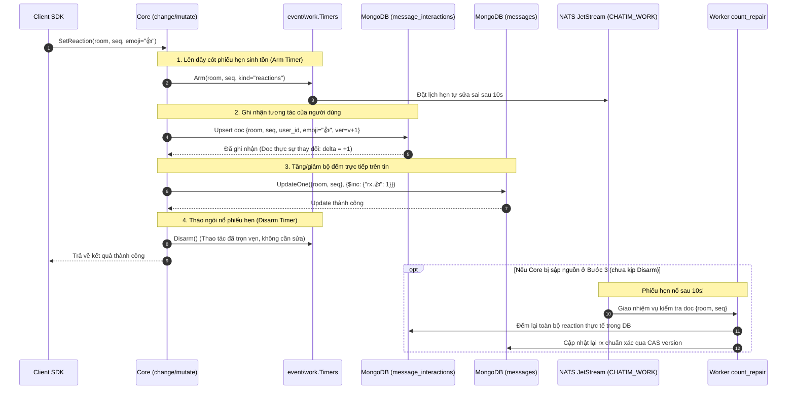
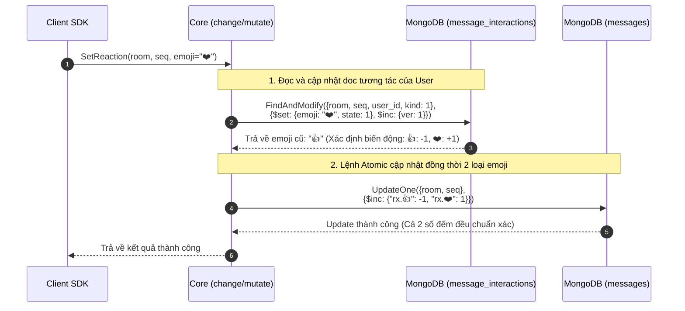

# Module 04: Tương tác — Thả cảm xúc, Ghim & Đánh dấu tin

> **Mục tiêu module:** Hỗ trợ các tương tác phong phú trên tin nhắn bao gồm thả biểu tượng cảm xúc (Reaction) kèm bộ đếm tổng hợp, ghim các thông báo quan trọng lên đầu phòng chat (Pinning), và lưu trữ tin nhắn cá nhân (Bookmarks).

---

## 1. Các Use Case nghiệp vụ (Business Use Cases)

| Mã Use Case | Tên Use Case | Tác nhân | Mô tả & Kết quả kỳ vọng |
|---|---|---|---|
| **UC-INT-01** | **Thả biểu tượng cảm xúc (Reaction)** | Thành viên | Thả một biểu tượng cảm xúc (như 👍, ❤️, 😂) vào tin nhắn. Mỗi thành viên chỉ có **tối đa một emoji** trên một tin nhắn tại một thời điểm (thả emoji mới sẽ tự động đổi emoji cũ). |
| **UC-INT-02** | **Gỡ biểu tượng cảm xúc** | Người đã thả | Bấm lại vào emoji đang chọn để gỡ bỏ cảm xúc. Bộ đếm tương ứng tự động giảm xuống. |
| **UC-INT-03** | **Xem tổng hợp và danh sách Reaction** | Mọi thành viên | Xem số lượng đếm gộp theo từng loại emoji trên tin nhắn (`rx`: {"👍": 5, "❤️": 2}) và mở danh sách xem chi tiết ai đã thả biểu tượng nào. |
| **UC-INT-04** | **Ghim tin nhắn lên đầu phòng (Pin message)** | Admin / Member | Ghim tin nhắn quan trọng để mọi người trong phòng dễ chú ý. Hỗ trợ danh sách tối đa 50 tin ghim. Bỏ ghim (Unpin) khi hết hạn thông báo. |
| **UC-INT-05** | **Đánh dấu tin nhắn cá nhân (Bookmark)** | Thành viên bất kỳ | Lưu tin nhắn vào mục "Tin nhắn đã lưu" của riêng mình để xem lại sau. Tương tác này hoàn toàn riêng tư, người khác không nhìn thấy. |

---

## 2. Luồng hoạt động chi tiết (How It Works)

### 2.1. Luồng Thả cảm xúc & Cơ chế Phiếu hẹn sinh tồn (Survivor Timers)

Để bộ đếm `rx` trên tin nhắn luôn chuẩn xác mà không cần transaction đa tài liệu, hệ thống sử dụng cơ chế **Ghi nguyên tử + Lên dây cót phiếu hẹn**:



### 2.2. Luồng Đổi Biểu tượng Cảm xúc (Change Reaction: 👍 sang ❤️)

Khi người dùng đã thả `👍` và bấm chọn sang `❤️`, hệ thống phải bảo đảm cập nhật cả 2 loại emoji một cách nguyên tử:



> [!NOTE]
> **Dọn dẹp key có số đếm bằng 0:** Khi số lượng của một emoji giảm về `0`, hệ thống hoặc tiến trình dọn dẹp nền sẽ tự động loại bỏ key đó khỏi trường `rx` (bằng toán tử `$unset`) để tài liệu không bị phình to vô ích.

---

## 3. Cơ chế bảo đảm tính đúng đắn (Guarantees & Mechanisms)

### 3.1. Lớp dữ liệu Tập `(target, user)` & Tombstone (Nguyên tắc D112)
- Cả **Reaction** và **Bookmark** đều thuộc lớp tập hợp: một người dùng chỉ có một trạng thái trên một mục tiêu (Target).
- Toàn bộ tương tác này được gom chung vào collection `message_interactions` với cấu trúc khoá:
  $$\text{\_id} = \text{hash}(\text{tenant}, \text{room\_id}, \text{seq}, \text{user\_id}, \text{kind})$$
- Khi người dùng gỡ reaction hoặc bỏ bookmark:
  - Hệ thống **không xoá bản ghi** (xoá vật lý làm mất lịch sử và lỗi các hệ thống đồng bộ).
  - Hệ thống ghi đè trạng thái sang **Tombstone** (`state = 2`, `emoji = ""`) và tăng số đếm phiên bản `ver = ver + 1`.

### 3.2. Đếm trực tiếp `$inc` kết hợp Phiếu hẹn sinh tồn (Survivor Timers D111 / D113)
- **Vấn đề cần giải quyết:** Nếu mỗi lần thả reaction đều phải quét toàn bộ collection để `COUNT(*)` rồi ghi lại số lượng (Recount), database sẽ bị nghẽn IOPS khi có hàng nghìn reaction mỗi giây. Ngược lại, nếu chỉ dùng `$inc`, nếu server crash giữa chừng thì số đếm sẽ vĩnh viễn bị lệch (Drift counter).
- **Cơ chế bảo đảm:**
  - **Đường bình thường (Fast-path):** Khi ghi bản ghi tương tác thành công, nếu thực sự có emoji mới, Core áp dụng toán tử `$inc: {"rx.<emoji>": 1}` ngay trên document `messages`. Tốc độ cực nhanh (<2ms).
  - **Bảo hiểm sinh tồn (Slow-path Insurance):** Trước khi ghi, Core bật một "phiếu hẹn" trên NATS JetStream. Nếu lệnh `$inc` thành công, phiếu hẹn được tháo ngòi (`Disarm`). Nếu Core crash trước khi kịp `$inc`, phiếu hẹn sẽ nổ sau 10s và kích hoạt worker `count_repair` quét đếm lại để đưa số lượng về chuẩn xác tuyệt đối.

### 3.3. Cơ chế gấp nếp Ghim tin nhắn (Pin Projection Folding D92)
- **Ghim tin:** Mọi thao tác ghim hay bỏ ghim được ghi thành các Fact bất biến vào `pin_actions` với `pin_ver` tăng dần đơn điệu.
- Bảng hiển thị ghim tại `rooms.pins` là bản chiếu (Projection) được sinh ra bằng cách gấp nếp (Fold) các hành động từ `pin_actions`.
- **Bảo đảm hạn mức `PIN_LIMIT = 50`:** Nhờ việc tính toán trên toàn bộ chuỗi fact của `pin_actions`, số lượng tin ghim đang hoạt động không bao giờ vượt quá 50 tin, ngăn chặn tình trạng tràn bộ nhớ giao diện người dùng.

---

## 4. Kỹ thuật & Công nghệ triển khai (Technologies)

### 4.1. Cấu trúc bảng MongoDB Clustered Collection `message_interactions`

```javascript
{
  "_id": BinData(0, "..."),            // Clustered Key: {room_id, seq, kind, user_id}
  "room_id": NumberLong("8492049201948201"),
  "seq": NumberLong(10042),
  "kind": 1,                           // 1: Reaction, 2: Bookmark, 3: Reply link
  "user_id": "usr_1001",
  "emoji": "👍",                       // Rỗng nếu là Bookmark hoặc đã gỡ
  "state": 1,                          // 1: Active, 2: Tombstone (đã gỡ)
  "ver": NumberLong(3),                // Version của tương tác này
  "updated_at": ISODate("2026-10-10T10:15:00Z")
}
```

### 4.2. Cấu trúc Danh sách Ghim trong Collection `rooms`

```javascript
// Bảng rooms lưu danh sách pins đã được chiếu (Projection)
{
  "_id": NumberLong("8492049201948201"),
  "pin_ver": NumberLong(12),           // Version ghim hiện tại
  "pins": [
    {
      "seq": NumberLong(10042),
      "pinned_by": "usr_1001",
      "pinned_at": ISODate("2026-10-10T10:15:00Z")
    }
  ]
}
```

### 4.3. Danh mục Emoji cố định & API
- Hệ thống quy định danh sách emoji hợp lệ qua cấu hình `REACTION_EMOJIS` (ví dụ: `👍`, `❤️`, `😂`, `😮`, `😢`, `🙏`). Client SDK gọi `GetReactionSettings` lúc khởi động để lấy danh sách emoji này.
- Mọi emoji nằm ngoài danh sách đều bị Core từ chối ngay tại tầng API với mã lỗi `codes.InvalidArgument`.

### 4.4. Hợp đồng Mã lỗi gRPC (Error Matrix)

| Mã lỗi gRPC | Tên lỗi domain | Tình huống kích hoạt | Hành vi Client SDK yêu cầu |
|---|---|---|---|
| `InvalidArgument` | `ERR_INVALID_EMOJI` | Emoji gửi lên không nằm trong danh sách `REACTION_EMOJIS`. | Không retry; hiển thị thông báo emoji không hợp lệ. |
| `NotFound` | `ERR_MESSAGE_NOT_FOUND` | Tin nhắn cần thả reaction hoặc ghim không tồn tại trong phòng. | Không retry; loại bỏ tin nhắn khỏi màn hình nếu cần. |
| `ResourceExhausted` | `ERR_PIN_LIMIT_EXCEEDED` | Phòng đã có đủ 50 tin ghim (`PIN_LIMIT`), không thể ghim thêm. | Không retry; báo người dùng gỡ bớt tin ghim cũ. |
| `Unavailable` | `ERR_CAS_PIN_CONFLICT` | Phiên bản ghim `pin_ver` bị xung đột với thao tác ghim của người khác. | Có retry; Client tự động backoff jitter và gọi lại. |
| `PermissionDenied` | `ERR_NOT_IN_ROOM` | Người gọi đã bị kick khỏi phòng hoặc chưa tham gia. | Không retry; yêu cầu người dùng gia nhập phòng. |

---

## 5. Hạn chế kỹ thuật & Đánh đổi (Limitations & Trade-offs)

1. **Giới hạn 1 Emoji / Người dùng / Tin nhắn:**
   - *Hạn chế:* Một người không thể vừa thả "👍" vừa thả "❤️" trên cùng một tin nhắn (thả ❤️ sẽ thay thế 👍).
   - *Lý do đánh đổi:* Đơn giản hoá mô hình dữ liệu tập `(target, user)`, triệt tiêu rủi ro một user spam hàng chục reaction lên 1 tin làm phình to document.
2. **Hạn mức Ghim tối đa 50 tin (`PIN_LIMIT = 50`):**
   - *Hạn chế:* Khi danh sách ghim đã đủ 50 tin, yêu cầu ghim tin thứ 51 sẽ bị từ chối trừ khi quản trị viên gỡ bớt tin cũ.
   - *Lý do đánh đổi:* Giữ kích thước document `rooms` nhỏ gọn (<4KB), không làm suy giảm hiệu năng khi tải thông tin phòng.
3. **Không hỗ trợ Reaction ẩn danh:**
   - Mọi lượt reaction đều gắn kèm `user_id` để đảm bảo tính minh bạch và phục vụ việc truy vấn danh sách người thả cảm xúc.

---

## 6. Phụ thuộc kỹ thuật & Bán kính sự cố (Dependencies & Blast Radius)

| Thành phần phụ thuộc | Mục đích phụ thuộc | Ứng xử khi thành phần gặp sự cố (Failure Behavior) |
|---|---|---|
| **MongoDB Clustered Collection** | Lưu `message_interactions` và `pin_actions` | Nếu MongoDB lỗi ghi CAS: Lệnh thả reaction/ghim trả `UNAVAILABLE`. Trạng thái cảm xúc giữ nguyên, client tự backoff và gọi lại. |
| **NATS JetStream (CHATIM_WORK)** | Lưu trữ Phiếu hẹn sinh tồn (Survivor Timers) | Nếu NATS quá tải không nhận được timer: Lệnh ghi vẫn hoàn tất trên fast-path; nếu Core crash đúng lúc này, quản trị viên có thể kích hoạt công cụ `/app recount` để sửa sai thủ công. |
| **Worker `count_repair`** | Tự động cân bằng lại bộ đếm khi có sự cố | Nếu worker bị chậm trễ: Bộ đếm reaction trên tin nhắn có thể lệch 1-2 đơn vị trong một khoảng thời gian ngắn, nhưng danh sách chi tiết từng người thả trong `message_interactions` luôn chính xác. |

### 6.1. Chỉ số Sức khoẻ Vận hành & Cảnh báo SRE (Key Metrics & Alerts)

- **`chatim_counter_repaired_total{counter="reactions"}`:** Bộ đếm tổng số lần worker `count_repair` phải can thiệp để sửa lệch số reaction.
  - *Ngưỡng bình thường:* Gần như bằng 0 trong điều kiện vận hành ổn định.
  - *Luật cảnh báo (`ChatimCounterRepairSurge`):* Khi tốc độ sửa sai tăng vọt `> 10 repairs/phút` trong 5 phút liên tục, cảnh báo Core đang bị crash đột ngột hoặc mạng giữa Core và MongoDB gặp tình trạng nghẽn nặng.
- **`chatim_pin_actions_total{action="pin|unpin"}`:** Đo lường tần suất ghim/bỏ ghim trong toàn hệ thống.
