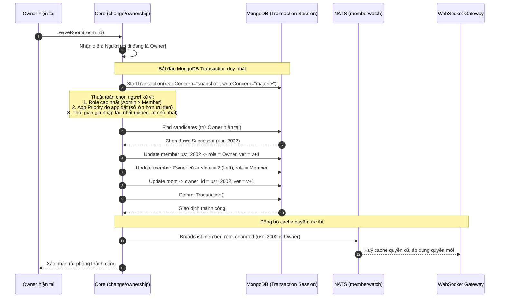

# Module 05: Thành viên — Quản lý Thành viên, Phân quyền & Kế nhiệm Owner

> **Mục tiêu module:** Quản lý vòng đời thành viên trong phòng chat (thêm, xoá, rời phòng), kiểm soát vai trò và quyền hạn (Owner, Admin, Member), đồng thời bảo đảm tính liên tục của phòng chat bằng thuật toán tự động kế nhiệm Owner thông qua giao dịch nguyên tử.

---

## 1. Các Use Case nghiệp vụ (Business Use Cases)

| Mã Use Case | Tên Use Case | Tác nhân | Mô tả & Kết quả kỳ vọng |
|---|---|---|---|
| **UC-MBR-01** | **Thêm thành viên vào nhóm** | Admin / Member | Mời một hoặc nhiều người dùng vào nhóm chat cùng lúc. Nếu người dùng đã có trong nhóm từ trước, yêu cầu được bỏ qua an toàn mà không làm lỗi hay nhân đôi dữ liệu. |
| **UC-MBR-02** | **Thành viên tự rời phòng (Leave room)** | Thành viên | Người dùng tự nguyện rút khỏi nhóm chat. Người dùng không còn nhận được tin nhắn mới và không thể gửi tin vào phòng này nữa. |
| **UC-MBR-03** | **Xoá thành viên khỏi phòng (Kick member)** | Owner / Admin | Quản trị viên truất quyền và mời một thành viên ra khỏi nhóm chat. Thành viên bị xoá lập tức bị ngắt kết nối nhận tin realtime của phòng đó. |
| **UC-MBR-04** | **Thay đổi vai trò (Role Assignment)** | Owner | Thăng cấp thành viên lên Quản trị viên (Admin) hoặc hạ cấp về Thành viên thường (Member). |
| **UC-MBR-05** | **Kế nhiệm Owner khi rời phòng (Succession)** | Owner rời phòng | Khi Owner của nhóm quyết định rời nhóm, hệ thống **bắt buộc và tự động** tìm kiếm thành viên ưu tú nhất để trao lại quyền Owner, đảm bảo nhóm chat không bao giờ bị rơi vào trạng thái "vô chủ". |

---

## 2. Luồng hoạt động chi tiết (How It Works)

### 2.1. Luồng Kế nhiệm Owner (Giao dịch đa tài liệu duy nhất — Single Transaction D100)

Việc chuyển giao quyền sở hữu nhóm là tác vụ nhạy cảm cao, yêu cầu tính toàn vẹn tuyệt đối trên nhiều document cùng lúc:



---

## 3. Cơ chế bảo đảm tính đúng đắn (Guarantees & Mechanisms)

### 3.1. Thêm thành viên an toàn và Chống lặp (BulkWrite with `request_id` D99)
- **Vấn đề:** Khi mời 50 người cùng lúc, nếu mạng bị ngắt giữa chừng và client gọi lại lệnh thêm thành viên, làm sao không kích hoạt tăng số lượng đếm thành viên (`member_count`) sai lệch?
- **Cơ chế bảo đảm:**
  - Client gửi kèm `request_id` duy nhất cho mỗi thao tác.
  - Sử dụng lệnh `BulkWrite` với pipeline cập nhật có điều kiện (`$cond`):
    - Nếu member đã tồn tại và đang hoạt động (`state == 1`): Bỏ qua (No-op).
    - Nếu member chưa có: Chèn mới với `state = 1`.
    - Nếu member trước đây đã rời nhóm (`state == 2`): Kích hoạt lại (`state = 1`).
  - Hệ thống đếm chính xác số lượng document **thực sự thay đổi trạng thái** để chỉ tăng bộ đếm `member_count` đúng bằng số lượng đó kết hợp với **Phiếu hẹn sinh tồn (Survivor Timers D111)**.

### 3.2. Thuật toán Kế nhiệm Owner tất định (Owner Succession Algorithm)
- Nhóm chat không bao giờ tồn tại trạng thái không có chủ (Orphan group) hoặc có 2 chủ (Split-owner).
- Khi Owner rời nhóm mà không chỉ định trước người kế vị, thuật toán tự động lựa chọn ứng viên theo thứ tự ưu tiên giảm dần:
  1. **Vai trò (Role):** Ưu tiên Admin trước Member thông thường.
  2. **Độ ưu tiên do ứng dụng đặt (`priority`):** Giá trị số nguyên do nghiệp vụ gán (ví dụ: cấp bậc trong công ty).
  3. **Thâm niên trong nhóm (`joined_at`):** Người gia nhập nhóm sớm nhất sẽ được chọn nếu các tiêu chí trên bằng nhau.
- Toàn bộ bước đổi vai trò của người cũ, người mới và đổi trường `owner_id` của phòng được khoá chặt trong **một MongoDB Transaction duy nhất** (Ngoại lệ duy nhất của toàn hệ thống `chatim`, vi phạm nguyên tắc "chỉ ghi đơn doc" để đổi lấy tính an toàn tuyệt đối).
- Nếu có xung đột giao dịch (Transaction Conflict): Core trả mã lỗi `codes.Unavailable` ngay lập tức, không retry nội bộ.

#### Ca biên đặc biệt: Owner là thành viên duy nhất còn lại (`CandidateCount == 0`)
Khi phòng chỉ còn đúng 1 người (chính là Owner) và người này bấm "Rời phòng":
- Hệ thống phát hiện danh sách ứng viên kế nhiệm rỗng (`CandidateCount == 0`).
- Thay vì ném lỗi, transaction tự động:
  1. Đánh dấu member chuyển sang `state = 2 (Left)`.
  2. Đánh dấu phòng chuyển sang trạng thái lưu trữ/giải tán: `rooms.state = 2 (Archived)`.
  3. Lập tức phát event `room_archived` và kích hoạt Core tự động huỷ bỏ (Evict) Actor của phòng đó trong RAM để giải phóng tài nguyên.

### 3.3. Cơ chế Quên Cache tức thời (`memberwatch` D106)
- Để tối ưu hiệu năng, các node Core và Gateway lưu cache danh sách quyền của thành viên trong RAM.
- Khi một người bị kick hoặc bị hạ quyền:
  - Core phát một sự kiện đặc biệt lên NATS JetStream: `member_removed` hoặc `member_role_changed`.
  - Bộ phận `send/memberwatch` trên tất cả các node Core khác lập tức nhận tín hiệu và xoá cache thành viên đó trong RAM. Lệnh gửi tin tiếp theo của người bị kick sẽ bị từ chối ngay lập tức tại tầng xác thực quyền `access.Policy`.

---

## 4. Kỹ thuật & Công nghệ triển khai (Technologies)

### 4.1. Cấu trúc bảng MongoDB Clustered Collection `members`

```javascript
{
  "_id": BinData(0, "..."),            // Clustered Key: {room_id, user_id}
  "room_id": NumberLong("8492049201948201"),
  "user_id": "usr_2002",
  "role": 2,                           // 1: Owner, 2: Admin, 3: Member, 4: Guest
  "priority": 100,                     // Trọng số ưu tiên kế nhiệm
  "state": 1,                          // 1: Active, 2: Left / Kicked (Tombstone)
  "joined_at": ISODate("2026-10-10T10:00:00Z"),
  "ver": NumberLong(3),                // Version cập nhật trạng thái member
  "read_seq": NumberLong(10040),       // Vị trí đã đọc mới nhất
  "read_ver": NumberLong(15),          // Version vị trí đọc
  "cleared_at": ISODate("1970-01-01T00:00:00Z") // Mốc thời gian xoá lịch sử
}
```

- **Secondary Index phục vụ danh sách phòng của User:** Chỉ mục `{user_id: 1, state: 1, room_id: 1}` giúp truy vấn cực nhanh: *"Người dùng này đang tham gia những phòng chat nào?"*.

### 4.2. Bộ đếm thành viên trên `rooms`
- Biến đếm `member_count` trên collection `rooms` được cập nhật qua toán tử nguyên tử `$inc: {member_count: delta}` đi kèm `member_count_ver`.
- Nếu có nghi ngờ lệch số, quản trị viên có thể chạy lệnh `/app recount` để quét lại toàn bộ thành viên đang active (`state = 1`) và cập nhật lại số chuẩn.

### 4.3. Hợp đồng Mã lỗi gRPC (Error Matrix)

| Mã lỗi gRPC | Tên lỗi domain | Tình huống kích hoạt | Hành vi Client SDK yêu cầu |
|---|---|---|---|
| `Unavailable` | `ERR_TRANSACTION_CONFLICT` | Xung đột giao dịch khi kế nhiệm Owner (WriteConflict do nhiều lệnh đổi role/leave cùng lúc). | Có retry; Client tự động backoff và thử lại sau 50–200ms. |
| `PermissionDenied` | `ERR_INSUFFICIENT_ROLE` | Người gọi không phải Owner/Admin nhưng cố tình kick thành viên hoặc thăng chức. | Không retry; hiển thị thông báo "Bạn không có quyền thực hiện". |
| `NotFound` | `ERR_MEMBER_NOT_FOUND` | Thành viên cần thao tác không tồn tại trong phòng. | Không retry; cập nhật lại danh sách thành viên trên UI. |
| `FailedPrecondition` | `ERR_ROOM_NOT_ACTIVE` | Thao tác trên phòng đã bị lưu trữ hoặc giải tán (`state != 1`). | Không retry; chuyển phòng sang trạng thái Read-only. |
| `ResourceExhausted` | `ERR_MEMBER_LIMIT_EXCEEDED`| Nhóm chat đã đạt giới hạn cứng 5,000 thành viên. | Không retry; thông báo nhóm đã đầy. |

---

## 5. Hạn chế kỹ thuật & Đánh đổi (Limitations & Trade-offs)

1. **Khả năng xung đột giao dịch khi đổi Owner:**
   - *Hạn chế:* Nếu tại thời điểm Owner rời nhóm, nhóm đang diễn ra việc thay đổi role ồ ạt, MongoDB Transaction có thể bị lỗi `WriteConflict`.
   - *Đánh đổi:* Chấp nhận trả mã lỗi `UNAVAILABLE` để client thử lại thay vì dùng cơ chế khoá phân tán phức tạp gây nguy cơ deadlock.
2. **Chi phí lan toả khi xoá thành viên ở nhóm lớn:**
   - *Hạn chế:* Khi kick một thành viên khỏi nhóm 5,000 người, Gateway phải ngắt kết nối WebSocket subscription của user đó đối với phòng. Quá trình này diễn ra bất đồng bộ qua NATS trong vòng vài mili-giây.
3. **Giới hạn số lượng thành viên tối đa (5,000 member):**
   - Không phù hợp cho các cộng đồng hàng trăm nghìn người thảo luận hai chiều; các trường hợp đó phải chuyển sang sử dụng mô hình **Kênh (Channel)**.

---

## 6. Phụ thuộc kỹ thuật & Bán kính sự cố (Dependencies & Blast Radius)

| Thành phần phụ thuộc | Mục đích phụ thuộc | Ứng xử khi thành phần gặp sự cố (Failure Behavior) |
|---|---|---|
| **MongoDB Replica Set (Transactions)** | Đảm bảo nguyên tử khi đổi Owner | Nếu cụm MongoDB không hỗ trợ transaction (ví dụ standalone) hoặc đang bầu lại Primary: Thao tác đổi Owner sẽ bị huỷ bỏ để tránh tạo ra nhóm vô chủ. |
| **NATS JetStream (`memberwatch`)** | Lan toả thông báo huỷ cache quyền | Nếu NATS bị nghẽn: Cache quyền trên một số Core có thể bị trễ tối đa bằng TTL của cache RAM (khoảng 30 giây), sau đó cache tự hết hạn và đọc lại từ DB. |
| **Worker `member_count_repair`** | Tự động cân bằng lại số đếm member | Giúp bảo đảm số lượng thành viên hiển thị trên giao diện không bao giờ bị sai lệch vĩnh viễn ngay cả khi server bị sập nguồn đột ngột. |

### 6.1. Chỉ số Sức khoẻ Vận hành & Cảnh báo SRE (Key Metrics & Alerts)

- **`chatim_owner_successions_total`:** Số lần thuật toán kế nhiệm Owner tự động kích hoạt thành công.
- **`chatim_owner_transaction_conflicts_total`:** Số lần transaction chuyển giao Owner bị abort do xung đột ghi (`WriteConflict`).
  - *Luật cảnh báo (`ChatimOwnershipConflictSpike`):* Báo động nếu `> 5 conflicts/phút` trong 5 phút liên tục.
- **`chatim_member_cache_invalidations_total`:** Đo lường lưu lượng thông điệp `memberwatch` được phân phát qua NATS.
