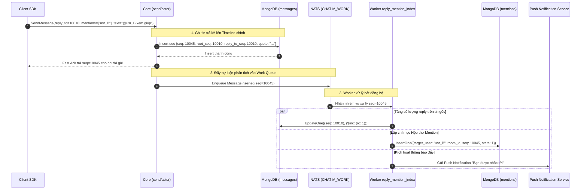

# Module 06: Thảo luận — Luồng trao đổi (Thread), Trích dẫn & Đề cập (@)

> **Mục tiêu module:** Nâng cao trải nghiệm giao tiếp nhóm thông qua việc trả lời tin nhắn có trích dẫn (Quote Reply), theo dõi các cuộc thảo luận phụ theo luồng (Thread), nhắc tên thành viên (@mention), và tổng hợp hộp thư "Tôi được nhắc tới".

---

## 1. Các Use Case nghiệp vụ (Business Use Cases)

| Mã Use Case | Tên Use Case | Tác nhân | Mô tả & Kết quả kỳ vọng |
|---|---|---|---|
| **UC-THRD-01** | **Trả lời tin nhắn có trích dẫn (Quote Reply)** | Thành viên | Trả lời một tin nhắn cụ thể. Tin trả lời hiển thị một đoạn trích ngắn của tin nhắn gốc để người đọc dễ dàng nắm bắt ngữ cảnh thảo luận. |
| **UC-THRD-02** | **Theo dõi luồng trao đổi (Thread)** | Thành viên | Mở xem toàn bộ các tin nhắn trao đổi xoay quanh một tin nhắn gốc (Root message). Tin nhắn gốc hiển thị huy hiệu đếm số lượng phản hồi (`rc`: "5 câu trả lời"). |
| **UC-THRD-03** | **Đề cập thành viên (@mention)** | Người gửi | Gõ `@tên_thành_viên` để nhắc đích danh một hoặc nhiều người trong tin nhắn (hoặc `@all` / `@channel` để thông báo cho toàn bộ phòng). |
| **UC-THRD-04** | **Hộp thư "Tôi được nhắc tới" (Mentions Inbox)** | Người nhận | Mở tab cá nhân xem danh sách tất cả các tin nhắn gần đây mà mình được người khác tag tên trong toàn bộ hệ thống, giúp không bị bỏ sót công việc. |
| **UC-THRD-05** | **Chuyển tiếp tin nhắn (Forward)** | Thành viên | Chuyển tiếp một tin nhắn từ phòng này sang một phòng khác kèm nhãn "Được chuyển tiếp". |

---

## 2. Luồng hoạt động chi tiết (How It Works)

### 2.1. Luồng Trả lời tin nhắn & Bóc tách Mention bất đồng bộ

Hệ thống thiết kế theo kiến trúc **Tách rời đường gửi tin tức thời và đường lập chỉ mục tìm kiếm**:



---

## 3. Cơ chế bảo đảm tính đúng đắn (Guarantees & Mechanisms)

### 3.1. Cấu trúc Phân cấp Phẳng (Flat Hierarchy — Không tạo Room con)
- **Vấn đề cần giải quyết:** Nhiều hệ thống chat tạo một "Sub-room" riêng biệt cho mỗi Thread, dẫn đến bùng nổ số lượng room, vỡ cấu trúc đánh số thứ tự `seq` và gây phức tạp trong việc tính toán unread.
- **Cơ chế bảo đảm:**
  - Tin nhắn trong Thread vẫn nằm **trực tiếp trên timeline chính của phòng chat** như một tin nhắn bình thường.
  - Mỗi tin trả lời mang 2 con trỏ số nguyên:
    - `root_seq`: Số thứ tự của tin nhắn khởi đầu luồng trao đổi.
    - `reply_to_seq`: Số thứ tự của tin nhắn trực tiếp được trả lời.
  - Khi người dùng bấm "Xem Thread", client chỉ cần truy vấn các tin nhắn có `root_seq == ROOT_SEQ`. Cách tiếp cận này giúp giữ vững tính toàn vẹn của một dòng thời gian duy nhất trong phòng.

### 3.2. Ảnh chụp trích dẫn bất biến (Immutable Quote Snapshot)
- Để bảo đảm trải nghiệm đọc không bị phá vỡ khi tin nhắn gốc bị chỉnh sửa hoặc thu hồi:
  - Khi gửi tin trả lời, Client gửi kèm một snapshot trích dẫn ngắn (ví dụ: tối đa 200 ký tự đầu của tin gốc).
  - Snapshot này được lưu cố định vào doc của tin trả lời trong trường `quote`.
  - Nếu sau này tin nhắn gốc bị xoá hoặc sửa nội dung, tin trả lời vẫn hiển thị rõ ràng ngữ cảnh thảo luận tại thời điểm nó được gửi.

### 3.3. Lập chỉ mục Mention bất đồng bộ & Idempotent (Async Mentions Indexing)
- **Cơ chế:** Việc phát hiện ai được nhắc tên và cập nhật hộp thư cá nhân được tách hoàn toàn khỏi luồng gửi tin chính (Fast-path).
- Worker `reply_mention_index` thuộc Effect Engine:
  - Quét danh sách `mentions` được khai báo trong tin nhắn.
  - Ghi vào collection `mentions` với khoá duy nhất:
    $$\text{\_id} = \text{hash}(\text{tenant}, \text{target\_user\_id}, \text{room\_id}, \text{seq})$$
  - Cơ chế này bảo đảm nếu worker bị chạy lại nhiều lần (do mạng chập chờn hoặc retry), document mention cũng không bao giờ bị nhân đôi.

---

## 4. Kỹ thuật & Công nghệ triển khai (Technologies)

### 4.1. Các trường dữ liệu liên kết trên Document `messages`

```javascript
{
  "_id": BinData(0, "..."),            // Clustered Key: {room_id, seq}
  "seq": NumberLong(10045),
  "root_seq": NumberLong(10010),       // seq của tin nhắn mở đầu thread
  "reply_to_seq": NumberLong(10010),   // seq của tin nhắn trực tiếp được trả lời
  "quote": {
    "sender_id": "usr_A",
    "text": "Báo cáo tiến độ dự án tuần này...",
    "ver": NumberLong(1)
  },
  "mentions": ["usr_B", "usr_C"],      // Danh sách người dùng được tag tên
  "has_mention_all": false,            // Cờ tag @all hoặc @channel
  "rc": 0                              // Số lượng tin trả lời trong thread (nếu là root)
}
```

### 4.2. Cấu trúc Collection `mentions` (Hộp thư "Tôi được nhắc tới")

```javascript
{
  "_id": "t1:usr_B:8492049201948201:10045", // tenant : user : room : seq
  "tenant_id": "t1",
  "target_user_id": "usr_B",
  "room_id": NumberLong("8492049201948201"),
  "seq": NumberLong(10045),
  "sender_id": "usr_1001",
  "created_at": ISODate("2026-10-10T10:20:00Z"),
  "state": 1                           // 1: Unread, 2: Read / Acknowledged
}
```

- **Compound Index phục vụ màn hình cá nhân:** `{target_user_id: 1, state: 1, created_at: -1}` giúp truy vấn toàn bộ các tin nhắn nhắc tên tôi mới nhất trong 0ms.

### 4.3. Hợp đồng Mã lỗi gRPC (Error Matrix)

| Mã lỗi gRPC | Tên lỗi domain | Tình huống kích hoạt | Hành vi Client SDK yêu cầu |
|---|---|---|---|
| `InvalidArgument` | `ERR_TOO_MANY_MENTIONS` | Tin nhắn chứa nhiều hơn 50 mentions (`MAX_MENTIONS = 50`). | Không retry; yêu cầu người dùng giảm bớt số người tag. |
| `NotFound` | `ERR_ROOT_MESSAGE_NOT_FOUND` | Tin nhắn gốc được reply không tồn tại trong phòng. | Không retry; loại bỏ ngữ cảnh reply trên UI. |
| `Unavailable` | `ERR_THREAD_COUNTER_BUSY` | Xung đột cập nhật bộ đếm replies trên tin gốc. | Có retry; Client tự động backoff retry. |

---

## 5. Hạn chế kỹ thuật & Đánh đổi (Limitations & Trade-offs)

1. **Không hỗ trợ cây phân nhánh vô hạn (No Infinite Nested Tree):**
   - *Hạn chế:* Hệ thống chỉ hỗ trợ 1 cấp độ Thread (chỉ có Root Message và các Replies). Không hỗ trợ việc trả lời một reply để tạo thành cây phân nhánh con cấp 2, cấp 3 như diễn đàn Reddit.
   - *Lý do đánh đổi:* Giữ mô hình truy vấn phẳng, đơn giản hoá giao diện di động và loại bỏ hoàn toàn các câu truy vấn đệ quy làm tê liệt cơ sở dữ liệu.
2. **Hạn mức Đề cập (Mention Quota):**
   - Giới hạn tối đa **50 mentions** trong một tin nhắn duy nhất.
   - Ngăn chặn các cuộc tấn công spam làm quá tải dịch vụ thông báo đẩy (Push Notification Amplification).
3. **Độ trễ xuất hiện trong Hộp thư Mention:**
   - Tin nhắn hiển thị trên timeline phòng chat tức thì, nhưng có thể mất từ 50–200ms trước khi xuất hiện trên tab "Tôi được nhắc tới" của người được tag (do xử lý bất đồng bộ qua worker).

---

## 6. Phụ thuộc kỹ thuật & Bán kính sự cố (Dependencies & Blast Radius)

| Thành phần phụ thuộc | Mục đích phụ thuộc | Ứng xử khi thành phần gặp sự cố (Failure Behavior) |
|---|---|---|
| **MongoDB Clustered Collection** | Lưu tin nhắn kèm con trỏ Thread | Nếu MongoDB lỗi ghi: Tin nhắn trả lời bị từ chối như tin nhắn thường; tính toàn vẹn của thread được bảo toàn. |
| **NATS JetStream (Work Queue)** | Đưa việc xử lý mention ra nền | Nếu NATS Work Queue bị ứ đọng: Tin nhắn trả lời vẫn gửi thành công, người trong phòng vẫn thấy tin; chỉ có tab "Tôi được nhắc tới" và thông báo đẩy bị trễ cho tới khi hàng đợi xả xong. |
| **Worker `reply_mention_index`** | Lập chỉ mục mention và đếm reply | Worker được thiết kế hoàn toàn Idempotent: có thể retry nhiều lần mà không sợ sai lệch bộ đếm `rc` hoặc nhân đôi bản ghi mention. |

### 6.1. Chỉ số Sức khoẻ Vận hành & Cảnh báo SRE (Key Metrics & Alerts)

- **`chatim_thread_replies_total`:** Số lượng tin nhắn trả lời trong thread được gửi.
- **`chatim_mentions_indexed_total`:** Số lượng bản ghi mention được bóc tách và lập chỉ mục vào database.
- **`chatim_effects_queue_lag{worker="reply_mention_index"}`:** Số lượng nhiệm vụ xử lý mention đang bị dồn ứ trong NATS JetStream.
  - *Luật cảnh báo (`ChatimMentionIndexingLag`):* Cảnh báo nếu queue lag `> 500 records` kéo dài trên 2 phút.
