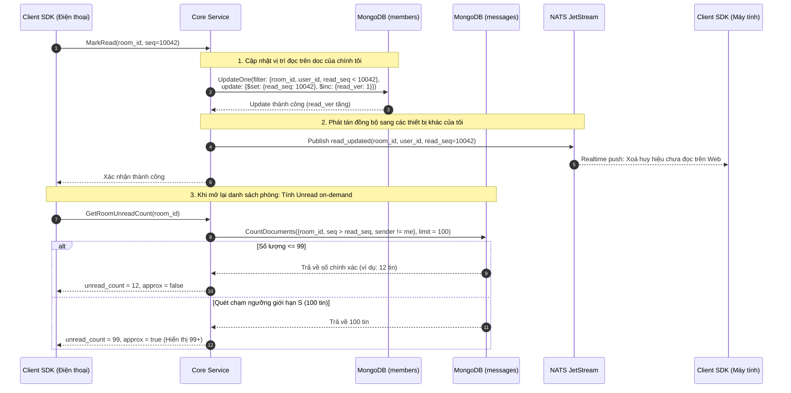

# Module 07: Vị trí đọc — Trạng thái đã đọc, Đánh dấu chưa đọc & Badge đếm

> **Mục tiêu module:** Theo dõi chính xác vị trí tin nhắn mà từng thành viên đã đọc trong phòng chat, đồng bộ trạng thái đọc tức thì trên mọi thiết bị cá nhân (Điện thoại, Máy tính, Web), và tính toán số lượng tin nhắn chưa đọc (Unread Badge) với hiệu năng cao mà không làm quá tải cơ sở dữ liệu.

---

## 1. Các Use Case nghiệp vụ (Business Use Cases)

| Mã Use Case | Tên Use Case | Tác nhân | Mô tả & Kết quả kỳ vọng |
|---|---|---|---|
| **UC-READ-01** | **Đánh dấu đã đọc (Mark Read)** | Người dùng | Khi người dùng mở xem phòng chat, client tự động gửi vị trí `read_seq` mới nhất. Huy hiệu chưa đọc của phòng đó biến mất trên giao diện. |
| **UC-READ-02** | **Đánh dấu chưa đọc (Mark as Unread)** | Người dùng | Người dùng chủ động đánh dấu một phòng chat là "Chưa đọc" để ghi nhớ cần xử lý sau. Huy hiệu chưa đọc xuất hiện trở lại bên cạnh tên phòng. |
| **UC-READ-03** | **Hiển thị số tin chưa đọc (Unread Badge)** | Hệ thống | Trên danh sách phòng chat, hiển thị số lượng tin nhắn mới mà tôi chưa đọc (ví dụ: `3`, `12`, hoặc `99+`). |
| **UC-READ-04** | **Đồng bộ đa thiết bị (Multi-Device Sync)** | Người dùng | Khi tôi đọc tin nhắn trên điện thoại, ứng dụng trên máy tính của tôi lập tức tắt huy hiệu chưa đọc mà không cần phải bấm làm mới. |

---

## 2. Luồng hoạt động chi tiết (How It Works)

### 2.1. Luồng Cập nhật Vị trí đọc & Thuật toán Đếm Unread có giới hạn (Bounded Scan)



---

## 3. Cơ chế bảo đảm tính đúng đắn (Guarantees & Mechanisms)

### 3.1. Vị trí đọc nhẹ tải (Lightweight Read Receipt — Không khoá bảng tin)
- **Vấn đề cần giải quyết:** Trong một nhóm có 5,000 thành viên, nếu mỗi lần một người đọc tin đều cập nhật một danh sách `read_by_users` ngay trên document tin nhắn, document đó sẽ bị ghi đè liên tục hàng nghìn lần (Hot document lock), làm tê liệt toàn bộ hệ thống.
- **Cơ chế bảo đảm:**
  - Vị trí đọc được lưu **riêng biệt trên document thành viên của người đó** tại collection `members`:
    $$\text{members.read\_seq} = \text{Số seq cao nhất đã đọc}$$
  - Thao tác `MarkRead` chỉ là một lệnh cập nhật cực nhẹ trên đúng 1 document cá nhân:
    $$\text{Update: } \{\$set: \{\text{read\_seq}: S\}, \$inc: \{\text{read\_ver}: 1\}\} \text{ where } \text{read\_seq} < S$$
  - Thao tác này hoàn toàn độc lập với bảng `messages`, không sinh ra bất kỳ sự tranh chấp tài nguyên nào giữa các thành viên trong phòng.

### 3.2. Thuật toán Đếm Unread có chặn ngưỡng (Bounded Scan — Quy tắc R17 / D73)
- **Cơ chế tính toán On-Demand:** Hệ thống **cố tình không lưu sẵn biến đếm unread** trong cơ sở dữ liệu. Số tin chưa đọc được tính toán động khi người dùng mở danh sách phòng chat.
- **Quy tắc bảo đảm hiệu năng:**
  - Để tránh việc database phải quét hàng nghìn bản ghi đối với những người dùng lâu ngày không mở ứng dụng, câu lệnh đếm áp dụng một **giới hạn cứng $S$ (ví dụ: $S = 100$)**:
    - Nếu số tin chưa đọc $< S$: Trả về kết quả chính xác (Exact count), cờ `approx = false`.
    - Nếu số tin chưa đọc $\ge S$: Ngắt quét lập tức để tiết kiệm CPU/Disk I/O, trả về cận dưới $99$ đi kèm cờ `approx = true`. Giao diện hiển thị huy hiệu `99+`.
  - **Quy tắc đếm chuẩn nghiệp vụ:** Chỉ đếm các tin nhắn:
    1. Do người khác gửi (`sender_id != current_user`).
    2. Chưa bị xoá cho mọi người (`deleted == false`).
    3. Chưa bị người này ẩn (`seq` không nằm trong danh sách `hidden` và `created_at > cleared_at`).
    4. Có loại tin được đánh dấu tính vào unread (loại trừ các tin hệ thống im lặng).

### 3.3. Đánh dấu chưa đọc linh hoạt (`MarkUnread`)
- Khi người dùng muốn đánh dấu một phòng là chưa đọc:
  - Hệ thống hạ giá trị `read_seq` lùi về trước số seq mới nhất một đơn vị (hoặc mốc do người dùng chỉ định).
  - Tăng số đếm phiên bản `read_ver = read_ver + 1` để đảm bảo event đồng bộ có số version lớn hơn, giúp các thiết bị khác luôn tôn trọng trạng thái mới nhất ("Version cao hơn luôn thắng").

---

## 4. Kỹ thuật & Công nghệ triển khai (Technologies)

### 4.1. Cấu trúc lưu trữ Vị trí đọc trên Collection `members`

```javascript
{
  "_id": BinData(0, "..."),            // Clustered Key: {room_id, user_id}
  "room_id": NumberLong("8492049201948201"),
  "user_id": "usr_1001",
  "read_seq": NumberLong(10042),       // Mốc tin nhắn đã đọc
  "read_ver": NumberLong(28),          // Version cập nhật vị trí đọc
  "updated_at": ISODate("2026-10-10T10:25:00Z")
}
```

### 4.2. Chỉ mục Clustered hỗ trợ Đếm Unread cực nhanh
- Nhờ cấu trúc Clustered Index của bảng `messages` trên cặp `{room_id, seq}`, câu truy vấn:
  ```javascript
  db.messages.countDocuments({
    "_id": {
      "$gt": makeKey(room_id, read_seq),
      "$lte": makeKey(room_id, max_seq)
    },
    "sender_id": { "$ne": "usr_1001" },
    "deleted": false
  }, { "limit": 100 })
  ```
  sẽ chỉ quét qua vùng bộ nhớ SSD chứa các tin nhắn mới nhất của phòng đó, hoàn thành trong thời gian **<5ms**.

### 4.3. Hợp đồng Mã lỗi gRPC (Error Matrix)

| Mã lỗi gRPC | Tên lỗi domain | Tình huống kích hoạt | Hành vi Client SDK yêu cầu |
|---|---|---|---|
| `InvalidArgument` | `ERR_INVALID_READ_SEQ` | `read_seq` gửi lên lớn hơn số seq cao nhất hiện có trong phòng. | Không retry; Client điều chỉnh lại seq đọc bằng max seq. |
| `PermissionDenied` | `ERR_NOT_IN_ROOM` | Người gọi cố tình cập nhật vị trí đọc của phòng mình không tham gia. | Không retry; bỏ qua thao tác trên UI. |
| `Unavailable` | `ERR_DATABASE_BUSY` | MongoDB Replica Set đang tạm thời quá tải hoặc failover. | Có retry; Client tự động backoff và thử lại trong lần cuộn sau. |

---

## 5. Hạn chế kỹ thuật & Đánh đổi (Limitations & Trade-offs)

1. **Không hiển thị số chính xác khi chưa đọc quá 99 tin:**
   - *Hạn chế:* Người dùng không thể thấy con số chính xác như "Bạn có 4,812 tin chưa đọc" (chỉ thấy 99+).
   - *Lý do đánh đổi:* Tiết kiệm 99.9% tài nguyên quét đĩa của cơ sở dữ liệu. Đây là tiêu chuẩn thiết kế thực tế đã được chứng minh trên Slack, Telegram, WhatsApp và Discord.
2. **Không lưu sẵn biến đếm Unread vào DB (No Pre-computed Unread):**
   - *Hạn chế:* Khi người dùng có 100 phòng chat cùng lúc, Client cần gửi yêu cầu lấy unread cho các phòng đó lúc khởi động.
   - *Lý do đánh đổi:* Tránh hoàn toàn thảm hoạ **Write Amplification**: nếu lưu trước unread count, mỗi khi có 1 tin nhắn gửi vào nhóm 5,000 người, hệ thống sẽ phải thực thi 5,000 lệnh ghi đĩa để tăng số đếm cho 5,000 người.
3. **Huy hiệu ứng dụng ngoài màn hình chính (Push Badge):**
   - Số đếm trên icon ứng dụng ở màn hình điện thoại (APNs/FCM badge) chỉ mang tính chất xấp xỉ, do dịch vụ thông báo đẩy (Push Service) tự duy trì riêng biệt, không phản ánh thời gian thực 100%.

---

## 6. Phụ thuộc kỹ thuật & Bán kính sự cố (Dependencies & Blast Radius)

| Thành phần phụ thuộc | Mục đích phụ thuộc | Ứng xử khi thành phần gặp sự cố (Failure Behavior) |
|---|---|---|
| **Collection `members`** | Lưu trạng thái `read_seq` | Nếu ghi thất bại: Client sẽ thử lại trong lần cuộn màn hình tiếp theo. Người dùng chỉ bị hiện tượng tạm thời thấy phòng chưa được đánh dấu đã đọc. |
| **NATS JetStream** | Phát sự kiện `read_updated` đồng bộ đa thiết bị | Nếu NATS quá tải: Thiết bị hiện tại vẫn hiển thị đã đọc bình thường; thiết bị thứ hai (ví dụ máy tính) sẽ được đồng bộ lại khi người dùng mở lại ứng dụng. |
| **Clustered Index `messages`** | Phục vụ thuật toán Bounded Count | Nếu index bị quá tải IOPS: API đếm unread sẽ fallback ngay lập tức về trả giá trị `unread_count = 0` hoặc trạng thái gần nhất để không làm nghẽn giao diện người dùng. |

### 6.1. Chỉ số Sức khoẻ Vận hành & Cảnh báo SRE (Key Metrics & Alerts)

- **`chatim_mark_read_requests_total`:** Tần suất thực thi cập nhật vị trí đã đọc.
- **`chatim_unread_calculation_duration_seconds`:** Thời gian tính toán số lượng unread cho một phòng chat.
  - *Ngưỡng SLA:* p99 ≤ 5ms.
- **`chatim_unread_approx_ratio`:** Tỷ lệ phòng chat chạm ngưỡng quét 99+ so với tổng số lần tính unread.
