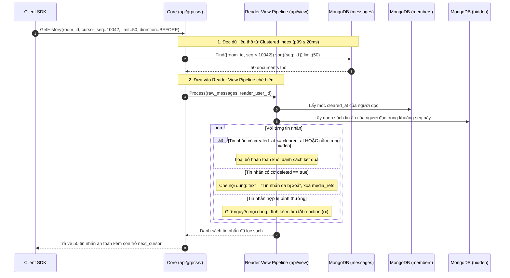

# Module 08: Đọc dữ liệu — Xem lịch sử tin nhắn & Đồng bộ khi Reconnect

> **Mục tiêu module:** Cho phép người dùng cuộn xem lịch sử trò chuyện mượt mà ở bất kỳ vị trí nào với độ trễ cực thấp (p99 ≤20ms cho 50 tin), bảo vệ tính riêng tư qua bộ lọc hiển thị động (Reader View Pipeline), và khôi phục trạng thái tức thì sau khi rớt mạng mà không gây quá tải hệ thống (Chống Reconnect Storm).

---

## 1. Các Use Case nghiệp vụ (Business Use Cases)

| Mã Use Case | Tên Use Case | Tác nhân | Mô tả & Kết quả kỳ vọng |
|---|---|---|---|
| **UC-HIST-01** | **Cuộn xem lịch sử tin nhắn (Pagination)** | Người dùng | Cuộn ngược lên để xem các tin nhắn cũ hơn, hoặc cuộn xuống để xem các tin nhắn mới hơn. Dữ liệu tải về nhanh chóng (50 tin/lần), không bị giật lag hay nhảy lộn xộn. |
| **UC-HIST-02** | **Nhảy đến tin nhắn chỉ định (Jump to Message)** | Người dùng | Bấm vào một tin nhắn được trích dẫn (Quote), kết quả tìm kiếm hoặc thông báo nhắc tên để nhảy thẳng tới vị trí tin nhắn đó trong timeline và tải ngữ cảnh các tin xung quanh. |
| **UC-HIST-03** | **Khôi phục trạng thái sau khi mất mạng (Reconnect Sync)** | Client SDK | Khi điện thoại đi vào vùng mất sóng (hoặc tắt ứng dụng) rồi kết nối lại mạng, Client tự động kéo các tin nhắn và thay đổi mới phát sinh trong thời gian offline mà không cần tải lại toàn bộ phòng chat từ đầu. |
| **UC-HIST-04** | **Bảo vệ quyền riêng tư lúc đọc (View Pipeline Filtering)** | Hệ thống | Người đọc không nhìn thấy các tin nhắn mà mình đã chủ động ẩn, không thấy các tin nhắn trước mốc thời gian đã bấm "Xoá lịch sử", và chỉ thấy nhãn "Tin nhắn đã bị xoá" đối với các tin đã thu hồi. |

---

## 2. Luồng hoạt động chi tiết (How It Works)

### 2.1. Luồng Phân trang & Xử lý qua Reader View Pipeline

Toàn bộ dữ liệu thô từ cơ sở dữ liệu đều phải đi qua **Đường ống chế biến giao diện (Reader View Pipeline)** trước khi trả về cho người đọc:

---

## 3. Cơ chế bảo đảm tính đúng đắn (Guarantees & Mechanisms)

### 3.1. Phân trang bằng Con trỏ tuần tự (Cursor-Based Pagination — Không dùng Offset)
- **Vấn đề cần giải quyết:** Nếu dùng phân trang kiểu truyền thống `OFFSET 50 LIMIT 50`, khi người dùng đang cuộn xem lịch sử mà trong phòng có người gửi thêm tin mới, toàn bộ vị trí offset sẽ bị trôi, dẫn đến việc người dùng bị nhìn thấy tin nhắn trùng lặp hoặc bị sót tin. Ngoài ra, câu lệnh `OFFSET` lớn làm database quét bảng cực kỳ chậm ($O(N)$).
- **Cơ chế bảo đảm:**
  - Hệ thống sử dụng **Con trỏ bất biến (Cursor)** dựa trên chính số thứ tự `seq`:
    $$\text{Cursor} = \{\text{room\_id}: \text{RID}, \text{seq}: \text{SEQ}\}$$
  - Truy vấn phân trang luôn tận dụng Clustered Index:
    $$\text{db.messages.find}(\{\text{\_id}: \{\$lt: \text{makeKey}(\text{RID}, \text{SEQ})\}\}).\text{sort}(\{\text{\_id}: -1\}).\text{limit}(50)$$
  - Tốc độ truy vấn luôn là $O(\log N)$ bất kể phòng chat có 100 tin hay 10 triệu tin, đảm bảo đạt chuẩn phi chức năng **A1: tải 50 tin ở bất kỳ vị trí nào chỉ mất ≤20ms**.

### 3.2. Cơ chế Đồng bộ bằng Sync Token (Sync Token Protocol — Nguyên tắc R10 / D74)
- **Vấn đề cần giải quyết (Reconnect Storm):** Khi một sự cố mạng diện rộng kết thúc, hàng trăm nghìn thiết bị cùng kết nối lại hệ thống tại cùng một thời điểm. Nếu hệ thống cố gắng phát lại (Replay) toàn bộ các sự kiện NATS mà thiết bị đã bỏ lỡ, hệ thống sẽ sập nguồn vì quá tải băng thông và CPU (Thundering Herd).
- **Cơ chế bảo đảm:**
  - **Không phát lại Event Stream (Nguyên tắc P8):** Thiết bị kết nối lại **không kéo event stream**, mà kéo **Snapshot trạng thái mới nhất**.
  - **Sync Token:** Client gửi một bảng ánh xạ nhỏ:
    $$\text{Token} = \{\text{room\_A}: \text{last\_seq\_A}, \text{room\_B}: \text{last\_seq\_B}, \dots\}$$
  - Core chỉ truy vấn và trả về phần chênh lệch (Delta): các tin nhắn có `seq > last_seq` của các phòng có hoạt động mới.
  - Mỗi doc tin nhắn trả về luôn mang **toàn bộ snapshot trạng thái hiện tại** (nội dung mới nhất, cờ đã xoá, tóm tắt reaction `rx`, số replies `rc`). Nhờ đó, Client chỉ cần đè snapshot này lên giao diện là đạt trạng thái đồng bộ tuyệt đối mà không cần tính toán chuỗi sự kiện phức tạp.

### 3.3. Client Jitter (Rải đều tải khi Reconnect)
- Để bảo vệ cụm Core lúc mạng vừa phục hồi:
  - Client SDK được tích hợp thuật toán **Exponential Backoff with Full Jitter**:
    $$T_{\text{wait}} = \text{random}(0, \min(T_{\text{max}}, T_{\text{base}} \times 2^{\text{attempt}}))$$
  - Các kết nối Reconnect được rải đều tự nhiên trong khoảng thời gian từ vài giây đến vài chục giây, triệt tiêu hoàn toàn đỉnh nhọn lưu lượng (Traffic Spike).

---

## 4. Kỹ thuật & Công nghệ triển khai (Technologies)

### 4.1. Hiệu năng vượt trội từ MongoDB Clustered Collection
- Nhờ khoá chính `_id` 16 bytes gồm `(8 bytes room_id + 8 bytes seq)`, toàn bộ các tin nhắn của cùng một phòng được lưu trữ vật lý nằm liền kề nhau trên các trang nhớ (Data Pages) của công cụ lưu trữ WiredTiger.
- Khi truy vấn 50 tin nhắn theo `seq`, MongoDB chỉ cần nạp 1–2 trang nhớ từ ổ cứng NVMe vào bộ nhớ đệm (WiredTiger Cache), giúp câu lệnh hoàn thành trong vòng **2–5ms**.

### 4.2. Bộ nhớ đệm Room-Tail Cache trên Core
- Tại mỗi node Core, Actor quản lý phòng duy trì một bộ nhớ đệm nhỏ chứa **100 tin nhắn mới nhất** của phòng trong RAM (Tail Cache).
- Các truy vấn đọc tin nhắn mới nhất khi người dùng vừa mở ứng dụng sẽ được phục vụ trực tiếp từ RAM của Core mà không cần chạm vào cơ sở dữ liệu MongoDB.

### 4.3. Hợp đồng Mã lỗi gRPC (Error Matrix)

| Mã lỗi gRPC | Tên lỗi domain | Tình huống kích hoạt | Hành vi Client SDK yêu cầu |
|---|---|---|---|
| `InvalidArgument` | `ERR_PAGE_LIMIT_EXCEEDED` | Yêu cầu số lượng tin nhắn trên 1 trang vượt quá 100 tin. | Không retry; Client điều chỉnh lại `limit <= 100`. |
| `PermissionDenied` | `ERR_NOT_IN_ROOM` | Người đọc không thuộc phòng chat cần xem lịch sử. | Không retry; hiển thị thông báo không có quyền truy cập. |
| `Unavailable` | `ERR_STORAGE_UNAVAILABLE` | Cụm MongoDB Secondary/Primary đang failover hoặc quá tải. | Có retry; Client tự động backoff retry sau 1–2s. |

---

## 5. Hạn chế kỹ thuật & Đánh đổi (Limitations & Trade-offs)

1. **Giới hạn số lượng tin nhắn trên mỗi trang:**
   - Mặc định mỗi lần tải là **50 tin**, tối đa không quá **100 tin/lần**.
   - Ngăn chặn việc Client cố tình yêu cầu tải hàng nghìn tin nhắn cùng lúc làm cạn kiệt RAM của server và gây đơ giao diện điện thoại.
2. **Không hỗ trợ phân trang kiểu ngẫu nhiên (No Random Page Jumping):**
   - Không thể bấm "Nhảy tới trang số 42" như trên website thương mại điện tử; chỉ hỗ trợ cuộn liên tục (Infinite Scroll) dựa trên con trỏ `seq` hoặc nhảy tới mốc thời gian cụ thể.
3. **Đánh đổi của Reconnect Snapshot:**
   - Client không biết được chuỗi biến động trung gian (ví dụ: tin nhắn bị sửa 3 lần trong lúc mất mạng), client chỉ nhận được kết quả cuối cùng của lần sửa thứ 3. Đây là sự đánh đổi hoàn toàn hợp lý trong nghiệp vụ ứng dụng chat.

---

## 6. Phụ thuộc kỹ thuật & Bán kính sự cố (Dependencies & Blast Radius)

| Thành phần phụ thuộc | Mục đích phụ thuộc | Ứng xử khi thành phần gặp sự cố (Failure Behavior) |
|---|---|---|
| **MongoDB Replica Set (Secondary Nodes)** | Phục vụ đọc lịch sử (Read-preferred) | Có thể cấu hình đọc từ các node Secondary để giảm tải cho node Primary. Nếu 1 node Secondary sập, driver tự động chuyển hướng đọc sang node khác. |
| **Reader View Pipeline** | Thẩm định quyền và che giấu dữ liệu | Chạy hoàn toàn in-memory trên tiến trình Core. Nếu có lỗi giải mã, tin nhắn bị lỗi sẽ được ẩn đi an toàn thay vì làm sập toàn bộ trang tin. |
| **Room-Tail Cache** | Tăng tốc đọc tin nhắn mới | Là cache tạm thời (In-memory). Nếu Core khởi động lại, cache sẽ tự động nạp lại từ MongoDB trong lần truy vấn đầu tiên mà không làm mất dữ liệu. |

### 6.1. Chỉ số Sức khoẻ Vận hành & Cảnh báo SRE (Key Metrics & Alerts)

- **`chatim_get_history_duration_seconds`:** Biểu đồ histogram đo độ trễ p99 khi đọc 50 tin nhắn qua API `GetHistory`.
  - *Ngưỡng SLA:* p99 ≤ 20ms.
  - *Luật cảnh báo (`ChatimHistoryReadLatencyHigh`):* Cảnh báo nếu p99 > 20ms kéo dài trên 5 phút.
- **`chatim_room_tail_cache_hit_ratio`:** Tỷ lệ đọc thành công trực tiếp từ RAM Room-tail cache (kỳ vọng > 80% đối với các truy vấn mở phòng mới nhất).
- **`chatim_reconnect_sync_requests_total`:** Đo lường lưu lượng Reconnect sau các sự cố mạng.
