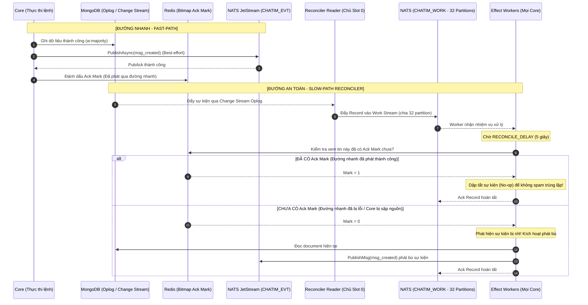

# Module 10: Tự phục hồi — Đối soát Dữ liệu, Sửa sai & Tự chữa lành (Self-Healing)

> **Mục tiêu module:** Hoạt động như một "tấm lưới bảo hiểm an toàn" cho toàn bộ hệ thống, bảo đảm không bao giờ mất mát sự kiện (At-least-once Event Delivery) ngay cả khi máy chủ sập nguồn, tự động phát hiện và cân bằng lại các bộ đếm bị lệch, và cung cấp công cụ vận hành để vá lành dữ liệu khi hạ tầng gặp sự cố thảm hoạ.

---

## 1. Các Use Case nghiệp vụ (Business Use Cases)

| Mã Use Case | Tên Use Case | Tác nhân | Mô tả & Kết quả kỳ vọng |
|---|---|---|---|
| **UC-RECON-01** | **Bù đắp sự kiện bị rớt (At-least-once Delivery)** | Hệ thống tự động | Nếu một tin nhắn đã ghi thành công vào cơ sở dữ liệu nhưng tiến trình gửi sự kiện qua mạng bị lỗi hoặc Core bị sập nguồn đột ngột, hệ thống tự động phát bù sự kiện đó sau vài giây mà không cần con người can thiệp. |
| **UC-RECON-02** | **Tự động sửa sai bộ đếm (Self-Healing Counters)** | Hệ thống tự động | Nếu thao tác cập nhật số lượng reaction hoặc số lượng thành viên bị ngắt quãng giữa chừng, hệ thống tự động đánh thức các tiến trình ngầm để đếm lại và hiệu chỉnh về con số chính xác tuyệt đối. |
| **UC-RECON-03** | **Tự chữa lành bản chiếu (Projection Repair)** | Hệ thống tự động | Nếu bản ghi Fact trong `message_edits` hoặc `pin_actions` đã ghi thành công nhưng bản chiếu hiển thị trên `messages` chưa kịp cập nhật, tiến trình ngầm tự động hoàn tất bản chiếu. |
| **UC-RECON-04** | **Phục hồi sự kiện diện rộng (Manual Resync Tool)** | Kỹ sư vận hành (SRE) | Khi hạ tầng gặp sự cố nghiêm trọng (mất điện toàn bộ trung tâm dữ liệu hoặc đứt Change Stream), kỹ sư chạy công cụ `/app resync` để quét lại toàn bộ dữ liệu trong MongoDB và phát lại toàn bộ sự kiện bị gián đoạn. |

---

## 2. Luồng hoạt động chi tiết (How It Works)

### 2.1. Kiến trúc Đối soát Hai luồng (Dual-Path Reconciliation Architecture)

Hệ thống kết hợp giữa **Đường nhanh (Fast-Path: độ trễ thấp)** và **Đường an toàn (Slow-Path: bảo đảm tính toàn vẹn)**:

---

## 3. Cơ chế bảo đảm tính đúng đắn (Guarantees & Mechanisms)

### 3.1. Chủ Slot 0 điều phối Đọc Oplog (Slot 0 Election)
- **Vấn đề cần giải quyết:** Nếu tất cả các node Core đều đọc MongoDB Change Stream cùng lúc, hệ thống sẽ bị lãng phí tài nguyên và làm quá tải MongoDB.
- **Cơ chế bảo đảm:**
  - Chỉ có node Core nào đang nắm giữ hợp đồng thuê **Slot 0** (được bầu qua Redis Slot Manager) mới có quyền mở kết nối Change Stream tới MongoDB Oplog.
  - Node này đóng vai trò là **Reconciler Reader**: đọc từng thay đổi từ MongoDB và băm đẩy vào 32 partition của hàng đợi công việc `CHATIM_WORK` trên NATS JetStream.
  - Các node Core khác chỉ đóng vai trò là Worker chia nhau kéo các partition này về xử lý song song. Nếu node giữ Slot 0 bị sập, một node khác sẽ lập tức nhận lại Slot 0 và tiếp tục đọc từ vị trí lưu gần nhất (Resume Token).

### 3.2. Dập tắt sự kiện trùng bằng Dấu xác nhận (Bitmap Ack Marks D52 / D60)
- **Cơ chế:**
  - Để tránh việc Reconciler liên tục phát lại các tin nhắn vốn đã được đường Fast-path gửi thành công, hệ thống sử dụng một chuỗi Bitmap nhỏ trên Redis Dedupe.
  - Khi Publisher của Fast-path nhận được phản hồi `PubAck` từ NATS, nó gom các số `seq` và gửi lệnh ghi một bit `1` lên Redis (gom 256 keys / 10ms).
  - Worker của Reconciler luôn cố tình **trì hoãn 5 giây (`RECONCILE_DELAY = 5s`)** trước khi kiểm tra bit này.
  - Nhờ cửa sổ 5 giây này, 99.99% tin nhắn bình thường đều đã có dấu Ack Mark, giúp Reconciler dập tắt (Suppress) các sự kiện thừa mà không tốn chi phí phát mạng.

### 3.3. Cơ chế Phiếu hẹn sinh tồn (Survivor Timers Recovery D111)
- Đối với các tác vụ cập nhật nhiều bước (ví dụ: ghi bản ghi interaction rồi mới tăng biến đếm `rx` trên tin nhắn):
  - Lệnh ghi luôn lên dây cót một phiếu hẹn sinh tồn có thời hạn 10 giây trên NATS JetStream.
  - Nếu tiến trình thực thi bị chết đột ngột trước khi kịp tháo ngòi phiếu hẹn, phiếu hẹn sẽ tự động nổ và chuyển giao cho worker `count_repair`.
  - Worker sẽ đọc lại toàn bộ các bản ghi trong cơ sở dữ liệu, tính toán lại tổng số chuẩn xác và áp dụng toán tử Optimistic CAS version để đưa hệ thống về trạng thái cân bằng hoàn hảo.

---

## 4. Kỹ thuật & Công nghệ triển khai (Technologies)

### 4.1. Hàng đợi Công việc NATS JetStream `CHATIM_WORK`
- Được cấu hình thành **32 partitions** tương ứng với các nhóm Slot.
- Tích hợp cơ chế xác nhận công việc (Message Acknowledgment):
  - Xử lý thành công -> Gửi `Ack`.
  - Xử lý thất bại hoặc lỗi mạng tạm thời -> Gửi `Nak(WORK_RETRY_DELAY)` để JetStream giao lại công việc cho một worker khác sau thời gian chờ.

### 4.2. Bộ công cụ Vận hành Dòng lệnh (CLI Operations)
- Hệ thống tích hợp sẵn các lệnh vận hành phục vụ công tác ứng cứu sự cố:
  - `/app resync --from="2026-10-10T10:00:00Z" --to="now"`: Quét lại toàn bộ các collection trong MongoDB và phát lại toàn bộ sự kiện trong khoảng thời gian chỉ định để vá lành các client bị mất dữ liệu.
  - `/app recount --room=8492049201948201`: Quét lại toàn bộ doc thành viên của một phòng và cân bằng lại biến đếm `member_count`.

### 4.3. Ma trận Sự cố & Cơ chế Tự chữa lành (Resilience Matrix)

| Loại sự cố hạ tầng | Biểu hiện rủi ro | Cơ chế Tự phục hồi tự động (Auto Self-Healing) | Thao tác can thiệp thủ công (nếu có) |
|---|---|---|---|
| **Mất gói tin NATS Fast-path** | Client không nhận được event realtime qua WebSocket. | Reconciler Slot 0 quét Oplog sau 5s, thấy thiếu Ack Mark trên Redis sẽ tự động phát bù sự kiện. | Tự động 100%, không cần can thiệp. |
| **Core crash khi đang `$inc`** | Bộ đếm `rx` hoặc `member_count` bị lệch so với dữ liệu thực tế. | Phiếu hẹn sinh tồn (Survivor Timers) nổ sau 10s kích hoạt worker `count_repair` đếm lại và cập nhật bằng CAS. | Tự động 100%; có thể chạy `/app recount` nếu muốn kiểm tra lại. |
| **Đứt Oplog Change Stream** | Reconciler mất dấu do Mongo ghi tràn Oplog (> 24h trễ). | Reader ghi log lỗi `LostResumeToken` và dừng lại an toàn để tránh bỏ sót dữ liệu. | Chạy lệnh `/app resync --from=...` để quét lại khoảng thời gian bị mất. |

---

## 5. Hạn chế kỹ thuật & Đánh đổi (Limitations & Trade-offs)

1. **Phụ thuộc vào Dung lượng Oplog của MongoDB (Oplog Retention Window):**
   - *Hạn chế:* Change Stream của MongoDB dựa vào dung lượng bộ đệm Oplog trên ổ đĩa. Nếu cụm Core bị sập quá lâu và dung lượng Oplog bị ghi tràn (Oplog Rollover), Reconciler sẽ bị mất dấu (Lost Resume Token).
   - *Đánh đổi:* Khi bị mất dấu Oplog, Reconciler sẽ ghi log cảnh báo nghiêm trọng và tự động dừng lại. Kỹ sư vận hành bắt buộc phải can thiệp bằng cách chạy lệnh `/app resync` để vá bù dữ liệu.
2. **Độ trễ bù đắp sự cố (5 giây):**
   - Sự cố mất tin qua đường nhanh sẽ mất khoảng **5–7 giây** mới được Reconciler phát hiện và phát bù. Đây là đánh đổi cần thiết để duy trì bộ lọc Ack Mark chống bùng nổ tin trùng lặp.
3. **Mô hình At-least-once (Có thể có trùng lặp hi hữu):**
   - Hệ thống cam kết không bao giờ mất tin, nhưng trong các kịch bản phân mảnh mạng cực đoan (Network Split-brain), một sự kiện có thể bị phát lại 2 lần. Do đó, **Client SDK bắt buộc phải bỏ trùng lặp dựa trên Event ID tự nhiên**.

---

## 6. Phụ thuộc kỹ thuật & Bán kính sự cố (Dependencies & Blast Radius)

| Thành phần phụ thuộc | Mục đích phụ thuộc | Ứng xử khi thành phần gặp sự cố (Failure Behavior) |
|---|---|---|
| **MongoDB Primary Node Oplog** | Cung cấp luồng Change Stream | Nếu MongoDB Primary bị đổi ngôi (Failover): Reader tự động ngắt kết nối và thử kết nối lại với Primary mới dựa trên `Resume Token` đã lưu. |
| **Redis Dedupe (Bitmap)** | Lưu dấu Ack Mark chống phát trùng | Nếu Redis bị lỗi hoặc mất dữ liệu: Reconciler sẽ phát lại các sự kiện trong cửa sổ 5s gần nhất. Nhờ Event ID tự nhiên trên NATS, Client SDK sẽ tự động bỏ qua các bản trùng này an toàn. |
| **Hạ tầng NATS JetStream Cluster** | Lưu trữ stream công việc `CHATIM_WORK` | Nếu cụm NATS gặp sự cố: Các worker tạm thời ngừng kéo việc. Khi NATS phục hồi, công việc trong queue tiếp tục được xử lý mà không bị mất dữ liệu. |

### 6.1. Chỉ số Sức khoẻ Vận hành & Cảnh báo SRE (Key Metrics & Alerts)

- **`chatim_reconcile_republished_total{effect="..."}`:** Tổng số sự kiện thực tế bị rớt ở đường nhanh và được Reconciler phát bù thành công.
  - *Luật cảnh báo (`ChatimRepublishSurge`):* Báo động nếu số lượng phát bù `> 100 events/giây` kéo dài trên 10 phút (dấu hiệu Publisher đường nhanh đang bị tê liệt).
- **`chatim_reconcile_delay_seconds`:** Độ trễ từ thời điểm bản ghi được commit vào MongoDB Oplog đến thời điểm Reader Slot 0 đọc được.
  - *Ngưỡng SLA:* ≤ 1s.
- **`chatim_work_stream_backlog{partition="..."}`:** Số lượng record đang chờ xử lý trong 32 partition của `CHATIM_WORK`.
  - *Luật cảnh báo (`ChatimWorkQueueBacklogHigh`):* Cảnh báo nếu partition backlog `> 1,000` records.
