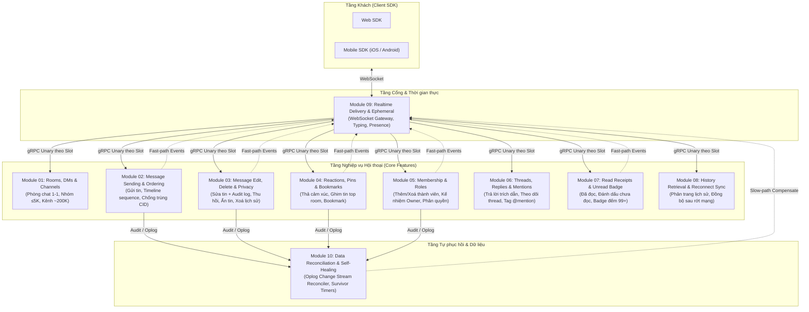

# chatim — Tài liệu Kỹ thuật Module & Tính năng (How It Works)

> **Mục tiêu:** Bản đặc tả chi tiết về cách thức vận hành (How It Works) của toàn bộ các tính năng nghiệp vụ trong nền tảng chat `chatim`. Tài liệu được phân rã theo **Module / Tính năng nghiệp vụ**, trả lời trực diện:
> - Tính năng / Use Case này vận hành thế nào?
> - Được bảo đảm nhờ **Cơ chế (Mechanisms)** gì?
> - Triển khai bằng **Kỹ thuật (Technologies)** gì?
> - Có **Hạn chế kỹ thuật (Limitations)** và **Phụ thuộc kỹ thuật (Dependencies)** gì khi thiết kế?

---

## 1. Bản đồ Tính năng Hệ thống (Feature Map)

---

## 2. Mục lục 10 Module Độc lập

Mỗi module dưới đây là một tập tài liệu đặc tả hoàn chỉnh, đi sâu vào từng trường hợp sử dụng cụ thể:

| # | Tài liệu | Tính năng nghiệp vụ trọng tâm | Điểm cốt lõi về Cơ chế & Kỹ thuật |
|---|---|---|---|
| **01** | [01. Rooms, DMs & Channels](./01-feature-rooms-dms-and-channels.md) | Mở chat 1-1, tạo nhóm chat, kênh phát sóng ~200K | Sổ nhận chỗ `room_dms` `$setOnInsert` triệt tiêu race condition tạo trùng phòng DM; băm 1024 soft slots; bỏ retry nội bộ. |
| **02** | [02. Message Sending & Ordering](./02-feature-message-sending-and-ordering.md) | Gửi tin nhắn văn bản, tệp, metadata; thứ tự timeline | Goroutine per-room actor độc quyền cấp monotonic seq; 3-tier dedupe (LRU -> Redis -> Mongo); Fast-ack sau `w:majority`. |
| **03** | [03. Message Edit, Delete & Privacy](./03-feature-message-edit-delete-and-privacy.md) | Sửa tin, xem lịch sử sửa, thu hồi, ẩn tin, xoá lịch sử | Fact/Projection pattern (`message_edits` -> `messages`); Optimistic CAS `base_ver`; Sparse fact filtering phía người đọc. |
| **04** | [04. Reactions, Pins & Bookmarks](./04-feature-reactions-pins-and-bookmarks.md) | Thả reaction, ghim tin nhắn, lưu trữ bookmark | Tập `(target, user)` với Tombstone; Survivor timers (Phiếu hẹn sinh tồn D111) tự sửa sai biến đếm; Pin folding CAS hạn mức 50 pins. |
| **05** | [05. Membership & Roles](./05-feature-membership-roles-and-succession.md) | Thêm/xoá thành viên, rời phòng, chuyển giao owner | BulkWrite upsert kèm `request_id`; Transaction Mongo duy nhất cho kế nhiệm Owner; NATS `memberwatch` xoá cache quyền Core. |
| **06** | [06. Threads, Replies & Mentions](./06-feature-threads-replies-and-mentions.md) | Trả lời trích dẫn, đếm reply, tag @mention, inbox nhắc tên | Cấu trúc phân cấp phẳng (Flat thread qua `root_seq`); Biến đếm `rc` `$inc` + survivor timer; Worker quét và bóc tách mention bất đồng bộ. |
| **07** | [07. Read Receipts & Unread Badge](./07-feature-read-receipts-and-unread-badge.md) | Đánh dấu đã đọc/chưa đọc, badge số tin chưa đọc | Cập nhật vị trí đọc trên doc Member (`read_seq`, `read_ver`); Thuật toán đếm unread giới hạn cửa sổ $S$, tự động trả `approx` 99+ khi vượt ngưỡng. |
| **08** | [08. History Retrieval & Reconnect Sync](./08-feature-history-retrieval-and-sync.md) | Cuộn xem lịch sử tin nhắn, khôi phục sau mất mạng | Cursor pagination `(room_id, seq)`; Dynamic View pipeline che giấu tin nhạy cảm; Sync token `(room_id, last_seq)` chống thundering herd. |
| **09** | [09. Realtime Delivery & Ephemeral](./09-feature-realtime-delivery-and-ephemeral.md) | Đẩy tin realtime, báo đang gõ, trạng thái online | Dynamic interest routing trên NATS PubSub; Bỏ qua DB cho tín hiệu tạm thời (typing, presence); Zero-alloc fanout WebSocket `gws`. |
| **10** | [10. Data Reconciliation & Self-Healing](./10-feature-data-reconciliation-and-repair.md) | Bù đắp event rớt mạng, tự sửa sai bộ đếm, resync | Kiến trúc Dual-Path: Fast-path tức thì + Reconciler Change Stream (Slot 0) sau 5s; Redis Bitmap Ack Marks chống trùng; CLI `/app resync`. |

---

## 3. Ma trận Đối chiếu: Feature ↔ Khung Lớp Dữ liệu ↔ Hạ tầng

Để đảm bảo tính nhất quán trên toàn bộ hệ thống, mọi tính năng đều phải tuân thủ nghiêm ngặt **Khung lớp dữ liệu (Data Class Framework - §4)**:

| Tính năng | Lớp dữ liệu quy định | Cách ghi dữ liệu | Cách phát Event | Cơ chế sửa sai khi crash |
|---|---|---|---|---|
| **Tạo tin nhắn** | Fact bất biến | Insert unique theo CID (CAS) | Tức thời `msg_created` (idempotent id) | Reconciler quét Change Stream Oplog |
| **Sửa / Thu hồi tin** | Fact bất biến + Projection | Insert `message_edits`, update CAS `messages` | `msg_changed` mang snapshot | Reconciler áp lại Projection |
| **Thả Reaction / Bookmark** | Tập `(target, user)` | Update `ver` trên `_id: {target, user}` | `reaction_changed`, `bookmark_event` | Reconciler phát lại doc hiện tại |
| **Ghim tin nhắn** | Fact bất biến + Projection | Insert `pin_actions`, fold CAS `rooms.pins` | `msg_pinned`, `msg_unpinned` | Worker `pin_projection` gấp nếp lại |
| **Bộ đếm tin nhắn (rx, rc)** | Aggregate theo target | `$inc` tức thời + Phiếu hẹn sinh tồn | `counts_changed` mang version | Worker `count_repair` đếm lại toàn bộ |
| **Thành viên nhóm** | Tập `(room, user)` | BulkWrite upsert `$cond` kèm `request_id` | `member_added`, `member_removed` | Reconciler phát lại doc member |
| **Số lượng thành viên** | Aggregate theo target | `$inc` theo doc đổi + Phiếu hẹn | `member_count_changed` | Worker `member_count_repair` |
| **Vị trí đã đọc** | Vị trí đọc | Update `read_seq`, tăng `read_ver` | `read_updated` không coalesce | Reconciler phát lại vị trí mới nhất |
| **Ẩn tin / Xoá lịch sử** | Giá trị theo người đọc | Ghi fact thưa `hidden`, update `cleared_at` | `message_hidden`, `history_cleared` | Worker phát lại trạng thái hiện tại |
| **Sổ nhận chỗ DM** | Sổ nhận chỗ | Upsert `$setOnInsert` theo cặp User | Không event riêng (thuộc room/member) | Lần mở phòng sau hoàn tất bước dở |
| **Typing & Presence** | Ephemeral (Tạm thời) | **Không ghi cơ sở dữ liệu** | Đi thẳng qua NATS WebSocket | Mất khi rớt mạng, không cần phục hồi |

---

## 4. Hướng dẫn Đọc tài liệu theo Vai trò

- **Dành cho Product Owner / Business Analyst:**  
  Đọc phần **1. Các Use Case nghiệp vụ** và **4. Hạn chế kỹ thuật & Đánh đổi** của từng module để hiểu rõ hệ thống hỗ trợ được những gì, giới hạn dung lượng ra sao và tại sao các tính năng như "Unread đếm 99+" hay "Kênh 200K chỉ admin post" lại được thiết kế như vậy.

- **Dành cho Frontend / Client SDK Developers:**  
  Đọc kỹ **Module 02 (Gửi tin & Chống trùng CID)**, **Module 07 (Vị trí đọc & Unread)**, **Module 08 (Đọc lịch sử & Reconnect Token)** và **Module 09 (WebSocket Realtime)** để nắm bắt chính xác hợp đồng giao tiếp, mã lỗi gRPC, cơ chế client retry và cách hiển thị snapshot.

- **Dành cho Backend / Core Developers:**  
  Đọc toàn bộ 10 module, đặc biệt chú ý phần **3. Cơ chế bảo đảm tính đúng đắn** và **4. Kỹ thuật triển khai**. Mọi thay đổi logic hay thêm tính năng mới bắt buộc phải đối chiếu với nguyên tắc: *Một ghi đơn doc atomic, không retry nội bộ, dùng phiếu hẹn sinh tồn cho dữ liệu phái sinh*.

- **Dành cho SRE / DevOps / Infrastructure Engineers:**  
  Tập trung vào phần **5. Phụ thuộc kỹ thuật & Bán kính sự cố** của các module và đọc toàn bộ **Module 10 (Data Reconciliation & Self-Healing)** để hiểu rõ cách thức hệ thống tự chữa lành, cách phân bổ 1024 slot, ngưỡng cảnh báo Redis/Mongo/NATS và quy trình vận hành công cụ `/app resync` khi có sự cố hạ tầng.

---

## 5. Ma trận Mã lỗi Hệ thống chung (System-Wide Error Codes Matrix)

Để đồng bộ hành vi xử lý ngoại lệ trên toàn bộ các nền tảng Client (iOS, Android, Web SDK), mọi RPC gọi đến Core đều tuân thủ nguyên tắc phân loại lỗi chuẩn:

| Mã lỗi gRPC | Ý nghĩa trong chatim | Hành vi Client SDK bắt buộc | Ví dụ tình huống |
|---|---|---|---|
| `codes.Unavailable` | Lỗi tạm thời do contention/failover | **BẮT BUỘC RETRY** kèm Exponential Backoff & Jitter (50ms–500ms). Không báo lỗi ngay cho người dùng. | Trượt CAS sửa tin/ghim, xung đột transaction đổi owner, Mongo đang failover bầu Primary. |
| `codes.FailedPrecondition` | Lệch trạng thái / Phiên bản cũ | **KHÔNG RETRY MÙ**. Phải tải lại Snapshot mới nhất từ server rồi cập nhật giao diện. | Sửa tin khi `base_ver` bị trôi do người khác đã sửa trước. |
| `codes.InvalidArgument` | Dữ liệu đầu vào sai quy cách | **KHÔNG RETRY**. Kiểm tra lại payload đầu vào. | Text > 16KB, CID chứa ký tự cấm, Emoji không thuộc whitelist. |
| `codes.PermissionDenied` | Vi phạm quyền hạn nghiệp vụ | **KHÔNG RETRY**. Hiển thị thông báo cấm thao tác. | Người bị kick cố gửi tin, thành viên thường cố sửa tin người khác. |
| `codes.ResourceExhausted` | Vượt hạn mức quota hệ thống | **KHÔNG RETRY**. Thông báo chạm ngưỡng trần. | Ghim tin thứ 51 (`PIN_LIMIT = 50`), nhóm vượt quá 5,000 người. |
| `codes.NotFound` | Tài nguyên không tồn tại | **KHÔNG RETRY**. Đồng bộ lại giao diện. | Thả reaction vào tin nhắn không tồn tại hoặc đã bị xoá. |

---

## 6. Tiêu chuẩn Vận hành SLA / SLO & Ngưỡng Cảnh báo Nền tảng

| Mục tiêu vận hành | Chỉ số cam kết (SLO) | Metric Prometheus tương ứng | Ngưỡng Cảnh báo (Alert Rule) |
|---|---|---|---|
| **Độ trễ Ack gửi tin** | p99 ≤ 30ms | `chatim_send_flush_duration_seconds` | `ChatimFlushLatencyHigh`: p99 > 30ms kéo dài 5 phút |
| **Độ trễ phân phối Realtime** | p99 ≤ 100ms | `chatim_realtime_delivery_latency_seconds` | `ChatimDeliveryLatencyHigh`: p99 > 100ms kéo dài 3 phút |
| **Độ trễ đọc 50 tin lịch sử** | p99 ≤ 20ms | `chatim_get_history_duration_seconds` | `ChatimHistoryReadLatencyHigh`: p99 > 20ms kéo dài 5 phút |
| **Bảo đảm không mất tin** | 100% (At-least-once) | `chatim_reconcile_republished_total` | `ChatimRepublishSurge`: > 100 events/s bù đắp kéo dài 10 phút |
| **Cân bằng bộ đếm tự động** | Tự sửa sai trong ≤ 10s | `chatim_counter_repaired_total` | `ChatimCounterRepairSurge`: > 10 repairs/phút kéo dài 5 phút |

