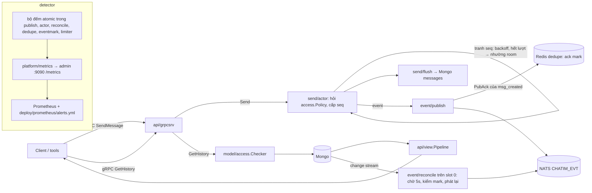
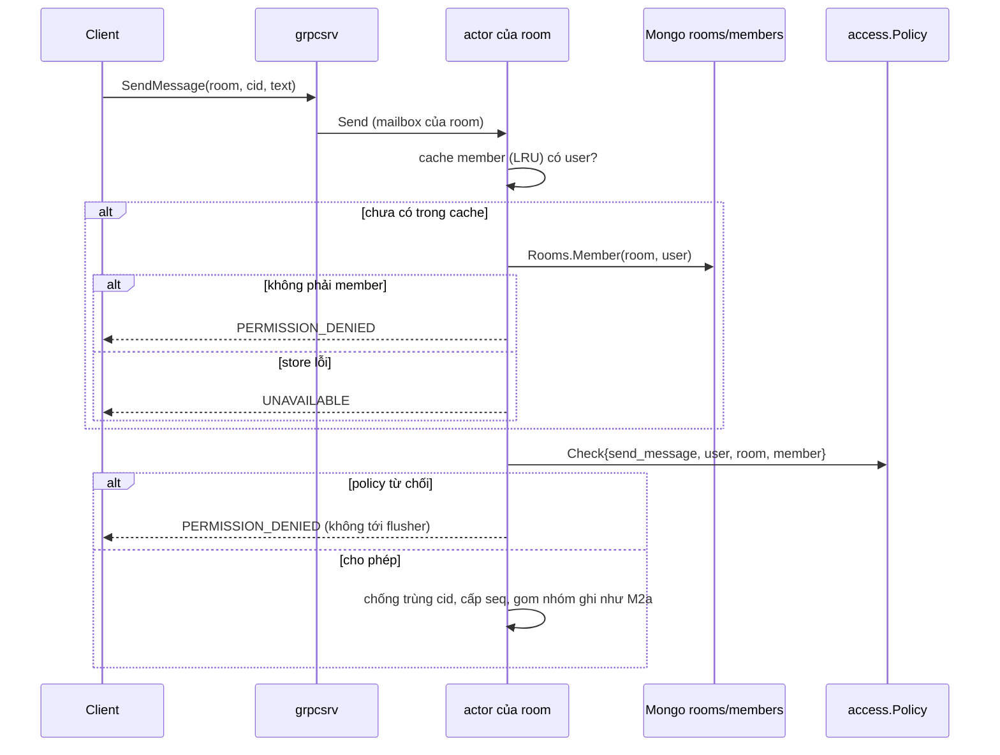
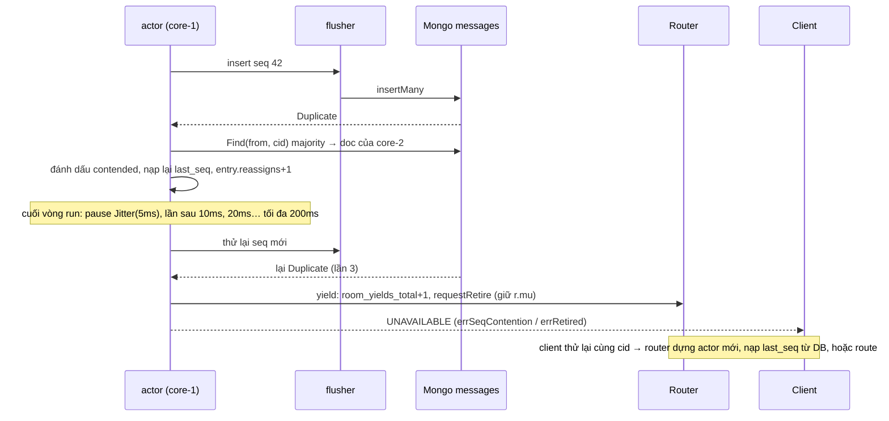
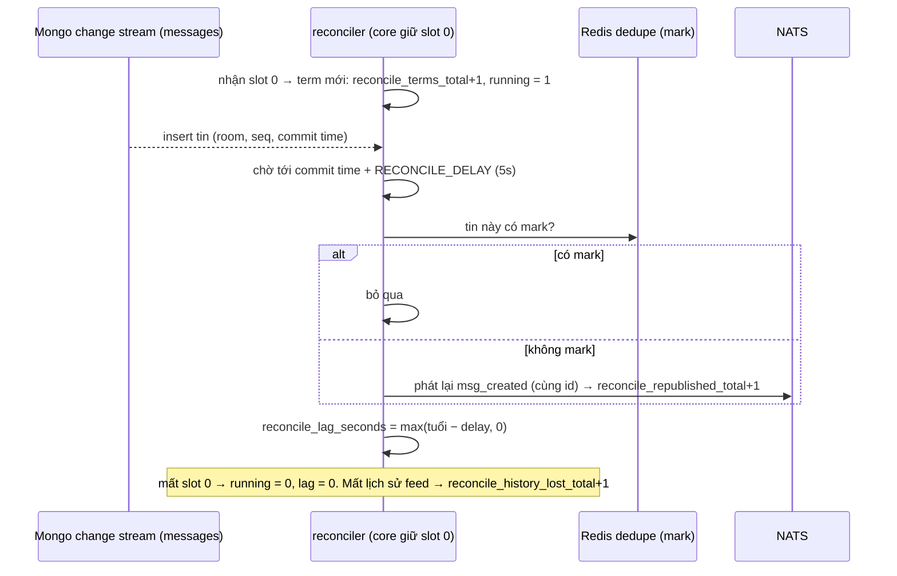
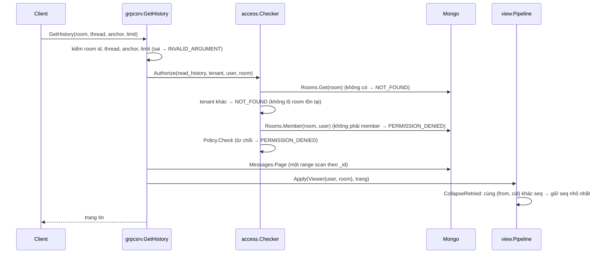

# M2b.0 — Nền cơ chế: tóm tắt kỹ thuật

> Trạng thái: **đã xây**, thực thi xong 2026-10-05 trên nhánh chung `feat/m2b`, `dev-done`; merge vào `main` cùng M2b.1–M2b.4 qua PR #12 ngày 2026-10-08. Plan execute gốc (cho AI) nằm ở `.claude/plans/2026-10-05-m2b0-mechanism-foundations.md` (local, không commit). Quyết định D65, D76, D77, D78 ở Decision Log của [thiết kế](../designs/261005-chatim-architecture.md) §17.2.
>
> Bản này mô tả cái đã duyệt và đã xây. Chỗ nào milestone sau đã đổi thì ghi "Sau M2bx: …". Đường dẫn package theo bố cục hiện tại `apps/core/internal/<nhóm>/<package>` (thiết kế §13); plan gốc dùng đường dẫn cũ `apps/core/internal/<package>`.

## 0. Thuật ngữ dùng trong bản này

| Từ | Nghĩa |
|---|---|
| fast path | Đường gửi event ngay sau khi lệnh ghi xong: actor → publisher → NATS. Nhanh nhưng có thể rớt event (best-effort, D47) |
| ack mark | Một bit trên Redis dedupe (`chatim:evtack:{room}:{thread}:{seq>>13}`) ghi "event `msg_created` của tin này đã được NATS nhận". Reconciler thấy bit thì không phát lại |
| reconciler | Phần chạy trên core giữ slot 0, đọc nhật ký thay đổi của Mongo và phát lại event bị rớt ở fast path (D52). Sau M2b.1 tách thành reader + worker |
| `RECONCILE_DELAY` | Thời gian chờ sau khi tin được commit rồi mới kiểm mark và phát lại; cho fast path đủ thời gian xong |
| seq contention (tranh seq) | Hai core cùng cấp một số seq cho một room (ví dụ lúc slot đổi chủ). Khoá `_id` của Mongo chỉ cho một doc thắng; core thua phải gán seq khác |
| actor nhường room (yield) | Actor của room tự dừng (retire) để lệnh sau dựng actor mới, nạp lại seq từ DB, hoặc đi về core chủ thật |
| backoff + jitter | Chờ tăng dần giữa các lần thử, mỗi lần chờ ngẫu nhiên trong nửa trên của mức (`backoff.Jitter(d)` ∈ [d/2, d]), để hai bên không đâm nhau đúng nhịp |
| permission hook | Một điểm duy nhất hỏi "người này có được làm việc này không" (`access.Policy`) |
| reader pipeline | Các bước chạy trên trang tin sau khi đọc từ store và trước khi trả client (`view.Pipeline`) |
| detector | Bộ đếm hoặc giá trị đo cho biết một guarantee đang vỡ; mỗi guarantee phải có detector + alert (D76) |
| guarantee RC1–RC5, CD1–CD3 | Các bảo đảm của thiết kế §12: RC = event cuối cùng tới stream (reconcile), CD = chống trùng cid |
| scrape | Prometheus gọi `GET /metrics` định kỳ để lấy số đo (kiểu pull) |
| CD2/CD3 | Hai ca một lần gửi bị lưu hai lần với hai seq khác nhau (Redis dedupe chết; core chết giữa insert và Commit) |

## 1. Bức tranh chung

M2b.0 không thêm collection, fact hay RPC mới. Nó dựng các **cơ chế dùng chung** mà mọi milestone M2b sau cần:

1. **Mark đúng loại event**: publisher chỉ ghi ack mark cho `msg_created`, để event thay đổi sau này (`msg_edited`…) không che mất một `msg_created` bị rớt (D65).
2. **`RECONCILE_DELAY` 30s → 5s**, có luật boot bảo đảm delay luôn dài hơn thời gian tối đa để một mark được ghi (D65).
3. **Actor nhường room khi tranh seq**: nghỉ có backoff giữa các vòng gán lại seq, hết lượt thì tự rút, để không thành bão retry giữa hai core (D77).
4. **Permission hook** `access` cho `SendMessage` (trong actor) và `GetHistory` (trong `grpcsrv`).
5. **Reader pipeline** `view` cho `GetHistory`, bước đầu che bản trùng CD2/CD3.
6. **Contract test**: mọi method của port store phải khai loại ghi (insert unique, CAS, upsert, bump version…).
7. **Detector + alert**: bộ đếm atomic trong component → `GET /metrics` trên cổng admin → 13 luật alert trong repo, kiểm bằng `promtool` (D76, D78).



- Mọi thay đổi nằm trên đường đã có (gửi tin, đọc lịch sử, publish, reconcile). Không đổi schema Mongo, không đổi proto, không thêm env mới.
- Sau M2b.1: reconciler thành **reader** (chỉ đẩy record vào work stream `CHATIM_WORK`) + **worker** ở mọi core (chờ `RECONCILE_DELAY`, kiểm mark, phát lại). Cơ chế mark và delay của M2b.0 giữ nguyên, chỉ chuyển chỗ chạy.

## 2. Config, metric, khoá và file mà M2b.0 thêm hoặc đổi

M2b.0 không thêm field DB và không thêm khoá Redis (ack mark `chatim:evtack:*` có từ M2a.3, D60).

### 2.1 Config

| Tên | Trước | Sau M2b.0 | Dùng để làm gì |
|---|---|---|---|
| `RECONCILE_DELAY` | 30s | **5s** (`DefaultDelay`) | Chờ sau commit rồi mới kiểm mark và phát lại `msg_created` |
| Luật boot mới | — | `RECONCILE_DELAY > PUB_ACK_TIMEOUT + 10ms + 1s` (`publish.MarkDeadline`) | Bảo đảm reconciler không kiểm mark trước khi publisher kịp ghi: 10ms là cửa sổ gom mark, 1s là timeout ghi mark. Với `PUB_ACK_TIMEOUT` mặc định 2s, ngưỡng là 3,01s; với delay 5s, `PUB_ACK_TIMEOUT` phải dưới khoảng 3,99s |
| Luật cũ giữ nguyên | | `RECONCILE_DELAY < EVT_STREAM_DUPLICATES` (5m) | Bản phát lại phải còn trong cửa sổ chống trùng của stream |

- Ở M2b.0 luật mới chỉ áp khi `RECONCILE_ENABLED=true`. **Sau M2b.1:** `RECONCILE_DELAY` là delay của effect trên worker (chạy ở mọi core), nên cả hai luật áp **luôn**, kể cả khi `RECONCILE_ENABLED=false`.

### 2.2 Metric trên `GET /metrics` (tiền tố `chatim_core_`)

| Metric | Loại, nhãn | Nguồn | Ví dụ | Guarantee |
|---|---|---|---|---|
| `publish_dropped_total` | counter, `reason` = `queue_full` / `malformed` / `refused` / `async_failed` | `publish.Counters` | `{reason="queue_full"} 0` | RC1, RC4 |
| `ack_marks_dropped_total` | counter, `reason` = `queue_full` / `marker_failed` | `publish.Counters` (hàng đợi mark, lỗi ghi mark) | `{reason="marker_failed"} 256` | RC4 (event sẽ bị phát lại, không mất) |
| `redis_degraded` | gauge, `client` = `cid_dedupe` / `ack_marks` | `redisguard.Guard.Degraded()` qua `dedupe.Store`, `eventmark.Store` | `{client="cid_dedupe"} 1` | CD1, CD2 |
| `cid_settle_dropped_total` | counter | `dedupe.Batcher.Dropped` (Commit/Abort bị bỏ khỏi hàng settle) | 0 | CD1 |
| `cid_pending_elsewhere_total` | counter | `actor.Router.Stats().CIDElsewhere` (lệnh gửi trả `ErrRetryLater` vì cid đang pending ở core khác) | 3 | CD3 |
| `room_yields_total` | counter | `actor.Router.Stats().Yields` | 1 | P1, D77 |
| `grpc_load_shed_total` | counter | `resilience.Limiter.Rejected` (lệnh bị bộ giới hạn in-flight từ chối) | 0 | quá tải |
| `mongo_oplog_window_seconds` | gauge, NaN khi không đọc được | `mongostore.OplogWindow` (ts mới nhất − ts cũ nhất của `local.oplog.rs`) | 259200 (3 ngày) | RC5 |
| `reconcile_running` | gauge | `reconcile.Stats().Running` | 1 trên đúng một core | RC1 |
| `reconcile_lag_seconds` | gauge | `max(tuổi thay đổi cũ nhất − RECONCILE_DELAY, 0)` | 0.4 | RC1 |
| `reconcile_terms_total` | counter | mỗi lần core nhận slot 0 và mở term | 2 | RC3 |
| `reconcile_republished_total` | counter | số event reconciler gửi lại | 17 | RC4 |
| `reconcile_dropped_total` | counter | thay đổi hỏng không thành event | 0 | RC1 |
| `reconcile_history_lost_total` | counter | vị trí feed rơi khỏi oplog | 0 | RC5 |

- Registry riêng (không dùng registry mặc định của Go), có thêm Go collector và process collector. Metric `reconcile_*` chỉ xuất trên core bật `RECONCILE_ENABLED`.
- **Sau M2b.1:** `reconcile_lag_seconds` và `reconcile_republished_total{effect}` chuyển sang worker (xuất ở mọi core, có nhãn `effect`); reader thêm `reconcile_forwarded_total`, worker thêm `work_processed_total`, `work_failures_total`, `effect_dropped_total{effect}`. M2b.3 thêm `counter_repaired_total{counter}`; M2b.4 thêm `member_cache_forgets_total`, `member_watch_malformed_total`.

### 2.3 Luật alert (`deploy/prometheus/alerts.yml`, nhóm `chatim-core-guarantees`)

| Luật | Điều kiện | `for` | Mức | Guarantee |
|---|---|---|---|---|
| `ChatimReconcilerAbsent` | tổng `reconcile_running` = 0 | 2m | critical | RC1 |
| `ChatimReconcilerLagging` | max `reconcile_lag_seconds` > 120 | 5m | warning | RC1 |
| `ChatimReconcilerDropping` | `reconcile_dropped_total` tăng trong 15m | — | warning | RC1 |
| `ChatimFeedHistoryLost` | `reconcile_history_lost_total` tăng trong 15m | — | critical | RC5 |
| `ChatimOplogWindowShort` | min cửa sổ oplog < 48h | 15m | warning | RC5 |
| `ChatimOplogWindowCritical` | min cửa sổ oplog < 24h | 15m | critical | RC5 |
| `ChatimOplogWindowUnknown` | có core báo cửa sổ oplog NaN (biểu thức `x != x`) | 10m | warning | RC5 |
| `ChatimRepublishSurge` | tốc độ phát lại > 100/s | 10m | warning | RC4 |
| `ChatimEventsDropped` | tốc độ `publish_dropped_total` > 0 | 10m | warning | RC1 |
| `ChatimRedisDegraded` | `redis_degraded` = 1 theo `client` | 1m | warning | CD2 |
| `ChatimCIDSettleDropped` | `cid_settle_dropped_total` tăng trong 5m | — | warning | CD1 |
| `ChatimCIDPendingElsewhere` | `cid_pending_elsewhere_total` tăng trong 5m | — | info | CD3 |
| `ChatimSeqContention` | `room_yields_total` tăng > 10 trong 5m | — | warning | P1 |

Sau M2b.1 thêm `ChatimWorkFailing`, `ChatimEffectDropping`; M2b.3 thêm `ChatimCounterRepairSurge` → hiện 16 luật.

### 2.4 Code, hằng số và file mới

| Thứ | Ở đâu | Giá trị / nghĩa |
|---|---|---|
| `markKey` | `event/publish/ack_mark_policy.go` | Trả khoá mark chỉ khi payload là `msg_created`; mọi loại khác không mark |
| `MarkDeadline(ackTimeout)` | cùng file | `ackTimeout + 10ms + 1s` |
| `contentionBackoff`, `maxContentionBackoff` | `send/actor/config.go` | 5ms, 200ms; `maxRequeues` = 3 (có từ M2a) |
| `actor.Option`, `WithPolicy`, `Router.Stats` | `send/actor/router_options.go`, `router_stats.go` | Cắm policy, đọc `Yields`, `CIDElsewhere` |
| `access.Policy`, `PolicyFunc`, `Checker`, `Request`, `ErrDenied` | `model/access` | Permission hook (mục 3.4) |
| `view.Pipeline`, `Step`, `Viewer`, `CollapseRetried`, `Default()` | `api/view` | Reader pipeline (mục 3.5) |
| `write_contract_test.go` | `store/` | Bảng phân loại mọi method của port |
| `Guard.Degraded()` | `platform/redisguard/guard_state.go` | true từ lần gọi lỗi tới lần probe thành công sau cooldown |
| `OplogWindow` | `store/mongostore/oplog_window.go` | Hai `findOne` trên `local.oplog.rs` (sort `$natural` 1 và −1, chỉ lấy `ts`) |
| `metrics.Source`, `metrics.Handler` | `platform/metrics/registry.go` | Đăng ký `CounterFunc`/`GaugeFunc` từ hàm đọc |
| `admin.Config.Metrics` | `pkg/admin` | Có handler thì mở `GET /metrics`, không có thì 404 |
| `metricSources`, `probes` | `app/metrics_wiring.go` (trước là `apps/core/metrics_wiring.go`) | Danh sách nguồn; `probes` chỉ giữ hàm đọc, không giữ component, nên test không cần hạ tầng |
| `PROM_IMAGE`, `make alerts-check` | `Makefile` | `prom/prometheus:v3.5.0`, chạy `promtool check rules` trong Docker |
| `github.com/prometheus/client_golang` | `go.mod` | v1.24.1 (dependency mới) |

## 3. Luồng xử lý

### 3.1 Gửi tin: hỏi policy trong actor



- Cache member của actor đổi từ "có/không" sang lưu cả `domain.Member` (có role), để policy theo role ở Phase 2 không cần đọc thêm DB.
- Policy mặc định của actor ở M2b.0 là `access.AllowMembers` (member nào cũng gửi được). **Sau M2b.2:** `access.DefaultPolicy` (D86). **Sau M2b.4:** cache member có generation + TTL 10s, được quên ngay sau thay đổi member trên cùng core và qua `memberwatch` ở core khác (D106, D110); `Rooms.Member` coi doc `state ≠ 1` là không phải member.

### 3.2 Tranh seq: backoff rồi nhường room (D77)

Trước M2b.0: gặp doc của core khác ở đúng seq thì gán lại ngay, không nghỉ, tối đa 3 lần rồi trả lỗi; actor ở lại và lệnh kế tiếp lại tranh tiếp.



- Pause chỉ chạy khi vòng vừa rồi có tranh **và** còn entry chờ thử lại, và actor chưa bị yêu cầu retire. Vòng không tranh thì đưa mức chờ về 0.
- Pause dùng `ctx` của vòng `run`, nên dừng core không bị pause chặn.
- Nhường room dùng **đúng đường retire của slot hook** (`a.retire`). Mọi lần đóng `a.retire` đều qua `requestRetire` khi giữ `r.mu`, nên không bao giờ đóng hai lần.
- Lệnh `PendingElsewhere` (cid đang pending ở core khác) được đếm vào `cid_pending_elsewhere_total` trước khi trả `UNAVAILABLE`.
- Không có fencing token: đúng đắn vẫn từ khoá `_id` unique (P1). Cơ chế này chỉ chặn bão retry tự khuếch đại.

### 3.3 Fast path publish và ack mark (D65)

```mermaid
sequenceDiagram
  participant A as actor
  participant P as publisher (shard theo slot)
  participant N as NATS CHATIM_EVT
  participant AM as ackMarks (hàng đợi 4096)
  participant R as Redis dedupe
  A->>P: Enqueue(events) (không chặn; hàng đầy → publish_dropped_total{queue_full})
  P->>N: PublishMsgAsync (Nats-Msg-Id = id tự nhiên)
  alt bị từ chối ngay
    P->>P: publish_dropped_total{refused}
  else lỗi bất đồng bộ (nack, timeout)
    N-->>P: handler lỗi → publish_dropped_total{async_failed}
  else PubAck
    P->>P: markKey(event): chỉ msg_created có khoá
    P->>AM: track(room, thread, seq) (hàng đầy → ack_marks_dropped_total{queue_full})
    AM->>R: gom 10ms / 256 khoá, SETBIT, timeout 1s (lỗi → ack_marks_dropped_total{marker_failed} += cả lô)
  end
```

- Lỗi cần sửa: trước đây publisher mark **mọi** event theo (room, thread, seq). Khi có `msg_edited` (M2b.2), PubAck của nó sẽ bật bit của tin, và reconciler bỏ qua `msg_created` bị rớt của cùng tin.
- Đã xây: khoá mark vẫn là (room, thread, seq) trong bitmap, nhưng chỉ event có payload `msg_created` được mark. Thiết kế gọi đây là "mark theo event id + loại": với một loại duy nhất có mark, khoá theo tin là đủ.
- Mất mark không mất event: reconciler (sau M2b.1: worker) chỉ phát lại thừa, stream bỏ trùng theo `Nats-Msg-Id`.

### 3.4 Reconcile với delay 5s (dạng M2b.0)



- Luật boot (mục 2.1) bảo đảm khi reconciler kiểm, mọi mark của PubAck tới đúng hạn đã kịp ghi.
- **Sau M2b.1:** reader trên slot 0 không chờ, không kiểm mark; nó chép thay đổi thành record vào `CHATIM_WORK`. Effect `msg_created` trên worker (mọi core, partition theo slot) chờ `RECONCILE_DELAY`, kiểm mark, `Find` tin chưa mark, phát lại và chờ PubAck (D66, D79–D81).

### 3.5 Đọc lịch sử: permission hook + reader pipeline



- `Checker` **luôn** kiểm tenant và membership trước policy; policy không bao giờ được hỏi khi hai bước đó trượt. `NewChecker` không nhận store rỗng (`INVALID_ARGUMENT` lúc dựng); policy rỗng → mặc định.
- `CollapseRetried` không sửa trang đầu vào; tin không có cid giữ nguyên. Lỗ seq của bản bị che là chấp nhận được (D71).
- **Sau M2b.2:** `Checker` tách `Admit` (room → tenant → membership) và `Allow` (policy), `Request` thêm `Author`, `Kind`; `view.Default()` = `CollapseRetried → MaskDeleted → HideForViewer`; `GetEditHistory` và các lệnh đổi cũng qua `access`. **Sau M2b.4:** `HideForViewer` dùng `Viewer.ClearedAt` (thời gian), `Request` thêm `Target`, `Role`.

### 3.6 Scrape metric và alert

```mermaid
sequenceDiagram
  participant PR as Prometheus
  participant AD as admin :9090
  participant H as metrics.Handler
  participant C as component (atomic)
  participant O as Mongo local.oplog.rs
  PR->>AD: GET /metrics
  AD->>H: ServeHTTP
  H->>C: gọi từng hàm đọc (Load atomic, không khoá đường nóng)
  H->>O: 2 findOne (timeout 2s) cho cửa sổ oplog; lỗi → NaN
  H-->>PR: text exposition
  PR->>PR: đánh giá alerts.yml
```

- Cổng admin không bao giờ publish ra ngoài compose (giữ như cũ). Không có handler thì `/metrics` trả 404.
- Đường nóng chỉ thêm `atomic.Add`; mọi việc còn lại xảy ra lúc scrape.

### 3.7 Boot

`config.Validate` chạy các luật chéo field (mục 2.1); sai thì core không khởi động. Wiring dựng `publish.New(... WithAckMarks, WithCounters)`, giữ reconciler ở phạm vi hàm để lấy `Stats`, tách limiter ra biến để đọc `Rejected`, dựng `metrics.Handler` rồi admin; lỗi đăng ký metric (trùng tên + nhãn) là lỗi boot.

## 4. Đúng đắn và các ca chạy đua

- **Mark của event khác loại.** Chỉ `msg_created` có mark, nên mọi event thay đổi về sau không thể che `msg_created` bị rớt. Test `TestOnlyMessageCreatedEventsGetAnAckMark`.
- **Reconciler kiểm trước khi mark kịp ghi.** PubAck tới muộn nhất `PUB_ACK_TIMEOUT`, mark gom thêm tối đa 10ms, ghi mark timeout 1s. Delay phải lớn hơn tổng này (luật boot), nên ca xấu nhất chỉ là phát lại thừa, không bỏ sót.
- **Hai core cùng giữ một room** (slot đổi chủ, lệch lease ~1 tick). Khoá `_id` unique vẫn là CAS: không mất, không trùng tin (P1). M2b.0 chỉ đổi nhịp thử lại: pause tăng dần có jitter giữa các vòng, hết 3 lượt thì nhường room. Không còn hai actor đâm nhau liên tục.
- **Nhường room và retire của slot hook chạy cùng lúc.** Cả hai đóng `a.retire` qua `requestRetire` khi giữ `r.mu`, có kiểm "đã đóng chưa", nên không panic đóng hai lần.
- **Lệnh tới actor đang nghỉ** nhận `errRetired` (`UNAVAILABLE`); client thử lại cùng cid nên chống trùng cid vẫn giữ một bản.
- **Dừng core giữa pause**: pause lắng nghe `ctx` của vòng `run`, thoát ngay.
- **Đọc lịch sử của room tenant khác** trả `NOT_FOUND` giống room không tồn tại, không lộ id.
- **Bản trùng CD2/CD3 trong cùng trang** được che ở phía đọc; nằm ở hai trang khác nhau thì vẫn thấy cả hai (pipeline chạy theo trang).
- **Metric đọc lúc scrape** không khoá: mỗi số là một `Load` atomic; metric reconcile lấy một snapshot `Stats` riêng cho mỗi metric (có thể lệch nhau rất ít giữa các dòng của cùng một lần scrape).

**Chỗ phải xếp hàng** (không đổi so với M2a, M2b.0 chỉ thêm nhịp nghỉ):
- **Seq đánh số liên tục theo timeline**: mỗi room một actor, mỗi actor một nhóm ghi đang bay (D29). Mọi tin của một room xếp hàng qua actor đó. Tranh seq chỉ xảy ra khi hai core cùng tưởng giữ room.
- **Khoá `r.mu` của Router**: giữ khi nhường room, khi slot hook retire actor, khi dựng actor mới.
- **Hàng đợi publisher theo shard** giữ thứ tự event của một room; **một hàng đợi mark** 4096 phần tử, gom lô.
- **Reconciler chỉ chạy trên một core** (chủ slot 0): một luồng đọc feed duy nhất cho cả cụm (sau M2b.1 vẫn là một reader, worker thì chia 32 partition).

## 5. Event và subject

M2b.0 **không thêm hay đổi event nào**. Thứ duy nhất đổi là event nào được ack mark: chỉ `msg_created`. Subject lúc đó là `evt.{t}.room.{rid}.msg_created`. **Sau M2b.4 (D108):** subject theo loại dữ liệu, tin nhắn đi `evt.{t}.message.{rid}.{kind}`, RePublish `evt.*.*.*.*` → `live.{t}.{loại}.{rid}.evt.{kind}`.

## 6. Thư viện và hạ tầng

- **`github.com/prometheus/client_golang` v1.24.1** (mới): registry riêng, `CounterFunc`/`GaugeFunc` (pull, đọc hàm lúc scrape), `promhttp.HandlerFor`, Go + process collector.
- **`prom/prometheus:v3.5.0`** chỉ dùng `promtool check rules` qua `make alerts-check` (Docker, không cài trên host).
- **MongoDB** (mongo-driver v2): đọc `local.oplog.rs` cho cửa sổ oplog. User compose là root nên đọc được; prod cần quyền đọc `local`.
- **NATS JetStream** (nats.go v1.54): `WithPublishAsyncErrHandler` nay đếm lỗi bất đồng bộ.
- **Redis dedupe**: không đổi khoá; `redisguard` xuất trạng thái suy giảm.
- **Go**: `testing/synctest` cho actor, reconcile; `pkg/backoff` (`Jitter`, `Pause`) có sẵn.
- `make vuln`: 0 lỗ hổng bị gọi tới; một cảnh báo cấp module GO-2026-5932 (`golang.org/x/crypto/openpgp`) có từ trước, code không gọi tới.

## 7. Quyết định kỹ thuật và phương án đã loại

| # | Quyết định | Phương án bị loại | Lý do |
|---|---|---|---|
| D65 | Chính sách theo effect (delay, ack mark…); chỉ `msg_created` có ack mark; delay mặc định 5s với luật boot theo deadline của mark; contract test cho write method | Một delay 30s chung; ack mark cho mọi effect; mark theo seq cho mọi event | Delay chỉ có lý do riêng theo effect; mark theo seq cho mọi event che mất `msg_created` khi có event thay đổi |
| D76 | Mỗi guarantee có detector + alert ngay khi định nghĩa | Để alert tới M5 | Guarantee không có detector thì không biết đã vỡ |
| D77 | Không fencing; actor tự rút khi va doc core khác, retry có backoff + jitter | Fencing epoch theo slot | P1 đã giữ đúng đắn qua khoá `_id`; rủi ro thật là bão retry tự khuếch đại, không phải mất dữ liệu |
| D78 | Bộ đếm atomic + accessor trong component; package `metrics` đăng ký kiểu pull vào registry riêng; `GET /metrics` trên cổng admin; luật alert trong repo, kiểm bằng `promtool` | Chỉ log; expvar; OTel metrics ngay | Owner chọn 2026-10-05; Prometheus đã có trong kế hoạch M5; pull không đổi đường nóng |
| — | Permission hook là **một** interface một hàm `Check`, `Checker` giữ bất biến tenant + membership trước policy | Mỗi handler tự kiểm (`authorizeRead` cũ trong `grpcsrv`) | Một chỗ cắm cho module policy Phase 2; bất biến không thể bị policy bỏ qua |
| — | Reader pipeline là danh sách bước thuần trên trang | Lọc ngay trong truy vấn Mongo | Bước theo người đọc (ẩn, mặt nạ xoá, M2b.2) không biểu diễn được trong range scan theo `_id`; phân trang theo seq giữ đúng |
| — | Contract test bằng reflection: mọi method của port phải có trong bảng phân loại | Chỉ dựa vào review | Thêm method ghi mà quên chọn loại sẽ fail ngay khi biên dịch test |
| — | `probes` chỉ giữ hàm đọc | Truyền component vào `metricSources` | Test danh sách metric không cần dựng Mongo/NATS/Redis |

## 8. Chi phí và tải

| Việc | Chi phí thêm |
|---|---|
| Mark theo loại | 0 (một type switch mỗi event) |
| Delay 5s thay 30s | Khoảng chờ ngắn hơn 6 lần: event bù tới sớm hơn khi fast path rớt, reconciler giữ ít thay đổi đang chờ hơn |
| Hỏi policy khi gửi | 0 lần đọc DB thêm (member nằm trong cache actor); policy thuần |
| Tranh seq | Mỗi vòng có tranh: tối đa một pause 5ms→200ms; hết lượt: một lần dựng lại actor (nạp `last_seq` + 100 tin cho LRU cid). Chỉ xảy ra khi hai core cùng giữ room |
| `GetHistory` | Như trước (đọc room + member + trang); thêm một map O(trang) trong RAM cho `CollapseRetried` |
| Bộ đếm | Một `atomic.Add` trên đường lỗi/hiếm; không thêm khoá |
| Mỗi scrape | 2 `findOne` trên primary (`local.oplog.rs`, timeout 2s), không cache; còn lại đọc atomic |

Ở group 5K và channel 200K: không có khuếch đại theo số member (M2b.0 không thêm event hay fan-out).

## 9. Rủi ro và giới hạn còn lại

- **D65 với delay 5s:** `PUB_ACK_TIMEOUT` phải dưới khoảng 3,99s; muốn ack timeout dài hơn thì phải nâng `RECONCILE_DELAY` (và giữ dưới `EVT_STREAM_DUPLICATES`).
- **Cửa sổ oplog cần quyền đọc `local`** trên prod; thiếu quyền thì metric là NaN và `ChatimOplogWindowUnknown` kêu.
- **Che trùng CD2/CD3 chỉ trong một trang.**
- **Không fencing:** hai core có thể cùng ghi một room tới ~1 tick; chấp nhận theo P1/D77.
- Known issue từ kết quả thực thi (Minor, không sửa, đã chuyển thành mục M5 trong [roadmap](../roadmap.md#mục-mang-sang-m5-hardening)):
  1. `room_yields_total` có thể đếm thừa khi hai entry cùng hết lượt trong một group, hoặc slot đã yêu cầu retire.
  2. Pause tranh seq không thức dậy khi actor bị retire; mỗi actor bị tranh có thể dùng tới 200ms của `HookTimeout` của slot.
  3. `contentionWait` không reset sau một vòng có tranh mà không còn gì để thử lại.
  4. Event còn trong hàng đợi khi publisher bị abort cưỡng bức không được đếm.
  5. `reconcile_republished_total` đếm số lần gửi, nên thay đổi phát lại sau khi term restart bị đếm lại. Sau M2b.1 số này do worker đếm theo `effect`; `msg_created` vẫn đếm mọi PubAck kể cả bản stream báo trùng (các effect sau chỉ đếm PubAck không trùng).
  6. `ack_marks_dropped_total{reason="marker_failed"}` là cận trên (cộng cả lô khi ghi lỗi).
  7. Chưa có test trực tiếp cho bộ đếm `MarkQueueFull` và `Malformed`.
  8. Probe oplog đọc primary hai lần mỗi lần scrape, không cache.
  9. Metric reconcile lấy một snapshot `Stats` cho mỗi metric.

## 10. Điểm đội tự chọn

| Điểm | Giá trị | Lý do |
|---|---|---|
| `RECONCILE_DELAY` mặc định | 5s | Đủ trên deadline mark 3,01s (ack timeout 2s), ngắn để event bù tới sớm |
| Backoff tranh seq | `Jitter(5ms → 10ms → 20ms …, tối đa 200ms)`, 3 lượt gán lại rồi nhường | Tách nhịp hai core đang đâm nhau; nhường room sau 3 lượt để lệnh sau đi về chủ thật (D77). Giá trị chưa đo |
| Policy mặc định | `AllowMembers` (member nào cũng gửi/đọc) | Giữ hành vi M2a; sau M2b.2 thay bằng `DefaultPolicy` |
| `CollapseRetried` | Giữ seq nhỏ nhất của mỗi `(from, cid)` | Một quy tắc xác định, mọi lần đọc cùng trang cho cùng kết quả; lỗ seq của bản bị che chấp nhận được (D71) |
| Ngưỡng alert | Lag > 120s trong 5m; oplog < 48h warning, < 24h critical; phát lại > 100/s trong 10m; yields > 10 trong 5m; CD3 mức `info` | Chọn lúc viết plan, chưa đo trên prod-like; chỉnh khi có số thật (thiết kế §2.3) |
| Timeout probe oplog | 2s | Không để scrape treo khi Mongo chậm |
| Metric reconcile | Chỉ xuất trên core bật reconcile | Tổng `reconcile_running` = 0 có nghĩa thật (không core nào chạy) |
| Image promtool | `prom/prometheus:v3.5.0` | Bản v3 cố định tag; plan yêu cầu dừng nếu tag không tồn tại |

## 11. Kiểm thử, mỗi mục chứng minh gì

- **Unit:**
  - `TestOnlyMessageCreatedEventsGetAnAckMark`: chỉ `msg_created` có khoá mark; event khác (`…-v2`) không.
  - `TestMarkDeadlineCoversAckTimeoutMarkWindowAndMarkTimeout`: `MarkDeadline(2s)` = 3,01s.
  - Bảng `validate_test`: delay 3s bị từ chối, 3011ms qua; default delay 5s.
  - `TestSeqContentionBacksOffBetweenReassignCycles`: ba vòng gán lại tốn ít nhất 17,5ms (nửa dưới của 5 + 10 + 20ms) rồi trả `ErrRetryLater`.
  - `TestExhaustedContentionYieldsTheRoom`: hết lượt thì không còn actor nào, `Yields` = 1.
  - `TestCIDPendingOnAnotherCoreIsCounted`: `CIDElsewhere` = 1.
  - `TestReassignLimitFailsWithRetryLater` (sửa): lệnh sau tới actor mới, nạp lại `last_seq`, vẫn ack đúng seq.
  - `TestCheckerEnforcesTenantAndMembershipBeforeThePolicy`: room lạ, tenant khác → `NOT_FOUND`; không phải member → `PERMISSION_DENIED`; policy không bị hỏi lần nào.
  - `TestCheckerPassesTheFullRequestToThePolicy`, `TestNilPolicyAllowsMembers`: policy nhận đủ action, user, room, member; policy rỗng → cho member; store rỗng → `INVALID_ARGUMENT`. Sau M2b.2 test thứ hai đổi thành `TestNilPolicyUsesTheDefaultPolicy`.
  - `TestSendAsksThePolicyBeforeWriting`: bị từ chối thì không tới flusher, policy thấy đúng một `send_message`; `TestDefaultPolicyAllowsMembers`.
  - `TestCollapseRetriedKeepsTheLowestSeqOfEachSend` (không sửa trang đầu vào), `TestPipelineRunsStepsInOrder`.
  - `TestHistoryHidesASendStoredTwice`, `TestHistoryAsksThePolicy`; `TestHistoryHidesRoomsOfOtherTenants`, `TestHistoryRequiresMembership` vẫn qua.
  - `TestEveryPortMethodHasAWriteContract`: method chưa phân loại hoặc loại không hợp lệ → fail (đã kiểm bằng cách tạm xoá `Cursor.Close`).
  - Bộ đếm publish: hàng đầy, bị từ chối, lỗi bất đồng bộ, ghi mark lỗi đều được đếm đúng số.
  - `TestStatsTrackTermsRepublishesAndLag`, `TestStatsCountLostHistory`: term, phát lại, lag, mất lịch sử. Sau M2b.1 test đầu đổi thành `TestStatsTrackTermsAndForwards` (reader chỉ chuyển tiếp).
  - `TestDegradedFollowsFailuresAndRecovery`: suy giảm sau lỗi, hết sau probe thành công khi qua cooldown.
  - `TestHandlerExposesCountersAndGaugesFromSources`, `TestHandlerRejectsConflictingSources`, `TestMetricsRouteServesOnlyAConfiguredHandler` (có handler 200, không có 404).
  - `TestCoreMetricSourcesCoverEveryGuarantee`: đủ 14 tên metric, đăng ký không trùng; reconcile tắt thì không có metric `reconcile_*`.
- **Contract:** bảng phân loại ở M2b.0 gồm `insert-unique`, `cas`, `monotonic-cas`, `upsert`, `version-bump`, cộng `read`, `lifecycle`, `reset` (`ChangeFeed.Forget`). Sau M2b.2–M2b.4 thêm `monotonic-max`, `purge`, `transaction` và các port mới.
- **Itest (hạ tầng thật):** `TestOplogWindowReadsTheReplicaSetLog` (cửa sổ ≥ 0 trên replica set); `TestRealInfraReconcilerPublishesWritesThatSkippedTheCore` chạy với `RECONCILE_DELAY` 2s, `PUB_ACK_TIMEOUT` 500ms (500ms + 10ms + 1s < 2s). Sau M2b.1 đổi thành `TestRealInfraWorkersPublishWritesThatSkippedTheCore`, nay ở `apps/core/itest`.
- **Compose:** `/metrics` trên cả hai core: có `publish_dropped_total{reason="queue_full"} 0`, cửa sổ oplog dương, đúng một core có `reconcile_running 1`, có `room_yields_total` và `cid_pending_elsewhere_total`.
- **E2e:** `make e2e` qua (kill core-1, không mất, không trùng).
- **Alert:** `make alerts-check` → `SUCCESS: 13 rules found`.
- Không chạy corebench: M2b.0 không phải milestone perf. Task 3 không chạm `platform/slot` nên không cần R5.

## 12. Kết quả thực thi (2026-10-05)

Mức sẵn sàng `dev-done`. 13 luật alert, `client_golang` v1.24.1, `make vuln` 0 lỗ hổng bị gọi tới. Không có số đo hiệu năng (không phải milestone perf).

**Lệch so với plan:**
- Task 2: tách case "ack timeout ngay dưới thời gian drain của publisher" ra riêng, với `RECONCILE_DELAY=7s`.
- Task 5: `NewRouter` chuyển sang `send/actor/router_new.go` (giới hạn 200 dòng của `router.go`); `actor` xuất `Option`, `WithPolicy`, `Stats`.
- Task 7, Task 8: đổi tên biến cục bộ (`grant`) và dùng iterator `Methods()` để qua lint.
- Task 9: fix thêm `f071dfb`: `reconcile_lag_seconds` = thời gian chạy trễ so với `RECONCILE_DELAY` (`max(tuổi − delay, 0)`), không phải tuổi thô; nếu không, lag luôn ≥ 5s ngay cả khi khoẻ.
- Task 11: kỳ vọng `make vuln` đổi vì cảnh báo cấp module GO-2026-5932 có sẵn.
- Task 13: fix thêm `2965edb`: luật thứ 13 `ChatimOplogWindowUnknown`, vì probe trả NaN khi lỗi và NaN không làm hai luật cửa sổ oplog kêu.
- Ràng buộc rút ra: với delay 5s, `PUB_ACK_TIMEOUT` phải dưới khoảng 3,99s.

**Minor giữ làm known issue:** 9 mục ở mục 9, đã ghi vào roadmap như mục mang sang M5.
