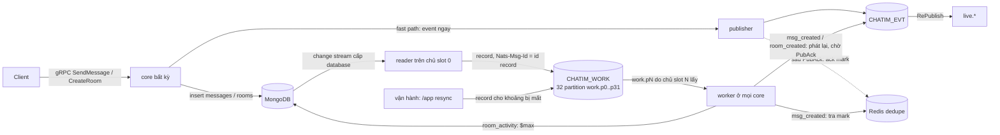
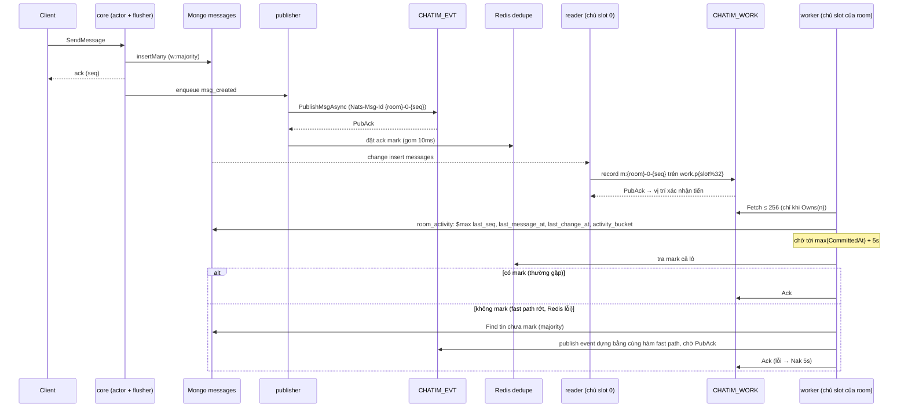
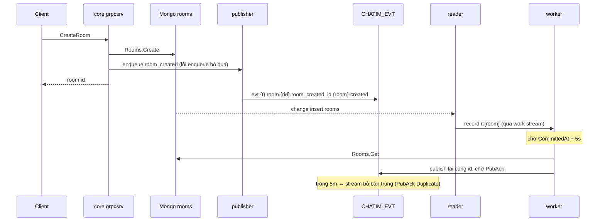
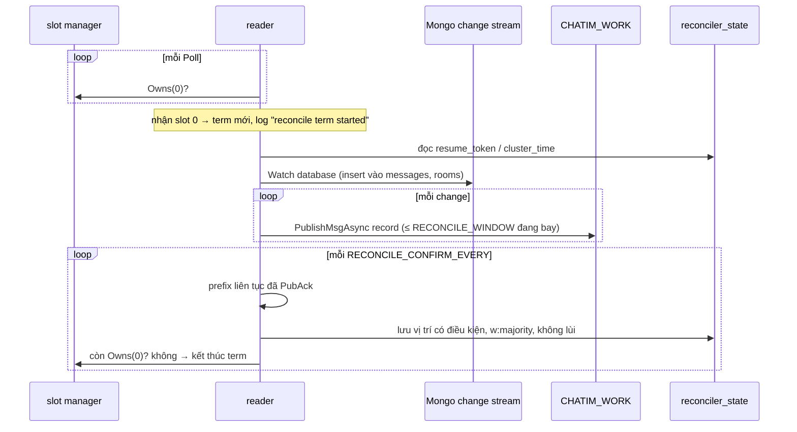
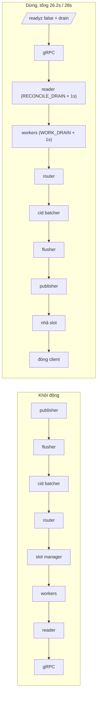

# M2b.1 — Effect engine: tóm tắt kỹ thuật

> Trạng thái: **đã xây** (thực thi xong 2026-10-05, `dev-done` trên `feat/m2b`), merge `main` trong PR #12 ngày 2026-10-08. Plan execute gốc (cho AI, có code mẫu, đường dẫn package cũ `apps/core/internal/<package>`) nằm ở `.claude/plans/2026-10-05-m2b1-effect-engine.md` (local). Quyết định D79–D81 trong Decision Log của [thiết kế](../designs/261005-chatim-architecture.md) §17.2.
>
> Bản này viết **sau khi thực thi**, làm tài liệu lưu trữ: mô tả cái đã duyệt và đã xây ở M2b.1. Chỗ milestone sau đã đổi được ghi "Sau M2b.x: …". Đường dẫn theo bố cục package hiện tại (thiết kế §13).

## 1. Thuật ngữ

| Từ | Nghĩa |
|---|---|
| fact | Một lần ghi gốc không bao giờ sửa: insert một tin vào `messages`, insert một room vào `rooms` |
| fast path | Đường của lệnh: core ghi xong thì tự phát event ngay (best-effort, có thể rớt) |
| nhật ký thay đổi (change stream / oplog) | Mongo tự ghi mọi thay đổi vào oplog; change stream cho đọc lại theo thứ tự commit. Core chết cũng không mất |
| reader | Package `reconcile` sau M2b.1: chạy trên core giữ slot 0, đọc nhật ký và chép mỗi thay đổi thành một record |
| term | Một lần một core làm reader (từ lúc nhận slot 0 tới lúc mất), log `reconcile term started` |
| record (phiếu việc) | Bản ghi nhỏ chỉ chứa khoá của thay đổi + thời điểm commit (`work.Record`, 33 byte ở M2b.1) |
| work stream | Stream JetStream `CHATIM_WORK` chứa record, kiểu WorkQueue: record bị xoá khi đã ack |
| partition | Một ngăn của work stream, subject `work.p{n}`, n = `slot % 32`; mọi record của một room luôn vào cùng ngăn |
| worker | `effects.Workers`, chạy ở **mọi** core: ngăn n do core giữ slot n lấy ra làm |
| effect | Một việc chạy nền cho một loại thay đổi (`msg_created`, `room_created`, `room_activity`), có chính sách riêng |
| registry | Bảng "loại thay đổi → danh sách effect theo thứ tự" (D65) |
| delay | Effect chờ tới `CommittedAt + delay` mới chạy, để fast path có thời gian phát trước |
| ack mark | Bit trên Redis dedupe nói "event này đã được stream nhận"; worker thấy bit thì bỏ qua tin (D52, D60, D65) |
| PubAck | Xác nhận của JetStream là đã lưu message; có cờ `Duplicate` khi message trùng id trong cửa sổ chống trùng |
| Ack / Nak / Term | Worker báo record xong (xoá) / trả lại để làm sau / bỏ hẳn không giao lại |
| `Nats-Msg-Id` | Header id; stream bỏ message trùng id trong cửa sổ chống trùng |
| vị trí xác nhận | Điểm trong nhật ký mà mọi thay đổi trước nó đã nằm an toàn trong work stream; reader chết thì đọc lại từ đây |
| room activity | Các field "room hoạt động lần cuối khi nào" trên `rooms` (D69), chỉ đi lên |
| resync | Công cụ tay `/app resync` đẩy lại record cho một khoảng thời gian mà nhật ký đã mất |

## 2. Bức tranh chung

**Trước M2b.1 (M2a.2–M2b.0):** một reconciler duy nhất trên core giữ slot 0 làm hết: đọc change stream của collection `messages`, chờ delay, tra ack mark, dựng event và phát lại. Mọi việc bù của cả cụm dồn vào một core, và mỗi loại thay đổi mới sẽ phải chen vào cùng vòng lặp đó.

**Sau M2b.1 (topo (a), D66):** tách làm ba phần.



- **Reader** chỉ đọc và chép: mỗi thay đổi thành một record nhỏ, bỏ vào work stream. Không chờ, không tra mark, không dựng event. Vị trí xác nhận chỉ tiến khi work stream đã ack record.
- **Worker** chạy ở mọi core, chia việc theo slot: ngăn n do core giữ slot n làm, nên phần lớn việc của một room chạy trên chính core đang giữ room đó.
- **Effect** là đơn vị việc, khai báo trong registry. M2b.1 có ba effect:

| Thay đổi | Effect (theo thứ tự) | Delay | Ack mark | Làm gì |
|---|---|---|---|---|
| `MessageInserted` | `room_activity` | 0 | — | Gom theo lô, mỗi room một lần ghi `$max` lên `rooms` |
| `MessageInserted` | `msg_created` | `RECONCILE_DELAY` (5s) | có | Tra mark theo lô; chỉ `Find` tin chưa mark; dựng event như fast path, publish, chờ PubAck |
| `RoomInserted` | `room_created` | `RECONCILE_DELAY` | không | Đọc room, dựng event như fast path, publish, chờ PubAck; stream bỏ bản trùng |

- `room_created` là **event mới đầu tiên không phải tin nhắn**: `CreateRoom` phát nó ngay (fast path), worker phát lại sau 5s làm lưới an toàn.
- `/app resync` là cửa phục hồi khi nhật ký đã mất (RC5): quét room theo room activity, đẩy record vào cùng work stream, worker xử lý như bình thường.

Sau M2b.2–M2b.4: engine này được dùng lại nguyên vẹn; registry thêm kind 3–10 và 12 effect (bảng đầy đủ ở thiết kế §8.3). Không milestone nào phải đổi topo.

## 3. Dữ liệu, record, config và metric

### 3.1 Field mới trên `rooms`

Tên lúc xây là tên ngắn; **sau M2b.4 (D96)** đổi sang tên đầy đủ (cột 2).

| Tên M2b.1 | Tên hiện tại | Nghĩa | Ví dụ | Dùng để |
|---|---|---|---|---|
| `ls` | `last_seq` | Seq lớn nhất của timeline chính đã thấy | 520 | Room list (M3), kiểm nhanh room có tin mới |
| `lm` | `last_message_at` | Thời điểm commit của tin đó | 2026-10-05 09:42:10 | Sắp xếp room list |
| `lc` | `last_change_at` | Lần thay đổi cuối vì bất kỳ fact nào | 2026-10-05 09:42:10 | Sắp xếp; nguồn của `ab` |
| `ab` | `activity_bucket` | Giờ của `lc`, `floor(unix/3600)` | tin 09:42 → giờ 09:00; tin 09:58 không đổi; tin 10:03 → giờ 10:00 | Chỉ mục cho `/app resync`; đổi tối đa 1 lần/giờ/room nên index không churn |

- Chỉ ghi bằng `$max`: không bao giờ lùi, ghi lại hay ghi lệch thứ tự vẫn hội tụ. Room không tồn tại thì bỏ qua, không lỗi.
- Chỉ effect `room_activity` ghi (owner chốt 2026-10-05: actor không ghi). `room_created` không chạm activity (room mới được resync tìm qua `created_at`).
- Domain: `domain.Room` thêm `LastSeq`, `LastMsgAt`, `LastChangeAt` (zero khi chưa có tin).
- Index mới trên `rooms`: `{ab: 1}` và `{ca: 1}` (sau M2b.4: `{activity_bucket: 1}`, `{created_at: 1}`). Index `created_at` thêm khi thực thi: truy vấn resync là `$or` hai nhánh, thiếu index một nhánh thì Mongo quét cả collection; `created_at` không đổi nên không churn.
- Sau M2b.2–M2b.4: mọi kind khác `MessageInserted` cũng chạy `room_activity` với `Seq = 0`, chỉ nâng `last_change_at`/`activity_bucket` (D83, D91).

### 3.2 Vị trí đọc nhật ký: `reconciler_state`

| `_id` | Field (M2b.1 → hiện tại) | Nghĩa |
|---|---|---|
| `"changes"` | `token` → `resume_token` | Resume token của change stream cấp database, lưu khi xác nhận |
| | `at` → `cluster_time` | Mốc bắt đầu khi chưa có token (`StartAtOperationTime`) |

- Bootstrap đặt `cluster_time = $$CLUSTER_TIME` chỉ khi chưa có, nên DB mới cũng chuyển cả những ghi trước term đầu tiên; chạy lại không bao giờ dời mốc hay token.
- Lưu vị trí là ghi có điều kiện, `w:majority`, không bao giờ lùi.
- M2b.1 có đường chuyển từ doc cũ `_id: "messages"` (vị trí của reconciler M2a.2): lấy `at` của doc cũ làm mốc, **không** chép token cũ (token của stream cấp collection không dùng được cho stream cấp database); `Forget` xoá cả hai doc. **Sau M2b.4:** bỏ đường chuyển này, chỉ còn `"changes"`.

### 3.3 Record (`work.Record`, D80)

| Byte | Nội dung | Ví dụ |
|---|---|---|
| 0 | kind (1 `MessageInserted`, 2 `RoomInserted`) | 1 |
| 1–8 | room (big-endian) | 7340000001 |
| 9–16 | thread | 0 |
| 17–24 | seq | 42 |
| 25–32 | `CommittedAt` (UnixNano; trước 1970 → 0) | 2026-10-05 09:42:10.123 |

- Id record = `Nats-Msg-Id`: `m:{room}-{thread}-{seq}` (ví dụ `m:7340000001-0-42`), `r:{room}`. Phần sau `m:` trùng id event `msg_created` để truy vết.
- Không mang doc, không mang event: worker tự đọc doc khi effect cần.
- Sau M2b.2 (D84): thêm `Version` 4 byte → 37 byte, id `e:`. Sau M2b.3/M2b.4 (D91, D103, D109): đuôi `len + user` cho một số kind (38–102 byte), id `x:`, `p:`, `g:`, `d:`, `h:`, `c:`, `k:`.

### 3.4 Work stream `CHATIM_WORK` (D79)

| Thuộc tính | Giá trị | Ghi chú |
|---|---|---|
| Kiểu | WorkQueue, lưu file | Record bị xoá khi đã ack; retention theo backlog, không theo lưu lượng |
| Subject | `work.>`; partition `work.p{n}`, n = `slot(room) % 32` | Gốc phải khác stream event |
| Replica | `EVT_STREAM_REPLICAS` | Cùng số với stream event |
| `MaxAge` | 2h | |
| Cửa sổ chống trùng | 2m | Reader gửi lại sau crash bị bỏ theo id |
| Consumer | durable pull `work-p{n}`, một cái mỗi partition, `AckExplicit`, `DeliverAll` | Mọi core dùng chung tên; ai giữ slot n thì fetch |
| `AckWait` | `RECONCILE_DELAY + 30s` = 35s | Record đang làm dở trên core chết được giao lại sau 35s |
| `MaxAckPending` | 1024 | Trần của `WORK_FETCH_BATCH` |

### 3.5 Config mới hoặc đổi nghĩa

| Env | Mặc định | Nghĩa |
|---|---|---|
| `WORK_STREAM`, `WORK_SUBJECT_ROOT` | `CHATIM_WORK` / `work` | Tên và gốc subject work stream |
| `WORK_PARTITIONS` | 32 | Số partition (1–1024); đổi khi đang chạy phải xả hàng trước |
| `WORK_MAX_AGE`, `WORK_DUPLICATES` | 2h / 2m | Retention, cửa sổ chống trùng |
| `WORK_FETCH_BATCH`, `WORK_FETCH_WAIT` | 256 / 1s | Lô tối đa mỗi lần fetch (≤ 1024), thời gian chờ fetch |
| `WORK_RETRY_DELAY` | 5s | Delay của `Nak` khi effect lỗi |
| `WORK_DRAIN` | 1s | Lúc dừng: chờ lô đang chạy; bước dừng worker = `WORK_DRAIN + 1s` |
| `RECONCILE_DELAY` | 5s | **Đổi nghĩa:** delay của effect `msg_created`/`room_created`, không còn của reconciler |
| `RECONCILE_ROOM_CACHE` | 65536 | **Đổi chủ:** cache `room_type` của effect `msg_created` |
| `RECONCILE_ENABLED` | true | **Thu hẹp:** chỉ tắt reader; worker luôn chạy, publisher vẫn ghi mark |
| `RECONCILE_WINDOW`, `RECONCILE_BATCH`, `RECONCILE_CONFIRM_EVERY`, `RECONCILE_DRAIN` | 1024 / 256 / 1s / 1s | Giữ, nay là của reader: số record đang bay, bộ đệm change, nhịp xác nhận, mốc dừng |
| `CORE_SHUTDOWN_BUDGET` | 25s → **28s** | Kế hoạch dừng mặc định 24.2s → 26.2s; compose `stop_grace_period` 30s → 33s |

Luật kiểm lúc boot:
- `RECONCILE_DELAY < EVT_STREAM_DUPLICATES` và `RECONCILE_DELAY > PUB_ACK_TIMEOUT + 10ms + 1s` (D65, có từ M2b.0) nay **luôn** áp dụng, kể cả khi `RECONCILE_ENABLED=false`, vì worker luôn chạy.
- Luật mới: `WORK_DUPLICATES > RECONCILE_CONFIRM_EVERY + RECONCILE_DRAIN`, để record reader gửi lại sau crash còn nằm trong cửa sổ chống trùng.
- Tổng các mốc dừng phải nhỏ hơn `CORE_SHUTDOWN_BUDGET`.

Không thêm khoá Redis: worker chỉ **đọc** ack mark `chatim:evtack:*` có sẵn.

### 3.6 Metric và luật alert

| Metric (`chatim_core_…`) | Nguồn | Xuất ở |
|---|---|---|
| `reconcile_lag_seconds` | Worker chạy trễ bao lâu so với delay của effect (không phải tuổi thô) | mọi core |
| `reconcile_republished_total{effect}` | Event worker phát vì không có mark (`msg_created`) hoặc luôn phát (`room_created`) | mọi core |
| `effect_dropped_total{effect}` | Record effect bỏ vì doc không đọc được (room mất, tin thiếu, tenant không hợp lệ cho subject) | mọi core |
| `work_processed_total`, `work_failures_total` | Record worker đã xử lý / lỗi (Nak, record hỏng) | mọi core |
| `reconcile_running`, `reconcile_terms_total`, `reconcile_forwarded_total`, `reconcile_dropped_total`, `reconcile_history_lost_total` | Reader; `dropped` = change hỏng không dựng được record | core bật `RECONCILE_ENABLED` |

- Tên `reconcile_lag_seconds`, `reconcile_republished_total` giữ nguyên để luật cũ không đổi biểu thức, chỉ đổi nguồn và `summary`.
- Hai luật mới: `ChatimWorkFailing` (`work_failures_total` tăng liên tục 10 phút), `ChatimEffectDropping` (`effect_dropped_total` tăng trong 15 phút, theo effect). Tổng 13 → **15 luật**. Sau M2b.3: thêm `ChatimCounterRepairSurge` → 16.

## 4. Luồng xử lý từng use case

M2b.1 **không thêm RPC**. `CreateRoom` và `SendMessage` giữ nguyên mã lỗi gRPC; lỗi khi phát event hay ghi record không bao giờ làm lệnh thất bại.

### 4.1 Gửi tin và bù `msg_created`



- **Kiểm gì:** mark theo lô; tra mark lỗi (Redis chết, cooldown) thì coi như mọi tin chưa mark và phát hết, stream bỏ trùng theo id trong `EVT_STREAM_DUPLICATES` (5m).
- **Bỏ (drop, đếm `effect_dropped_total`, trả nil):** room không tồn tại, tin không tìm thấy, event không dựng được. Thử lại không giúp được.
- **Lỗi (Nak):** store lỗi tạm, publish bị từ chối, PubAck báo lỗi. Chỉ đúng record lỗi bị Nak, record khác trong lô vẫn Ack.
- **Room type** lấy từ cache dùng chung giữa các goroutine partition (có khoá; đầy thì xoá sạch).

### 4.2 Tạo room và `room_created`



- Event: `actor` = người tạo, `ts` = `CreatedAt` của room, payload `RoomCreated{room}` (proto `Event` field 21). Không có `thread_root`/`seq`.
- Không ack mark (D65: effect hiếm). Vì vậy **mỗi room luôn sinh đúng một publish trùng** bị stream bỏ, và được đếm vào `reconcile_republished_total{effect="room_created"}`.
- Room không tồn tại hoặc tenant không hợp lệ cho subject → drop có đếm.
- Sau M2b.4: `CreateRoom` phát thêm `member_added` cho từng người và `member_count_changed` `{room}-members-v1` cùng lúc.

### 4.3 Room activity

- Worker gom record `MessageInserted` của lô theo (room, thread), lấy seq và `CommittedAt` lớn nhất, ghi **một** bulk write cho cả lô: mỗi room tối đa một update `$max`.
- `last_seq`/`last_message_at` chỉ đổi theo timeline chính (`thread = 0`); `last_change_at`/`activity_bucket` đổi theo mọi tin.
- Bulk lỗi → mọi record của lô Nak, ghi lại lần sau vẫn đúng nhờ `$max`.
- Delay 0: chạy ngay khi lô về, trước `msg_created` của cùng lô.

### 4.4 Reader: term, cửa sổ, xác nhận



- **Cửa sổ có thứ tự:** tối đa `RECONCILE_WINDOW` (1024) record đang bay; vị trí xác nhận chỉ tiến qua **prefix liên tục** đã được ack. Record bị từ chối được gửi lại, không giới hạn số lần (log có giới hạn).
- **Change hỏng** (không giải mã được) hoặc kind lạ: bỏ, đếm `reconcile_dropped_total`, vị trí vẫn đi qua.
- **Mất lịch sử** (Mongo lỗi 286 → `ErrFeedHistoryLost`): log Error, đếm `reconcile_history_lost_total`, `Forget` vị trí, bắt đầu lại từ bây giờ. Khoảng mất phục hồi bằng `/app resync` (mục 4.7).
- **Đổi chủ slot 0:** core mới đọc lại từ vị trí xác nhận cuối; phần đã gửi sau vị trí đó bị work stream bỏ trùng theo id (cửa sổ 2m).
- **Dừng:** ngừng đọc, chờ record đang bay tới `RECONCILE_DRAIN`, lưu vị trí lần cuối.

### 4.5 Worker: lấy, chờ, ack

```mermaid
sequenceDiagram
  participant K as worker partition n
  participant S as slot manager
  participant W as consumer work-p{n}
  participant F as effect
  loop
    K->>S: Owns(n)?
    alt không giữ slot n
      K->>K: nghỉ Poll (SLOT_TICK), lag partition = 0
    else giữ
      K->>W: Fetch ≤ WORK_FETCH_BATCH, chờ ≤ WORK_FETCH_WAIT
      Note over K: nhóm lô theo kind
      loop mỗi effect của kind, theo thứ tự registry
        K->>K: chờ max(CommittedAt) + delay
        K->>F: Run(lô record cùng kind) → mỗi record một lỗi hoặc nil
      end
      K->>W: Ack record mà mọi effect trả nil; Nak(WORK_RETRY_DELAY) record lỗi
    end
  end
```

- Mỗi partition một goroutine; kiểm `Owns(n)` **trước mỗi** fetch.
- Nhóm nào xong thì settle ngay, không chờ cả lô.
- Record không giải mã được: adapter gọi `Term` (stream xoá, để lại advisory trên server), đếm vào `work_failures_total`.
- Effect trả lỗi khi chính worker đang dừng: `Nak(0)`, không đếm lỗi.
- `Stats().Lag` = max theo partition của `now − (CommittedAt cũ nhất + delay)` lúc effect chạy; về 0 khi fetch rỗng hoặc không giữ partition.

### 4.6 Khởi động và dừng



- Worker đi sau slot manager vì cần `Owns`; đi trước reader để record đầu tiên đã có người nhận. Lúc dừng thì ngược lại: reader ngừng đẩy trước, worker xả sau.
- `Close` của worker: dừng fetch ngay; effect **đang chạy** chạy xong; record còn **chờ delay** được `Nak(0)` để chủ slot kế tiếp nhận ngay, không phải đợi `AckWait`. Nên mốc dừng chỉ phủ một lô đang chạy, không phủ delay 5s.
- Core có ba JetStream client: publisher fast path, reader (cửa sổ `RECONCILE_WINDOW`), worker (`WORK_PARTITIONS × WORK_FETCH_BATCH` = 8192 publish đang bay, timeout `PUB_ACK_TIMEOUT`; `Fetch` dùng chung client này).
- Sau M2b.4: thêm `memberwatch` sau reader lúc khởi động và sau workers lúc dừng (không thêm mốc thời gian).

### 4.7 Phục hồi bằng `/app resync` (D81)

```mermaid
sequenceDiagram
  participant O as vận hành
  participant T as /app resync (binary core)
  participant RM as Mongo rooms
  participant MM as Mongo messages
  participant W as CHATIM_WORK
  participant K as worker
  O->>T: -from -to [-tenant] [-room] [-rate 500] [-dry-run]
  alt có -room
    T->>RM: Rooms.Get (kiểm tenant nếu có)
  else
    T->>RM: ActiveRooms: activity_bucket ≥ giờ(from) HOẶC created_at ∈ [from, to], trang 500 theo _id
  end
  loop mỗi room
    opt created_at ∈ [from, to]
      T->>W: record RoomInserted
    end
    T->>MM: Page từ tin mới nhất lùi về, trang 100
    Note over T: CreatedAt > to → bỏ qua; CreatedAt < from → dừng room
    T->>W: record MessageInserted, một nhịp 1s/rate, PublishMsg chờ PubAck
  end
  T-->>O: resync rooms=N room_records=N message_records=N dry_run=B
  W->>K: worker chạy effect như đường thường (delay, mark, id tự nhiên)
```

- Cùng image, secret, config và log che credential như `serve`; chỉ cần Mongo + NATS, không đụng Redis, không publish event trực tiếp.
- Mã thoát: 2 khi sai cờ; 1 khi config, kết nối hoặc publish lỗi (in số đã đẩy; chạy lại an toàn nhờ id record); 0 khi xong. `-rate` mặc định 500/s, tối đa 10000.
- Nhánh `activity_bucket` **không chặn trên** bằng giờ(to): `activity_bucket` chỉ giữ giờ hoạt động cuối, chặn trên sẽ bỏ sót đúng những room còn bận sau `to` (lệch có chủ đích so với hợp đồng ban đầu, đã duyệt khi thực thi).
- Sau M2b.2–M2b.4: sau timeline, resync còn quét `message_edits`, `reactions`, `pin_actions`, `members`, `hidden` của mỗi room (thiết kế §8.3, đoạn Resync).

## 5. Đúng đắn và các ca chạy đua

- **Không mất (RC1, RC3):** fact đã commit nằm trong oplog. Reader chỉ dời vị trí xác nhận khi record đã nằm trong work stream; reader chết ở đâu thì core kế tiếp đọc lại từ vị trí cuối. Record nằm trong work stream (file, replica) tới khi worker ack; worker chết giữa chừng thì record được giao lại sau `AckWait` 35s.
- **Trùng có kiểm soát (RC4):** hai tầng chống trùng theo id tự nhiên: work stream (2m) bỏ record reader gửi lại; event stream (5m) bỏ event worker phát lại. Ngoài cửa sổ (resync khoảng xa, mark hết TTL 1h) là trùng thật, consumer bỏ theo id event.
- **Giống hệt fast path (RC2):** worker dựng event bằng đúng hàm `pbconv` của fast path (`MessageCreated`, `RoomCreated`) nên id và nội dung trùng; có test parity.
- **Vì sao delay 5s:** mark được ghi sau PubAck, gom 10ms; worker phải chạy sau khi mark của fast path chắc chắn đã ghi, nên `RECONCILE_DELAY > PUB_ACK_TIMEOUT + 10ms + 1s`. Và phải nhỏ hơn cửa sổ chống trùng của event stream để bản phát lại vẫn bị bỏ.
- **Đổi chủ slot n giữa chừng:** consumer `work-p{n}` dùng chung tên ở mọi core. Lúc chuyển giao, core cũ có thể còn làm nốt lô đang chạy trong khi core mới fetch; JetStream chỉ giao mỗi record cho một bên cho tới khi hết `AckWait`. Effect hội tụ (`$max`, publish theo id) nên chạy hai lần vẫn đúng.
- **Room activity ghi lệch thứ tự:** `$max` giao hoán; hai lô, hai core hay resync ghi chồng vẫn ra cùng giá trị cuối.
- **Mark lỗi:** coi như chưa mark → phát lại nhiều hơn, không bao giờ ít hơn.
- **Thứ tự event:** đường thường giữ thứ tự trong một partition (lô xử lý tuần tự). Đường bù thì không: Nak đẩy record ra sau, resync phát ngược (mới trước, cũ sau). Consumer không được dựa thứ tự ở đường bù.
- **Tin ghi bỏ qua core** (migrator, ghi tay): vẫn có event, vì nguồn là nhật ký của DB chứ không phải core (itest kiểm).

**Chỗ phải xếp hàng (một điểm nối tiếp):**
- **Reader là một instance cho cả cụm:** mọi thay đổi của mọi room đi qua một change stream, một cửa sổ 1024 record trên core giữ slot 0. Vị trí xác nhận là prefix liên tục, nên một record kẹt chặn xác nhận phía sau (không chặn việc gửi tới khi cửa sổ đầy).
- **Mỗi partition một goroutine, lô tuần tự:** trong một lô, các kind chạy lần lượt và mỗi effect chờ delay của nó; một nhóm chậm làm chậm cả lô (head-of-line, chỉ trễ, không sai).
- **Không thêm số đánh liên tục nào:** record và event dùng id tự nhiên; `room_activity` dùng `$max` (Mongo chỉ xếp hàng ghi ở mức doc room, không có va chạm hay thử lại).

## 6. Event và subject

| Event | Subject lúc M2b.1 | Id | Nguồn | Ack mark |
|---|---|---|---|---|
| `msg_created` (đã có) | `evt.{t}.room.{rid}.msg_created` | `{room}-{thread}-{seq}` | fast path + worker `msg_created` | có |
| `room_created` (**mới**) | `evt.{t}.room.{rid}.room_created` | `{room}-created` | fast path `CreateRoom` + worker `room_created` | không |

- RePublish lúc M2b.1: `evt.*.room.*.*` → `live.{t}.room.{rid}.evt.{kind}`.
- **Sau M2b.4 (D108):** subject theo loại dữ liệu; `room_created` giữ `room`, `msg_created` chuyển sang `evt.{t}.message.{rid}.msg_created`; một luật RePublish `evt.*.*.*.*`.
- Publisher chỉ đặt ack mark cho `msg_created` (D65); `room_created` đi qua publisher nhưng không có mark.
- `corecli`/e2e: watcher chỉ ghi lại event `msg_created`, bỏ qua các live event khác (trước đó coi mọi live event là tin nên báo "unexpected seq 0").
- `CHATIM_WORK` là stream nội bộ, không phải event cho consumer.

## 7. Thư viện và hạ tầng

- **MongoDB (mongo-driver v2):** change stream **cấp database** (`Database.Watch`, read concern majority, primary) với `$match` `operationType: insert` và `ns.coll ∈ {messages, rooms}`, giải mã theo `ns.coll`; `StartAfter(token)` hoặc `StartAtOperationTime(cluster_time)`; bulk `UpdateOne` với `$max` không upsert cho room activity; index `{activity_bucket}`, `{created_at}` trên `rooms`. Change stream cấp database cần quyền `changeStream` trên cả database (role prod).
- **NATS JetStream (nats.go v1.54):** stream WorkQueue + durable pull consumer (`CreateOrUpdateStream`, `CreateOrUpdateConsumer`), `Fetch` gắn context của caller (`FetchContext`), `Ack`, `NakWithDelay`, `Term`; `PublishMsgAsync` + `PubAckFuture` cho reader và worker; `PublishMsg` đồng bộ cho resync; cờ `PubAck.Duplicate`.
- **Redis dedupe:** chỉ đọc bitmap ack mark có sẵn.
- **Proto (buf):** `Event.payload` thêm `RoomCreated room_created = 21` (chỉ thêm field).
- **Go:** `testing/synctest` + goleak cho reader và worker; fake trong RAM `worktest.Broker` (Publish, Queue, Acked, Naked, Pending; Nak trả về hàng sau delay theo đồng hồ synctest).
- **Package mới** (đường dẫn hiện tại): `apps/core/internal/event/work` (record, stream, queue; `worktest`), `apps/core/internal/event/effects` (worker + effect), `apps/core/internal/event/resync`. Viết lại: `apps/core/internal/event/reconcile` (reader). Sửa: `store` (`Change.Kind`, `Activity`, `ActiveQuery`, `TouchActivity`, `ActiveRooms`, `HourBucket`), `memstore` (một log chung cho tin và room), `mongostore` (feed, bootstrap, room activity), `publish`, `api/grpcsrv`, `model/pbconv`, `config`, `app` (wiring, vòng đời, `resync_command`).

## 8. Quyết định kỹ thuật và phương án đã loại

| # | Quyết định | Phương án bị loại | Lý do |
|---|---|---|---|
| D65 (áp dụng) | Registry `kind → []effect`, mỗi effect có delay/ack mark riêng; chỉ `msg_created` có mark | Một delay chung; mark cho mọi effect | Delay có lý do riêng theo effect; effect hiếm để stream bỏ trùng rẻ hơn giữ không gian mark |
| D66 | Topo (a): một reader trên slot 0 → work stream theo slot → worker mọi core; vị trí xác nhận = work stream đã ack | Một reconciler làm hết; N change stream lọc `$mod`; id theo resume token | Mỗi cursor vẫn đọc toàn oplog phía server; work stream đưa retention về mức định cỡ được; resume token phụ thuộc phiên bản server |
| D69 (áp dụng) | Room activity là projection `$max` gom theo lô fetch, chỉ worker ghi; index `{activity_bucket}`; resync tay có phạm vi + rate + diễn tập | Index `{last_message_at}`; actor ghi; resync tự động toàn cục | Field đổi theo từng tin làm index churn; owner chốt 2026-10-05 chỉ worker ghi; resync toàn cục sinh hàng triệu bản trùng |
| D79 | `CHATIM_WORK` WorkQueue, 32 partition `slot % 32`, consumer durable `work-p{n}` do chủ slot n tiêu thụ, ack khi mọi effect xong, lỗi → Nak | Một consumer mỗi slot (1024); một consumer chung, worker tự lọc; partition theo core id; hàng đợi Redis | 32 đủ chia cho ≤ 32 core với ít consumer; gắn slot nên cache ấm trên chủ room; WorkQueue tự xoá record đã ack; Redis dedupe không bền (D44). Owner chốt 2026-10-05 |
| D80 | Record chỉ mang khoá + `CommittedAt` (33 byte); worker đọc doc khi cần | Đẩy doc đầy đủ; đẩy event dựng sẵn từ reader | Record nhỏ; phần lớn tin đã có mark nên không cần đọc lại; event chỉ dựng ở một chỗ, dùng chung với fast path (RC2) |
| D81 | Resync là subcommand `/app resync` của binary core, đẩy record vào work stream | Binary riêng trong `tools/`; tự động khi mất lịch sử; tool publish event trực tiếp | Không thêm thứ phải deploy và cấp secret; dùng chung registry, delay, mark, bỏ trùng; tự động dễ sinh hàng triệu bản trùng. Owner chốt 2026-10-05 |
| — | Một change stream cấp database, vị trí mới `_id: "changes"`; không chép token cũ | Mỗi collection một stream; dùng lại token `messages` | Thêm collection chỉ thêm tên vào `$match`; token cấp collection không dùng được cho cấp database |
| — | Record không giải mã được → `Term` | `Ack` im lặng; Nak mãi | Không giao lại vô ích; `Term` để lại advisory trên server, dễ truy vết |
| — | `effect_dropped_total` tách khỏi `reconcile_dropped_total` | Một bộ đếm chung | Nguồn khác nhau: change hỏng trong nhật ký (reader) với record hợp lệ mà doc không đọc được (effect) |
| — | `ActiveRooms`: `activity_bucket ≥ giờ(from)` không chặn trên, thêm index `{created_at}` | Chặn trên bằng giờ(to); `$or` thiếu index | Chặn trên bỏ sót room bận nhất; thiếu index một nhánh thì quét cả collection |
| — | JetStream client thứ ba cho worker, tối đa `WORK_PARTITIONS × WORK_FETCH_BATCH` publish đang bay | `2 × WORK_FETCH_BATCH`; mặc định 4000 của nats.go; dùng chung client publisher | Một core có thể giữ cả 32 partition, mỗi cái một lô 256; giới hạn nhỏ hơn làm `PublishMsgAsync` trả "too many stalled" rồi Nak vô ích; tách hàng đợi/err handler khỏi fast path |
| — | Worker khởi động trước reader, dừng sau reader; `Close` trả record chờ delay bằng `Nak(0)` | Chờ hết delay khi dừng | Không kéo dài bước dừng thêm 5s; chủ slot kế tiếp nhận ngay. Ngân sách dừng 28s, grace 33s (owner chốt 2026-10-05) |
| — | `room_created` không có ack mark, chấp nhận một publish trùng mỗi room | Mark riêng cho `room_created` | Tạo room hiếm; stream bỏ trùng theo id rẻ hơn thêm không gian mark |
| — | Fetch gắn context của caller (`FetchContext` + timeout) | `FetchMaxWait` | Phát hiện khi thực thi: `FetchMaxWait` không huỷ được, 32 goroutine fetch còn sống sau shutdown (goleak) |

## 9. Chi phí và tải

Theo một tin nhắn (không phụ thuộc số member, nên nhóm 5K và channel 200K như nhau: core không fanout):

| Bước | Đọc | Ghi | Mạng |
|---|---|---|---|
| Reader | 1 change trong change stream | 0 (lưu vị trí 1 lần/giây cho cả cụm) | 1 publish record ~33 byte + header id, 1 PubAck |
| Worker `room_activity` | 0 | ≤ 1 update `$max` mỗi room mỗi lô (≤ 256 record) | — |
| Worker `msg_created` | 1 lần tra mark cho cả lô; `Find` chỉ tin chưa mark (thường 0) | 0 | 1 publish + PubAck chỉ cho tin chưa mark |
| Work stream | — | record giữ tới khi ack (WorkQueue) | 1 fetch mỗi lô, 1 ack mỗi record |

- Theo một room tạo: 1 record, 1 `Rooms.Get`, 1 publish trùng bị stream bỏ.
- Work stream chỉ chứa backlog chưa xử lý; thiết kế §8.3 đã tính lại retention theo record 37 byte (~130–200B/record trên đĩa gồm overhead, 2026-10-09), vẫn là ước tính chưa đo.
- Đo dev (W1, mục 13): 36000 record xả trong ~4s, ≥ 9000 record/s với 2 core; mục tiêu thiết kế ≥ 3× ingest đỉnh (D66), số prod đo ở P3.
- Resync: mỗi room đọc ngược từ tin mới nhất tới `from`, nên room rất bận sau `to` tốn đọc tương ứng; `ActiveRooms` phân trang `$or` + sort `_id` có thể đọc lại phần đầu khoảng (~N²/500 khoá index), chấp nhận cho công cụ tay.

## 10. Rủi ro và giới hạn còn lại

**Thiết kế:**
- **RC5:** reader ngừng lâu hơn cửa sổ oplog thì khoảng đó mất khỏi nhật ký; chỉ phục hồi bằng `/app resync` (tay). Room không có tin hay room tạo trong khoảng mất không được chọn → dùng `-room` (sau M2b.3/M2b.4 áp cho room chỉ có reaction, ghim, đổi member).
- **Resync:** thứ tự event ngược; giả định `CreatedAt` tăng theo seq, lệch đồng hồ giữa core (hoặc migrator) có thể dừng sớm và bỏ sót tin sát mép `from` → chọn `-from` rộng hơn vài phút; ngoài cửa sổ 5m là trùng thật.
- **`WORK_DUPLICATES` chỉ chặn replay khi head ack kịp:** NATS chết > 2m làm head kẹt, rồi reader crash → replay record cũ hơn cửa sổ → record trùng (an toàn vì effect hội tụ).
- **`MaxAge` 2h của work stream:** worker ngừng lâu hơn 2h thì record cũ bị stream xoá trước khi xử lý (suy ra từ cấu hình, không có test); phục hồi bằng resync.
- **`ChatimRepublishSurge` (> 100/s trong 10m) cộng cả `room_created`**, effect luôn đếm republish kể cả bản trùng; tạo room liên tục > 100/s sẽ làm alert kêu (suy ra từ code, chưa kiểm bằng tải).
- **Rolling deploy:** core cũ và mới phải hiểu cùng tập kind. Lúc M2b.1, kind chưa đăng ký bị ack im lặng; **sau M2b.3 (D91):** record kind lạ được Nak có đếm thay vì xoá.

**Known issues từ lúc thực thi (Minor, chưa sửa trừ khi ghi khác):**
- Feed: `NewFeed` dựng lại handle database nên mất option db của caller; lỗi giải mã bị bọc hai lần; mốc `cluster_time` cũ hơn oplog → lỗi 286 → `Forget`. (Đọc doc `messages` mỗi lần boot: hết từ M2b.4.)
- Worker: effect `Run` panic không được recover → core sập; sau `Close`, effect delay 0 kế tiếp trong nhóm vẫn có thể bắt đầu (có hạn); `Lag` cũ khi lô đang chạy; kết quả sai độ dài/nil không được log, chỉ retry mỗi `RetryDelay`; `BadRecordsError` lúc đang dừng không được đếm.
- `msg_created`: drop chỉ đếm, không log (có metric + alert bù); PubAck và ctx cùng sẵn sàng có thể Nak record đã publish được (bản trùng bị bỏ, `Failed` bị thổi phồng); `PublishMsgAsync` có thể chặn ở giới hạn stall mà không theo ctx (có hạn bởi nats.go).
- Fetch: thời gian fetch hiệu dụng ~90% `WORK_FETCH_WAIT`; tin server đã đẩy vào lô mà chưa đọc lúc ctx hết chỉ được giao lại sau `AckWait` 35s (chỉ trễ); lưu lượng nhẹ thì `room_activity` trễ ~1s vì fetch chờ trọn `WORK_FETCH_WAIT`; mỗi cửa sổ fetch chỉ kiểm dừng/ownership một lần.
- Bước dừng worker `WORK_DRAIN + 1s` = 2s có thể ngắn hơn thời gian chờ PubAck (~`PUB_ACK_TIMEOUT`) dưới tải → log "shutdown incomplete", record bị Nak, **không mất**. Cân nhắc luật boot `WORK_DRAIN` so với `PUB_ACK_TIMEOUT`.
- `/app resync`: lỗi `config.Load` được log trước khi có handler che credential; dòng báo cáo vẫn in khi lỗi (không đánh dấu partial); không tham số thì báo lỗi `-from` mà không liệt kê cờ; `config.Load` có thể đòi secret Redis dù resync không dùng Redis.
- Test còn thiếu: kết quả effect sai độ dài; ctx huỷ khi effect đang chạy; `Close` hai lần/không `Run`; lỗi Ack/Nak; mất ownership giữa lô; `fetchError` deadline so với cancel; `stop_order_test` thiếu ca reader nil; drill resync kiểm "không có event" bằng chờ cố định 3s.

## 11. Điểm đội tự chọn

| Điểm | Giá trị chọn | Lý do |
|---|---|---|
| Số partition | 32 (owner chốt) | Đủ chia cho ≤ 32 core; ít consumer |
| `WORK_FETCH_BATCH` / `WORK_FETCH_WAIT` | 256 / 1s | Lô đủ lớn để gom room activity và tra mark; ≤ `MaxAckPending` 1024 |
| `WORK_RETRY_DELAY` | 5s | Bằng delay mặc định; lỗi tạm thường hết trong vài giây |
| `WORK_DRAIN` | 1s | Bước dừng 2s, tổng kế hoạch 26.2s < 28s |
| `AckWait` | `RECONCILE_DELAY + 30s` = 35s | Phải dài hơn delay mà effect chờ trong lúc giữ record |
| `WORK_DUPLICATES` / `WORK_MAX_AGE` | 2m / 2h | Phủ khoảng xác nhận + drain của reader; backlog tối đa trước khi phải resync |
| Giới hạn publish đang bay của worker | `WORK_PARTITIONS × WORK_FETCH_BATCH` = 8192 | Mục 8 |
| Room type cache | 65536, khoá chung, đầy thì xoá sạch | Như bản reconciler cũ, nay dùng chung giữa các goroutine |
| `-rate` resync | 500/s mặc định, tối đa 10000 | Không đè tải lên worker khi phục hồi |
| Trang resync | 500 room, 100 tin (`store.MaxPageLimit`); `ActiveRooms` tối đa 1000 | |
| `room_created` không chạm room activity | — | Room mới được resync tìm qua `created_at` |
| Effect drop chỉ đếm, không log | — | Metric `effect_dropped_total` + alert `ChatimEffectDropping` thay cho log |

## 12. Kiểm thử, mỗi mục chứng minh gì

- **Unit:**
  - `work`: mã hoá/giải mã record (biên thời gian, độ dài sai, kind lạ → `ErrBadRecord`), id, partition = `slot % P`, subject, cấu hình stream/consumer, `Validate`.
  - `worktest`: fake broker giao, ack, Nak có delay đúng như JetStream trong `synctest`.
  - `reconcile` (reader): change → record trên đúng partition ngay, không chờ; room insert → record `r:`; xác nhận chỉ sau ack; publish bị từ chối được gửi lại; cửa sổ đầy chờ head; change hỏng/kind lạ bị bỏ và vị trí đi qua; không giữ slot 0 thì đứng yên; đổi chủ đọc lại từ vị trí xác nhận; mất lịch sử bắt đầu lại từ bây giờ; `Close` chờ publish đang bay.
  - `effects` worker: chỉ fetch partition mình giữ; effect chạy sau delay; nhóm lô theo kind; giữ thứ tự trong partition; ack record thành công, Nak record lỗi; chỉ ack khi mọi effect của kind xong; `Lag` đúng; record hỏng đếm lỗi; `Close` trả record chờ delay, để effect đang chạy xong, dừng fetch rảnh ngay.
  - `msg_created`: chỉ phát tin chưa mark, giống fast path; mark lỗi thì phát hết; drop tin thiếu/room lạ; chỉ Nak record bị từ chối; store lỗi → retry; chờ PubAck; huỷ ctx thì record chưa ack bị lỗi; cache room type.
  - `room_created`: phát đúng event fast path, drop room lạ, chờ PubAck, store lỗi → retry.
  - `room_activity`: một write mỗi room mỗi lô với seq cao nhất; không lùi; write lỗi → mọi record lỗi.
  - `publish`: `room_created` đi đúng subject, không đặt mark. `grpcsrv`: `CreateRoom` phát `room_created`, lỗi enqueue không làm lệnh lỗi.
  - `config`: env mới, mặc định, luật delay luôn áp dụng, luật `WORK_DUPLICATES`, ngân sách 26.2s/28s. `app`: thứ tự dừng reader → workers → router; cổng khởi động.
- **Contract store** (memstore và Mongo thật): feed trộn room và tin theo thứ tự commit; `TouchActivity` chỉ đi lên; `ActiveRooms` hai nhánh, phân trang, `Validate`; write contract thêm loại `monotonic-max`.
- **Itest trên hạ tầng thật:**
  - feed cấp database + anchor: bootstrap idempotent (index `activity_bucket`, `created_at`), `Forget` xoá vị trí;
  - work stream + consumer trên NATS thật;
  - `TestRealInfraWorkersPublishWritesThatSkippedTheCore`: tin ghi thẳng vào Mongo → reader → worker → live event id tự nhiên, rồi room activity `LastSeq = 1`;
  - `TestRealInfraRoomCreatedComesFromTheFastPathAndTheWorkers`: `room_created` tới từ cả hai đường;
  - `TestRealInfraSendMessageMovesRoomActivity`: gửi qua gRPC → activity được ghi;
  - `TestRealInfraResyncDrillRepublishesWritesTheReaderMissed`: diễn tập RC5 — reader tắt, ghi thẳng vào Mongo, không có event; resync → event tới với id tự nhiên, `room_created` trùng bị stream bỏ;
  - `TestRealInfraStopUnderLoadKeepsEveryAckedMessage`: dừng khi đang tải không mất tin đã ack.
- **E2e hai core:** 40 tin trước và 40 sau khi kill core-1, không mất, không trùng, mọi seq đã ack có live event.
- **Alert:** `make alerts-check` → 15 luật.

## 13. Kết quả thực thi

- **Commit** trên `feat/m2b`: T1 `32b4680` … T15 `f8ffa10`, docs T16, kết quả T17 (danh sách đầy đủ trong plan execute).
- **Lệch so với plan:**
  - `ActiveRooms` bỏ chặn trên ở nhánh activity và thêm index `{created_at}` (mục 4.7, 8).
  - Giới hạn publish đang bay của worker là `WORK_PARTITIONS × WORK_FETCH_BATCH` thay vì `2 × WORK_FETCH_BATCH` của đề bài part C.
  - T12: itest đầu fail goleak vì 32 goroutine pull fetch còn sống sau shutdown; sửa bằng `FetchContext` (commit `a24a108`) trước khi commit Task 12.
  - Write contract thêm loại `monotonic-max`; `effect_dropped_total` tách metric riêng; `RoomInserted` không chạm activity.
  - Idiom gofmt/vet/lint nhỏ (căn cột, `errors.AsType`, `slices.Backward`); `bootstrap.go` 101 dòng (ước 100).
- **Kiểm chứng cuối (2026-10-05):** `fmt-check`, `vet`, `lint` sạch; `vuln` 0 lỗ hổng ảnh hưởng code; `make test` mọi package `ok`; `make itest` xanh; `make e2e` PASS (80 seq live, 0 trùng); `/metrics` hai core: đúng một core `reconcile_running 1`, `work_failures_total 0`, `effect_dropped_total 0`, `mongo_oplog_window_seconds` dương; `alerts-check` 15 luật.
- **Đo xả backlog dev (W1, `docs/poc/README.md`):** 35s ghi 1000 tin/s với reader tắt, rồi bật reader: 36000 record (1000 `RoomInserted` + 35000 `MessageInserted`) xả trong ~4s ≈ ≥ 9000 record/s (cận dưới, mẫu cách 1–2s); lag worker tối đa 52.4s (backlog tích luỹ); `work_failures_total` 0; republish `room_created` 1000 (không mark, stream bỏ trùng), `msg_created` 0 (fast path đã mark); `CPU_Speed_Limit` 100. Chỉ kiểm công cụ, không phải số prod.
- **Mức sẵn sàng:** `dev-done`; merge `main` cùng M2b.0–M2b.4 trong PR #12 (2026-10-08).
