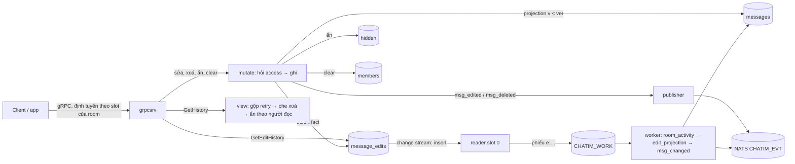
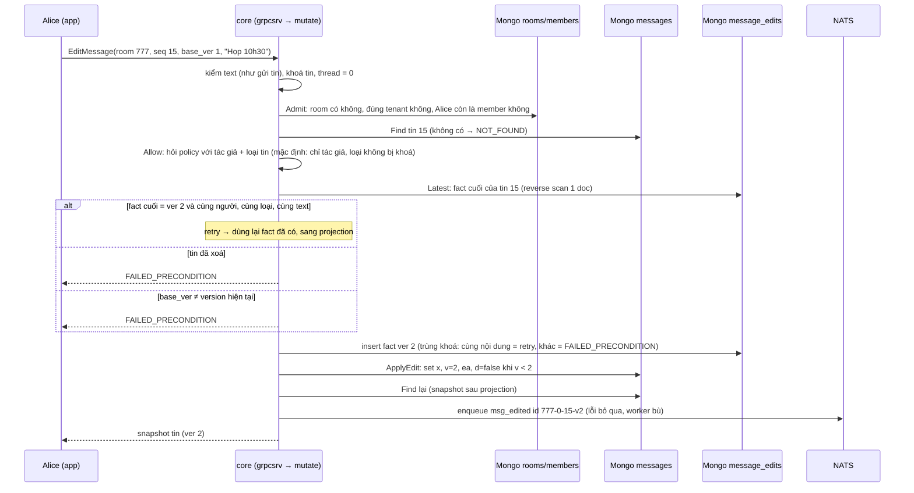

# M2b.2 — Sửa + xoá tin, ẩn và xoá lịch sử phía tôi: tóm tắt kỹ thuật

> Trạng thái: **đã xây**, `dev-done`. Thực thi xong 2026-10-06 trên nhánh `feat/m2b`, merge `main` cùng M2b.0–M2b.4 qua PR #12 ngày 2026-10-08. Plan execute gốc (cho AI) nằm ở `.claude/plans/2026-10-05-m2b2-edit-delete.md` (local). Bản này là tài liệu lưu trữ: mô tả cái owner đã duyệt và cái đã xây. Chỗ nào milestone sau đã đổi thì ghi "Sau M2b.x: …". Quyết định D62–D64, D70, D75, D82–D87 nằm trong Decision Log của [thiết kế](../designs/261005-chatim-architecture.md) §17.
>
> Đường dẫn package theo bố cục hiện tại `apps/core/internal/<nhóm>/<package>` (thiết kế §13). Plan gốc dùng đường dẫn cũ `apps/core/internal/<package>`.

## 1. Thuật ngữ

| Từ | Nghĩa |
|---|---|
| fact bất biến | Một dòng chỉ được insert, không bao giờ sửa nội dung. Ở đây là mỗi lần sửa hoặc xoá tin: một dòng trong `message_edits` |
| projection | Bản "hiện tại" dựng từ các fact. Ở đây là doc `messages` (text mới nhất, cờ đã xoá) |
| version (`ver`, `v`) | Số thứ tự phiên bản nội dung của **một** tin: tin gốc 0, lần đổi đầu 1, rồi 2, 3… Tên Go vẫn là `Version` |
| `base_ver` | Version client đang thấy khi bấm sửa/xoá. Server ghi fact ở `base_ver + 1` |
| CAS (ghi có điều kiện) | Ghi chỉ khi điều kiện vẫn đúng. Ở đây có hai chỗ: khoá unique của fact (hai lệnh cùng ghi version 2 thì chỉ một lệnh thắng) và "chỉ cập nhật `messages` khi `v` đang nhỏ hơn version của fact" |
| retry (gửi lại) | Client gửi lại đúng lệnh vì mất trả lời. Server nhận ra và trả thành công, không ghi lần hai |
| fast path | Đường xử lý ngay trong lệnh: ghi, phát event, trả lời |
| worker / effect | Phần chạy nền ở mọi core (engine M2b.1): đọc phiếu việc từ work stream và làm lại phần fast path có thể đã lỡ |
| phiếu việc (work record) | Bản ghi ngắn reader chép từ nhật ký thay đổi của Mongo vào hàng đợi `CHATIM_WORK` |
| reader pipeline (`view`) | Các bước chạy trên trang tin vừa đọc từ DB trước khi trả client: gộp tin gửi lại, che tin đã xoá, ẩn theo người đọc |
| policy (`access.Policy`) | Điểm hỏi quyền duy nhất: "user này được làm việc này trên tin này không" |
| placeholder | Tin vẫn có mặt trong trang (giữ seq) nhưng không có nội dung, kèm cờ `deleted` hoặc `hidden` |

## 2. Bức tranh chung

M2b.2 thêm năm thao tác trên tin đã gửi:

| Thao tác | RPC | Lớp dữ liệu (thiết kế §4) | Ai thấy thay đổi |
|---|---|---|---|
| Sửa tin | `EditMessage` | Fact bất biến (`message_edits`) + projection (`messages`) | Mọi người |
| Xoá tin cho mọi người | `DeleteMessage` | Như trên, fact loại xoá; dọn text các bản cũ (D75) | Mọi người |
| Ẩn tin phía tôi | `HideMessage` | Giá trị theo người đọc: fact thưa `hidden` | Chỉ người ẩn |
| Xoá lịch sử phía tôi | `ClearHistory` | Giá trị theo người đọc: mốc trên doc member | Chỉ người xoá |
| Xem lịch sử sửa | `GetEditHistory` | Đọc fact | Member (policy quyết) |



Ý chính:
- **Lệnh đổi không đi qua actor của room** (D82): actor chỉ lo cấp seq cho tin mới; sửa/xoá không cấp seq. Lệnh vẫn được định tuyến tới core giữ slot của room để cache ấm, nhưng đúng đắn đến từ CAS, nên hai core cùng nhận lệnh vẫn đúng.
- **Sửa/xoá = ghi fact trước, cập nhật bản hiện tại sau, rồi mới trả lời** (D62, D64). Trả lời xong thì `GetHistory` chắc chắn thấy bản mới.
- **Core chết giữa hai lần ghi không để lại sai lệch lâu**: mỗi fact vào nhật ký thay đổi, worker chạy lại projection ngay (delay 0) và phát lại event sau `RECONCILE_DELAY` (D83).
- **Ẩn và clear không đổi dữ liệu tin**, chỉ ghi một dấu theo người đọc; `GetHistory` áp lúc đọc (D85).
- **Quyền chỉ do `access.Policy` quyết** (D86): mặc định chỉ tác giả sửa/xoá tin của mình, kể cả owner room cũng không xoá được tin người khác. Loại tin bị khoá theo config `MESSAGE_LOCKED_KINDS` (D87, mặc định không khoá).

## 3. Dữ liệu, field, config

### 3.1 Field mới trên `messages` (tên ngắn, giữ nguyên sau D96)

| Field | Nghĩa | Ví dụ | Dùng để |
|---|---|---|---|
| `v` | Version hiện tại = `ver` của fact sửa/xoá cuối; thiếu = 0 (tin chưa đổi). Lưu int32 nên tối đa `MaxInt32` | 2 | Điều kiện CAS của projection; client gửi làm `base_ver` lần sau |
| `d` | Đã xoá cho mọi người | true | View che text; chặn sửa tiếp |
| `ea` | Lúc sửa/xoá cuối (ms, giờ server core xử lý lệnh) | 2026-10-06 09:15:02.120 | Hiện "đã sửa"; proto `edited_at` |
| `x` | Text (đã có). Sửa → text mới; xoá → chuỗi rỗng | "Họp 10h" | — |

Cả ba field mới `omitempty`: tin chưa từng đổi vẫn đúng 7 field như trước, codec gửi tin không đổi byte nào. Cờ `hidden` của proto **không** lưu: chỉ view đặt.

### 3.2 Collection mới `message_edits` (clustered)

`_id` 28 byte = `room│thread│seq│ver` (khoá tin 24 byte + uint32 version, big-endian). Fact của một tin là một khoảng `_id` liên tục, nên "fact cuối" là một reverse scan một doc, "lịch sử sửa" là một range scan.

| Field (hiện tại, sau M2b.4) | Tên lúc M2b.2 | Nghĩa | Ví dụ |
|---|---|---|---|
| `_id` | `_id` | `room│thread│seq│ver` | room 777, thread 0, seq 15, ver 2 |
| `room_id` | `r` | Room (int64) | 777 |
| `tenant` | `t` | Tenant | acme |
| `kind` | `k` | 1 sửa, 2 xoá; sau M2b.4 thêm 3 `original` | 1 |
| `created_by` | `by` | Người ra lệnh | alice |
| `text` | `x` | Nội dung của phiên bản này; fact xoá không có; bị `$unset` khi tin bị xoá | "Họp 10h30" |
| — | `p` | Lúc M2b.2: text gốc, chỉ có trên fact sửa ver 1 (fact xoá không bao giờ có) | "Họp 9h" |
| `created_at` | `ts` | Lúc ghi fact (ms) | 09:15:02.120 |

Index `{room_id, created_at}` (D70) cho `/app resync` quét fact theo thời gian. `messages` vẫn không có index phụ.

Ví dụ lúc M2b.2: gửi "Họp 9h", sửa thành "Họp 10h", rồi "Họp 10h30" → fact ver 1 `{k: 1, x: "Họp 10h", p: "Họp 9h"}`, fact ver 2 `{k: 1, x: "Họp 10h30"}`; `messages` giữ `x: "Họp 10h30", v: 2`.

**Sau M2b.4 (D96):** bỏ `p`. Bản gốc thành một dòng riêng `ver 0` (`kind original`, text lúc gửi, `created_by`/`created_at` là người gửi và lúc gửi), ghi "nếu chưa có" ở lần **sửa** đầu; xoá một tin chưa từng sửa không ghi dòng `ver 0`. Worker bỏ qua dòng `ver 0` (không projection, không event).

### 3.3 Collection mới `hidden` (thường, `_id` ObjectId)

| Field (hiện tại) | Tên lúc M2b.2 | Nghĩa | Ví dụ |
|---|---|---|---|
| `user_id` | `u` | Người ẩn | bob |
| `room_id` | `r` | Room | 777 |
| `thread_root` | `th` | Timeline | 0 |
| `seq` | `s` | Tin bị ẩn | 15 |
| `created_at` | — | Thêm ở M2b.4: lúc ẩn, cho resync và event | 09:20 |

Index unique `{user_id, room_id, thread_root, seq}`: vừa chống trùng vừa phục vụ truy vấn covered "các seq bị ẩn của bob trong khoảng seq của trang". Thưa: chỉ có dòng khi ai đó thật sự ẩn. Lúc M2b.2 ghi bằng `InsertOne`, trùng khoá = đã ẩn, trả thành công. **Sau M2b.4:** `UpdateOne` upsert với `$setOnInsert created_at`, thêm index `{room_id, created_at}`.

### 3.4 Mốc xoá lịch sử trên `members`

| Lúc M2b.2 | Sau M2b.4 (D97) |
|---|---|
| `cb` (int64, `ClearedBeforeSeq`): tin có `seq ≤ cb` bị ẩn với người này trên timeline chính. Ghi bằng `$max`, nên chỉ tăng | `cleared_at` (thời gian, ms): tin có `ts ≤ cleared_at` bị ẩn trên **mọi** timeline. `ClearHistoryRequest.up_to_seq` reserved, response trả `cleared_at` |

### 3.5 Phiếu việc 37 byte (D84)

`work.Record` thêm `Version` (uint32): `kind(1) room(8) thread(8) seq(8) version(4) unixNano(8)` = 37 byte (trước 33). Kind mới `EditInserted` (3), id phiếu `e:{room}-{thread}-{seq}-v{ver}`, ví dụ `e:777-0-15-v2`. `work.KnownKind` là danh sách kind dùng chung cho reader và `Decode`, nên reader không bao giờ đẩy phiếu mà worker sẽ từ chối.

### 3.6 Proto

- `Message` thêm `ver` (10, lúc M2b.2 tên `version`), `deleted` (11), `edited_at` (12, không đặt khi chưa sửa), `hidden` (13).
- 5 RPC: `EditMessage {room_id, thread_root, seq, base_ver, text}` và `DeleteMessage {…, base_ver}` trả snapshot `Message`; `HideMessage {room_id, thread_root, seq}` trả rỗng; `ClearHistory`; `GetEditHistory {room_id, thread_root, seq, after_ver, limit}` trả danh sách `MessageVersion {ver, kind ORIGINAL|TEXT|DELETE, text, by, at}`.
- Event payload `message_edited = 22`, `message_deleted = 23`, mỗi cái `{message (snapshot), ver}`.
- **Sau M2b.4 (D96):** `version` → `ver`, `base_version` → `base_ver`, `after_version` → `after_ver`, giữ số field nên tương thích wire.

### 3.7 Config, metric, Redis

| Loại | Tên | Mặc định | Ghi chú |
|---|---|---|---|
| Config | `MESSAGE_LOCKED_KINDS` | rỗng (không khoá) | Tên loại tin, cách nhau dấu phẩy, phân biệt hoa thường; tên lạ → core không khởi động. Hiện chỉ có `text` (D87) |
| Metric | `effect_dropped_total{effect="edit_projection"}` | — | Fact không đọc được, bỏ có đếm |
| Metric | `effect_dropped_total{effect="msg_changed"}`, `reconcile_republished_total{effect="msg_changed"}` | — | Republish chỉ đếm khi PubAck **không** phải bản trùng, tức fast path đã mất event |
| Alert | không thêm | 15 luật lúc M2b.2 | `ChatimRepublishSurge`, `ChatimEffectDropping`, `ChatimWorkFailing` đã phủ hai effect mới |
| Redis | không thêm khoá | — | Sửa/xoá chống gửi lại bằng `base_ver`, không bằng cid; không có ack mark |

Hằng số: `GetEditHistory` mặc định 50, tối đa 100 dòng mỗi trang (`store.MaxEditPage`); `Edits.Between` tối đa 1000 (`store.MaxEditScan`).

## 4. Luồng xử lý

### 4.1 Sửa tin (`EditMessage`)



- Version hiện tại = `max(v` của tin, version fact cuối`)`. Lấy max vì fact có thể đã ghi mà projection chưa kịp (core chết giữa hai lần ghi).
- `base_ver ≥ MaxInt32` → `FAILED_PRECONDITION` (field `v` là int32).
- **Nhận diện retry đứng trước kiểm "đã xoá"**, nên gửi lại một lệnh xoá đã thắng (mất ack) vẫn nhận thành công thay vì `FAILED_PRECONDITION` (D63). Policy được hỏi **trước** bước này nên tác giả gửi lại vẫn được phép.
- Retry enqueue lại đúng id event; JetStream bỏ bản trùng trong `EVT_STREAM_DUPLICATES` (5 phút).
- Sau M2b.4: lần sửa đầu (`base_ver 0`) ghi dòng `ver 0` trước fact ver 1.

### 4.2 Xoá tin cho mọi người (`DeleteMessage`)

Giống sửa, khác ba chỗ:
- Fact loại xoá, không có text.
- Projection đặt `x = ""`, `d = true`.
- Sau projection, `PurgeText` (`UpdateMany` `$unset` text trên mọi fact `ver ≤ ver mới − 1` của tin), nên text các bản cũ cũng biến mất khỏi kho chính (D75). Lúc M2b.2 dọn cả `p` (text gốc trên fact ver 1); sau M2b.4 dọn dòng `ver 0`.
- Feed chỉ lấy insert của `message_edits`, nên `$unset` không sinh phiếu việc.

Event `msg_deleted` mang snapshot đã che text. Sửa hay xoá tin đã xoá → `FAILED_PRECONDITION`.

### 4.3 Bảng mã lỗi của sửa/xoá

| Trường hợp | Mã gRPC |
|---|---|
| Text rỗng/quá dài/UTF-8 sai, khoá tin sai, `thread_root ≠ 0` (thread để M2c) | `INVALID_ARGUMENT` |
| Room không có hoặc khác tenant; tin không có | `NOT_FOUND` |
| Không phải member; policy từ chối (không phải tác giả, kể cả owner room; loại tin bị khoá) | `PERMISSION_DENIED` |
| `base_ver` lệch; tin đã xoá; trùng version mà khác nội dung | `FAILED_PRECONDITION` |
| Gửi lại đúng lệnh đã thắng | `OK`, cùng snapshot |

Mã đi qua một chỗ duy nhất `pkg/grpcserver`; client chỉ thấy câu sentinel.

### 4.4 Lịch sử sửa (`GetEditHistory`)

`limit` (0 → 50, > 100 → `INVALID_ARGUMENT`) → `Admit` (action `read_edit_history`, A7) → `Find` tin (không có → `NOT_FOUND`) → `Allow` với tác giả (mặc định member nào cũng xem được) → tin đã xoá: danh sách rỗng → `History(after_ver, limit)` (range scan tăng dần theo `ver`) → trả.
- Lúc M2b.2: trang đầu (`after_ver = 0`) thêm phần tử `ver 0 ORIGINAL` dựng từ `p` của fact ver 1, người gửi và lúc gửi. Sau M2b.4: đọc thẳng dòng `ver 0`.
- Tin bị chính người đọc ẩn/clear vẫn trả lịch sử (view ẩn chỉ áp ở `GetHistory`); policy có thể đổi.

### 4.5 Ẩn tin phía tôi (`HideMessage`)

`Admit` (`hide_message`) → tin phải tồn tại (kể cả đã xoá; không có → `NOT_FOUND`) → `Allow` với tác giả (mặc định ẩn được tin của bất kỳ ai) → ghi `hidden`. Ẩn lại → thành công, không ghi gì. Lúc M2b.2 không event. **Sau M2b.4 (D109):** lần ẩn đầu phát `message_hidden` `{room}-hd-{user}-{thread}-{seq}`, worker `hidden_event` phát lại.

### 4.6 Xoá lịch sử phía tôi (`ClearHistory`)

- Lúc M2b.2: `Authorize` (`clear_history`, action theo room) → đọc seq cuối `Messages.Last(room, 0)` → **kẹp** `up_to_seq` về seq cuối (0 hoặc lớn hơn seq cuối → seq cuối) → `FindOneAndUpdate` `$max cb` trên doc member, trả giá trị sau cập nhật (`cleared_before_seq`). Kẹp để client không vô tình ẩn luôn tin **tương lai** của chính mình mà không gỡ được (mốc chỉ tăng). Không phải member → `PERMISSION_DENIED`. Không event.
- **Sau M2b.4 (D97, D109):** `cleared_at = max(cũ, giờ server)`, chỉ member active; mốc tăng thật → `history_cleared` `{room}-cl-{user}-{cleared_at ms}`.

### 4.7 Đọc lịch sử (`GetHistory`) qua reader pipeline

`view.Default()` = `CollapseRetried` → `MaskDeleted` → `HideForViewer` (D85):
- `MaskDeleted`: tin `deleted` → không text (lưới an toàn; projection đã xoá text). Sau M2b.3 bỏ cả số reaction.
- `HideForViewer`: tin nằm dưới mốc clear của người đọc hoặc trong `hidden` của họ → `hidden = true`, không text.
- Seq, `ver`, `edited_at` giữ nguyên: trang theo seq không lệch, client không tưởng là lỗ seq.
- `grpcsrv` dựng `Viewer` từ doc member đã đọc lúc `Admit` và **một** truy vấn covered `HiddenIn(user, room, thread, seq đầu trang, seq cuối trang)`; trang rỗng thì bỏ truy vấn. Không bước nào sửa slice đầu vào.

### 4.8 Đường bù của worker

```mermaid
sequenceDiagram
  participant ED as Mongo message_edits
  participant R as reader (slot 0)
  participant W as CHATIM_WORK
  participant K as worker (core giữ partition)
  participant MS as Mongo messages
  participant N as NATS CHATIM_EVT
  ED-->>R: change stream: insert fact 777-0-15-v2
  R->>W: phiếu e:777-0-15-v2 (37 byte, work.p{slot % 32})
  K->>W: fetch lô
  K->>K: room_activity (delay 0): chỉ nâng last_change_at / activity_bucket
  K->>ED: edit_projection (delay 0): At(ver 2)
  K->>MS: ApplyEdit (v < 2); fact xoá thì PurgeText
  Note over K: msg_changed chờ RECONCILE_DELAY (~5s)
  K->>ED: At(ver 2)
  K->>MS: Find tin; v < 2 → lỗi, Nak, chạy lại cả hai effect
  K->>N: msg_edited (snapshot hiện tại) + chờ PubAck
  Note over N: id đã có từ fast path → bản trùng bị bỏ, không đếm republish
  K->>W: ack phiếu khi mọi effect trả nil
```

- Thứ tự registry cho `EditInserted`: `room_activity` → `edit_projection` → `msg_changed`. `msg_changed` không bao giờ phát snapshot cũ hơn fact.
- `room_activity` ánh xạ phiếu sửa thành activity `Seq 0`: chỉ nâng `last_change_at`/`activity_bucket`, không đổi `last_seq`/`last_message_at`. Nhờ vậy resync (chọn room theo `activity_bucket`) thấy được room chỉ có sửa/xoá.
- Fact, tin hoặc room không còn → bỏ có đếm (`effect_dropped_total`). Lỗi store → `Nak(WORK_RETRY_DELAY)`.
- Phiếu ver 1 tới muộn phát snapshot hiện tại (ví dụ ver 3) dưới id v1: đúng thiết kế (D83), consumer giữ bản có `ver` lớn nhất.

### 4.9 `/app resync`

Sau timeline chính của mỗi room đã chọn, quét `message_edits` theo `{room_id, created_at}` trong `[from, to]`, trang 1000, dời `from` tới `created_at` cuối trang và bỏ trùng mép trang theo id phiếu. Mỗi fact → phiếu `EditInserted`. Một thời điểm có ≥ 1000 fact của một room → `ErrEditPageFull`. Dòng in thêm `edit_records=N`.

## 5. Đúng đắn và chạy đua

| Ca | Kết quả | Vì sao |
|---|---|---|
| Hai lệnh sửa cùng `base_ver 1` cùng lúc | Đúng một thắng; lệnh kia `FAILED_PRECONDITION` | Cả hai insert fact ver 2; khoá `_id` unique chỉ nhận một. Lệnh thua đọc fact ver 2, khác nội dung → conflict. Itest kiểm |
| Sửa và xoá cùng lúc | Cái nào insert ver kế tiếp trước thì thắng; "sửa thua xoá" là kết quả của CAS | Sửa và xoá dùng chung không gian version |
| Client gửi lại sau khi mất ack | Thành công, không fact thứ hai, cùng id event | Nhận diện retry: fact `base+1` cùng người, loại, text |
| Retry cũ sau khi tác giả đã sửa tiếp | `FAILED_PRECONDITION` | Retry chỉ được nhận khi version hiện tại = `base+1`. Desired-state thuần sẽ đưa tin về nội dung cũ (ABA), nên D63 chọn `base_ver` |
| Core chết giữa insert fact và projection | Lệnh gửi lại: đi nhánh retry rồi chạy lại projection. Không gửi lại: `edit_projection` sửa ngay khi phiếu tới (delay 0) | Projection CAS `v < ver` chạy lại vô hại |
| Fast path mất event (NATS chậm, core chết) | `msg_changed` phát lại sau `RECONCILE_DELAY` | Phiếu việc bền trên JetStream; stream bỏ trùng theo id |
| Projection tới lệch thứ tự (ver 3 trước ver 2) | `messages` dừng ở ver 3 | `v < ver` từ chối bản cũ |
| Hai core cùng nghĩ mình giữ slot | Vẫn đúng | Lệnh đổi không dựa vào actor; chỉ dựa vào khoá fact và CAS projection (P1) |
| Ẩn hai lần / clear với mốc nhỏ hơn | Không đổi gì | Khoá unique của `hidden`; `$max` |
| Publisher mark nhầm | Không có | Event đổi không có ack mark (`markKey` chỉ `msg_created`), nên ack của `msg_edited` không che mất `msg_created` bị rớt (D65) |

**Chỗ phải xếp hàng:**
- **Version của một tin đánh số liên tục** (`ver = base_ver + 1`): mọi lệnh sửa/xoá trên **cùng một tin** tranh một số. Lệnh thua nhận `FAILED_PRECONDITION`, client đọc lại rồi gửi với `base_ver` mới. Tin khác nhau, room khác nhau không tranh nhau. Chấp nhận vì một tin hiếm khi bị nhiều người sửa cùng lúc (mặc định chỉ tác giả).
- Phiếu việc của một room vào cùng một partition (`slot % 32`), một core xử lý (có từ M2b.1).
- Không có khoá chung theo room; ẩn và clear không tranh với ai ngoài chính doc của người đó.

## 6. Event và subject

| Event | Id (chống trùng) | Payload | Ack mark | Phát lại khi rớt |
|---|---|---|---|---|
| `msg_edited` | `{room}-{thread}-{seq}-v{ver}` | snapshot tin sau projection + `ver` của fact | Không | `msg_changed`, delay `RECONCILE_DELAY` |
| `msg_deleted` | như trên | snapshot đã che text + `ver` | Không | như trên |

- Lúc M2b.2: subject `evt.{t}.room.{rid}.msg_edited|msg_deleted`. **Sau M2b.4 (D108):** subject theo loại dữ liệu `evt.{t}.message.{rid}.…`, RePublish ra `live.{t}.message.{rid}.evt.{kind}`.
- Event mang **snapshot**, không mang diff: tới trễ hay lệch thứ tự vẫn đúng, client giữ bản `ver` lớn nhất (D83).
- Ẩn và clear lúc M2b.2 không phát event (D85, owner chốt 2026-10-05; đồng bộ đa thiết bị để M3/M4). **Sau M2b.4 (D109):** `message_hidden`, `history_cleared` trên subject `member`, có worker phát lại.

## 7. Thư viện và hạ tầng

- **MongoDB (mongo-driver v2):** collection clustered `message_edits` (zstd, như `messages`); `InsertOne` theo khoá unique (trùng khoá = `ErrEditExists`); range scan và reverse scan trên `_id` clustered; `UpdateOne` có điều kiện `{_id, $or: [v không có, v < ver]}` cho projection; `UpdateMany $unset` cho dọn text; `FindOneAndUpdate $max` trả doc sau cập nhật cho clear; truy vấn covered trên index của `hidden`. Change stream lọc thêm insert của `message_edits`. Collection mới tạo ở bước bootstrap (`TestBootstrapIsIdempotent`).
- **NATS JetStream:** `Nats-Msg-Id` bỏ trùng event fast path / worker; work stream `CHATIM_WORK` (M2b.1).
- **Go:** package mới `mutate` (nay `apps/core/internal/change/mutate`); `view` thêm hai bước (`apps/core/internal/api/view`); `access` thêm `Admit`/`Allow`/`DefaultPolicy` (`apps/core/internal/model/access`); effect mới ở `apps/core/internal/event/effects`; wiring ở `apps/core/internal/app/service_wiring.go`. Không thêm thư viện ngoài.
- **Công cụ:** `tools/internal/route` có 5 lệnh mới, cả 5 theo slot của room và gửi lại khi timeout (an toàn nhờ `base_ver`, upsert, `$max`, đọc); `corecli` thêm `edit`, `delete`, `hide`, `clear`, `edits` và bước `e2e change`; `scripts/e2e.sh` phase 3.

## 8. Quyết định và phương án bị loại

| # | Quyết định | Phương án bị loại | Lý do |
|---|---|---|---|
| D62 | Sửa/xoá = insert fact bất biến vào `message_edits`; `messages` là projection | `updateOne` CAS + insert bản cũ (hai lần ghi rời); pre/post-image của change stream; transaction | Lịch sử đúng; tin hệ thống biết từng lần đổi; feed chỉ cần insert; pre-image bị oplog xoá và khoá vào Mongo; transaction phạm luật sẵn sàng sharding |
| D63 | Lệnh mang `base_ver`; trùng khoá cùng tác giả + nội dung = retry thành công | Desired-state thuần (lệnh là "text phải là X") | Desired-state bị ABA: retry cũ sau một lần sửa mới đưa tin về nội dung cũ |
| D64 | Trả lời sau projection | Trả lời sau fact, projection chạy nền | +1 vòng ghi majority chấp nhận được (lệnh đổi không thuộc mục tiêu A1); trả lời xong là đọc lịch sử thấy bản mới |
| D70 | Cấm index phụ chỉ áp `messages`; `message_edits` có `{room_id, created_at}` | Cấm index phụ mọi collection lớn | Sửa tin cũ không đổi `last_seq`, resync cần quét fact theo thời gian |
| D75 | Xoá = huỷ hiển thị + dọn text trong kho chính (fact giữ khoá); tenant xoá chặt dùng event không text | Purge mọi nơi; mã hoá từng tin rồi huỷ khoá | Purge JetStream chưa kiểm chứng; hàng tỷ khoá mã hoá không đáng |
| D82 | Lệnh đổi chạy trong `mutate`, gọi thẳng từ `grpcsrv`, không qua actor; vẫn định tuyến theo slot | Đưa vào mailbox actor; actor riêng cho lệnh đổi | Không cấp seq nên không cần thứ tự actor; CAS giữ đúng khi hai core cùng nhận; không chen vào hàng gửi tin |
| D83 | Event mang snapshot + `ver` của fact, id theo version, không ack mark; worker `edit_projection` (0s) + `msg_changed` (`RECONCILE_DELAY`) | Event mang diff; ack mark cho event đổi; delay xoá riêng 2–3s (roadmap cũ); projection chỉ ở fast path | Snapshot đúng khi tới trễ/lệch thứ tự; lệnh đổi hiếm nên phát lại sau delay rẻ, stream bỏ trùng; projection delay 0 sửa ngay khi core chết; một delay chung đủ vì fast path đã đẩy event |
| D84 | `work.Record` thêm `Version`, 37 byte, id `e:…-v{ver}` | Kiểu phiếu riêng cho fact sửa; id theo `_id` nhị phân | Một định dạng cho mọi kind; id đọc được, trùng đuôi với id event để truy vết |
| D85 | View: ẩn/clear → `hidden`, xoá → `deleted`, không nội dung, giữ seq/version; ẩn/clear không event | Bỏ tin khỏi trang; lọc trong truy vấn store; event `msg_hidden`/`history_cleared` | Phân trang theo seq đúng; `messages` không index phụ nên lọc ở view rẻ hơn. **Sau M2b.4:** mốc theo thời gian (D97), ẩn/clear có event (D109) |
| D86 | Quyền trên một tin chỉ do `access.Policy`; mặc định chỉ tác giả sửa/xoá; `Admit` → `Find` → `Allow` | Luật cứng "sửa: tác giả; xoá: tác giả hoặc owner" trong core | Owner chốt 2026-10-05: mỗi sản phẩm muốn luật khác (owner/moderator xoá, giới hạn thời gian theo tenant) thì cắm policy Phase 2, không sửa core. Hỏi sau `Find` để thấy tác giả, trước nhận diện retry để tác giả gửi lại vẫn được phép |
| D87 | Không chặn cứng theo loại tin; `MESSAGE_LOCKED_KINDS` nạp vào `DefaultPolicy.LockedKinds`, chỉ checker của `mutate` nhận | Chặn cứng (vd. tin hệ thống không bao giờ sửa được) | Owner chốt 2026-10-06: theo D86, core không giữ luật quyền; mặc định không khoá nên hành vi như D86 |
| — | Không giới hạn thời gian sửa/xoá trong core | Hằng số thời gian trong core | Owner chốt 2026-10-05: policy theo tenant ở Phase 2 |
| — | `ClearHistory` kẹp `up_to_seq` về seq cuối (M2b.2) | Ghi thẳng giá trị client gửi | Mốc chỉ tăng; không kẹp thì client có thể tự ẩn tin tương lai vĩnh viễn. Bỏ ở M2b.4 khi đổi sang thời gian |
| — | `msg_changed` chỉ đếm republish khi PubAck không phải bản trùng | Đếm mọi PubAck | Đếm mọi lần thì metric = tốc độ sửa (100–300/s) và `ChatimRepublishSurge` (> 100/s) kêu sai |

## 9. Chi phí và tải

Giả định thiết kế §2.3: sửa/xoá 1–3% số tin, tức 100–300 lệnh/s đỉnh.

| Thao tác | Đọc | Ghi | Event | Phiếu việc |
|---|---|---|---|---|
| Sửa | 2 (room, member) + 1 `Find` + 1 reverse scan + 1 `Find` lại | 1 insert fact (+1 insert dòng `ver 0` ở lần sửa đầu, sau M2b.4) + 1 CAS `messages` (majority, không gom) | 1 | 1 |
| Xoá | như sửa | 1 insert + 1 CAS + 1 `UpdateMany` dọn text | 1 | 1 |
| Ẩn | 2 + 1 `Find` | 1 | 0 lúc M2b.2 | 0 lúc M2b.2 |
| Clear | 2 + 1 seq cuối (M2b.2) | 1 `FindOneAndUpdate` | 0 lúc M2b.2 | 0 |
| `GetEditHistory` | 2 + 1 `Find` + 1 range scan (≤ 100) | 0 | 0 | 0 |
| `GetHistory` (thêm) | +1 truy vấn covered `hidden` mỗi trang | 0 | 0 | 0 |
| Worker mỗi phiếu sửa | `edit_projection`: 1 `At`; `msg_changed`: 1 `At` + 1 `Find` (loại room có cache) | 1 CAS (vô hại khi đã chiếu) + `$max` activity gom theo lô | ≤1 (bản trùng bị stream bỏ) | — |

- Ước tính thiết kế §6.3: 200–600 vòng ghi majority/s thêm ở đỉnh. Nếu đo thấy nặng thì gom qua flusher (chưa làm).
- Nhóm 5K hay channel 200K: chi phí mỗi lệnh không đổi theo số member (O(1)); fanout là việc của gateway.
- Đo cuối milestone (dev, chỉ kiểm không hồi quy): corebench 1000 tin/s 30s, p99 ack 42,8ms, p50 11,6ms. Không phải milestone perf, không so trước/sau.

## 10. Rủi ro và giới hạn còn lại

- **Retry sau khi tác giả sửa tiếp:** retry chỉ được nhận khi version hiện tại = `base+1`; tác giả sửa thêm giữa lúc mất ack và lúc retry thì retry nhận `FAILED_PRECONDITION` (phạm vi D63).
- **`GetEditHistory` chỉ xem cờ `d` của projection:** giữa insert fact xoá và projection (core chết, worker chưa tới) lịch sử còn trả text cũ; cửa sổ ngắn vì `edit_projection` delay 0.
- **`ApplyEdit` trả nil cả khi tin không còn**, nên nhánh "tin không có" của `edit_projection` không bao giờ chạy; fact mồ côi chỉ bị `msg_changed` bỏ có đếm sau `RECONCILE_DELAY`.
- **`msg_changed` đọc `At` + `Find` cho từng phiếu**, chưa gom theo room: đủ ở 100–300 lệnh/s, cần gom khi xả backlog lớn.
- **Resync:** `ErrEditPageFull` khi một thời điểm (cùng ms) có ≥ 1000 fact sửa của một room; chưa phân trang theo `_id`. Room chỉ có sửa/xoá mà chính write activity cũng mất trong khoảng đó phải chạy `-room`.
- **Nâng cấp phiếu 33 → 37 byte:** phiếu 33 byte còn trong work stream lúc deploy bị Term như bản ghi hỏng (đếm vào `work_failures_total`). Chưa có prod; khi có thì xả work stream trước khi nâng cấp hoặc resync khoảng đó.
- **Không giới hạn thời gian sửa/xoá, owner/moderator không xoá được tin người khác** với policy mặc định: chờ module policy Phase 2.
- **Ẩn/clear chỉ áp ở `GetHistory`**, không ở `GetEditHistory`.
- `MESSAGE_LOCKED_KINDS` phân biệt hoa thường, tên lặp được giữ (vô hại), chưa có trong `Config.LogValue`.
- Store Minor: Mongo từ chối seq clear > `MaxInt64` còn memstore nhận (đã hết ý nghĩa sau M2b.4); `HiddenIn` trả rỗng với đầu vào ngoài khoảng; fact có `At` bằng 0 lưu thành năm 1 (mutator luôn đặt `At`).
- Các mục mở được mang sang M5 trong [roadmap](../roadmap.md) ("Từ M2b.2").

## 11. Điểm đội tự chọn

| Điểm | Giá trị chọn | Lý do |
|---|---|---|
| Thứ tự kiểm trong lệnh đổi | Kiểm đầu vào → `Admit` → `Find` → policy → retry → đã xoá → `base_ver` | Policy thấy tác giả; retry của lệnh xoá đã thắng vẫn thành công |
| Delay `edit_projection` | 0 | Projection phải sửa ngay khi core chết giữa hai lần ghi |
| Delay `msg_changed` | `RECONCILE_DELAY` (5s), dùng chung | Fast path đã đẩy event; không cần delay riêng 2–3s |
| `room_activity` cho phiếu sửa | Chạy, với `Seq 0` | Resync tìm được room chỉ có sửa/xoá mà không làm sai `last_seq` |
| `msg_changed` khi projection chưa tới | Lỗi retry được, Nak cả phiếu | Không bao giờ phát snapshot cũ hơn fact |
| Trang `GetEditHistory` | Mặc định 50, tối đa 100 | Cùng giới hạn trang với `GetHistory` |
| Trang resync fact | 1000, lỗi khi một thời điểm đầy trang | Đơn giản; phân trang theo `_id` để sau |
| Ẩn tin đã xoá | Được | Ẩn là dấu theo người đọc, không phụ thuộc trạng thái tin |
| Route client | Gửi lại cả 5 lệnh khi timeout | Mỗi lệnh đều idempotent (`base_ver`, upsert, `$max`, đọc) |

## 12. Kiểm thử, mỗi mục chứng minh gì

- **Unit `domain`, `pbconv`, `publish`:** giá trị kind lưu đúng; tin/member mới không mang trạng thái sửa; id event có đuôi `-v{ver}`; proto mang trạng thái sửa, `edited_at` trống khi chưa sửa; envelope `msg_edited`/`msg_deleted` đúng; danh sách phiên bản chỉ có bản gốc ở trang đầu; hai kind mới đi đúng subject và không có ack mark.
- **Contract store** (`storetest.RunEdits`, `RunEditFeed`, chạy trên memstore và Mongo thật): insert unique, `At`/`Latest`/`History`/`Between` đúng thứ tự và giới hạn, `PurgeText` chỉ dọn bản ≤ upTo, `ApplyEdit` chỉ khi `v < ver`, ẩn idempotent, clear chỉ tăng, activity `Seq 0` chỉ nâng thời điểm đổi, feed sinh `EditInserted`. Write contract: thêm loại ghi `purge`; mọi port mới là insert unique, CAS, upsert, `$max` hoặc purge.
- **Mongo:** bootstrap tạo `message_edits` clustered và `hidden` có index (từ chối `message_edits` không clustered); codec giữ trạng thái sửa nhưng không lưu cờ `hidden`; fact xoá không lưu text; từ chối version ngoài khoảng.
- **`work` + reader:** phiếu 37 byte đi về nguyên vẹn; kind đã biết là ba kind; reader chuyển insert fact thành phiếu `e:`.
- **`access`:** policy nil dùng `DefaultPolicy`; `Admit` không hỏi policy; `Allow` nhận tác giả; `DefaultPolicy` chỉ cho tác giả sửa/xoá; loại tin bị khoá bị từ chối cả với tác giả.
- **`mutate`:** sửa ghi ver 1 kèm bản gốc; sửa nối tiếp theo version client thấy; `base_ver` cũ → conflict; retry không ghi fact thứ hai; retry sau crash chạy nốt projection; trùng version chỉ là retry khi cùng nội dung; đầu vào sai bị từ chối; xoá dọn text các bản trước; không gì đổi được tin đã xoá; tin không có → `NOT_FOUND`; event bị từ chối không làm lệnh lỗi; policy được hỏi với tác giả và một policy khác có thể cho owner xoá tin bất kỳ; ẩn cần tin tồn tại; clear chỉ tăng mốc, room rỗng giữ 0.
- **`grpcsrv` + `view`:** 5 RPC qua service giữ đúng mã lỗi; lịch sử sửa đủ phiên bản, rỗng với tin đã xoá, kiểm `limit` và quyền; `MaskDeleted` chỉ bỏ text tin đã xoá; `HideForViewer` ẩn theo mốc và `hidden`; pipeline che sau khi gộp retry; placeholder khác nhau theo người đọc.
- **`effects`:** `edit_projection` áp fact fast path lỡ, dọn text khi xoá, bỏ fact không còn, retry khi store lỗi; `msg_changed` phát snapshot hiện tại, chỉ đếm event stream chưa có, chờ projection, bỏ cái đã mất, chờ PubAck; `room_activity` với phiếu sửa chỉ nâng thời điểm đổi.
- **`resync`:** fact trong khoảng mất được đẩy sau timeline; phân trang theo thời gian không lặp mép trang; dừng khi một thời điểm đầy trang.
- **`route`, `e2e`:** lệnh đổi định tuyến theo room và gửi lại khi timeout; conflict và room id sai không gửi lại; kiểm trang lịch sử có nội dung đã sửa/xoá, event đổi theo id, lịch sử sửa có bản gốc rồi bản sửa.
- **Itest trên hạ tầng thật:** (a) sửa thấy trong lịch sử, lịch sử sửa và live, gửi lại là retry thành công; (b) fact ghi thẳng vào Mongo (bỏ qua core) được worker chiếu và phát; (c) xoá dọn text các bản trước, chặn sửa sau đó, gửi lại lệnh xoá vẫn thành công; (d) hai lệnh sửa cùng base: đúng một thắng; người khác và cả owner room bị từ chối sửa/xoá; tác giả tự xoá được; (e) ẩn và clear chỉ áp cho người làm, `$max` không lùi, không event. Cộng drill resync có fact sửa.
- **E2e hai core:** phase 3 sửa seq 1 và xoá seq 2 (base 0), kiểm trên lịch sử, lịch sử sửa và live, sau phase kill core giữ slot của room (lần chạy cuối: kill core-1, lệnh đổi đi qua core-2, mỗi lệnh một lần thử).

## 13. Kết quả thực thi

- **Commit theo task** trên `feat/m2b` (T1 `861dfbb` … T14b `23e1531`, docs T15), cộng `999fcfd` sửa một itest flaky có từ trước (core test mới khởi động còn chia slot nên `SendMessage` nhận `UNAVAILABLE` theo D77; test nay gửi lại cùng cid như route client).
- **Thêm ngoài plan gốc:** Task 14b (owner chốt 2026-10-06, D87): `access.Request.Kind`, `DefaultPolicy.LockedKinds`, config `MESSAGE_LOCKED_KINDS`.
- **Lệch nhỏ so với plan:** `pbconv` có thêm hàm chọn `msg_edited`/`msg_deleted` theo loại fact, dùng chung cho fast path và worker; `ApplyEdit` và `ClearHistory` nằm ở hai port nhỏ `store.MessageEditor`, `store.HistoryClearer` thay vì thêm vào `Messages`/`Rooms`; T7 viết test và code cùng lúc (lỗi quy trình, code không lệch); vài dòng `INDEXES.csv` đổi định dạng; một file 126 dòng so với ước tính 125.
- **Kiểm chứng cuối (2026-10-06):** `fmt-check`, `vet`, `lint` sạch; `vuln` 0 lỗ hổng được gọi; `make test` 40 package `ok`; `itest` xanh ở T14b; `make e2e` PASS (40 tin trước và sau khi kill core-1, sửa seq 1, xoá seq 2); `/metrics` hai core: `msg_changed` republish 0 + 0 (fast path đã phát cả hai), dropped 0, `work_failures_total` 0; `alerts-check` 15 luật; resync dry-run 15 phút `edit_records=2`; corebench 1000/s 30s: 30000 gửi, 0 lỗi, 0 mất, 0 trùng trên 20 room theo dõi, p99 ack 42,8ms, `CPU_Speed_Limit` 100.
- **Sau đó:** M2b.3 bỏ số reaction trên tin đã xoá/ẩn trong view; M2b.4 đổi tên field, thay `p` bằng dòng `ver 0`, đổi clear sang `cleared_at`, thêm event cho ẩn/clear, đổi subject sang `message`, đổi tên field proto sang `ver`.
