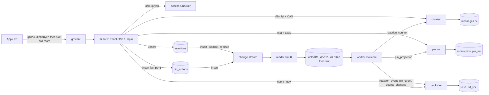
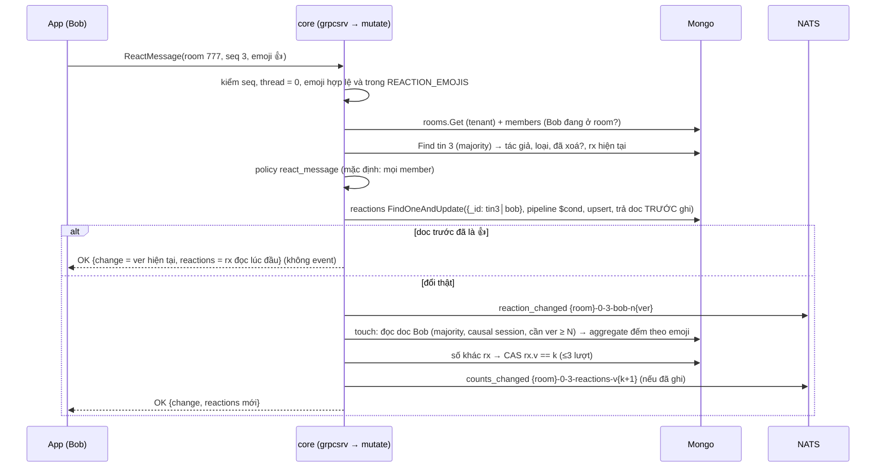

# M2b.3 — Reaction + ghim: tóm tắt kỹ thuật

> Trạng thái: **đã xây** (2026-10-06, `dev-done` trên nhánh chung `feat/m2b`), merge `main` qua PR #12 ngày 2026-10-08 cùng M2b.0–M2b.4. Plan execute gốc (cho AI) nằm ở `.claude/plans/2026-10-06-m2b3-reactions-pins.md` (local, không còn trong `docs/`). Quyết định D88–D95 nằm trong Decision Log của [thiết kế](../designs/261005-chatim-architecture.md) §17. Bản này mô tả cái owner đã duyệt và cái đã xây; chỗ milestone sau đổi lại thì ghi "Sau M2b.4: …".
>
> Đường dẫn package theo bố cục hiện tại `apps/core/internal/<nhóm>/<package>` (thiết kế §13). Plan gốc dùng đường dẫn cũ `apps/core/internal/<package>`.

## Owner đã chốt (2026-10-06)

| Chốt | Nội dung |
|---|---|
| Reaction | Một emoji mỗi người trên một tin; chọn emoji khác thì thay emoji cũ; emoji rỗng là gỡ. "Nhiều trên một người" là reply và mention (M2c), không phải reaction |
| Emoji | Danh sách cố định trong config của core (`REACTION_EMOJIS`), mặc định 👍 ❤️ 😂 😮 😢 🙏; core có API `GetReactionSettings` cho FE đọc (D95, sửa sau kiểm chứng cuối) |
| Quyền | Mặc định mọi thành viên được react, ghim, bỏ ghim; module policy chat (Phase 2) có thể giới hạn theo role (D94) |
| Giới hạn ghim | 50 mỗi room (`PIN_LIMIT`), chính xác kể cả khi nhiều người ghim cùng lúc |
| Ghim không cần version phía client | Bỏ `base_pv`; server tự đọc trạng thái hiện tại và xử lý tranh chấp (D92) |
| Số đếm | Cập nhật ngay khi thả (trước khi trả lời), rồi việc chạy nền kiểm lại sau |
| Lịch sử tin | `GetHistory` chỉ trả số đếm theo emoji; "emoji của tôi" để M3 (`GetReactions`) |
| Ghi reaction | Dựa vào khoá unique, một lần upsert, không vòng thử lại (D89, sửa sau kiểm chứng cuối) |
| Quy tắc mới | Mỗi plan có bản tóm tắt kỹ thuật như file này để owner duyệt (nay là quy tắc trong roadmap) |

## 1. Thuật ngữ

| Từ | Nghĩa |
|---|---|
| lớp tập (target, user) | Mỗi cặp (đích, người) là đúng một doc. Reaction: mỗi (tin, user) một doc. Gửi lại cùng giá trị thì doc giữ nguyên |
| fact + projection | Fact là bản ghi bất biến của một lần làm (ví dụ "Alice ghim tin 4 lúc 9:00"); projection là trạng thái hiện tại dựng lại từ các fact (danh sách ghim trên doc room) |
| aggregate | Số suy ra từ nhiều doc, ở đây là số reaction theo emoji của một tin (`messages.rx`) |
| CAS (ghi có điều kiện) | Ghi chỉ khi một giá trị vẫn như lúc đọc, ví dụ "chỉ ghi `rx` nếu `rx.v` vẫn là 3". Hai bên ghi cùng lúc thì một bên thắng |
| touch (đếm lại) | Đếm lại reaction của một tin từ các doc `reactions` rồi CAS vào `messages.rx`. Không bao giờ cộng/trừ dồn (`$inc`) |
| witness (nhân chứng) | "Doc reaction của Bob phải có `ver ≥ 5`". Lần đếm chỉ hợp lệ khi đã thấy mọi witness; thiếu thì báo đọc cũ (`ErrStaleRead`) và thử lại sau |
| tombstone | Gỡ reaction không xoá doc mà để `emoji = ""`, giữ bộ đếm `ver` để id event không bao giờ lặp |
| pv / `pin_ver` | Số thứ tự **liên tục** (1, 2, 3…) của các lần ghim/bỏ ghim trong một room. Trước M2b.4 tên field là `pv` |
| fold | Áp lần lượt các fact ghim lên một danh sách ghim để ra danh sách mới |
| nhật ký thay đổi (change stream / feed) | Mongo tự ghi mọi thay đổi; reader trên core giữ slot 0 đọc và chép thành phiếu việc |
| phiếu việc (work record) / worker | Bản ghi ngắn trên `CHATIM_WORK` (M2b.1); worker ở mọi core lấy ra chạy các effect (đếm lại, phát lại event, dựng lại projection). Lỗi thì Nak (trả lại để làm sau) |
| fast path | Phần lệnh chạy ngay trong request: ghi, phát event, đếm lại, rồi trả lời |

## 2. Bức tranh chung

M2b.3 thêm hai tính năng, mỗi tính năng khớp một lớp dữ liệu của thiết kế §4:
- **Reaction** = lớp tập (`reactions`, một doc mỗi (tin, user)) + aggregate (`messages.rx`, số đếm theo emoji).
- **Ghim** = fact (`pin_actions`, đánh số liên tục theo room) + projection (`rooms.pins`, `rooms.pin_ver`).



Người dùng thấy:
- **Reaction:** mỗi người thả một emoji trong danh sách cố định; đổi emoji thì thay; gỡ bất cứ lúc nào. Mỗi tin hiện số đếm theo emoji. Tin đã xoá, đã ẩn hay nằm trong phần đã xoá lịch sử thì không hiện số đếm. Tin đã xoá không nhận reaction mới nhưng vẫn gỡ được.
- **Ghim:** mọi thành viên ghim/bỏ ghim; tối đa 50 tin mỗi room. Ghim tin đã ghim hay bỏ ghim tin chưa ghim thì thành công, không đổi gì. Không ghim được tin đã xoá, nhưng vẫn bỏ ghim được; xoá tin không tự gỡ ghim. Mỗi lần ghim/bỏ ghim có một event; module tin hệ thống sau này dùng nó để sinh tin "X đã ghim…".
- **Realtime:** `reaction_changed`, `counts_changed`, `msg_pinned`, `msg_unpinned`. Event rớt thì worker phát lại sau khoảng `RECONCILE_DELAY` (5s).

Ví dụ: Bob thả 👍 lên tin 3 của room 777.
1. Core ghi doc reaction (777, tin 3, Bob) = 👍, `ver` 1; phát `reaction_changed`.
2. Core đếm lại reaction của tin 3 (thấy chắc chắn doc của Bob `ver ≥ 1`), ghi `rx = {👍: 1}`, `rx.v` 1; phát `counts_changed`; trả lời Bob `{change: 1, reactions: 👍 1}`.
3. Mongo ghi thay đổi vào nhật ký; reader chép thành phiếu `x:777-0-3-bob-n1` vào hàng đợi việc.
4. Sau 1s, worker `reaction_counter` đếm lại tin 3: số đã đúng thì không ghi, chỉ phát lại `counts_changed` (NATS bỏ bản trùng). Sau 5s, worker `reaction_event` đọc doc của Bob: vẫn `ver` 1 thì phát lại `reaction_changed` (bỏ trùng).

## 3. Dữ liệu và field

M2b.3 thêm hai collection clustered và field mới trên `messages`, `rooms`. Tên dưới là tên hiện tại; M2b.4 (D96) đã đổi tên ngắn ban đầu sang tiếng Anh đầy đủ (ghi trong cột cuối).

### 3.1 `reactions` (clustered, mới)

`_id` = khoá tin 24 byte (`room│thread│seq`) nối byte của user id, nên mọi reaction của một tin nằm liền nhau (một range) và `_id` chính là khoá unique.

| Field | Nghĩa | Ví dụ | Dùng để | Tên lúc M2b.3 |
|---|---|---|---|---|
| `message_key` | Khoá tin 24 byte | `777│0│3` | Đếm theo emoji trên index `{message_key, emoji}` | `k` |
| `room_id`, `tenant`, `user_id` | Room, tenant, người react | 777, acme, bob | Resync, event | `r`, `t`, `u` |
| `emoji` | Emoji hiện tại; `""` = đã gỡ (tombstone) | 👍 | Đếm, event | `e` |
| `previous_emoji` | Emoji ngay trước lần đổi cuối (`""` khi doc mới) | ❤️ | Payload `reaction_changed` | `pe` |
| `ver` | Số lần doc đổi (thả = 1, đổi = 2, gỡ = 3…), chỉ tăng | 2 | Id event `-n{ver}`, witness của touch | `n` |
| `updated_at` | Lúc đổi cuối | 09:00:01.120 | Resync quét theo thời gian | `ts` |

Index: `{message_key, emoji}` (đếm phủ index, không đọc doc) và `{room_id, updated_at}` (resync). Tombstone không bao giờ dọn.

### 3.2 `pin_actions` (clustered, mới)

`_id` = room 8 byte nối `pin_ver` 8 byte. `pin_ver` dày nên khoá chính là CAS: hai lệnh cùng muốn ghi pv 6 thì chỉ một lệnh vào được.

| Field | Nghĩa | Ví dụ | Tên lúc M2b.3 |
|---|---|---|---|
| `room_id`, `tenant` | Room, tenant | 777, acme | `r`, `t` |
| `action` | 1 ghim, 2 bỏ ghim | 1 | `op` |
| `thread_root`, `seq` | Tin đích | 0, 4 | `th`, `s` |
| `created_by`, `created_at` | Ai, lúc nào | alice, 09:00 | `by`, `ts` |

Index `{room_id, created_at}` (resync, D70).

### 3.3 Field mới trên `messages` và `rooms`

| Collection | Field | Nghĩa | Ví dụ | Tên lúc M2b.3 |
|---|---|---|---|---|
| `messages` | `rx` | Số reaction `{c: [{e, n}], v}`: mảng (emoji, số) sắp số giảm rồi emoji; `v` là version của summary, chỉ tăng khi số đổi. Không có `rx` = `v` 0. `messages` giữ tên ngắn (D96) | `{c: [{👍, 3}, {❤️, 1}], v: 7}` | `rx` |
| `rooms` | `pins` | Danh sách ghim hiện tại, mới nhất trước: `{thread_root, seq, pinned_by, pinned_at, pin_ver}` | `[{0, 4, alice, 09:00, 6}]` | `[{th, s, by, ts, pv}]` |
| `rooms` | `pin_ver` | pv của fact cuối đã áp vào `pins` | 6 | `pv` |

- `rx` là mảng chứ không phải map vì emoji có thể chứa ký tự như `$`, `.` không làm tên field được.
- `Rooms.Get` (chạy ở mọi lần kiểm quyền) **không** đọc `pins`/`pin_ver`; đọc riêng bằng projection khi cần.

### 3.4 Config, proto, metric

| Loại | Tên | Mặc định | Ý nghĩa |
|---|---|---|---|
| env | `REACTION_EMOJIS` | `👍,❤️,😂,😮,😢,🙏` | Danh sách emoji được phép, giữ thứ tự; để trống = mặc định. Boot kiểm: không rỗng, mỗi emoji hợp lệ, không lặp, ≤ 100 (D95) |
| env | `PIN_LIMIT` | 50 | Số ghim tối đa mỗi room, 1..1000 |
| env | `REACTION_COUNT_DELAY` | 1s | Delay của worker `reaction_counter`; dương và ≤ `RECONCILE_DELAY` |
| env | `WORK_RETRY_DELAY` | 5s | Có từ M2b.1; M2b.3 dùng thêm làm delay Nak cho phiếu kind lạ (cập nhật README) |
| RPC | `ReactMessage`, `PinMessage`, `UnpinMessage`, `GetReactionSettings` | — | Message trong `proto/chatim/v1/reactions_pins.proto` |
| proto | `Message.reactions` (field 14) | — | `ReactionSummary {counts, ver}`; rỗng khi chưa từng có số đếm |
| event | `reaction_changed` (24), `counts_changed` (25), `message_pinned` (26), `message_unpinned` (27) | — | oneof trong `events.proto` |
| metric | `chatim_core_counter_repaired_total{counter="reactions"}` | — | Số summary worker phải sửa vì fast path để lệch |
| metric | nhãn mới của `effect_dropped_total` / `reconcile_republished_total` | — | `reaction_event`, `reaction_counter`, `pin_event` (cả hai); `pin_projection` (chỉ dropped) |
| alert | `ChatimCounterRepairSurge` | > 1/s trong 10 phút | Luật thứ 16 (guarantee CT1) |

Sau M2b.4 (D96): field proto `ReactionSummary.version` → `ver`, `pin_version` → `pin_ver` (giữ số field, tương thích wire). Không có khoá Redis mới.

## 4. Luồng xử lý

Mọi lệnh chạy trong `change/mutate`, được `api/grpcsrv` gọi, không qua actor; client định tuyến theo slot của room. Tenant và user lấy từ metadata `x-chatim-tenant`, `x-chatim-user` (thiếu → `UNAUTHENTICATED`). Chỉ timeline chính: `thread_root ≠ 0` → `INVALID_ARGUMENT` (thread ở M2c).

### 4.1 Thả / đổi / gỡ reaction (`ReactMessage`)



1. **Kiểm đầu vào** (trước khi chạm DB): seq ≠ 0, thread = 0; emoji khác rỗng thì phải hợp lệ (UTF-8, 1–32 byte, không ký tự điều khiển) và nằm trong `REACTION_EMOJIS` → sai là `INVALID_ARGUMENT` (`ErrEmojiNotAllowed`). Emoji ngoài danh sách bị từ chối **trước** khi kiểm membership.
2. **Quyền:** `Admit` (room thuộc tenant → không thì `NOT_FOUND`; người gọi là member active → không thì `PERMISSION_DENIED`) → `Find` tin (không có → `NOT_FOUND`) → `Allow` với tác giả và loại tin (policy từ chối → `PERMISSION_DENIED`). `MESSAGE_LOCKED_KINDS` không áp cho reaction (D94).
3. **Tin đã xoá:** thả emoji → `FAILED_PRECONDITION`; gỡ (emoji rỗng) vẫn được.
4. **Ghi** (D89): một `FindOneAndUpdate` lọc **chỉ** theo `_id`, upsert, trả doc trước ghi. Pipeline dùng `$cond`: emoji đang lưu bằng emoji mới thì giữ nguyên mọi field, nên doc không đổi byte nào (không oplog, không phiếu việc, không event); khác thì `previous_emoji` = emoji cũ, `emoji` mới, `ver + 1`, `updated_at`. Kết quả suy từ doc trước ghi: không có doc → `ver` 1; cùng emoji → no-op; khác → `ver + 1`.
5. **Gỡ:** update không upsert, lọc `{_id, emoji ≠ ""}`, để tombstone `emoji = ""`, `ver + 1`. Chưa có doc hoặc đã gỡ → không ghi gì, trả doc hiện tại (không chèn tombstone).
6. **Sau khi ghi:** enqueue `reaction_changed` → touch inline (`FastTouchTries` 3) → nếu `rx.v` tăng thì enqueue `counts_changed` → trả `{change, reactions}`. Lỗi enqueue hay lỗi touch **bị bỏ qua** (client nhận summary đang có, worker sửa sau); lệnh chỉ báo lỗi khi chính lần ghi reaction lỗi.
7. **Không cid:** lệnh là trạng thái mong muốn, gửi lại an toàn.

| Trường hợp | Kết quả |
|---|---|
| Thiếu metadata caller | `UNAUTHENTICATED` |
| seq 0, thread ≠ 0, emoji sai định dạng hoặc ngoài danh sách | `INVALID_ARGUMENT` |
| Room không có / khác tenant; tin không có | `NOT_FOUND` |
| Không phải member active; policy từ chối | `PERMISSION_DENIED` |
| Thả emoji lên tin đã xoá | `FAILED_PRECONDITION` |
| Thả lại đúng emoji đang có; gỡ khi chưa có | `OK`, không đổi, không event |

### 4.2 Ghim / bỏ ghim (`PinMessage`, `UnpinMessage`)

```mermaid
sequenceDiagram
  participant A as App (Alice)
  participant C as core (mutate)
  participant DB as Mongo
  participant N as NATS
  A->>C: PinMessage(room 777, seq 4)
  C->>DB: Admit + Find tin 4 + policy pin_message
  C->>C: tin đã xoá → FAILED_PRECONDITION
  loop tối đa 3 lượt
    C->>DB: Current: đọc rooms.pins/pin_ver = 5, quét pin_actions sau pv 5, fold
    alt tin 4 đã ghim
      C-->>A: OK {pin_ver, pins} (không fact, không event)
    else đã đủ PIN_LIMIT
      C-->>A: FAILED_PRECONDITION
    end
    C->>DB: insert pin_actions {_id: 777│6, ghim, tin 4, alice}
    alt trùng khoá pv 6
      C->>DB: đọc fact pv 6: cùng thao tác, tin, người → đó là kết quả; khác → lượt sau
    end
  end
  C->>DB: Project: fold + CAS rooms.pin_ver == p (≤5 lượt; lỗi → dùng fold cục bộ)
  C->>N: msg_pinned {room}-p6 (snapshot tin)
  C-->>A: OK {pin_ver 6, pins mới nhất trước}
```

1. **Quyền:** `Admit` → `Find` tin → `Allow` (`pin_message` / `unpin_message`, mặc định mọi member; khoá loại tin không áp).
2. **Tin đã xoá:** ghim → `FAILED_PRECONDITION` (kiểm trước "đã ghim chưa"); bỏ ghim vẫn được.
3. **Trạng thái hiện tại** (`pinproj.Current`): đọc `rooms.pins/pin_ver`, quét `pin_actions` có pv lớn hơn (trang 1000), fold. Nhờ vậy lệnh luôn thấy cả fact chưa kịp vào projection.
4. **Đúng trạng thái sẵn** → thành công, không fact, không event.
5. **Giới hạn** kiểm trên trạng thái ở pv − 1 của chính fact sắp ghi, nên chính xác.
6. **Ghi fact** pv + 1. Trùng khoá (người khác vừa ghi pv đó): fact ở pv đó cùng thao tác, cùng tin, cùng người → đó là lần gửi lại của chính lệnh này, trả thành công; khác → lượt sau (đọc lại, kiểm lại giới hạn). Hết 3 lượt → `UNAVAILABLE` (`ErrRetryLater`), client gọi lại.
7. **Projection** (`pinproj.Project`): fold + CAS `pin_ver == p`, tối đa 5 lượt; lỗi thì trả fold cục bộ, worker `pin_projection` sửa sau.
8. **Event** `msg_pinned`/`msg_unpinned` mang snapshot tin (tin đã xoá thì không có text) và `pin_ver`.

| Trường hợp | Kết quả |
|---|---|
| seq 0, thread ≠ 0 | `INVALID_ARGUMENT` |
| Room/tin không có | `NOT_FOUND` |
| Không phải member; policy từ chối | `PERMISSION_DENIED` |
| Ghim tin đã xoá; ghim khi đã có `PIN_LIMIT` ghim | `FAILED_PRECONDITION` |
| Hết 3 lượt vì người khác liên tục chiếm pv | `UNAVAILABLE` |
| Ghim tin đã ghim; bỏ ghim tin chưa ghim | `OK`, không đổi, không event |

Danh sách ghim hiện chỉ đọc được qua response của `PinMessage`/`UnpinMessage` và event; RPC `ListPins` để M3.

### 4.3 Đọc lịch sử và danh sách emoji

- `GetHistory` trả `Message.reactions` (chỉ số đếm, đọc từ `rx` trên chính doc tin, không thêm lần đọc). `view.MaskDeleted` và `view.HideForViewer` xoá cả text lẫn số đếm của tin đã xoá, tin bị ẩn với người đọc và tin nằm trong phần đã xoá lịch sử; giữ seq và version. Sau M2b.4: xoá lịch sử tính theo thời gian (`members.cleared_at`, D97) thay cho theo seq.
- `GetReactionSettings` không định tuyến theo room, chỉ cần metadata caller; trả danh sách emoji theo thứ tự config, không đọc DB.

### 4.4 Việc chạy nền (worker)

Feed thêm insert của `reactions`, `pin_actions` và update/replace của `reactions`. Update chỉ giải mã `documentKey._id` (ra room, thread, seq, user) và `updatedFields.ver`; không dùng `updateLookup`. Reader chép thành phiếu:
- `ReactionChanged` (kind 4): khoá tin + `ver` + đuôi user, id `x:{room}-{thread}-{seq}-{user}-n{ver}`.
- `PinInserted` (kind 5): room + pv, id `p:{room}-p{pin_ver}`.

| Kind | Effect theo thứ tự | Delay | Làm gì |
|---|---|---|---|
| `ReactionChanged` | `room_activity` | 0 | Chỉ cập nhật `last_change_at`/`activity_bucket` (`Seq` 0, không đè `last_seq`) |
| | `reaction_counter` | `REACTION_COUNT_DELAY` (1s) | Gom phiếu theo tin trong lô; witness = `ver` lớn nhất của mỗi user; một touch mỗi tin mỗi lô (3 lượt CAS); ghi thật thì `counter_repaired_total` +1; `rx.v > 0` thì phát lại `counts_changed` của `v` hiện tại |
| | `reaction_event` | `RECONCILE_DELAY` (5s) | Đọc doc: `ver` bằng phiếu → phát `reaction_changed`; lớn hơn → bỏ (phiếu mới hơn lo); nhỏ hơn → đọc cũ, Nak |
| `PinInserted` | `room_activity` | 0 | Như trên |
| | `pin_projection` | 0 | Mỗi room một `Project` tới pv lớn nhất trong lô |
| | `pin_event` | `RECONCILE_DELAY` | Đọc fact ở pv + tin → phát `msg_pinned`/`msg_unpinned` |

Phiếu chỉ được ack khi mọi effect trả nil; lỗi → Nak `WORK_RETRY_DELAY`. Room, tin, fact không còn → bỏ, đếm `effect_dropped_total`. Delay tăng dần trong danh sách (luật `REACTION_COUNT_DELAY ≤ RECONCILE_DELAY` giữ điều đó).

### 4.5 Resync

`/app resync` quét thêm, cho mỗi room đã chọn: timeline → `message_edits` → `reactions` (doc hiện tại, kể cả tombstone, theo `{room_id, updated_at}`) → `pin_actions` (theo `{room_id, created_at}`), trang 1000, rồi đẩy phiếu vào hàng đợi việc. Dòng in ra thêm `reaction_records`, `pin_records`. Room được chọn theo `activity_bucket`/`created_at`, nên room **chỉ** có reaction hay ghim trong khoảng mất phải chạy kèm `-room`.

## 5. Đúng đắn và các ca chạy đua

**Chỗ phải xếp hàng** (không có khoá chung nào khác):

| Điểm | Ai tranh | Xử lý |
|---|---|---|
| `pin_ver` của một room (đánh số liên tục) | Mọi lệnh ghim/bỏ ghim **cùng room** | Khoá `room│pv` là CAS; bên thua đọc lại, tối đa 3 lượt rồi `UNAVAILABLE`. Chấp nhận vì ghim hiếm; đổi lại giới hạn 50 chính xác |
| `rooms.pin_ver` (projection) | Fast path và worker `pin_projection` | CAS `pin_ver == p`; ai thua thì đọc lại và fold tiếp, kết quả như nhau |
| `messages.rx.v` của một tin | Mọi touch của **cùng tin** (fast path nhiều người + worker) | CAS; fast path tối đa 3 lượt rồi bỏ, worker sửa. Tin nóng (channel) là rủi ro (mục 10) |
| Doc reaction (tin, user) | Chỉ các thiết bị của **cùng user** trên cùng tin | Mongo xếp hàng ghi trên một doc; upsert trùng khoá được server tự thử lại vì filter chỉ là phép bằng trên `_id` |
| Ngăn hàng đợi việc | Phiếu của một room luôn vào cùng ngăn (`slot % 32`), một core xử lý | Theo lô; không chặn room khác |

Người khác nhau react cùng một tin **không** tranh nhau ở bước ghi (mỗi người một doc), chỉ gặp nhau ở CAS của `rx`.

Các ca:
- **Thả lại đúng emoji / gửi lại lệnh:** doc giữ nguyên byte, không oplog, không event, không đếm lại.
- **Gửi lại trễ (không cid):** Bob thả 👍, đổi ❤️, rồi lệnh 👍 cũ bị client gửi lại muộn → reaction quay về 👍. Chấp nhận cho lớp tập (người dùng thấy và bấm lại); cid tốn Redis mà vẫn không chặn được kiểu ABA này (D89).
- **Hai thiết bị của Bob đổi emoji cùng lúc:** mỗi `FindOneAndUpdate` nguyên tử trên một doc; `ver` tăng lần lượt; kết quả mỗi lệnh suy từ doc trước ghi của chính nó.
- **Số đếm không bao giờ lệch vĩnh viễn:** không `$inc`; mỗi touch đếm lại từ đầu rồi CAS. Witness bảo đảm lần đếm đã thấy write vừa làm, kể cả khi primary đổi (failover) hay đọc từ node chậm: đọc doc của Bob trong causal session với majority, `ver < N` → `ErrStaleRead` (fast path bỏ qua, worker Nak). Mỗi thay đổi sinh một phiếu, worker touch **sau** nó, nên lần touch cuối luôn thấy mọi thay đổi (thiết kế §7.5).
- **Số bằng thì không ghi:** `rx.v` chỉ tăng khi số đổi, nên `counts_changed` không bị phát thừa.
- **Hai người ghim cùng lúc khi còn 1 chỗ:** cả hai đọc pv 49 → cùng ghi pv 50 → một người vào; người kia đọc fact pv 50, thấy khác tin/người → lượt sau đọc lại thấy 50 ghim → `FAILED_PRECONDITION`. Itest: `PIN_LIMIT=3`, 6 lệnh đồng thời → đúng 3 thành công.
- **Core chết giữa fact và projection ghim:** fact đã nằm trong `pin_actions`. Lệnh sau tự fold fact đó (bước Current); worker `pin_projection` ghi lại `rooms.pins`; `pin_event` phát event từ fact. Gửi lại lệnh cũ → thấy đã đúng trạng thái → thành công, không event mới (event do worker phát).
- **Fold đi qua fact không đổi danh sách** (ghim tin đã ghim từ một lệnh đua) vẫn tăng `pin_ver`, để projection không kẹt.
- **Fast path không bao giờ báo lỗi vì effect:** lỗi enqueue, touch, projection đều bị bỏ qua sau khi fact đã commit; worker hội tụ về trạng thái cuối.
- **Event trung gian có thể mất:** Bob 👍 rồi ❤️; nếu event `n1` rớt ở fast path thì worker chỉ phát doc hiện tại (`n2`). Chỉ trạng thái cuối được bảo đảm (lớp tập, D93).
- **Nâng cấp từng core (rolling deploy):** phiếu đúng dạng nhưng kind lạ (core mới ghi, core cũ đọc) → Nak có đếm, không xoá (Term), để core mới xử lý. Core trước M2b.3 thì Term phiếu dài 38+ byte và kind 5, nên phải nâng mọi core trước khi có phiếu mới (prod chưa live, D91).
- **`room_activity` không bị đè:** phiếu reaction/ghim mang `Seq` 0, nên `last_seq`/`last_message_at` chỉ đổi theo tin mới.

## 6. Event và subject

| Event | Id (chống trùng) | Payload | Phát lại khi rớt |
|---|---|---|---|
| `reaction_changed` | `{room}-{thread}-{seq}-{user}-n{ver}` | `{user, emoji, previous_emoji, change}` | `reaction_event`, chỉ doc hiện tại |
| `counts_changed` | `{room}-{thread}-{seq}-reactions-v{v}` | `{counter: "reactions", reactions}` | `reaction_counter`, `v` hiện tại |
| `msg_pinned`, `msg_unpinned` | `{room}-p{pin_ver}` | `{message (tin xoá không text), pin_ver}` | `pin_event` |

- **Subject:** lúc M2b.3 cả bốn đi `evt.{t}.room.{rid}.{kind}`. **Sau M2b.4 (D108):** `reaction_changed`, `counts_changed` đi `evt.{t}.message.{rid}.…`; `msg_pinned`, `msg_unpinned` ở lại `evt.{t}.room.{rid}.…` (danh sách ghim nằm trên doc room). RePublish ra `live.{t}.{loại}.{rid}.evt.{kind}`.
- **Không ack mark** cho bốn event này: worker luôn gửi lại sau delay, JetStream bỏ bản trùng theo `Nats-Msg-Id` (cửa sổ 5 phút); `reconcile_republished_total` chỉ đếm PubAck không phải bản trùng (tức fast path thật sự đã mất event).
- **Id đọc được một cách:** user chỉ gồm `[A-Za-z0-9_-]`, ba số đầu cố định, đuôi `-n{số}` khác `-v{số}`, nên id reaction không trùng id sửa/xoá, `-created`, `-p{pv}`, `-reactions-v{v}` (test bảng với user `reactions`, `v1`, `a-n1`). Id dài nhất ~140 ký tự.
- Id phiếu việc: `x:` + id reaction, `p:` + id ghim; `counts_changed` không có phiếu riêng (đi theo phiếu reaction).
- cid của tin hệ thống sinh từ event sau này: `sys-{event_id}` (D93; `ValidCID` không nhận `:`).
- Client: `ver`/`v`/`pin_ver` lớn hơn là mới hơn, bỏ event cũ; mất kết nối lâu thì tải lại (P8).

## 7. Thư viện và hạ tầng

- **MongoDB (mongo-driver v2):**
  - collection clustered `reactions`, `pin_actions` (tạo ở bootstrap, kèm index);
  - `FindOneAndUpdate` với update dạng pipeline, `$cond`, `$literal` (để emoji như `$x` không bị hiểu là đường dẫn field), upsert, trả doc trước ghi;
  - causal-consistency session + majority read cho witness rồi aggregate `$match {message_key, emoji > ""}` + `$group` trong cùng session; explain xác nhận phủ index `message_key_1_emoji_1`, không FETCH;
  - `UpdateOne` CAS cho `rx.v` và `rooms.pin_ver`; insert unique cho `pin_actions`;
  - change stream lấy update/replace của `reactions` không cần `updateLookup`.
- **NATS JetStream:** `Nats-Msg-Id` bỏ trùng event; work stream `CHATIM_WORK` (WorkQueue, 32 ngăn) với `NakWithDelay` cho record lỗi/kind lạ.
- **buf:** message reaction/ghim tách sang `proto/chatim/v1/reactions_pins.proto` (cùng package, không đổi tên/số field).
- **Prometheus:** metric mới đăng ký pull qua `/metrics` cổng admin; luật alert kiểm bằng `make alerts-check` (promtool).
- **Package mới:** `change/counter` (touch: witness → đếm → CAS) và `change/pinproj` (Current/Project: fold + CAS), dùng chung cho `mutate` và `event/effects` (nên `effects` không import `mutate`).

## 8. Quyết định kèm phương án bị loại

| # | Quyết định | Phương án bị loại | Lý do |
|---|---|---|---|
| D88 | Reaction một emoji mỗi (user, tin): clustered `reactions`, `_id = message_key│user`, index `{message_key, emoji}` + `{room_id, updated_at}`; thay D68 | Unique `{k, emoji, u}` trên ObjectId (nhiều emoji mỗi user, D68 cũ); shard `{k: 1}` | Owner chốt một emoji. `_id` làm luôn khoá unique (không cần index unique phụ), reaction của một tin là một range trên một shard |
| D89 | Đặt = một upsert lọc chỉ theo `_id`, pipeline `$cond` giữ nguyên doc khi cùng emoji, kết quả suy từ doc trước ghi; gỡ để tombstone; không cid | Upsert lọc `e ≠ emoji`, trùng khoá → đọc lại majority, thử ≤3 rồi `UNAVAILABLE` (bản đầu, đã xây rồi owner sửa); toggle theo emoji; cid; chèn tombstone khi chưa có doc | Filter chỉ trên `_id` unique thì server tự thử lại upsert trùng khoá: bỏ vòng thử lại, lần đọc lại và lỗi `UNAVAILABLE` giả. Tombstone giữ `ver` để id event không lặp |
| D90 | Summary `rx {c: [{e, n}], v}` dạng mảng; touch = witness → aggregate phủ index → bằng thì bỏ → khác thì CAS `rx.v`; touch inline trước khi trả lời + worker một touch mỗi tin mỗi lô; cửa sổ gom W và bucket K để milestone Channel. Tinh chỉnh D67 | `afterClusterTime` qua port (D67 gốc); map emoji → số; `$inc`; chỉ touch ở worker | Cluster time không đi qua port mà không lộ kiểu driver; witness đúng cả sau failover; emoji không làm tên field được; `$inc` trễ làm thừa vĩnh viễn; touch inline để người bấm thấy số mới ngay |
| D91 | Feed thêm insert/update/replace của `reactions`, insert của `pin_actions`; kind 4, 5; record thêm đuôi user; kind lạ → Nak; `room_activity` để `Seq` 0 cho kind không phải tin | `updateLookup`; record riêng cho reaction; đẩy doc đầy đủ vào work stream | `updateLookup` thêm một lần đọc và trả doc lúc đọc chứ không phải bản của change; worker đọc doc hiện tại nên chỉ cần khoá + `ver`; record 37 byte cũ vẫn đọc được |
| D92 | Ghim bỏ `base_pv`; pv dày; `PIN_LIMIT` chính xác; đúng trạng thái sẵn = thành công không fact; projection fold + CAS `pin_ver == p` dùng chung fast path/worker; `Rooms.Get` không đọc pins. Thay phần ghim của D63/D64 | `base_pv` từ client; `$push`/`$pull` + `pv < v`; kiểm giới hạn trên projection | Client không cần biết pv; fold + CAS đúng với mọi thứ tự fact và khi core chết giữa chừng; pv dày nên giới hạn chính xác không cần khoá; `Rooms.Get` chạy ở mọi lần kiểm quyền nên không mang danh sách ghim |
| D93 | Bốn event, id như mục 6; không ack mark; `GetHistory` chỉ số đếm, `view` che ở tin xoá/ẩn; cid SysMsg `sys-{event_id}` | Id `{k}-{u}-{emoji}-n{n}`; ack mark cho event mới; emoji của người đọc trong `GetHistory`; cid `sys:{event_id}` | Id đọc một cách, không trùng loại khác; lưu lượng thấp nên không cần không gian mark; emoji của người đọc cần query theo user (M3); `ValidCID` không nhận `:` |
| D94 | Action `react_message`, `pin_message`, `unpin_message`; mặc định mọi member; `MESSAGE_LOCKED_KINDS` không áp | Chỉ owner/tác giả được ghim; khoá loại tin áp cả reaction/ghim | Owner chốt, như D86: luật owner/moderator thuộc module policy chat (Phase 2) |
| D95 | Danh sách emoji cố định `REACTION_EMOJIS`; ngoài danh sách → `INVALID_ARGUMENT`, kiểm trước membership; `GetReactionSettings`; độ dài danh sách là giới hạn số loại emoji mỗi tin | Mọi emoji hợp lệ, tối đa `REACTION_MAX_EMOJIS` loại mỗi tin (mặc định 20, giới hạn mềm đọc từ `rx`; bản đầu, đã xây rồi owner sửa) | Owner muốn danh sách khai báo trước, FE chỉ đọc danh sách đó. Giới hạn thành chính xác mà không phải đọc `rx`; hết ca "người duy nhất của một emoji không đổi được sang emoji mới khi tin đã đủ N loại" |

Quyết định nhỏ của đội trong lúc làm (không số D): `FoldPins` tăng `pin_ver` cả với fact không đổi danh sách; record kind 0 là hỏng (Term), không phải kind lạ (Nak); `*mongostore.Store` cấp port reaction/ghim qua accessor `Reactions()`/`Pins()` vì trùng tên method với `Edits`/`Rooms`.

## 9. Chi phí và tải

| Thao tác | Đọc | Ghi | Event | Phiếu việc |
|---|---|---|---|---|
| React có đổi | 3 (room, member, tin) + touch: đọc witness + aggregate O(số reaction của tin, ≤ 5K khoá ở group 5K) | 1 `FindOneAndUpdate` majority + ≤1 CAS `rx` | 1–2 | 1 |
| React không đổi | 3 | 1 lệnh không ghi gì | 0 | 0 |
| Ghim/bỏ ghim có đổi | 3 + đọc `rooms.pins` + quét fact sau pv (+ đọc lại trong Project) | 1 insert + 1 CAS majority | 1 | 1 |
| `GetHistory` | không thêm (số đếm nằm trên doc tin) | 0 | 0 | 0 |
| `GetReactionSettings` | 0 | 0 | 0 | 0 |

- **Worker mỗi phiếu reaction:** ≤1 write activity mỗi room mỗi lô; 1 touch mỗi tin mỗi lô (đọc witness + aggregate + ≤1 CAS + 1 publish, thường là bản trùng); 1 đọc doc + 1 publish (bản trùng). **Mỗi phiếu ghim:** ≤1 CAS projection mỗi room mỗi lô; 1 đọc fact + 1 `Find` tin + 1 publish.
- **Group 5K:** mọi lệnh O(1) cộng một aggregate phủ index theo số reaction của tin. Phát tới 5K người là việc của gateway.
- **Channel 200K (chưa giải):** một bài nhận R react/s phải đếm lại tới 200K khoá mỗi touch (ví dụ 500/s × 100K ≈ 50M khoá index/s) và CAS `rx.v` tranh nhau. Cửa sổ gom W + bucket `hash(u) % K` để milestone Channel, bắt buộc trước khi channel go-live.
- **Lưu trữ:** một doc reaction mỗi (tin, user) từng react, không bao giờ dọn tombstone; mỗi lần đổi reaction ghi oplog và thêm một phiếu việc.
- **Đo:** corebench 1000 tin/s × 30s sau M2b.3: không lỗi, không mất, không trùng, p99 ack 60,9ms (chỉ kiểm không hỏng đường gửi, không phải milestone perf).

## 10. Rủi ro và giới hạn còn lại

- **Tin nóng ở channel:** đếm lại O(số reaction của tin) mỗi touch, CAS `rx.v` tranh nhau; W + K để milestone Channel (D90).
- **Rolling deploy:** core cũ Term phiếu 38+ byte và kind 5; phải nâng mọi core trước khi có phiếu mới. Trong lúc còn core cũ, Nak kind lạ không giới hạn nên `ChatimWorkFailing` kêu; một lần fetch có thể đếm cùng phiếu nhiều lần khi `WORK_FETCH_WAIT` > `WORK_RETRY_DELAY` (hiếm với mặc định 1s so với 5s) (D91).
- **Không cid cho reaction:** gửi lại trễ có thể đưa reaction về trạng thái cũ (D89).
- **Event trung gian của reaction có thể mất;** chỉ trạng thái cuối được bảo đảm (D93).
- **Resync:** room chỉ có reaction/ghim trong khoảng mất cần `-room`; một thời điểm có quá 1000 reaction hay fact ghim → `ErrReactionPageFull`/`ErrPinPageFull`; index `{room_id, updated_at}` của `reactions` không có prefix `_id` nên `Between` sẽ scatter-gather khi đã shard (công cụ tay, chấp nhận, D88).
- **effects:** lỗi publish đếm drop một lần mỗi nhóm chứ không mỗi phiếu; ba cache loại room riêng theo effect (tốn bộ nhớ); `reaction_counter` đếm drop cả lỗi vĩnh viễn `INVALID_ARGUMENT`. Lỗi của chính `Nak`/`Term` bị bỏ qua (phiếu giao lại sau `AckWait`).
- **Đọc ở Mongo:** `Pins` đọc local trên primary còn `Reactions` đọc majority (chưa ghi lý do); `Count` mở causal session cả khi không có witness; `PinState` với room id > `MaxInt64` trả `NOT_FOUND`; decoder không đối chiếu field của doc với `_id`; `ver` kiểu double không nguyên bị cắt; nhánh update từ chối `ver == 0` còn nhánh insert/replace nhận (vô hại).
- **Mã hoá phiếu:** `Encode` bỏ im lặng user không hợp lệ (không tới được vì user đã qua kiểm); `Decode` chặn độ dài tối đa nên đuôi dài hơn sau này sẽ bị Term.
- **Chưa có trong M2b.3:** reaction và ghim chỉ cho timeline chính (thread ở M2c); "emoji của tôi" (`GetReactions`) và `ListPins` ở M3.
- **Quy tắc "không thử lại nội bộ"** (owner chốt 2026-10-07, sau M2b.3, áp từ M2b.4) chưa áp ngược cho M2b.3: ghim vẫn thử ≤3 lượt khi trùng pv, `Project` ≤5 lượt, touch inline ≤3 CAS (code hiện tại vẫn vậy).
- **File gần 200 dòng** (lần sửa sau phải tách): `mongostore/codec_test.go`, `counter/counter_test.go`, `mongostore/codec.go`, `resync/scan_test.go`, `grpcsrv/harness_test.go`, `config/load_test.go` (181–192 dòng lúc kết thúc M2b.3).

## 11. Điểm đội tự chọn (owner đã duyệt cùng bản tóm tắt)

| Điểm | Giá trị | Lý do |
|---|---|---|
| Doc reaction | Một doc mỗi (tin, user), bộ đếm `ver` làm id event | Gửi lại không sinh event trùng; tombstone giữ `ver` |
| Số đếm | Đếm lại + CAS, không `$inc` | Không bao giờ lệch vĩnh viễn |
| Ghim | Fact bất biến đánh số liên tục, danh sách dựng lại từ fact | Giới hạn 50 chính xác; core chết giữa chừng vẫn tự lành |
| `REACTION_COUNT_DELAY` | 1s | Đếm lại sớm hơn phát lại event (5s); phải ≤ `RECONCILE_DELAY` để delay tăng dần trong registry và vừa `AckWait` |
| Lượt thử | touch inline 3, touch worker 3, ghim 3, projection 5 | Lệnh không chờ lâu; phần còn lại do worker (Nak) hoặc client (gọi lại khi `UNAVAILABLE`) lo |
| Trang quét | 1000 reaction / 1000 fact ghim | Như `message_edits` |
| Emoji | 1–32 byte UTF-8, không ký tự điều khiển; danh sách ≤ 100 | Kiểm ở boot (config) và ở store, nên emoji hỏng không vào được DB |
| `PIN_LIMIT` | 50, cho chỉnh 1..1000 | Owner chốt 50 |
| Thứ tự `pins` | Mới nhất trước | `FoldPins` chèn tin vừa ghim lên đầu; response và projection cùng thứ tự |
| `Rooms.Get` | Không đọc `pins` | Mọi lần kiểm quyền gọi nó |
| Event | Không ack mark | Lưu lượng thấp, worker gửi lại và stream bỏ trùng là đủ |
| Kind lạ trong hàng đợi | Nak có đếm, không Term | Core cũ không xoá phiếu của core mới khi nâng cấp |
| Detector | `counter_repaired_total` + `ChatimCounterRepairSurge` (16 luật) | Tăng vọt nghĩa là touch inline hỏng hệ thống |

## 12. Kiểm thử, mỗi mục chứng minh gì

- **Unit:**
  - `domain`: `FoldPins` (mọi thứ tự fact, fact không đổi danh sách vẫn tăng version, không sửa slice đầu vào), `ValidateEmoji`, sắp số đếm; `pkg/keys`: khoá reaction/ghim và giới hạn độ dài;
  - `pbconv`: bảng id chứng minh id reaction, số đếm, ghim, sửa/xoá, tin mới không trùng nhau (kể cả user `reactions`, `v1`, `a-n1`);
  - `work`: mã hoá phiếu có đuôi user, phiếu 37 byte cũ vẫn đọc được, kind lạ → Nak, kind 0 → Term;
  - `counter`: số bằng thì không ghi; CAS trượt thì đọc lại; witness thiếu → `ErrStaleRead`; hết lượt → `ErrContended`;
  - `pinproj`: fold qua nhiều trang, dừng khi không tiến, CAS trượt thì đọc lại;
  - `mutate`: thứ tự kiểm, emoji ngoài danh sách, tin xoá, no-op không event/không touch, lỗi touch/enqueue không làm lệnh lỗi; ghim: trùng pv của chính lệnh là kết quả, fact khác thử lại rồi `UNAVAILABLE`, projection lỗi dùng fold cục bộ;
  - `effects`: bốn effect (doc hiện tại thắng, gom theo tin/room, drop có đếm), mọi effect có metric dropped và chỉ effect phát event có republished;
  - `config`: `REACTION_EMOJIS` (rỗng, lặp, sai, > 100), `PIN_LIMIT`, `REACTION_COUNT_DELAY ≤ RECONCILE_DELAY`;
  - `view`: tin xoá/ẩn/đã xoá lịch sử không mang số đếm; `GetHistory` trả số đếm.
- **Contract store** (memstore và Mongo thật): `RunReactions`, `RunPins` (25 subtest: đặt, đổi, gỡ, tombstone, witness, đếm, CAS `rx`, append/At/After/Between, `PinState`/`ApplyPins`), `RunReactionFeed`, `RunPinFeed` (insert/update/replace sinh đúng change; no-op không sinh change); write contract xếp loại mọi method mới (version-bump, cas, insert-unique, read); bootstrap tạo đủ collection + index.
- **Itest trên hạ tầng thật** (`apps/core/itest`):
  - `TestRealInfraWorkersPublishReactionChangesWrittenOutsideTheCore`: reaction ghi thẳng vào Mongo (insert, đổi, gỡ) → feed → worker phát `reaction_changed` n1..n3 và `counts_changed` v1..v3, `rx` cuối rỗng;
  - `TestRealInfraConcurrentReactionsConvergeToExactCounts`: 24 user react rồi đổi/gỡ đồng thời → `rx` hội tụ đúng bằng số doc;
  - `TestRealInfraWorkersProjectAPinFactWrittenOutsideTheCore`: giả core chết giữa fact và projection → worker sửa `rooms.pins` và phát `msg_pinned`;
  - `TestRealInfraPinLimitHoldsUnderConcurrentPins`: `PIN_LIMIT=3`, 6 lệnh đồng thời → đúng 3 thành công, 3 fact;
  - `TestRealInfraMembersReactAndPinEvenOnLockedKinds`: member không phải tác giả react/ghim được kể cả khi khoá loại tin; người ngoài room bị từ chối;
  - `TestRealInfraDeletedMessagesTakeNoNewReactionOrPin`: tin xoá không nhận reaction/ghim mới, gỡ/bỏ ghim vẫn được, lịch sử không mang số đếm;
  - drill resync quét `reactions` và `pin_actions`.
- **E2e trên cụm hai core** (phase 4 của `make e2e`): đọc danh sách emoji, react emoji thứ nhất rồi thứ hai trên seq 3 (`change` 2, số đếm `v2`), 🎉 bị từ chối `INVALID_ARGUMENT`, ghim seq 4 (`pin_ver` 1), lặp lệnh là no-op; kiểm trên reply, lịch sử và live; kill core-1 không mất, không trùng tin.
- **Vận hành:** `make alerts-check` 16 luật; `/metrics` có đủ nhãn mới.

## 13. Kết quả thực thi

- **Lệch so với plan:**
  - Sau kiểm chứng cuối, owner sửa hai điểm và code đã sửa theo: (1) đặt reaction bằng một upsert lọc chỉ `_id` (bỏ vòng thử lại, lần đọc lại majority và lỗi `ErrReactionContended`); (2) danh sách emoji cố định `REACTION_EMOJIS` + RPC `GetReactionSettings` + lệnh corecli `reaction-settings` (bỏ `REACTION_MAX_EMOJIS`, `ErrTooManyEmojis` và giới hạn mềm). Hai Minor của plan (lỗi `UNAVAILABLE` giả khi cùng user đổi đồng thời; người duy nhất của một emoji không đổi được emoji ở giới hạn) hết theo.
  - `*mongostore.Store` không cài trực tiếp port `Reactions`/`Pins` (trùng tên method) mà cấp qua accessor `Reactions()`/`Pins()`.
  - Message reaction/ghim tách sang `reactions_pins.proto` để `core.proto` dưới 200 dòng (không đổi tên/số field; `buf breaking` so với `main` sạch).
  - Test Nak kind lạ sửa ở phần test (fetch lô 1) vì một lần fetch giao lại cùng phiếu nhiều lần; hệ quả ghi vào D91.
  - Còn lại là sửa cơ học cho lint/biên dịch, không đổi hành vi. Không có lỗi runtime.
- **Kiểm chứng cuối** (2026-10-06): `fmt-check`, `vet`, `lint` sạch; `vuln` 0 lỗ hổng trong code; `make test` 42 package `ok`; `make itest` xanh (6 itest mới đạt lần đầu); `make e2e` PASS; `/metrics` hai core: mọi `effect_dropped_total`, `reconcile_republished_total` của effect mới, `counter_repaired_total{counter="reactions"}` và `work_failures_total` đều 0 (fast path đã phát và đếm đủ); `alerts-check` 16 luật; resync dry-run 15 phút `rooms=2 … edit_records=2 reaction_records=1 pin_records=1`; corebench 1000/s × 30s: `failed=0 missing=0 duplicates=0`, p99 ack 60,9ms, pacer lag p99 6,0ms, `CPU_Speed_Limit` 100 → 72. Sau khi owner sửa: `make itest` xanh, `make e2e` PASS, review không có lỗi Critical/Important.
- **Mức sẵn sàng:** `dev-done`; merge `main` cùng M2b.0–M2b.4 qua PR #12 (2026-10-08).
