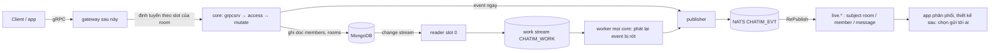
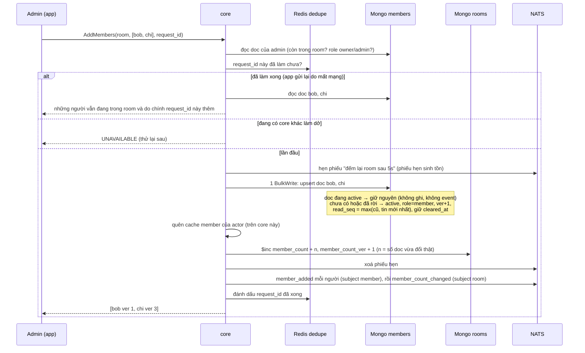

# M2b.4 — Member + vị trí đọc: tóm tắt kỹ thuật cho owner

> Plan chi tiết (cho AI): [2026-10-06-m2b4-members-read.md](2026-10-06-m2b4-members-read.md). Trạng thái: **owner đã duyệt; đã thực thi xong (2026-10-08), `dev-done` trên `feat/m2b`.** Kết quả, lệch so với plan và Minor ở mục "Kết quả thực thi" cuối plan; quyết định D96–D111 đã vào Decision Log của thiết kế. Mục 9 liệt kê những điểm đội tự chọn để anh phản biện.
>
> Lưu ý: bản plan M2b.4 trước (đánh số liên tục `mv`) đã **huỷ hoàn toàn**. Số quyết định D96–D110 được dùng lại cho thiết kế mới này với nghĩa khác.

## 0. Thuật ngữ dùng trong bản này

| Từ | Nghĩa |
|---|---|
| CAS (ghi có điều kiện) | Ghi chỉ khi một giá trị vẫn như lúc mình đọc, ví dụ "chỉ ghi nếu `ver` của Bob vẫn là 3". Hai bên ghi cùng lúc thì chỉ một bên thắng; bên thua nhận lỗi `UNAVAILABLE` và app gọi lại |
| transaction | Gói nhiều lần ghi thành một khối: hoặc xong hết, hoặc không có gì được ghi. Chỉ dùng cho lệnh đổi owner |
| tombstone | Doc không bị xoá mà chỉ đánh dấu "đã rời" (`state = 2`), để giữ lịch sử và các bộ đếm |
| nhật ký thay đổi (change stream / oplog) | Mongo tự ghi mọi thay đổi vào một nhật ký nằm trong chính Mongo; core chết cũng không mất |
| phiếu việc / hàng đợi việc (work stream) | Mỗi thay đổi được chép thành một "phiếu việc" ngắn, bỏ vào hàng đợi trên NATS (có từ M2b.1) |
| worker / Nak | Phần chạy nền ở mọi core, lấy phiếu ra làm; làm chưa được thì trả phiếu lại (Nak) để làm lại sau |
| subject | "Địa chỉ" của một event trên NATS, ví dụ `evt.acme.member.777.member_added`. Ai cần thì đăng ký nghe theo địa chỉ |
| RePublish | Luật của NATS chép event từ stream lưu trữ sang subject `live.*` để app khác nghe |
| `$inc` | Lệnh Mongo cộng/trừ thẳng một số trên doc, ví dụ `member_count + 2` |
| P8 | Nguyên tắc trong thiết kế: kết nối lại thì lấy trạng thái mới nhất, không phát lại event cũ |

## 1. Bức tranh chung

M2b.4 gồm hai phần:
1. **Đổi tên field** của mọi collection đã làm (trừ `messages`) sang tiếng Anh đầy đủ, và đổi mốc "xoá lịch sử phía tôi" sang thời gian.
2. **Thành viên và vị trí đọc** theo nguyên tắc **không đánh số liên tục**: mỗi (room, user) là một doc riêng, có bộ đếm riêng. Thêm hay xoá **những người khác nhau** trong cùng room chạy song song, không tranh nhau.



- Lệnh của client tới core giữ slot của room. Core kiểm quyền, ghi doc, cộng/trừ số member, phát event rồi trả lời ngay.
- **Core chỉ bảo đảm mọi event được phát; không chọn người nhận.** Mỗi event đi một subject theo loại dữ liệu (`room`, `member`, `message`, mục 4). Chuyển tới user nào, bao nhiêu user, bao nhiêu room, thông báo đẩy… là việc của một app phân phối thiết kế sau (owner chốt 2026-10-07).
- **Việc chạy nền diễn ra thế nào** (engine M2b.1 đang chạy). Ví dụ admin thêm Bob vào room 777:
  1. Core ghi doc member của Bob, cộng `member_count` của room, phát event `member_added` và `member_count_changed`, rồi **trả lời admin ngay**.
  2. Mongo tự ghi vào nhật ký thay đổi: "doc member (room 777, Bob) vừa đổi, `ver` 1".
  3. Một core (core giữ slot 0, gọi là reader) đọc nhật ký và chép mỗi thay đổi thành **phiếu việc** "room 777, Bob, ver 1", bỏ vào hàng đợi việc trên NATS.
  4. Hàng đợi chia 32 ngăn **theo room**: phiếu của room 777 luôn vào cùng một ngăn, và mỗi ngăn chỉ một core xử lý.
  5. Worker của core đó lấy một lô phiếu, đợi khoảng 5 giây (`RECONCILE_DELAY`), đọc trạng thái hiện tại và **phát lại** event (NATS bỏ bản trùng theo id nếu bước 1 đã phát được), xong thì xoá phiếu. Lỗi thì trả phiếu lại để làm sau.
- **Vì sao tách ra như vậy:** lệnh trả lời nhanh; event ở bước 1 có thể rớt (NATS chậm, core chết ngay sau khi ghi), phiếu việc vẫn còn trong hàng đợi nên event luôn được phát lại.

## 2. Dữ liệu và tên field

### 2.1 Đổi tên các collection đã có (task đầu tiên, sau đó reset dữ liệu dev)

| Collection | Tên cũ → tên mới |
|---|---|
| `rooms` | `t`→`tenant`, `ty`→`type`, `n`→`name`, `cb`→`created_by`, `ca`→`created_at`, `mc`→`member_count`, `ls`→`last_seq`, `lm`→`last_message_at`, `lc`→`last_change_at`, `ab`→`activity_bucket`, `pv`→`pin_ver`; phần tử `pins` thành `{thread_root, seq, pinned_by, pinned_at, pin_ver}` |
| `members` | `r`→`room_id`, `u`→`user_id`, `t`→`tenant`, `ro`→`role`, `ja`→`joined_at`, `cb` (seq) → `cleared_at` (thời gian) |
| `message_edits` | `r`→`room_id`, `t`→`tenant`, `k`→`kind`, `by`→`created_by`, `x`→`text`, `ts`→`created_at`; **bỏ** `p` (xem 2.4) |
| `hidden` | `u`→`user_id`, `r`→`room_id`, `th`→`thread_root`, `s`→`seq`; **thêm** `created_at` (lúc ẩn, để resync tìm lại được) |
| `reactions` | `k`→`message_key`, `r`→`room_id`, `t`→`tenant`, `u`→`user_id`, `e`→`emoji`, `pe`→`previous_emoji`, `n`→`ver`, `ts`→`updated_at` |
| `pin_actions` | `r`→`room_id`, `t`→`tenant`, `op`→`action`, `th`→`thread_root`, `s`→`seq`, `by`→`created_by`, `ts`→`created_at` |
| `reconciler_state` | `token`→`resume_token`, `at`→`cluster_time` |

`messages` giữ tên ngắn (owner chốt). Bảng tra:

| Tên ngắn | Nghĩa |
|---|---|
| `t` | tenant |
| `f` | người gửi |
| `k` | loại tin |
| `x` | text |
| `c` | cid |
| `ts` | lúc gửi (created_at) |
| `v` | version sửa |
| `d` | đã xoá |
| `ea` | lúc sửa cuối |
| `rx` | số reaction |

### 2.2 Doc `members` mới: mỗi (room, user) một doc

`_id` ghép từ room id (8 byte) và user id, giống reaction. Nhờ vậy change stream biết ngay doc thuộc room nào, user nào.

| Field | Nghĩa | Ví dụ |
|---|---|---|
| `room_id`, `tenant`, `user_id` | Room, tenant, user | 777, acme, bob |
| `role` | owner / admin / member | member |
| `state` | 1 = đang trong room, 2 = đã rời hoặc bị xoá. Luôn ghi rõ; doc không bao giờ bị xoá (tombstone) | 1 |
| `priority` | Ưu tiên của người này trong room, do app đặt (`SetMemberPriority`, chỉ owner gọi). Số lớn hơn được chọn làm owner kế nhiệm trước. Mặc định 0; vào lại thì về 0 | 5 |
| `joined_at` | Lúc vào (hoặc vào lại) gần nhất; dùng để chọn người kế nhiệm owner khi `priority` bằng nhau | 2026-10-07 09:00 |
| `ver` | Số lần trạng thái thành viên của người này đổi (vào, rời, vào lại, đổi role, đổi ưu tiên). Chỉ tăng, có lỗ không sao | vào = 1, bị xoá = 2, thêm lại = 3 |
| `previous_role`, `previous_state`, `previous_priority` | Trạng thái ngay trước lần đổi cuối, để event biết đây là "vào", "rời", "đổi role" hay "đổi ưu tiên" | member, 1, 0 |
| `request_id` | Lệnh đã gây ra lần đổi cuối; dùng chống gửi lại và gộp tin hệ thống "A thêm X và 499 người khác" | `req-7f3a…` |
| `updated_at`, `updated_by` | Lúc nào, ai làm lần đổi thành viên cuối | 09:00, alice |
| `last_change_at` | Lúc doc đổi lần cuối vì bất kỳ lý do gì (thành viên, đọc tin, xoá lịch sử). Chỉ dùng cho `/app resync` tìm thay đổi trong khoảng bị mất | 10:05 |
| `cleared_at` | Mốc "xoá lịch sử phía tôi": tin gửi trước hoặc đúng mốc này bị ẩn với riêng người này | 2026-10-07 10:05:03.120 |
| `read_seq` | Đã đọc tới tin số mấy | 500 |
| `read_ver` | Số lần vị trí đọc đổi, để hai thiết bị biết bản nào mới hơn | 12 |

Index:
- `{room_id, state, role, priority giảm dần, joined_at, user_id}`: dùng chung cho đếm số member đang ở room, tìm owner và chọn người kế nhiệm (một lần đọc index, kể cả channel 200K).
- `{tenant, user_id, state, room_id}`: "các room user đang ở", chuẩn bị cho M3 và gateway.

### 2.3 Field mới trên `rooms`

| Field | Nghĩa | Ví dụ |
|---|---|---|
| `member_count` | Số member đang ở room (đã có từ trước, tên cũ `mc`). Cộng/trừ ngay trong lệnh thêm/xoá/rời bằng `$inc` (mục 3.7) | 5000 |
| `member_count_ver` | Tăng 1 mỗi lần `member_count` đổi; dùng làm id event `member_count_changed`, client giữ số có `ver` lớn hơn | 37 |
| `owners_ver` | Số lần danh sách owner đổi. Mỗi lệnh đổi owner tăng nó trong transaction, để hai lệnh đổi owner chạy cùng lúc va nhau và chỉ một lệnh thắng (mục 3.3) | 4 |

### 2.4 Ghi chú cho một số field

- **Danh sách room của user là một phần của `members`.** Không có collection `user_rooms` riêng: câu "Bob đang ở những room nào" tra bằng index thứ hai `{tenant, user_id, state, room_id}` trên chính `members`. Mỗi lần ghi doc member, Mongo cập nhật cả hai index trong cùng một lần ghi, nên hai cách tra không bao giờ lệch nhau. Chỉ khi shard Mongo (member chia theo room) mới cân nhắc tách một bản xếp theo user.
- **`activity_bucket` (`rooms`)**: giờ cuối cùng room có thay đổi, làm tròn xuống theo giờ. Ví dụ tin lúc 09:42 → "09:00"; tin lúc 09:58 không đổi; tin lúc 10:03 → "10:00". Chỉ dùng cho công cụ `/app resync` tìm room có hoạt động trong khoảng thời gian bị mất. Không đánh index thẳng trên `last_change_at` vì field đó đổi theo từng tin; `activity_bucket` đổi tối đa 1 lần mỗi giờ mỗi room.
- **`read_seq` (`members`)**: vị trí đọc, tức đã đọc tới tin số mấy. Ví dụ room có 520 tin, Bob đọc tới tin 500 → `read_seq` = 500, chưa đọc là tin 501–520 (đếm unread để M3). Dùng số tin, không dùng thời gian, vì phải khớp chính xác thứ tự tin mọi người cùng thấy.
- **`message_edits`: mỗi dòng là một phiên bản nội dung của tin**, theo thứ tự `ver`, chỉ có field `text` (cùng `kind`, `created_by`, `created_at`).
  - Ví dụ: gửi "Họp 9h", sửa thành "Họp 10h", rồi "Họp 10h30" → dòng `ver 0` = "Họp 9h", dòng `ver 1` = "Họp 10h", dòng `ver 2` = "Họp 10h30"; `messages` giữ bản hiện tại "Họp 10h30".
  - Dòng `ver 0` được ghi ở lần **sửa** đầu tiên, ghi "nếu chưa có" nên chạy lại hay chạy song song vẫn đúng. Tin chưa từng sửa thì không có dòng nào. Xoá một tin chưa từng sửa thì không ghi dòng `ver 0` (text sẽ bị xoá ngay, ghi ra là thừa).
  - Kiểu của dòng `ver 0` là `original`; người tạo và thời gian là người gửi và lúc gửi. `GetEditHistory` chỉ đưa dòng này lên đầu ở trang đầu.
  - `GetEditHistory` trả các dòng theo `ver`. Xoá tin cho mọi người thì xoá `text` của mọi dòng (D75).
  - Bỏ field cũ `previous_text`; worker bỏ qua dòng `ver 0` vì nó không phải một lần sửa (không phát event, không cập nhật `messages`).

## 3. Luồng xử lý

### 3.1 Thêm người (`AddMembers`)



1. **Kiểm đầu vào:**
   - `request_id` bắt buộc.
   - User id hợp lệ; trùng thì **tự gộp**.
   - Danh sách rỗng hoặc vượt `MEMBER_BATCH_MAX` (mặc định 500) → `INVALID_ARGUMENT`.
   - Room là DM → `FAILED_PRECONDITION`.
   - Người gọi không phải owner/admin đang trong room → `PERMISSION_DENIED`.
2. **Chống gửi lại bằng `request_id`:** dùng lại cơ chế chống trùng `cid` của tin nhắn (RAM của core, rồi Redis dedupe), giữ `CID_COMMITTED_TTL` (mặc định 15 phút).
   - Gửi lại cùng `request_id` thì trả lại kết quả, không ghi lại. Vì vậy lần gửi lại muộn **thường** không thể thêm lại người vừa bị xoá.
   - **Chỉ trong 15 phút:** sau `CID_COMMITTED_TTL`, gửi lại cùng `request_id` được coi là lệnh mới và **có thể thêm lại** người đã bị xoá. App không nên tự gửi lại một lệnh thêm người đã quá vài phút.
   - **Giới hạn:** Redis dedupe không lưu xuống đĩa, và tự xoá khoá cũ khi đầy bộ nhớ. Nếu Redis lỗi hoặc khoá bị xoá sớm, chỉ còn RAM của từng core chống trùng. Khi đó lần gửi lại tới **core khác** vẫn có thể thêm lại người đó (giống giới hạn của tin nhắn, CD2).
   - **`request_id` phải mới cho mỗi lệnh.** Dùng lại một `request_id` với danh sách người khác thì lệnh không thêm ai mà vẫn báo thành công.
   - Ghi thất bại thì khoá `request_id` được nhả để app gọi lại được.
3. **Ghi:** một lệnh `BulkWrite` cho k người, mỗi người một upsert lọc đúng `_id`.
   - Thêm những người khác nhau không bao giờ tranh nhau.
   - Hai lệnh cùng thêm Bob: khoá `_id` bảo đảm chỉ một lần ghi đổi doc; lần kia thấy Bob đã active nên không làm gì.
4. **Người vào lại** luôn có role `member`, không lấy lại role cũ. Vị trí đọc không bao giờ lùi.
5. **Số member** cộng ngay trong lệnh bằng `$inc`, theo số người thực sự vào (mục 3.7).
6. **Lỗi khi phát event** ở bước này được bỏ qua (lệnh vẫn thành công); worker phát bù sau.
7. Event `member_added` mang cả vị trí đọc mới (`read_seq`, `read_ver`), vì vào room đặt vị trí đọc = tin cuối.

### 3.2 Xoá người, rời room, đổi role giữa member và admin (không đụng owner)

- Một lệnh update trên đúng doc của người đó, có điều kiện "`ver` vẫn như lúc tôi đọc". Đổi `state` (xoá hoặc rời) hoặc `role`, rồi `ver+1`.
- Trượt nghĩa là có người vừa đổi doc này: trả `UNAVAILABLE` **ngay**, không tự thử lại; app gọi lại thì lệnh đọc lại và kiểm lại quyền từ đầu (owner chốt 2026-10-07: không có vòng thử lại bên trong core).
- Không đụng doc người khác. Xoá/rời một người đang ở room thì trừ `member_count` 1 bằng `$inc` (mục 3.7); đổi role không đổi số.
- **Quyền mặc định** (owner chốt 2026-10-06):
  - owner làm mọi việc;
  - admin chỉ **thêm người** và **xoá người có role member**; admin không xoá được admin hay owner;
  - **chỉ owner đổi role** và **đặt ưu tiên** (`SetMemberPriority`);
  - ai cũng tự rời được.
- **Quyền được hỏi trước khi trả lời về người đích**, nên member thường không dò được ai từng ở room.

| Trường hợp | Kết quả |
|---|---|
| Xoá chính mình | `INVALID_ARGUMENT` (muốn rời dùng `LeaveRoom`) |
| Owner/admin xoá người chưa từng là member | `NOT_FOUND` |
| Xoá người đã rời (kể cả người từng là admin) | Thành công, không đổi gì. Quyền được kiểm như thể họ là member thường, nên admin không bị từ chối và không dò được role cũ |
| Đổi role người đã rời hoặc chưa từng là member | `NOT_FOUND` |
| Người chưa từng là member gọi rời | `PERMISSION_DENIED` (không cho dò room) |
| Người đã rời gọi rời lần nữa | Thành công, không đổi gì |

### 3.3 Lệnh đụng owner: owner rời, xoá owner, hạ owner, nâng ai lên owner

Lệnh này phải ghi nhiều doc cùng lúc (nâng người kế nhiệm, hạ hoặc cho người cũ rời), nên dùng **transaction của Mongo**: hoặc xong hết, hoặc không có gì được ghi. Đây là **ngoại lệ duy nhất** của quy tắc "không dùng transaction nhiều doc" (thiết kế §5.1), chấp nhận vì lệnh này rất hiếm (owner chốt 2026-10-07).

```mermaid
sequenceDiagram
  participant An as An (owner)
  participant C as core
  participant DB as Mongo (một transaction)
  An->>C: LeaveRoom
  C->>DB: BẮT ĐẦU transaction
  C->>DB: đọc danh sách owner đang active = [An], đọc doc An
  Note over C: An là owner cuối → chọn kế nhiệm:<br/>admin trước member; cùng role thì priority cao nhất; bằng nhau thì vào sớm nhất; rồi user id → Bình
  C->>DB: Bình: role = owner
  C->>DB: An: state = rời
  C->>DB: rooms.owners_ver + 1, member_count − 1, member_count_ver + 1
  C->>DB: COMMIT
  alt commit thành công
    C-->>An: đã rời, new_owner = Bình
  else va với lệnh owner khác
    C-->>An: UNAVAILABLE (không có gì được ghi; app gọi lại)
  end
```

**Vì sao đúng:**
- **Xong hết hoặc không gì cả.** Core chết giữa chừng thì transaction bị huỷ, không có trạng thái nửa vời. Không cần phiếu ghi nhớ, không cần việc chạy nền làm nốt.
- **Hai owner rời cùng lúc.** An và Bình là hai owner cuối, cùng bấm rời. Mỗi transaction chỉ sửa doc của người rời; nếu chỉ có vậy, Mongo coi là không đụng nhau và cho cả hai qua, room mất owner. Vì vậy mỗi transaction đều **tăng `rooms.owners_ver`**, một chỗ ghi chung: hai transaction cùng ghi một chỗ thì Mongo chỉ cho một cái thắng; cái thua thường bị Mongo báo lỗi `WriteConflict` ngay lúc ghi (trước commit), kết quả như nhau: không ghi gì, nhận `UNAVAILABLE`; app gọi lại thì đọc thấy An đã rời, Bình là owner cuối, nên chọn người kế nhiệm (ví dụ Chi) trước khi cho Bình rời.
- **Không tự thử lại.** Transaction chạy đúng một lần; va chạm thì trả `UNAVAILABLE` để app gọi lại.
- **Số member trong transaction:** owner rời hoặc bị xoá thì `member_count − 1` nằm luôn trong transaction, nên luôn đúng.
- **Bất biến: group còn member đang ở thì luôn còn owner.** Owner cuối rời khi không còn ai khác thì group rỗng, không owner.
- **Đường thường không thể hạ owner.** Lệnh xoá/rời/đổi role thường chỉ ghi khi đã kiểm người đích không phải owner, và ghi có điều kiện theo `ver` đã kiểm.
- **Owner cuối tự hạ role** → `FAILED_PRECONDITION`.
- **Cần Mongo chạy replica set** (dev và prod đều vậy). Sau này nếu shard, transaction này có thể chạm hai shard (`members` và `rooms`); chấp nhận vì hiếm.

### 3.4 Người bị xoá mất quyền ngay

- Mọi lệnh (gửi tin, đọc lịch sử, đọc tin, các lệnh member) kiểm quyền bằng doc `members`; `state = 2` thì `PERMISSION_DENIED`.
- **Riêng gửi tin có cache.** Cache này có từ M2a: actor của room (xử lý gửi tin) nhớ "Bob là member" trong RAM, để mỗi tin không phải đọc Mongo (10.000 tin/giây sẽ là 10.000 lần đọc/giây). Trước M2b.4 chưa có lệnh xoá nên nhớ mãi không sai; nay phải quên khi Bob bị xoá. Ba lớp:
  1. **Cùng core:** lệnh xoá chạy trên core giữ actor của room → quên ngay.
  2. **Core khác** (room vừa chuyển core, hoặc app gọi nhầm core): mọi core nghe event `member_removed` / `member_role_changed` trên `live.*.member.>` và quên cache của room đó khi event tới, thường vài mili-giây (owner chốt 2026-10-07).
  3. **Chốt chặn:** event chậm hoặc mất thì mỗi mục cache tự hết hạn sau 10 giây.
- Đọc lịch sử và mọi lệnh khác không qua cache nên bị chặn ngay.

### 3.5 Đọc tin và đánh dấu chưa đọc

1. `MarkRead(seq)` chỉ nâng: ghi khi `read_seq < seq`, đặt `read_seq = seq` và `read_ver + 1`.
   - Seq lớn hơn tin cuối thật thì kẹp về tin cuối; seq 0 nghĩa là "đọc hết".
2. `MarkUnread(seq)` chỉ hạ: `read_seq = seq − 1`, `read_ver + 1`. Seq 0 → `INVALID_ARGUMENT`.
3. Chỉ member đang ở room được gọi. Lệnh dùng toán tử ghi thường, **không bao giờ** đụng `ver` (nên không bị nhầm là đổi thành viên).
4. Đổi xong thì phát **một** event `read_updated` (mục 3.6).

### 3.6 Event `read_updated`

- Khi một người đọc, core **chỉ** cập nhật dữ liệu của chính người đó (`read_seq`, `read_ver`), rồi phát **một** event `read_updated` mỗi lần vị trí đọc thực sự đổi, trên subject `member` (vị trí đọc nằm trên doc member).
- **Bảo đảm phát** (owner chốt 2026-10-07: mọi event đều phải được phát): thay đổi `read_ver` cũng vào nhật ký thay đổi thành phiếu việc loại "đọc"; worker đợi `RECONCILE_DELAY` rồi phát lại `read_updated` của vị trí **hiện tại** (NATS bỏ bản trùng).
  - Ví dụ: Bob đọc tới 500 (`read_ver` 7) rồi 520 (`read_ver` 8), event 7 rớt. Worker thấy doc đang ở `read_ver` 8 nên chỉ phát lại 8; số 7 đã cũ, không phát. Trạng thái cuối luôn tới.
- **Ai nhận** (điện thoại/laptop của Bob, người khác thấy "đã xem", bao nhiêu kênh) do app phân phối quyết định sau.
- **Chi phí:** mỗi lần vị trí đọc đổi thêm một phiếu việc (mục 7). Cần số thật "lượt đánh dấu đọc mỗi giây" trước khi định cỡ hàng đợi việc.

### 3.7 Số member: cộng/trừ ngay trong lệnh (`$inc`)

```mermaid
sequenceDiagram
  participant A as Admin
  participant C as core
  participant M as Mongo members
  participant RM as Mongo rooms
  A->>C: AddMembers(room 777, [bob, chi, dan])
  C->>M: BulkWrite 3 upsert
  M-->>C: 1 doc mới (bob) + 1 doc vào lại (chi); dan đã ở sẵn, không đổi → n = 2
  C->>RM: $inc member_count +2, member_count_ver +1 → 5002, ver 38
  C->>C: phát member_count_changed {5002, ver 38}
  C-->>A: OK
```

- **`n` là số doc thực sự đổi trạng thái** trong lần ghi đó, Mongo trả sẵn (`UpsertedCount + ModifiedCount`):
  - thêm Bob, Chi, Dan mà Dan đã ở sẵn → `n = 2`;
  - app gửi lại đúng lệnh đó → cả ba đã ở, `n = 0`, không cộng (không đếm trùng);
  - xoá/rời một người đang ở → `−1`; xoá người đã rời → không trừ; đổi role → không đổi.
- **Không transaction** (owner chốt 2026-10-07): lệnh thêm/xoá của nhiều người trong cùng room vẫn chạy song song; `$inc` trên doc room không bao giờ báo lỗi va chạm. Riêng lệnh owner thì `$inc` nằm trong transaction sẵn có.
- **Khe hở:** ghi member xong nhưng `$inc` lỗi (Mongo lỗi mạng, core chết đúng giữa hai lần ghi) → số sẽ **lệch** mãi nếu không có gì sửa, vì gửi lại lệnh thì `n = 0`.
- **Phiếu hẹn sinh tồn** (owner chốt 2026-10-07; nay là cơ chế chung của chatim, thiết kế §7.1, D111):
  1. **Trước** khi ghi member, core hẹn một phiếu "đếm lại room 777" tự bật sau 5 giây (`MEMBER_COUNT_CHECK_DELAY`). Phiếu là message hẹn giờ của NATS (có sẵn từ NATS 2.12, ta chạy 2.15), lưu trên JetStream nên core chết vẫn còn. Hẹn lỗi → `UNAVAILABLE`, chưa ghi gì.
  2. Ghi member → `$inc` số member → **xoá phiếu**.
  3. Lỗi hoặc core chết ở bước 2 → phiếu bật sau 5 giây; worker `member_count_repair` đếm doc đang ở room trên index (group 5K khoảng 1ms, channel 200K khoảng 20–60ms, ước tính), ghi lại có điều kiện `member_count_ver`, phát `member_count_changed`.
  4. Trước khi ghi số sửa, worker hẹn thêm một phiếu 5 giây nữa. Nếu đúng lúc đếm có lệnh khác vừa ghi member mà chưa `$inc`, lần đếm sau (khi lệnh đó chắc chắn đã xong) sẽ sửa nốt. Số đã đúng thì chỉ phát lại event, không ghi, không hẹn — nên không lặp.
  - **Vì sao 5 giây, không phải 1 giây:** mỗi lệnh có hạn 3 giây. Nếu phiếu bật lúc lệnh còn chạy (ví dụ Mongo chậm 1,5s) thì lần đếm tính cả Bob, rồi `$inc` của lệnh cộng thêm lần nữa → chính lần sửa gây lệch.
  - Lệnh vẫn trả **thành công** khi `$inc` lỗi (member đã vào); phiếu lo phần còn lại.
  - Lần sửa nào cũng đếm vào `counter_repaired_total{counter="members"}` (alert `ChatimCounterRepairSurge` có sẵn). Không cần alert mới, không cần người chạy tay.
  - `/app recount -room 777 [-dry-run]` vẫn có cho vận hành tay.
- **Event `member_count_changed`:** phát ngay trong lệnh; nếu rớt, worker `member_count_event` (chạy theo phiếu việc của doc member) phát lại số **hiện tại** của room. Tạo room cũng phát `{room}-members-v1` ngay (owner chốt 2026-10-08), nên worker không phải "cứu" event này và metric phát lại không bị nhiễu.

### 3.8 Tạo room (`CreateRoom`)

- Ghi doc room, rồi doc từng member ban đầu (`ver = 1`, `request_id = {room}-created`).
- Giới hạn mỗi lệnh `MEMBER_BATCH_MAX` (mặc định 500). Bỏ giới hạn cứng 5000 member cũ; core không giới hạn tổng số member.
- Ghi `member_count` = số người lúc tạo, `member_count_ver` = 1.
- Phát `room_created` (subject `room`), `member_added` cho từng người (subject `member`) và `member_count_changed` `{room}-members-v1` (subject `room`); mọi thay đổi đều có event, kể cả lúc tạo.

### 3.9 Xoá lịch sử phía tôi (đổi sang thời gian)

- `ClearHistory`: `cleared_at = max(cũ, giờ server lúc nhận lệnh)`. Chỉ member đang ở room được gọi.
- Mỗi lần mốc thực sự tăng phát event `history_cleared` (subject `member`, id `{room}-cl-{user}-{mốc ms}`), worker phát lại mốc hiện tại nếu rớt (owner chốt 2026-10-07: ghi mọi event, app khác có thể cần làm log; trước đây lệnh này không có event).
- Khi đọc lịch sử, tin có thời điểm gửi (`ts` trong `messages`) ≤ mốc bị ẩn với riêng người đó, trên mọi timeline (kể cả thread sau này).
- Chấp nhận lệch vài mili-giây với tin gửi sát lúc bấm. Tin gửi **cùng mili-giây** với lúc bấm cũng bị ẩn.
- **Thay đổi API (breaking):** bỏ tham số `up_to_seq` (đánh dấu `reserved`), nên app không còn chọn mốc theo số tin. Kết quả trả `cleared_at`. `corecli clear` bỏ cờ `-up-to`.

### 3.10 Ẩn tin phía tôi

- Như M2b.2: ghi một dòng `hidden` (user, room, thread, seq), nay thêm `created_at`.
- Lần ẩn đầu phát `message_hidden` (subject `member`, id `{room}-hd-{user}-{thread}-{seq}`); ẩn lại không ghi gì, không event. Worker phát lại nếu rớt.

### 3.11 Đặt ưu tiên member (`SetMemberPriority`)

- Chỉ owner gọi; DM → `FAILED_PRECONDITION`. Một lần ghi có điều kiện theo `ver` như đổi role (mục 3.2), `ver + 1`, phát `member_priority_changed`. Đặt đúng số đang có → thành công, không đổi gì.
- Dùng khi chọn owner kế nhiệm (mục 3.3): role > priority > vào sớm nhất > user id. Không có ưu tiên theo user (owner chốt 2026-10-07: không cần).

## 4. Event và subject

**Subject theo loại dữ liệu** (owner chốt 2026-10-07): event của room đi subject room, của member đi subject member, của tin đi subject message. Cùng dạng `evt.{tenant}.{loại}.{room}.{kind}`, RePublish thành `live.{tenant}.{loại}.{room}.evt.{kind}`.

| Subject | Event | Id (chống trùng) | Phát lại khi rớt |
|---|---|---|---|
| `evt.{t}.room.{rid}.…` | `room_created` | `{room}-created` | Có (đã có) |
| | `msg_pinned`, `msg_unpinned` (danh sách ghim nằm trên doc room) | `{room}-p{pin_ver}` | Có (đã có) |
| | `member_count_changed` (số member là field của room) | `{room}-members-v{member_count_ver}` | Có, số hiện tại |
| `evt.{t}.member.{rid}.…` | `member_added` (kèm vị trí đọc), `member_removed` (bị xoá / tự rời), `member_role_changed`, `member_priority_changed` | `{room}-mb-{user}-v{ver}` | Có, trạng thái hiện tại của doc |
| | `read_updated` | `{room}-rd-{user}-v{read_ver}` | Có, vị trí hiện tại |
| | `message_hidden` | `{room}-hd-{user}-{thread}-{seq}` | Có |
| | `history_cleared` | `{room}-cl-{user}-{cleared_at ms}` | Có, mốc hiện tại |
| `evt.{t}.message.{rid}.…` | `msg_created`, `msg_edited`, `msg_deleted`, `reaction_changed`, `counts_changed` | như cũ | Có (đã có) |

- **Đổi subject của event đã có:** trước đây mọi event (kể cả tin) đi `evt.{t}.room.{rid}.…`; nay tin và reaction chuyển sang `message`. Chưa go-live nên không cần chạy song song hai kiểu. Luật RePublish đổi từ `evt.*.room.*.*` thành `evt.*.*.*.*` (một luật cho cả ba loại); NATS nhận đổi luật trên stream có sẵn, itest kiểm.
- **Muốn mọi event của room 777:** nghe `live.{t}.*.777.>`. Chỉ tin nhắn: `live.{t}.message.777.>`. Chỉ member: `live.{t}.member.777.>`.
- **Core không chọn người nhận.** Không có subject riêng theo user; payload member/đọc mang `user` để app phân phối (thiết kế sau) tự định tuyến.
- **Thứ tự:** hai event về cùng một người thì `ver` (hoặc `read_ver`) lớn hơn là mới hơn, client bỏ event cũ. Mất kết nối lâu thì client tải lại (P8).
- **Event trung gian có thể mất hẳn:** worker chỉ phát lại event của trạng thái hiện tại. Ví dụ Bob được thêm (ver 1) rồi bị xoá ngay (ver 2), và event "được thêm" bị rớt ở đường nhanh: worker chỉ phát "bị xoá". Trạng thái cuối luôn đúng (như reaction ở M2b.3).
- **`new_owner`:** người kế nhiệm owner nhận event `member_role_changed` của chính họ, nên event `member_removed` của người rời không mang `new_owner`. Phản hồi của lệnh `LeaveRoom` vẫn trả `new_owner`.

## 5. Thư viện và hạ tầng

- **MongoDB (mongo-driver v2):**
  - collection clustered theo `_id`;
  - `BulkWrite` không thứ tự với upsert dạng pipeline `$cond`: doc đang active giữ nguyên, không sinh oplog;
  - `UpdateOne` có điều kiện (CAS theo `ver`) cho xoá, đổi role;
  - `FindOneAndUpdate` với `$inc` cho số member;
  - transaction một lần (`StartTransaction` / `CommitTransaction`, không dùng vòng tự thử lại của driver) cho lệnh đổi owner;
  - đếm phủ index cho worker sửa số và `/app recount`;
  - message hẹn giờ (`WithScheduleAt`, `AllowMsgSchedules` trên `CHATIM_WORK`) cho phiếu hẹn sinh tồn; xoá phiếu bằng `DeleteMsg`;
  - change stream lọc theo `updateDescription.updatedFields.ver` (đổi thành viên) và `read_ver` (đổi vị trí đọc).
- **Redis dedupe:** dùng lại script Lua và batcher chống trùng `cid` sẵn có, với namespace mới `chatim:req:{room}:{user}:{request_id}`.
- **NATS JetStream:**
  - `Nats-Msg-Id` chống trùng event (cửa sổ 5 phút);
  - RePublish ra `live.*` (một luật cho subject `room`, `member`, `message`);
  - mỗi core subscribe NATS thường (không JetStream) `live.*.member.*.evt.member_removed|member_role_changed` để quên cache member;
  - work stream `CHATIM_WORK` cho việc chạy nền.
- **Go:** `testing/synctest` và goleak cho thành phần có goroutine (cache actor). Package mới:
  - `ownership`: luật owner (chọn người kế nhiệm, owner cuối không tự hạ), chạy trong transaction;
  - `pkg/lru`: cache dùng chung, chuyển từ actor.

## 6. Quyết định kỹ thuật và phương án đã loại

| # | Quyết định | Phương án bị loại | Lý do |
|---|---|---|---|
| D96 | Tên field đầy đủ, trừ `messages` | Giữ tên ngắn; hoặc tên đầy đủ cả `messages` | Owner đọc được thiết kế. `messages` giữ ngắn vì trong RAM cache Mongo doc không nén, tên dài làm cache chứa ít tin hơn (theo phân tích lúc owner chọn; chưa đo) |
| D97 | Xoá lịch sử theo thời gian | Theo số tin | Một mốc dùng cho mọi timeline kể cả thread; chấp nhận lệch vài ms |
| D98 | Mỗi (room, user) một doc, `ver` riêng | Nhật ký thay đổi member đánh số liên tục cho cả room (plan cũ) | Số liên tục bắt mọi thay đổi trong room tranh một số, khoảng 100–200 lệnh/s mỗi room (ước tính của reviewer khi đánh giá plan cũ) |
| D99 | `AddMembers` có `request_id`, chống gửi lại `CID_COMMITTED_TTL` | Không chống | Gửi lại muộn có thể thêm lại người vừa bị xoá |
| D100 | Người kế nhiệm: role (admin trước member) > `priority` (app đặt) > vào sớm nhất > user id. Lệnh đụng owner chạy trong **một transaction Mongo** (kiểm, nâng kế nhiệm, hạ/rời, tăng `owners_ver`), chạy một lần; va chạm → `UNAVAILABLE` | Phiếu ghi nhớ trên doc room + việc chạy nền làm nốt; ghi rời từng doc rồi kiểm | Owner chốt 2026-10-07: đơn giản, không trạng thái nửa vời. Ngoại lệ duy nhất của §5.1, vì lệnh hiếm |
| D101 | Quyền mặc định như mục 3.2 (chỉ owner đặt ưu tiên); DM cố định; mã lỗi như các bảng trên | — | Owner chốt 2026-10-06, 2026-10-07 |
| D102 | Số member cộng/trừ bằng `$inc` ngay trong lệnh theo số doc thực sự đổi, không transaction; **phiếu hẹn sinh tồn** (hẹn NATS trước khi ghi, xoá sau `$inc`, bật thì worker đếm lại) sửa mọi lệch, kể cả core chết | (a) Redis set chứa member; (b) worker đếm lại sau mỗi đổi; (c) `$inc` trong transaction; (d) số dự kiến trên Redis; (e) cờ "cần đếm lại" | Owner chốt 2026-10-07. (a) bản sao toàn bộ member trong RAM, lệch khi event mất, mất khi Redis đầy; (b) phức tạp, thừa; (c) mọi lệnh cùng room tranh doc room; (d), (e) không bắt được core chết giữa hai lần ghi |
| D111 | Phiếu hẹn sinh tồn là **cơ chế chung** cho mọi ca "hai lần ghi không nguyên khối" (thiết kế §7.1) | Thiết kế riêng cho từng ca | Owner chốt 2026-10-07: gặp ca tương tự thì dùng luôn |
| D103 | Change stream lấy thay đổi member có `ver` và thay đổi vị trí đọc có `read_ver`; mỗi loại một kiểu phiếu việc | Không đưa vị trí đọc vào (bản trước) | Owner chốt 2026-10-07: mọi event phải được phát, nên vị trí đọc cũng cần phiếu để phát lại |
| D104 | Mỗi thay đổi doc member một event trên subject `member`, kể cả lúc tạo room | Hai bản (room + riêng user) qua field `recipient` (bản trước) | Owner chốt 2026-10-07: core chỉ phát; chuyển tới ai do app khác thiết kế sau |
| D105 | Đọc tin chỉ cập nhật dữ liệu của người đọc, phát một `read_updated` (subject `member`), worker phát lại | Chỉ gửi kênh riêng người đọc, không phát lại (bản trước) | Như D103, D104 |
| D106 | Cache member của actor (có từ M2a): quên ngay trên cùng core + hết hạn 10s làm chốt chặn | Không cache; cache mãi | Không cache thì mỗi tin gửi thêm một lần đọc DB; cache mãi thì người bị xoá vẫn gửi được |
| D107 | Giới hạn mỗi lệnh 500 (2..1000), bỏ trần 5000 | Trần tổng số member | Owner chốt không giới hạn tổng; 1 sẽ chặn mọi DM |
| D109 | Ẩn tin và xoá lịch sử phát `message_hidden`, `history_cleared` (subject `member`), có worker phát lại | Không event (D85 cũ) | Owner chốt 2026-10-07: ghi mọi event, app khác có thể cần làm log |
| D110 | Mọi core nghe event member để quên cache của room | Chỉ TTL 10s; bỏ cache | Owner chốt 2026-10-07: chặn người bị xoá ngay cả ở core khác; bỏ cache thì thêm 1 lần đọc Mongo mỗi tin |
| — | Chỉ `priority` theo member, không có ưu tiên theo user | Thêm `user_priority` | Owner chốt 2026-10-07: không cần |
| D108 | Subject theo loại dữ liệu: `room`, `member`, `message` (mục 4), áp cho cả event cũ | Mọi event chung subject room | Owner chốt 2026-10-07 |
| — | Xoá tin chưa từng sửa không ghi dòng `ver 0` | Luôn ghi dòng gốc | Text bị xoá ngay, ghi ra là thừa |
| — | Xoá người đã rời: kiểm quyền như member thường, thành công không đổi gì | Kiểm theo role cũ (admin không xoá được cựu admin) | Giống ca "không có người", không dò được role cũ |
| — | Không vòng thử lại bên trong core: va chạm trả `UNAVAILABLE`, app gọi lại | Thử tối đa N lần | Owner chốt 2026-10-07: lỗi rõ ràng, không độ phức tạp ẩn |
| — | `message_edits`: mỗi dòng một phiên bản `text`; dòng `ver 0` = nội dung lúc gửi, ghi ở lần sửa đầu | Field `previous_text` riêng trên dòng sửa đầu tiên | Owner chốt 2026-10-07: mỗi dòng chỉ một `text`, dễ hiểu |
| — | Danh sách room của user là index thứ hai của `members`, không có collection `user_rooms` | Collection `user_rooms` riêng, ghi kèm mỗi lần ghi member | Hai collection ghi rời nhau có thể lệch khi core chết giữa chừng (Mongo không ghi nguyên khối hai doc nếu không dùng transaction); một collection hai index thì không bao giờ lệch. Chỉ tách khi shard |
| — | Ghim giữ đánh số liên tục `pin_ver` | Đổi sang mỗi tin ghim một doc | Owner chốt: ghim rất hiếm, giữ giới hạn 50 chính xác |

## 7. Chi phí và tải

| Lệnh | Đọc | Ghi | Event | Phiếu việc |
|---|---|---|---|---|
| Thêm k người | 2 (kiểm quyền) + 1 Redis + 1 (tin cuối) + 1 (đọc lại k doc) | 1 BulkWrite k doc + 1 `$inc` room + 2 thao tác NATS (hẹn, xoá phiếu) | k `member_added` + 1 `member_count_changed` | k |
| Xoá / rời / đổi role thường | 3 | 1 (+1 `$inc` và 2 thao tác NATS hẹn/xoá phiếu khi xoá/rời) | 1 (+1 số member) | 1 |
| Lệnh owner | khoảng 5 trong transaction (room, doc người gọi và đích, owner, người kế nhiệm admin, member) | 1 transaction: 1–2 doc member + doc room | 2–3 | 1–2 |
| Đọc / chưa đọc | 2 (+1 nếu kẹp) | 1 | 1 `read_updated` mỗi lần vị trí đọc đổi | 1 |
| Ẩn tin / xoá lịch sử | 2 | 1 | 1 khi thực sự đổi | 1 |
| Đặt ưu tiên | 3 | 1 | 1 | 1 |
| `/app recount` (vận hành) | 1 room + đếm index ≤ N khoá | 1 | 1 | 0 |

- Group 5K: mọi lệnh O(1) hoặc O(k).
- Thêm/xoá member song song, giới hạn chỉ là sức Mongo; `$inc` trên doc room là một lần ghi nhỏ, Mongo xếp hàng ở mức doc nhưng không báo lỗi. Lệnh owner tranh nhau theo room nhưng hiếm.
- **Vị trí đọc vào hàng đợi việc:** mỗi lần đổi vị trí đọc = 1 phiếu + 1 lần worker đọc doc (+1 event nếu rớt). Nếu lượt đọc/s cao hơn nhiều lượt gửi tin thì hàng đợi việc tăng tương ứng. Cần số thật trước khi định cỡ.

## 8. Rủi ro và giới hạn còn lại

- **Core khác:** người bị xoá bị chặn gửi ở core khác khi event `member_removed` tới (thường vài ms); event chậm/mất thì tối đa 10 giây. Đọc lịch sử và mọi lệnh khác bị chặn ngay.
- **Chống gửi lại chỉ có hiệu lực trong 15 phút,** và Redis dedupe lỗi hoặc tự xoá khoá thì lần gửi lại `AddMembers` tới core khác có thể thêm lại người vừa bị xoá.
- **Khe "kiểm rồi mới ghi" ở lệnh thường:** admin bị hạ đúng lúc đang xoá một member thường thì lệnh xoá đã được duyệt vẫn ghi. Chỉ lệnh owner dùng transaction; lệnh thường giữ một lần ghi có điều kiện cho nhanh.
- **Thêm 500 người sinh 501 event** (500 `member_added` + 1 số member). Tin hệ thống gộp nhờ `request_id`.
- **Số member lệch tạm** tối đa khoảng 5 giây khi `$inc` lỗi hoặc core chết giữa hai lần ghi; phiếu hẹn tự sửa. NATS lỗi lúc hẹn phiếu thì lệnh thêm/xoá trả `UNAVAILABLE`.
- **Event trung gian của một người có thể mất hẳn;** chỉ trạng thái cuối được phát lại.
- **Không có thứ tự chung** của các thay đổi member trong room, chỉ có thứ tự theo từng người.
- **Đọc tin ghi oplog và vào hàng đợi việc** (để bảo đảm `read_updated`). Cần số thật để định cỡ oplog và hàng đợi việc.
- **Nâng cấp:**
  - Đổi tên field và đổi khoá `members` nên không có đường nâng cấp tại chỗ. Prod chưa chạy, nên go-live thẳng từ bản này.
  - Dev phải `make infra-reset` hai lần: sau task đổi tên, và sau task `members`. Giữa hai lần đó `members` tạm chưa clustered.
  - Mọi core và mọi app nghe event phải nâng cùng lúc: subject của tin đổi sang `message`; core cũ khởi động lại sẽ ghi đè luật RePublish (event `member`/`message` ngừng tới `live.*`) và trả lại phiếu việc loại mới.
- **Va chạm trả lỗi thay vì tự thử lại:** app phải tự gọi lại khi nhận `UNAVAILABLE` (route client trong `tools` đã làm vậy).
- **API thay đổi:**
  - `ClearHistory` bỏ `up_to_seq`; corecli bỏ `-up-to`.
  - Field proto đã có đổi tên theo quy tắc `ver`/`_ver` (chỉ đổi tên, giữ số field, nên tương thích wire): `version` → `ver`, `base_version` → `base_ver`, `after_version` → `after_ver`, `pin_version` → `pin_ver`.
- **Bỏ đường đọc vị trí feed cũ** `_id: "messages"` trong `reconciler_state` (không dùng từ M2b.1).

## 9. Điểm đội tự chọn, mời owner phản biện

| Điểm | Giá trị chọn | Lý do |
|---|---|---|
| TTL cache member của actor | 10 giây | Chốt chặn khi event member tới chậm hoặc mất (mục 3.4) |
| Giới hạn mỗi lệnh thêm | 500 (owner đồng ý), cho chỉnh 2..1000 | Mỗi request gRPC phải xong trong 3 giây (`CORE_REQUEST_DEADLINE`), quá thì bị huỷ; thêm 500 người = ghi 500 doc + đọc lại + 500 event, ước tính còn xa 3 giây, trần 1000 để không chạm hạn (chưa đo). Nhỏ nhất là 2 vì giới hạn này áp cả cho `CreateRoom`, mà DM luôn có 2 người |
| `request_id` cho xoá / rời / đổi role | Server tự sinh, client không gửi | Các lệnh này là "trạng thái mong muốn", gửi lại không gây hại |
| Luật chọn người kế nhiệm | Role (admin trước member) → `priority` cao nhất → vào sớm nhất → user id nhỏ nhất | Owner chốt 2026-10-07 |
| Người vào lại | Luôn role `member`; giữ mốc xoá lịch sử của họ | Không vô tình trả lại quyền admin cũ |
| `member_count_changed`, ghim | Subject `room` | Dữ liệu nằm trên doc room; nếu anh muốn ghim đi subject `message` hoặc số member đi subject `member` thì chỉ đổi bảng ánh xạ |
| Delay phiếu hẹn sinh tồn | 5 giây | Phải lớn hơn hạn chót 3 giây của một lệnh, để phiếu không bật khi lệnh còn chạy |

## 10. Kiểm thử, mỗi mục chứng minh gì

- **Unit:**
  - luật quyền mặc định (kể cả xoá người đã rời từng là admin);
  - chọn người kế nhiệm (role, rồi priority, rồi vào sớm nhất);
  - owner cuối không tự hạ;
  - thêm người: `$inc` đúng số doc thực sự đổi, gửi lại không cộng; xoá người đã rời không trừ; `$inc` lỗi vẫn trả OK và tăng metric;
  - đọc / chưa đọc phát đúng một `read_updated` mỗi lần đổi;
  - mỗi kind đi đúng subject `room` / `member` / `message`;
  - worker phát lại trạng thái hiện tại của member, số member, vị trí đọc;
  - cache actor hết hạn và bị quên; event member từ core khác làm quên cache;
  - ẩn tin, xoá lịch sử, đặt ưu tiên phát đúng một event khi thực sự đổi;
  - chống gửi lại `request_id`, kể cả khi core khởi động lại;
  - va chạm trả `UNAVAILABLE` ngay, không ghi gì hai lần; hai owner rời cùng lúc: một thắng, một nhận `UNAVAILABLE`, gọi lại thì chọn người kế nhiệm.
- **Contract store** (chạy trên cả bộ nhớ và Mongo thật): thêm (trả số doc đổi), xoá, đổi role, transaction đổi owner (lỗi giữa chừng không ghi gì, số member trừ đúng một lần), `$inc` và đặt lại số member, đọc / chưa đọc (vào nhật ký thay đổi), xoá lịch sử theo thời gian (không vào).
- **Itest trên hạ tầng thật:**
  - hai owner rời cùng lúc, lặp nhiều vòng: luôn còn owner trong khi còn member, số member đúng;
  - người bị xoá gửi tin và đọc lịch sử bị từ chối;
  - gửi lại `AddMembers` cùng `request_id` sau khi người đó bị xoá: không thêm lại;
  - mỗi thay đổi tới đúng subject `room` / `member` / `message` qua RePublish;
  - event đường nhanh bị chặn: worker vẫn phát `member_added`, `member_count_changed`, `read_updated`;
  - đọc tin vào hàng đợi việc, xoá lịch sử thì không;
  - phiếu hẹn: hẹn rồi xoá thì không bật; giả core chết sau ghi member thì sau 5 giây số được sửa;
  - `/app recount` sửa số bị sửa tay;
  - xoá Bob qua core-2 khi actor ở core-1: Bob bị chặn gửi ngay khi event tới, không chờ 10 giây;
  - owner cuối rời: admin có `priority` cao hơn được chọn dù vào sau.
- **E2e trên cụm hai core:**
  - thêm người: `member_added` trên subject `member`, số member trên subject `room`; họ thấy lịch sử, không có tin chưa đọc;
  - đổi role;
  - đọc và chưa đọc: `read_updated` trên subject `member`;
  - xoá người: họ không gửi hay đọc được nữa;
  - gửi lại cùng `request_id`: không thêm lại;
  - owner cuối rời: quyền owner chuyển;
  - DM từ chối mọi lệnh member;
  - xoá lịch sử theo thời gian;
  - kill một core: không mất, không trùng tin.
