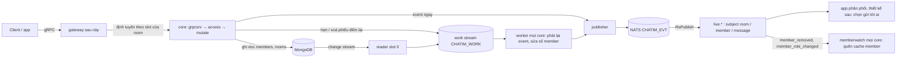
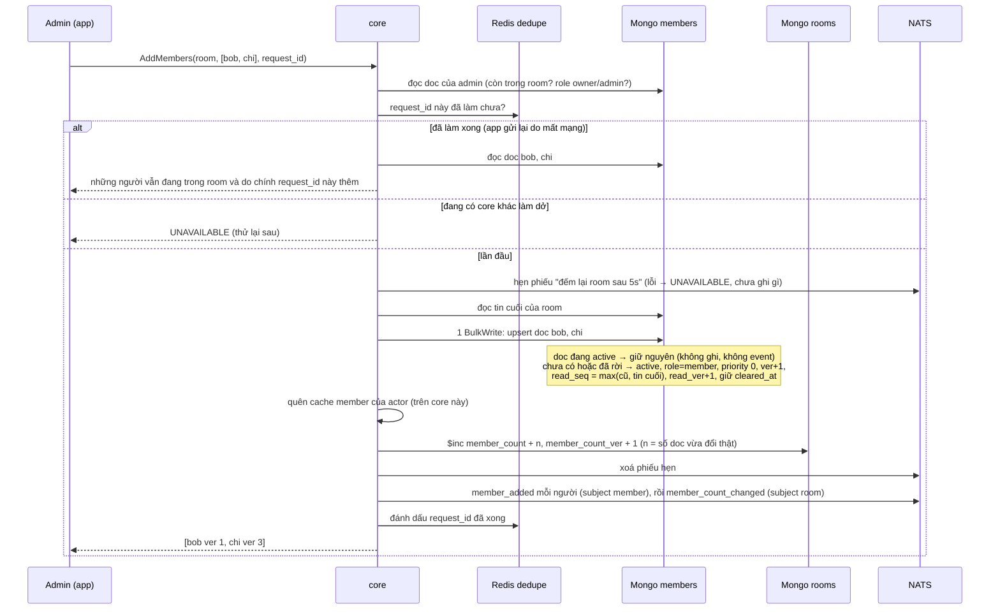
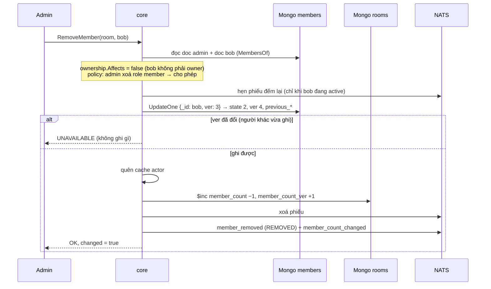
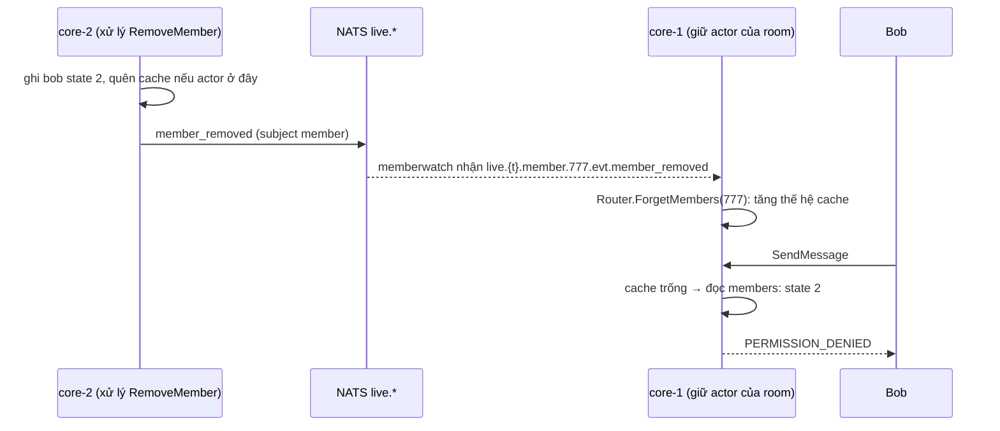
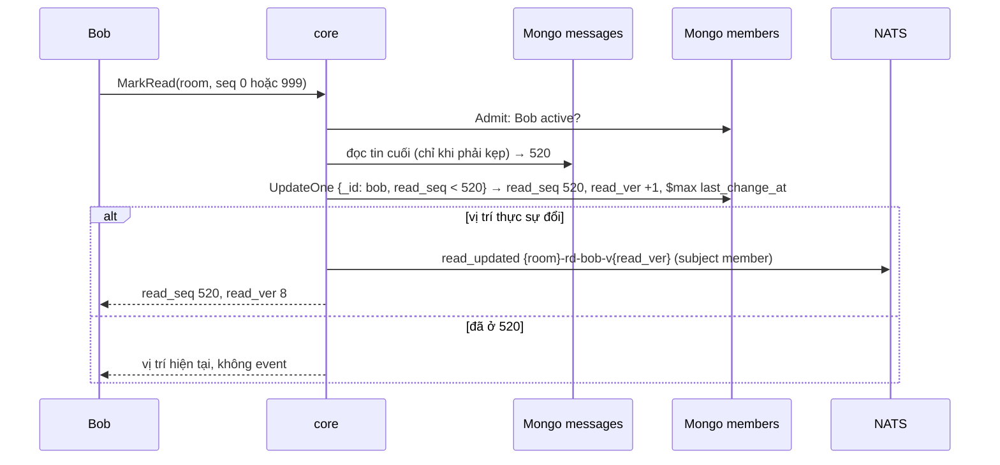

# M2b.4 — Member + vị trí đọc: tóm tắt kỹ thuật

> Trạng thái: **đã xây, `dev-done`** (thực thi xong 2026-10-08 trên nhánh chung `feat/m2b`), đã merge `main` qua **PR #12 ngày 2026-10-08**. Bản này là tài liệu lưu trữ: mô tả cái owner đã duyệt và cái đã thực sự xây, kể cả chỗ lệch so với plan (mục 13). Plan execute gốc cho AI nằm ở `.claude/plans/2026-10-06-m2b4-members-read.md` (local, không trong `docs/`). Quyết định D96–D111 nằm trong Decision Log của [thiết kế](../designs/261005-chatim-architecture.md) §17.2; thiết kế là nguồn sự thật hiện hành.
>
> Lưu ý lịch sử: bản plan M2b.4 đầu tiên (nhật ký member đánh số liên tục `mv`, `pending_owner_change`, `owner_guard`, `readcast`) đã **huỷ hoàn toàn**, chưa từng thực thi. Số quyết định D96–D110 được dùng lại cho thiết kế này với nghĩa khác.
>
> Đường dẫn package trong bản này theo bố cục hiện tại `apps/core/internal/<nhóm>/<package>` (thiết kế §13). Bố cục này có **sau M2b.4** (refactor 2026-10-08, trước M2c); lúc thực thi, code nằm ở `apps/core/internal/<package>` và wiring ở `apps/core/*.go` (nay ở `apps/core/internal/app`).

## 1. Thuật ngữ

| Từ | Nghĩa |
|---|---|
| CAS (ghi có điều kiện) | Ghi chỉ khi một giá trị vẫn như lúc mình đọc, ví dụ "chỉ ghi nếu `ver` của Bob vẫn là 3". Hai bên ghi cùng lúc thì chỉ một bên thắng; bên thua nhận lỗi `UNAVAILABLE` và app gọi lại |
| transaction | Gói nhiều lần ghi thành một khối: hoặc xong hết, hoặc không có gì được ghi. Chỉ dùng cho lệnh đổi owner |
| tombstone | Doc không bị xoá mà chỉ đánh dấu "đã rời" (`state = 2`), để giữ lịch sử và các bộ đếm |
| lớp tập (set class) | Lớp dữ liệu trong thiết kế §4: mỗi phần tử (ở đây mỗi (room, user)) là một doc riêng có `ver` riêng; không có số thứ tự chung cho cả room |
| nhật ký thay đổi (change stream / oplog) | Mongo tự ghi mọi thay đổi vào một nhật ký nằm trong chính Mongo; core chết cũng không mất |
| phiếu việc / hàng đợi việc (work stream) | Mỗi thay đổi được chép thành một "phiếu việc" ngắn (`work.Record`), bỏ vào hàng đợi `CHATIM_WORK` trên NATS (có từ M2b.1) |
| worker / Nak | Phần chạy nền ở mọi core, lấy phiếu ra làm; làm chưa được thì trả phiếu lại (Nak) để làm lại sau |
| phiếu hẹn sinh tồn | Message hẹn giờ của NATS đặt **trước** một cặp ghi không nguyên khối, xoá **sau** khi cả hai xong; nếu không bị xoá thì tự bật và sửa (thiết kế §7.1, D111) |
| subject | "Địa chỉ" của một event trên NATS, ví dụ `evt.acme.member.777.member_added`. Ai cần thì đăng ký nghe theo địa chỉ |
| RePublish | Luật của NATS chép event từ stream lưu trữ `CHATIM_EVT` sang subject `live.*` để app khác nghe |
| `$inc` | Lệnh Mongo cộng/trừ thẳng một số trên doc, ví dụ `member_count + 2` |
| fast path | Đường xử lý ngay trong lệnh gRPC (ghi rồi phát event), trước khi trả lời |
| P8 | Nguyên tắc trong thiết kế: kết nối lại thì lấy trạng thái mới nhất, không phát lại event cũ |

## 2. Bức tranh chung

M2b.4 gồm hai phần:
1. **Đổi tên field** của mọi collection đã làm (trừ `messages`) sang tiếng Anh đầy đủ, đổi tên field proto `version` → `ver`, đổi mốc "xoá lịch sử phía tôi" sang thời gian, và đổi `message_edits` sang "mỗi dòng một phiên bản nội dung".
2. **Thành viên và vị trí đọc** theo nguyên tắc **không đánh số liên tục**: mỗi (room, user) là một doc riêng, có bộ đếm riêng. Thêm hay xoá **những người khác nhau** trong cùng room chạy song song, không tranh nhau.



- Lệnh của client tới core giữ slot của room. Core kiểm quyền, ghi doc, cộng/trừ số member, phát event rồi trả lời ngay.
- **Core chỉ bảo đảm mọi event được phát; không chọn người nhận.** Mỗi event đi một subject theo loại dữ liệu (`room`, `member`, `message`, mục 6). Chuyển tới user nào, bao nhiêu user, bao nhiêu room, thông báo đẩy… là việc của một app phân phối thiết kế sau (owner chốt 2026-10-07).
- **Việc chạy nền diễn ra thế nào** (engine M2b.1). Ví dụ admin thêm Bob vào room 777:
  1. Core ghi doc member của Bob, cộng `member_count` của room, phát event `member_added` và `member_count_changed`, rồi **trả lời admin ngay**.
  2. Mongo tự ghi vào nhật ký thay đổi: "doc member (room 777, Bob) vừa đổi, `ver` 1".
  3. Một core (core giữ slot 0, gọi là reader) đọc nhật ký và chép mỗi thay đổi thành **phiếu việc** "room 777, Bob, ver 1" (`MemberChanged`, id `g:777-mb-bob-v1`), bỏ vào hàng đợi việc trên NATS.
  4. Hàng đợi chia 32 ngăn **theo room**: phiếu của room 777 luôn vào cùng một ngăn, và mỗi ngăn chỉ một core xử lý.
  5. Worker của core đó lấy một lô phiếu, đợi khoảng 5 giây (`RECONCILE_DELAY`), đọc trạng thái hiện tại và **phát lại** event (NATS bỏ bản trùng theo id nếu bước 1 đã phát được), xong thì xoá phiếu. Lỗi thì trả phiếu lại để làm sau.
- **Vì sao tách ra như vậy:** lệnh trả lời nhanh; event ở bước 1 có thể rớt (NATS chậm, core chết ngay sau khi ghi), phiếu việc vẫn còn trong hàng đợi nên event luôn được phát lại.

**Package đã xây** (đường dẫn hiện tại):

| Package | Vai trò trong M2b.4 |
|---|---|
| `proto/chatim/v1` | đổi tên `version`→`ver`; message member/đọc ở `members.proto` mới, 7 RPC khai trên service ở `core.proto` |
| `pkg/keys` | `Member(room, user)` / `ParseMember` |
| `pkg/lru` (mới) | LRU dùng chung, chuyển từ actor |
| `internal/model/domain` | `RoleAdmin`, `MemberState`, `Join`, `MemberCount`, `ReadPosition`, `EditOriginal`, lỗi member |
| `internal/model/access` | 6 action member/đọc, `Request.Target`/`Role`, `DefaultPolicy` |
| `internal/model/pbconv` | id và envelope event member, số member, đọc, ẩn, xoá lịch sử |
| `internal/store` (+ `memstore`, `mongostore`, `storetest`) | port `MemberWriter`, `MemberReader`, `OwnerChanges`, `MemberCounts`, `ReadPositions`; `members` clustered, transaction owner; feed kind 6–9; hợp đồng `RunMembers`, `RunMemberFeed` |
| `internal/change/mutate` | 5 lệnh member, `MarkRead`/`MarkUnread`, event ẩn/xoá lịch sử, `$inc` + phiếu hẹn |
| `internal/change/ownership` (mới) | luật owner thuần: `Affects`, `Plan`, `Successor` |
| `internal/send/actor` | cache member theo thế hệ + TTL 10s, `Router.ForgetMembers` |
| `internal/send/dedupe` | `Requests` trên namespace `chatim:req:` |
| `internal/send/memberwatch` (mới) | mọi core nghe event member, quên cache |
| `internal/event/publish` | subject theo loại dữ liệu, RePublish `evt.*.*.*.*` |
| `internal/event/work` | record kind 6–10, `work.Timers` (phiếu hẹn) |
| `internal/event/effects` | 6 effect mới (mục 6) |
| `internal/event/resync` + `internal/app` | resync quét `members`, `hidden`; subcommand `/app recount` |
| `internal/api/grpcsrv` | 7 RPC, `CreateRoom` phát event member + số member |
| `internal/config` | `MEMBER_BATCH_MAX`, `MEMBER_COUNT_CHECK_DELAY` |
| `tools/internal/route`, `tools/corecli`, `scripts/e2e.sh` | lệnh member/đọc, e2e phase 5 |

## 3. Dữ liệu và tên field

### 3.1 Đổi tên các collection đã có

| Collection | Tên cũ → tên mới |
|---|---|
| `rooms` | `t`→`tenant`, `ty`→`type`, `n`→`name`, `cb`→`created_by`, `ca`→`created_at`, `mc`→`member_count`, `ls`→`last_seq`, `lm`→`last_message_at`, `lc`→`last_change_at`, `ab`→`activity_bucket`, `pv`→`pin_ver`; phần tử `pins` thành `{thread_root, seq, pinned_by, pinned_at, pin_ver}` |
| `members` | `r`→`room_id`, `u`→`user_id`, `t`→`tenant`, `ro`→`role`, `ja`→`joined_at`, `cb` (seq) → `cleared_at` (thời gian) |
| `message_edits` | `r`→`room_id`, `t`→`tenant`, `k`→`kind`, `by`→`created_by`, `x`→`text`, `ts`→`created_at`; **bỏ** `p` (xem 3.4) |
| `hidden` | `u`→`user_id`, `r`→`room_id`, `th`→`thread_root`, `s`→`seq`; **thêm** `created_at` (lúc ẩn, để resync tìm lại được) |
| `reactions` | `k`→`message_key`, `r`→`room_id`, `t`→`tenant`, `u`→`user_id`, `e`→`emoji`, `pe`→`previous_emoji`, `n`→`ver`, `ts`→`updated_at` |
| `pin_actions` | `r`→`room_id`, `t`→`tenant`, `op`→`action`, `th`→`thread_root`, `s`→`seq`, `by`→`created_by`, `ts`→`created_at` |
| `reconciler_state` | `token`→`resume_token`, `at`→`cluster_time`; bỏ doc vị trí feed cũ `_id: "messages"` |

Index đổi theo tên mới; thêm `hidden {room_id, created_at}` cho resync. Tên Go (struct, field) không đổi, trừ `Member.ClearedBeforeSeq` → `ClearedAt` và bỏ `Edit.Prev`. Giá trị `_id` và mọi id event/record không đổi.

`messages` giữ tên ngắn (owner chốt). Bảng tra:

| Tên ngắn | Nghĩa |
|---|---|
| `t` | tenant |
| `f` | người gửi |
| `k` | loại tin |
| `x` | text |
| `c` | cid |
| `ts` | lúc gửi (created_at) |
| `v` | version sửa |
| `d` | đã xoá |
| `ea` | lúc sửa cuối |
| `rx` | số reaction |

**Proto** (giữ số field nên wire tương thích; tên JSON và getter Go đổi): `version` → `ver`, `base_version` → `base_ver`, `after_version` → `after_ver`, `pin_version` → `pin_ver`. `ClearHistoryRequest.up_to_seq` thành `reserved`; `ClearHistoryResponse` trả `cleared_at`. Tên Go nội bộ (`domain.Message.Version`, `mutate.EditCmd.BaseVersion`) giữ nguyên.

### 3.2 Doc `members` mới: mỗi (room, user) một doc

Collection clustered, `_id` = `keys.Member(room, user)`: room id (8 byte) ghép user id (1..64 byte), giống reaction. Nhờ vậy change stream biết ngay doc thuộc room nào, user nào. Mongo so BinData theo độ dài trước, nên **không bao giờ quét khoảng `_id`** của `members`: tra theo room qua index `room_id`, theo user bằng `_id` bằng nhau hoặc `$in`.

| Field | Nghĩa | Ví dụ |
|---|---|---|
| `room_id`, `tenant`, `user_id` | Room, tenant, user | 777, acme, bob |
| `role` | owner / admin / member | member |
| `state` | 1 = đang trong room, 2 = đã rời hoặc bị xoá. Luôn ghi rõ; doc không bao giờ bị xoá (tombstone) | 1 |
| `priority` | Ưu tiên của người này trong room, do app đặt (`SetMemberPriority`, chỉ owner gọi). Số lớn hơn được chọn làm owner kế nhiệm trước. Mặc định 0; vào lại thì về 0 | 5 |
| `joined_at` | Lúc vào (hoặc vào lại) gần nhất; dùng để chọn người kế nhiệm owner khi `priority` bằng nhau | 2026-10-07 09:00 |
| `ver` | Số lần trạng thái thành viên của người này đổi (vào, rời, vào lại, đổi role, đổi ưu tiên). Chỉ tăng, có lỗ không sao, ≤ MaxUint32 | vào = 1, bị xoá = 2, thêm lại = 3 |
| `previous_role`, `previous_state`, `previous_priority` | Trạng thái ngay trước lần đổi cuối, để event biết đây là "vào", "rời", "đổi role" hay "đổi ưu tiên" | member, 1, 0 |
| `request_id` | Lệnh đã gây ra lần đổi cuối; dùng chống gửi lại và gộp tin hệ thống "A thêm X và 499 người khác". Tạo room ghi `{room}-created` | `req-7f3a…` |
| `updated_at`, `updated_by` | Lúc nào, ai làm lần đổi thành viên cuối | 09:00, alice |
| `last_change_at` | Lúc doc đổi lần cuối vì bất kỳ lý do gì (thành viên, đọc tin, xoá lịch sử); ghi bằng `$max` nên không bao giờ lùi. Chỉ dùng cho `/app resync` tìm thay đổi trong khoảng bị mất | 10:05 |
| `cleared_at` | Mốc "xoá lịch sử phía tôi": tin gửi trước hoặc đúng mốc này bị ẩn với riêng người này | 2026-10-07 10:05:03.120 |
| `read_seq` | Đã đọc tới tin số mấy | 500 |
| `read_ver` | Số lần vị trí đọc đổi, để hai thiết bị biết bản nào mới hơn | 12 |

`state`, `priority`, `ver`, `read_seq`, `read_ver` luôn được ghi. Số nguyên lưu dạng int64; đọc ra số âm hoặc vượt kiểu Go → coi là doc hỏng; ghi giá trị vượt (room id > MaxInt64, `ver` > MaxUint32) → `INVALID_ARGUMENT`.

Index:
- `{room_id, state, role, priority giảm dần, joined_at, user_id}`: dùng chung cho đếm số member đang ở room, tìm owner và chọn người kế nhiệm (một lần đọc index, kể cả channel 200K).
- `{tenant, user_id, state, room_id}`: "các room user đang ở", chuẩn bị cho M3 và gateway.

### 3.3 Field mới trên `rooms`

| Field | Nghĩa | Ví dụ |
|---|---|---|
| `member_count` | Số member đang ở room (đã có từ trước, tên cũ `mc`). Cộng/trừ ngay trong lệnh thêm/xoá/rời bằng `$inc` (mục 4.7) | 5000 |
| `member_count_ver` | Tăng 1 mỗi lần `member_count` đổi (1 lúc tạo room); dùng làm id event `member_count_changed`, client giữ số có `ver` lớn hơn | 37 |
| `owners_ver` | Số lần danh sách owner đổi. Mỗi lệnh đổi owner tăng nó trong transaction, để hai lệnh đổi owner chạy cùng lúc va nhau và chỉ một lệnh thắng (mục 5) | 4 |

Cập nhật `member_count` và `owners_ver` trên `rooms` **không** vào feed (feed không xem update của `rooms`).

### 3.4 Ghi chú cho một số field

- **Danh sách room của user là một phần của `members`.** Không có collection `user_rooms` riêng: câu "Bob đang ở những room nào" tra bằng index thứ hai `{tenant, user_id, state, room_id}` trên chính `members`. Mỗi lần ghi doc member, Mongo cập nhật cả hai index trong cùng một lần ghi, nên hai cách tra không bao giờ lệch nhau. Chỉ khi shard Mongo (member chia theo room) mới cân nhắc tách một bản xếp theo user.
- **`activity_bucket` (`rooms`)**: giờ cuối cùng room có thay đổi, làm tròn xuống theo giờ. Ví dụ tin lúc 09:42 → "09:00"; tin lúc 09:58 không đổi; tin lúc 10:03 → "10:00". Chỉ dùng cho `/app resync` tìm room có hoạt động trong khoảng bị mất. Không đánh index thẳng trên `last_change_at` vì field đó đổi theo từng tin; `activity_bucket` đổi tối đa 1 lần mỗi giờ mỗi room.
- **`read_seq` (`members`)**: vị trí đọc, tức đã đọc tới tin số mấy. Ví dụ room có 520 tin, Bob đọc tới tin 500 → `read_seq` = 500, chưa đọc là tin 501–520 (đếm unread để M3). Dùng số tin, không dùng thời gian, vì phải khớp chính xác thứ tự tin mọi người cùng thấy.
- **`message_edits`: mỗi dòng là một phiên bản nội dung của tin**, theo thứ tự `ver`, chỉ có field `text` (cùng `kind`, `created_by`, `created_at`).
  - Ví dụ: gửi "Họp 9h", sửa thành "Họp 10h", rồi "Họp 10h30" → dòng `ver 0` = "Họp 9h", dòng `ver 1` = "Họp 10h", dòng `ver 2` = "Họp 10h30"; `messages` giữ bản hiện tại "Họp 10h30".
  - Dòng `ver 0` được ghi ở lần **sửa** đầu tiên, ghi "nếu chưa có" nên chạy lại hay chạy song song vẫn đúng. Tin chưa từng sửa thì không có dòng nào. Xoá một tin chưa từng sửa thì không ghi dòng `ver 0` (text sẽ bị xoá ngay, ghi ra là thừa).
  - Kiểu của dòng `ver 0` là `original`; người tạo và thời gian là người gửi và lúc gửi. `GetEditHistory` chỉ đưa dòng này lên đầu ở trang đầu.
  - `GetEditHistory` trả các dòng theo `ver`. Xoá tin cho mọi người thì xoá `text` của mọi dòng (D75).
  - Bỏ field cũ `previous_text`; worker `edit_projection`, `msg_changed` bỏ qua dòng `ver 0` vì nó không phải một lần sửa (không phát event, không cập nhật `messages`); store chặn chiếu dòng `original` lên `messages`.

### 3.5 Config, khoá Redis, metric mới

| Tên | Nghĩa | Ví dụ / mặc định |
|---|---|---|
| `MEMBER_BATCH_MAX` | Số người tối đa mỗi lệnh `CreateRoom` hoặc `AddMembers`, đếm sau khi bỏ trùng; hợp lệ 2..1000 | 500 |
| `MEMBER_COUNT_CHECK_DELAY` | Hạn phiếu hẹn đếm lại số member; phải lớn hơn `CORE_REQUEST_DEADLINE`; bật trong `[delay, delay + 1s]` | 5s |
| `chatim:req:{room}:{user}:{request_id}` (Redis dedupe) | Khoá chống gửi lại `AddMembers`, cùng Lua và batcher với cid, TTL `CID_COMMITTED_TTL` | `chatim:req:777:alice:req-7f3a` |
| `work.timer.{room}.{op}` (subject `CHATIM_WORK`) | Phiếu hẹn đếm lại, target `work.p{slot % 32}`; `op` là số ngẫu nhiên 32 bit mỗi lần hẹn | `work.timer.777.2841937465` |
| `counter_repaired_total{counter="members"}` | Số lần worker sửa `member_count` | alert `ChatimCounterRepairSurge` có sẵn |
| `effect_dropped_total{effect}`, `reconcile_republished_total{effect}` | Nhãn mới `member_event`, `member_count_event`, `read_event`, `hidden_event`, `history_cleared_event`, `member_count_repair` | — |
| `member_cache_forgets_total`, `member_watch_malformed_total` | `memberwatch`: số lần quên cache, số event có subject lạ | không alert |

Không có luật alert mới: tổng vẫn 16 luật. Không có metric owner (transaction không để lại trạng thái dở).

## 4. Luồng xử lý

Mọi lệnh member và đọc chạy trong `mutate` (không qua actor), gọi từ `grpcsrv`; client định tuyến theo slot của room. Thứ tự chung: `Admit` (tenant + người gọi còn active) → đọc doc cần thiết → policy → ghi → quên cache → event → trả lời.

**Bảng mã lỗi chung** (D101):

| Trường hợp | gRPC |
|---|---|
| `request_id` thiếu/sai, danh sách rỗng, user sai, xoá chính mình, role sai, `MarkUnread(0)`, quá `MEMBER_BATCH_MAX` | `INVALID_ARGUMENT` |
| Room là DM; owner cuối tự hạ | `FAILED_PRECONDITION` |
| Người gọi không active; policy từ chối; người chưa từng là member gọi rời | `PERMISSION_DENIED` |
| Xoá người chưa từng là member (sau khi policy cho); đổi role/priority người không active | `NOT_FOUND` |
| CAS trượt, transaction va chạm, request đang chạy ở core khác, hẹn phiếu lỗi | `UNAVAILABLE` |
| Xoá tombstone, người đã rời gọi rời, đặt đúng role/priority đang có | `OK`, `changed = false` |

### 4.1 Thêm người (`AddMembers`)



1. **Kiểm đầu vào:**
   - `request_id` bắt buộc.
   - User id hợp lệ; trùng thì **tự gộp** (giới hạn đếm sau khi gộp).
   - Danh sách rỗng hoặc vượt `MEMBER_BATCH_MAX` (mặc định 500) → `INVALID_ARGUMENT`.
   - Room là DM → `FAILED_PRECONDITION`.
   - Người gọi không phải owner/admin đang trong room → `PERMISSION_DENIED`.
2. **Chống gửi lại bằng `request_id`:** dùng lại cơ chế chống trùng `cid` của tin nhắn (RAM của core, rồi Redis dedupe), giữ `CID_COMMITTED_TTL` (mặc định 15 phút).
   - Gửi lại cùng `request_id` thì trả lại kết quả, không ghi lại. Vì vậy lần gửi lại muộn **thường** không thể thêm lại người vừa bị xoá.
   - **Chỉ trong 15 phút:** sau `CID_COMMITTED_TTL`, gửi lại cùng `request_id` được coi là lệnh mới và **có thể thêm lại** người đã bị xoá. App không nên tự gửi lại một lệnh thêm người đã quá vài phút.
   - **Giới hạn:** Redis dedupe không lưu xuống đĩa, và tự xoá khoá cũ khi đầy bộ nhớ. Nếu Redis lỗi hoặc khoá bị xoá sớm, chỉ còn RAM của từng core chống trùng. Khi đó lần gửi lại tới **core khác** vẫn có thể thêm lại người đó (giống giới hạn của tin nhắn, CD2).
   - **`request_id` phải mới cho mỗi lệnh.** Dùng lại một `request_id` với danh sách người khác thì lệnh không thêm ai mà vẫn báo thành công.
   - Ghi thất bại thì khoá `request_id` được nhả để app gọi lại được; phiếu hẹn để nguyên (bật thì đếm lại, vô hại).
3. **Ghi:** một lệnh `BulkWrite` cho k người, mỗi người một upsert lọc đúng `_id`.
   - Thêm những người khác nhau không bao giờ tranh nhau.
   - Hai lệnh cùng thêm Bob: khoá `_id` bảo đảm chỉ một lần ghi đổi doc; lần kia thấy Bob đã active nên không làm gì.
4. **Người vào lại** luôn có role `member`, không lấy lại role cũ. Vị trí đọc không bao giờ lùi.
5. **Số member** cộng ngay trong lệnh bằng `$inc`, theo số người thực sự vào (mục 4.7).
6. **Lỗi khi phát event** ở bước này được bỏ qua (lệnh vẫn thành công); worker phát bù sau.
7. Event `member_added` mang cả vị trí đọc mới (`read_seq`, `read_ver`), vì vào room đặt vị trí đọc = tin cuối.

### 4.2 Xoá người, rời room, đổi role giữa member và admin (đường thường, không đụng owner)



- Một lệnh update trên đúng doc của người đó, có điều kiện "`ver` vẫn như lúc tôi đọc". Đổi `state` (xoá hoặc rời) hoặc `role`, rồi `ver+1`.
- Trượt nghĩa là có người vừa đổi doc này: trả `UNAVAILABLE` **ngay**, không tự thử lại; app gọi lại thì lệnh đọc lại và kiểm lại quyền từ đầu (owner chốt 2026-10-07: không có vòng thử lại bên trong core).
- Không đụng doc người khác. Xoá/rời một người đang ở room thì trừ `member_count` 1 bằng `$inc` (mục 4.7); đổi role không đổi số, không hẹn phiếu.
- **Quyền mặc định** (owner chốt 2026-10-06):
  - owner làm mọi việc;
  - admin chỉ **thêm người** và **xoá người có role member**; admin không xoá được admin hay owner;
  - **chỉ owner đổi role** và **đặt ưu tiên** (`SetMemberPriority`);
  - ai cũng tự rời được.
- **Quyền được hỏi trước khi trả lời về người đích**, với role giả `member` khi đích không có doc hoặc đã rời, nên member thường không dò được ai từng ở room.

| Trường hợp | Kết quả |
|---|---|
| Xoá chính mình | `INVALID_ARGUMENT` (muốn rời dùng `LeaveRoom`) |
| Owner/admin xoá người chưa từng là member | `NOT_FOUND` |
| Xoá người đã rời (kể cả người từng là admin) | Thành công, không đổi gì. Quyền được kiểm như thể họ là member thường, nên admin không bị từ chối và không dò được role cũ |
| Đổi role người đã rời hoặc chưa từng là member | `NOT_FOUND` |
| Người chưa từng là member gọi rời | `PERMISSION_DENIED` (không cho dò room) |
| Người đã rời gọi rời lần nữa | Thành công, không đổi gì |

### 4.3 Lệnh đụng owner: owner rời, xoá owner, hạ owner, nâng ai lên owner

Lệnh này phải ghi nhiều doc cùng lúc (nâng người kế nhiệm, hạ hoặc cho người cũ rời), nên dùng **transaction của Mongo**: hoặc xong hết, hoặc không có gì được ghi. Đây là **ngoại lệ duy nhất** của quy tắc "không dùng transaction nhiều doc" (thiết kế §5.1), chấp nhận vì lệnh này rất hiếm (owner chốt 2026-10-07). `ownership.Affects` quyết định lệnh nào đi đường này: người đích đang active với role owner, hoặc lệnh nâng ai đó lên owner.

```mermaid
sequenceDiagram
  participant An as An (owner)
  participant C as core
  participant DB as Mongo (một transaction)
  An->>C: LeaveRoom
  C->>DB: BẮT ĐẦU transaction (StartTransaction)
  C->>DB: đọc rooms.owners_ver, doc An, tối đa 2 owner active,<br/>admin active đứng đầu và member active đứng đầu theo index
  Note over C: ownership.Plan (hàm thuần): An là owner cuối → chọn kế nhiệm:<br/>admin trước member; cùng role thì priority cao nhất;<br/>bằng nhau thì vào sớm nhất; rồi user id nhỏ nhất → Bình
  C->>DB: Bình: role = owner (CAS ver) — ghi kế nhiệm trước
  C->>DB: An: state = rời (CAS ver)
  C->>DB: rooms: owners_ver + 1, member_count − 1, member_count_ver + 1
  C->>DB: COMMIT (CommitTransaction)
  alt commit thành công
    C-->>An: đã rời, new_owner = Bình
  else va với lệnh owner khác (WriteConflict) hoặc CAS trượt
    C-->>An: UNAVAILABLE (không có gì được ghi; app gọi lại)
  end
```

- Transaction chạy **đúng một lần** (`StartTransaction`/`CommitTransaction`, không dùng `WithTransaction` có vòng tự thử lại của driver). Lỗi commit không rõ kết quả → `UNAVAILABLE`.
- **Không hẹn phiếu**: `$inc member_count` nằm trong chính transaction nên đã nguyên khối.
- **Owner cuối tự hạ role** → `FAILED_PRECONDITION`.
- **Người kế nhiệm** nhận event `member_role_changed` của chính họ; `member_removed` của người rời không mang `new_owner`. Phản hồi `LeaveRoom` vẫn trả `new_owner`.
- memstore (dùng cho unit test) cho cùng ngữ nghĩa: chụp view, quyết định, kiểm lại `owners_ver` và `ver` trước khi ghi.

Lý do đúng và các ca chạy đua ở mục 5.

### 4.4 Người bị xoá mất quyền ngay



- Mọi lệnh (gửi tin, đọc lịch sử, đọc tin, các lệnh member) kiểm quyền bằng doc `members`; `state = 2` thì `PERMISSION_DENIED` (`Rooms.Member` chỉ coi `state = 1` là member).
- **Riêng gửi tin có cache.** Cache này có từ M2a: actor của room (xử lý gửi tin) nhớ "Bob là member" trong RAM, để mỗi tin không phải đọc Mongo (10.000 tin/giây sẽ là 10.000 lần đọc/giây). Trước M2b.4 chưa có lệnh xoá nên nhớ mãi không sai; nay phải quên khi Bob bị xoá. Không cache "không phải member". Ba lớp:
  1. **Cùng core:** lệnh xoá chạy trên core giữ actor của room → `Router.ForgetMembers` quên ngay (tăng thế hệ cache; lần đọc đang dở bị bỏ).
  2. **Core khác** (room vừa chuyển core, hoặc app gọi nhầm core): `memberwatch` trên mọi core subscribe NATS core (không JetStream) `live.*.member.*.evt.member_removed` và `….member_role_changed`, lấy room id từ token thứ 4 của subject và quên cache của room đó, thường vài mili-giây (owner chốt 2026-10-07).
  3. **Chốt chặn:** event chậm hoặc mất thì mỗi mục cache tự hết hạn sau 10 giây.
- Đọc lịch sử và mọi lệnh khác không qua cache nên bị chặn ngay.

### 4.5 Đọc tin và đánh dấu chưa đọc



1. `MarkRead(seq)` chỉ nâng: ghi khi `read_seq < seq`, đặt `read_seq = seq` và `read_ver + 1`.
   - Seq lớn hơn tin cuối thật thì kẹp về tin cuối; seq 0 nghĩa là "đọc hết".
2. `MarkUnread(seq)` chỉ hạ: `read_seq = seq − 1`, `read_ver + 1`. Seq 0 → `INVALID_ARGUMENT`.
3. Chỉ member đang ở room được gọi (action `mark_read`). Lệnh dùng toán tử ghi thường (`$set`, `$inc`, `$max`), không pipeline/replace/upsert, **không bao giờ** đụng `ver` (nên không bị nhầm là đổi thành viên).
4. Đổi xong thì phát **một** event `read_updated` (mục 4.6).
5. SDK nên nâng `read_seq` khi user gửi tin, để tin của chính mình không tính là chưa đọc.

### 4.6 Event `read_updated`

- Khi một người đọc, core **chỉ** cập nhật dữ liệu của chính người đó (`read_seq`, `read_ver`), rồi phát **một** event `read_updated` mỗi lần vị trí đọc thực sự đổi, trên subject `member` (vị trí đọc nằm trên doc member), payload `{user, read_seq, read_ver}`.
- **Bảo đảm phát** (owner chốt 2026-10-07: mọi event đều phải được phát): update có `read_ver` mà không có `ver` vào nhật ký thay đổi thành phiếu việc `ReadChanged`; worker `read_event` đợi `RECONCILE_DELAY` rồi phát lại `read_updated` của vị trí **hiện tại** (NATS bỏ bản trùng).
  - Ví dụ: Bob đọc tới 500 (`read_ver` 7) rồi 520 (`read_ver` 8), event 7 rớt. Worker thấy doc đang ở `read_ver` 8 nên chỉ phát lại 8; số 7 đã cũ, không phát. Trạng thái cuối luôn tới.
- **Ai nhận** (điện thoại/laptop của Bob, người khác thấy "đã xem", bao nhiêu kênh) do app phân phối quyết định sau. Không có `READ_RECEIPT_*`, không có bước dừng mới.
- **Chi phí:** mỗi lần vị trí đọc đổi thêm một phiếu việc (mục 9). Cần số thật "lượt đánh dấu đọc mỗi giây" trước khi định cỡ hàng đợi việc.

### 4.7 Số member: cộng/trừ ngay trong lệnh (`$inc`) + phiếu hẹn sinh tồn

```mermaid
sequenceDiagram
  participant A as Admin
  participant C as core
  participant N as NATS CHATIM_WORK
  participant M as Mongo members
  participant RM as Mongo rooms
  participant WK as worker member_count_repair
  A->>C: AddMembers(room 777, [bob, chi, dan])
  C->>N: Arm: phiếu k:777-{op}, bật lúc now + 5s
  C->>M: BulkWrite 3 upsert
  M-->>C: 1 doc mới (bob) + 1 doc vào lại (chi); dan đã ở sẵn → n = 2
  C->>RM: $inc member_count +2, member_count_ver +1 → 5002, ver 38
  C->>N: Disarm: DeleteMsg theo seq của PubAck
  C->>C: phát member_count_changed {5002, ver 38}
  C-->>A: OK
  Note over C,WK: nếu $inc lỗi hoặc core chết trước Disarm:
  N-->>WK: phiếu bật sau 5–6s
  WK->>M: đếm doc state 1 của room trên index
  alt bằng số đang lưu
    WK->>N: chỉ phát lại member_count_changed hiện tại
  else khác
    WK->>N: hẹn phiếu mới TRƯỚC
    WK->>RM: ghi số đúng, CAS member_count_ver (trượt → Nak)
    WK->>N: member_count_changed, counter_repaired_total{counter="members"} +1
  end
```

- **`n` là số doc thực sự đổi trạng thái** trong lần ghi đó, Mongo trả sẵn (`UpsertedCount + ModifiedCount`):
  - thêm Bob, Chi, Dan mà Dan đã ở sẵn → `n = 2`;
  - app gửi lại đúng lệnh đó → cả ba đã ở, `n = 0`, không cộng (không đếm trùng);
  - xoá/rời một người đang ở → `−1`; xoá người đã rời → không trừ; đổi role → không đổi.
- **Không transaction** (owner chốt 2026-10-07): lệnh thêm/xoá của nhiều người trong cùng room vẫn chạy song song; `$inc` trên doc room không bao giờ báo lỗi va chạm. Riêng lệnh owner thì `$inc` nằm trong transaction sẵn có.
- **Khe hở:** ghi member xong nhưng `$inc` lỗi (Mongo lỗi mạng, core chết đúng giữa hai lần ghi) → số sẽ **lệch** mãi nếu không có gì sửa, vì gửi lại lệnh thì `n = 0`.
- **Phiếu hẹn sinh tồn** (owner chốt 2026-10-07; nay là cơ chế chung của chatim, thiết kế §7.1, D111):
  1. **Trước** khi ghi member, core hẹn một phiếu "đếm lại room 777" (record `MemberCountCheck`, kind 10, id `k:{room}-{op}`, `op` ngẫu nhiên) tự bật sau 5 giây (`MEMBER_COUNT_CHECK_DELAY`). Phiếu là message hẹn giờ của NATS (`WithScheduleAt`, có từ NATS 2.12, ta chạy 2.15), lưu trên JetStream nên core chết vẫn còn. Hẹn lỗi → `UNAVAILABLE`, chưa ghi gì.
  2. Ghi member → `$inc` số member → **xoá phiếu** (`DeleteMsg` theo seq của PubAck; phiếu đã bật thì `ErrMsgNotFound`, không cảnh báo).
  3. Lỗi hoặc core chết ở bước 2 → phiếu bật; worker `member_count_repair` đếm doc đang ở room trên index (group 5K khoảng 1ms, channel 200K khoảng 20–60ms, ước tính, chưa đo), so với số đang lưu.
  4. Số đúng → chỉ phát lại `member_count_changed`, không ghi, không hẹn — nên không lặp. Số sai → **hẹn một phiếu mới trước**, rồi ghi có điều kiện `member_count_ver` (trượt → Nak). Nếu đúng lúc đếm có lệnh khác vừa ghi member mà chưa `$inc`, phiếu mới bật khi lệnh đó chắc chắn đã xong và sửa nốt. Không đọc lại sau khi ghi (đọc lại không bắt được `$inc` tới muộn hơn lần đọc; sửa sau review, mục 13).
  - **Vì sao 5 giây, không phải 1 giây:** mỗi lệnh có hạn `CORE_REQUEST_DEADLINE` 3 giây. Nếu phiếu bật lúc lệnh còn chạy (ví dụ Mongo chậm 1,5s) thì lần đếm tính cả Bob, rồi `$inc` của lệnh cộng thêm lần nữa → chính lần sửa gây lệch. Giờ bật làm tròn lên giây, nên phiếu bật trong `[5s, 6s]`.
  - `$inc` chạy trên context dọn dẹp riêng (hạn 2s, tạo **sau** khi ghi member) để client huỷ không bỏ dở. Lệnh vẫn trả **thành công** khi `$inc` lỗi (member đã vào); phiếu lo phần còn lại.
  - Lần sửa nào cũng đếm vào `counter_repaired_total{counter="members"}` (alert `ChatimCounterRepairSurge` có sẵn). Không cần alert mới, không cần người chạy tay.
  - `/app recount -room 777 [-dry-run]` cho vận hành tay: in `room=… stored=… counted=…`; không `-dry-run` thì CAS `member_count_ver` (trượt → báo lỗi, chạy lại) và phát `member_count_changed`.
- **Event `member_count_changed`:** phát ngay trong lệnh; nếu rớt, worker `member_count_event` (chạy theo phiếu việc `MemberChanged` của doc member, một `Rooms.Get` mỗi room mỗi lô) phát lại số **hiện tại** của room.

### 4.8 Tạo room (`CreateRoom`)

- Ghi doc room, rồi doc từng member ban đầu (`ver = 1`, `request_id = {room}-created`).
- Giới hạn mỗi lệnh `MEMBER_BATCH_MAX` (mặc định 500). Bỏ giới hạn cứng 5000 member cũ; core không giới hạn tổng số member.
- Ghi `member_count` = số người lúc tạo, `member_count_ver` = 1.
- Phát ở đường nhanh `room_created` (subject `room`), `member_added` cho từng người (subject `member`) và `member_count_changed` `{room}-members-v1` (subject `room`); mọi thay đổi đều có event, kể cả lúc tạo. Worker cũng phát lại cùng id, stream bỏ bản trùng. Phần `member_count_changed` ở đường nhanh được thêm **sau** khi kết thúc plan (owner chốt 2026-10-08, mục 13), để worker không phải "cứu" event này cho mỗi room mới và `reconcile_republished_total{effect="member_count_event"}` không bị nhiễu.

### 4.9 Xoá lịch sử phía tôi (đổi sang thời gian)

- `ClearHistory`: `cleared_at = max(cũ, giờ server lúc nhận lệnh)` (mili-giây). Một `UpdateOne` lọc `cleared_at < mốc` hoặc chưa có, chỉ doc `state = 1`, rồi đọc lại. Chỉ member đang ở room được gọi.
- Mỗi lần mốc thực sự tăng phát event `history_cleared` (subject `member`, id `{room}-cl-{user}-{mốc ms}`). Update chỉ có `cleared_at` vào feed thành phiếu `HistoryCleared`; worker `history_cleared_event` phát lại mốc hiện tại nếu rớt (owner chốt 2026-10-07: ghi mọi event, app khác có thể cần làm log; trước M2b.4 lệnh này không có event).
- Khi đọc lịch sử, `view.HideForViewer` ẩn với riêng người đó tin có thời điểm gửi (`ts` trong `messages`) ≤ mốc, trên mọi timeline (kể cả thread sau này): không text, không reaction, giữ seq.
- Chấp nhận lệch vài mili-giây với tin gửi sát lúc bấm. Tin gửi **cùng mili-giây** với lúc bấm cũng bị ẩn. Người vào lại giữ `cleared_at`.
- **Thay đổi API (breaking):** bỏ tham số `up_to_seq` (đánh dấu `reserved`), nên app không còn chọn mốc theo số tin. Kết quả trả `cleared_at`. `corecli clear` bỏ cờ `-up-to`.

### 4.10 Ẩn tin phía tôi

- Như M2b.2: ghi một dòng `hidden` (user, room, thread, seq) bằng upsert, nay thêm `created_at` (`$setOnInsert`).
- Lần ẩn đầu phát `message_hidden` (subject `member`, id `{room}-hd-{user}-{thread}-{seq}`, envelope mang `thread_root`/`seq` của tin bị ẩn); ẩn lại không ghi gì, không event. Insert vào `hidden` vào feed thành phiếu `MessageHidden`; worker `hidden_event` phát lại nếu rớt.

### 4.11 Đặt ưu tiên member (`SetMemberPriority`)

- Chỉ owner gọi (action `set_member_priority`); DM → `FAILED_PRECONDITION`; đích không active → `NOT_FOUND`. Một lần ghi có điều kiện theo `ver` như đổi role (mục 4.2), `ver + 1`, phát `member_priority_changed`. Đặt đúng số đang có → thành công, không đổi gì.
- Dùng khi chọn owner kế nhiệm (mục 4.3): role > priority > vào sớm nhất > user id. Không có ưu tiên theo user (owner chốt 2026-10-07: không cần).

## 5. Cơ chế đúng đắn và các ca chạy đua

**Bất biến đã xây:**
1. **Group còn member active thì còn owner active** (MB1). Chỉ transaction owner được hạ owner hay cho owner rời; nó luôn ghi kế nhiệm trước đích và tăng `owners_ver`. Đường thường chỉ ghi doc đã kiểm không phải owner, CAS theo `ver` của đúng doc đó. Owner cuối rời khi không còn ai khác thì group rỗng, không owner.
2. Đọc, chưa đọc, xoá lịch sử chỉ dùng toán tử thường, không bao giờ đụng `ver`; nên feed phân biệt được `MemberChanged` (có `ver`), `ReadChanged` (có `read_ver`, không `ver`), `HistoryCleared` (chỉ `cleared_at`).
3. `ver`, `read_ver`, `member_count_ver`, `owners_ver` chỉ tăng; tombstone không bao giờ bị xoá, nên id event không bao giờ lặp.
4. Fast path không báo lỗi vì event: lỗi phát event hay quên cache sau khi ghi được bỏ qua; worker phát lại trạng thái hiện tại.
5. Mỗi thay đổi đúng một event, trên subject theo loại dữ liệu; core không chọn người nhận.
6. Không có vòng thử lại nào bên trong core; vòng gọi lại chỉ ở client (`tools/internal/route`, giữ nguyên `request_id`) và test.

**Các ca chạy đua:**

| Ca | Chuyện gì xảy ra | Vì sao đúng |
|---|---|---|
| Hai owner cuối (An, Bình) cùng rời | Mỗi transaction chỉ sửa doc người rời; nếu chỉ có vậy Mongo coi là không đụng nhau và cho cả hai qua, room mất owner (write skew) | Mỗi transaction đều `$inc rooms.owners_ver` — **một chỗ ghi chung, là chỗ duy nhất xếp hàng** của các lệnh owner trong một room. Mongo chỉ cho một transaction thắng; bên thua nhận `WriteConflict` (thường ngay lúc ghi, trước commit), không ghi gì, trả `UNAVAILABLE`. App gọi lại thì đọc thấy An đã rời, Bình là owner cuối, nên chọn kế nhiệm (ví dụ Chi) trước khi cho Bình rời. Itest lặp 20 vòng |
| Hai owner xoá nhau cùng lúc | Như trên | Một transaction thắng, còn đúng một owner |
| Core chết giữa transaction owner | Transaction bị huỷ | Không có trạng thái nửa vời, không cần phiếu ghi nhớ hay việc chạy nền làm nốt |
| Hai lệnh cùng thêm Bob | Cùng upsert trên một `_id` | Khoá `_id` bảo đảm chỉ một lần đổi doc; lần kia thấy Bob active, `n = 0`, không cộng trùng |
| Thêm Bob và xoá Chi cùng room | Hai doc khác nhau | Không tranh nhau; `$inc` trên doc room Mongo tự xếp hàng ở mức doc, không báo lỗi |
| Hai lệnh cùng đổi doc Bob (xoá và đổi role) | Cả hai CAS trên `ver` cũ | Một thắng; bên kia `UNAVAILABLE`, gọi lại thì đọc lại và kiểm quyền từ đầu |
| Kế nhiệm rời đúng lúc owner cuối rời | Kế nhiệm rời bằng đường thường, transaction ghi kế nhiệm bằng CAS `ver` | CAS trượt → transaction huỷ, `UNAVAILABLE` |
| `$inc` lỗi hoặc core chết sau khi ghi member | Số lệch | Phiếu hẹn chưa bị xoá, bật sau 5–6s, worker sửa |
| Worker đếm lại đúng lúc một lệnh khác vừa ghi member mà chưa `$inc` | Lần đếm thấy doc mới, ghi số "đúng", rồi `$inc` tới cộng thêm | Worker hẹn phiếu mới **trước** khi ghi; phiếu mới bật khi lệnh kia chắc chắn đã xong, đếm lại và sửa. Số đúng thì không hẹn nữa, không lặp |
| Phiếu bật khi lệnh đặt nó còn chạy | Lần đếm tính cả doc mới, `$inc` cộng thêm | Không xảy ra: delay 5s > hạn lệnh 3s (config kiểm lúc boot) |
| Gửi lại `AddMembers` khi lần đầu còn chạy ở core khác | Khoá `request_id` đang pending | `UNAVAILABLE`, gọi lại sau |
| Gửi lại `AddMembers` sau khi Bob đã bị xoá | — | Trả lại kết quả cũ (chỉ người vẫn active và do request này thêm), không thêm lại (trong 15 phút, khi Redis còn khoá) |
| Bob bị xoá trên core-2 khi actor ở core-1 | Cache core-1 còn "Bob là member" | `memberwatch` quên khi event tới (vài ms); event mất thì TTL 10s |
| Hai thiết bị cùng `MarkRead` | Ghi lọc `read_seq < seq` | Vị trí chỉ nâng; `read_ver` lớn hơn là bản mới hơn, client bỏ bản cũ |
| Bob vào (ver 1) rồi bị xoá (ver 2), event "vào" rớt | Worker chỉ phát trạng thái hiện tại | Chỉ "bị xoá" được phát lại; trạng thái cuối luôn đúng (như reaction M2b.3) |
| Admin bị hạ đúng lúc đang xoá một member thường | Lệnh xoá đã qua policy | **Khe đã biết**: lệnh vẫn ghi. Chỉ lệnh owner dùng transaction; lệnh thường giữ một lần ghi có điều kiện cho nhanh |
| Clear history khi tin gửi sát lúc bấm | `cleared_at` là giờ core xử lý lệnh, `ts` là giờ actor gửi tin (có thể core khác) | **Giới hạn đã biết**: lệch đồng hồ giữa hai core có thể để sót hoặc ẩn thừa tin sát lúc clear (cỡ vài ms) |

**Thứ tự:** không có thứ tự chung của các thay đổi member trong room, chỉ có thứ tự theo từng người (`ver`, `read_ver`). Mất kết nối lâu thì client tải lại (P8).

**Mongo phải chạy replica set** (transaction cần; dev rs0, prod giống). Sau này nếu shard, transaction owner có thể chạm hai shard (`members` và `rooms`); chấp nhận vì hiếm.

## 6. Event và subject

**Subject theo loại dữ liệu** (owner chốt 2026-10-07, D108): event của room đi subject room, của member đi subject member, của tin đi subject message. Cùng dạng 5 token `evt.{tenant}.{loại}.{room}.{kind}`, một luật RePublish `evt.*.*.*.*` → `live.{tenant}.{loại}.{room}.evt.{kind}`. Kind lạ không được phát.

| Subject | Event | Id (chống trùng) | Phát lại khi rớt (worker) |
|---|---|---|---|
| `evt.{t}.room.{rid}.…` | `room_created` | `{room}-created` | Có (`room_created`, đã có) |
| | `msg_pinned`, `msg_unpinned` (danh sách ghim nằm trên doc room) | `{room}-p{pin_ver}` | Có (`pin_event`, đã có) |
| | `member_count_changed` (số member là field của room) | `{room}-members-v{member_count_ver}` | Có, số hiện tại (`member_count_event`, `member_count_repair`) |
| `evt.{t}.member.{rid}.…` | `member_added` (kèm `read_seq`, `read_ver`), `member_removed` (`REMOVED` / `LEFT`), `member_role_changed`, `member_priority_changed` | `{room}-mb-{user}-v{ver}` | Có, trạng thái hiện tại của doc (`member_event`) |
| | `read_updated` | `{room}-rd-{user}-v{read_ver}` | Có, vị trí hiện tại (`read_event`) |
| | `message_hidden` | `{room}-hd-{user}-{thread}-{seq}` | Có (`hidden_event`) |
| | `history_cleared` | `{room}-cl-{user}-{cleared_at ms}` | Có, mốc hiện tại (`history_cleared_event`) |
| `evt.{t}.message.{rid}.…` | `msg_created`, `msg_edited`, `msg_deleted`, `reaction_changed`, `counts_changed` | như cũ | Có (đã có) |

**Phiếu việc mới** (feed → `CHATIM_WORK`, đuôi user trong record):

| Kind | Nguồn trong feed | Record id | Effect (theo thứ tự) |
|---|---|---|---|
| 6 `MemberChanged` | insert/replace `members`, update có `updatedFields.ver` | `g:{room}-mb-{user}-v{ver}` | `room_activity` (0) → `member_event` → `member_count_event` |
| 7 `ReadChanged` | update `members` có `read_ver`, không `ver` | `d:{room}-rd-{user}-v{read_ver}` | `read_event` |
| 8 `MessageHidden` | insert `hidden` | `h:{room}-hd-{user}-{thread}-{seq}` | `hidden_event` |
| 9 `HistoryCleared` | update `members` chỉ có `cleared_at` | `c:{room}-cl-{user}-{CommittedAt ms}` | `history_cleared_event` |
| 10 `MemberCountCheck` | chỉ từ phiếu hẹn, không từ feed | `k:{room}-{op}` | `member_count_repair` (0) |

Các effect phát lại đều đợi `RECONCILE_DELAY`, không ack mark; `room_activity` giữ `Seq` 0 cho mọi kind trừ tin mới. Doc hỏng hoặc room không có → bỏ, đếm `effect_dropped_total`.

- **Đổi subject của event đã có:** trước đây mọi event (kể cả tin) đi `evt.{t}.room.{rid}.…`; nay tin và reaction chuyển sang `message`. Chưa go-live nên không chạy song song hai kiểu. Luật RePublish đổi từ `evt.*.room.*.*` thành `evt.*.*.*.*`; NATS nhận đổi luật trên stream có sẵn (itest kiểm).
- **Muốn mọi event của room 777:** nghe `live.{t}.*.777.>`. Chỉ tin nhắn: `live.{t}.message.777.>`. Chỉ member: `live.{t}.member.777.>`.
- **Core không chọn người nhận.** Không có subject riêng theo user; payload member/đọc mang `user` để app phân phối (thiết kế sau) tự định tuyến.
- **Thứ tự:** hai event về cùng một người thì `ver` (hoặc `read_ver`) lớn hơn là mới hơn, client bỏ event cũ.
- **Event trung gian có thể mất hẳn:** worker chỉ phát lại event của trạng thái hiện tại (mục 5).
- **`new_owner`:** người kế nhiệm nhận event `member_role_changed` của chính họ, nên `member_removed` của người rời không mang `new_owner`.
- **Thêm 500 người sinh 501 event** (500 `member_added` + 1 số member). Tin hệ thống gộp nhờ `request_id`.

## 7. Thư viện và hạ tầng

- **MongoDB (mongo-driver v2):**
  - collection clustered theo `_id` (`members` chuyển sang clustered, tạo trong bootstrap);
  - `BulkWrite(ordered:false)` với upsert dạng pipeline `$cond`: doc đang active giữ nguyên byte, không sinh oplog;
  - `UpdateOne` có điều kiện (CAS theo `ver`) cho xoá, rời, đổi role, đặt ưu tiên;
  - `FindOneAndUpdate` với `$inc` cho số member (trả doc sau ghi); transaction owner cập nhật room cũng bằng một `FindOneAndUpdate`;
  - transaction một lần (`StartTransaction` / `CommitTransaction`, không `WithTransaction`) cho lệnh đổi owner;
  - đếm phủ index cho worker sửa số và `/app recount`;
  - change stream lọc `updateDescription.updatedFields.ver` (đổi thành viên), `read_ver` (đổi vị trí đọc), chỉ `cleared_at` (xoá lịch sử), cộng insert `hidden`.
- **Redis dedupe:** dùng lại script Lua và batcher chống trùng `cid` sẵn có, với namespace mới `chatim:req:{room}:{user}:{request_id}` (`dedupe.Requests`).
- **NATS JetStream (server 2.15, nats.go jetstream):**
  - `Nats-Msg-Id` chống trùng event (cửa sổ `EVT_STREAM_DUPLICATES` 5 phút);
  - RePublish ra `live.*` (một luật cho subject `room`, `member`, `message`);
  - message hẹn giờ (`WithScheduleAt`, `AllowMsgSchedules` trên `CHATIM_WORK`, bật qua `EnsureStream` cả trên stream cũ) cho phiếu hẹn sinh tồn; xoá phiếu bằng `DeleteMsg`; `work.Timers` dùng client JetStream của publisher;
  - mỗi core subscribe NATS core (không JetStream) `live.*.member.*.evt.member_removed|member_role_changed` để quên cache member; kết nối NATS core cũng là của publisher;
  - work stream `CHATIM_WORK` cho việc chạy nền.
- **Go:** `testing/synctest` và goleak cho thành phần có goroutine (cache actor, `memberwatch`). Package mới `change/ownership` (luật owner thuần, chạy trong transaction), `send/memberwatch`, `pkg/lru` (cache dùng chung, chuyển từ actor).
- **Vòng đời core:** khởi động thêm `memberwatch` sau workers và reader, trước gRPC (subscribe khi router đã chạy); dừng `memberwatch` sau workers, trước router (Unsubscribe tức thì, không thêm mốc). Kế hoạch dừng giữ 26.2s/28s.

## 8. Quyết định kỹ thuật và phương án đã loại

| # | Quyết định | Phương án bị loại | Lý do |
|---|---|---|---|
| D96 | Tên field đầy đủ, trừ `messages`; proto `version` → `ver` | Giữ tên ngắn; hoặc tên đầy đủ cả `messages` | Owner đọc được thiết kế. `messages` giữ ngắn vì trong RAM cache Mongo doc không nén, tên dài làm cache chứa ít tin hơn (theo phân tích lúc owner chọn; chưa đo) |
| D97 | Xoá lịch sử theo thời gian `cleared_at` | Theo số tin (`cleared_before_seq`) | Một mốc dùng cho mọi timeline kể cả thread; chấp nhận lệch vài ms |
| D98 | Mỗi (room, user) một doc, `ver` riêng, tombstone | Nhật ký thay đổi member đánh số liên tục cho cả room (plan cũ) | Số liên tục bắt mọi thay đổi trong room tranh một số, khoảng 100–200 lệnh/s mỗi room (ước tính của reviewer khi đánh giá plan cũ) |
| D99 | `AddMembers` có `request_id`, chống gửi lại `CID_COMMITTED_TTL` | Không chống | Gửi lại muộn có thể thêm lại người vừa bị xoá |
| D100 | Người kế nhiệm: role (admin trước member) > `priority` (app đặt) > vào sớm nhất > user id. Lệnh đụng owner chạy trong **một transaction Mongo** (kiểm, nâng kế nhiệm, hạ/rời, tăng `owners_ver`), chạy một lần; va chạm → `UNAVAILABLE` | Phiếu ghi nhớ trên doc room (`pending_owner_change`) + việc chạy nền làm nốt; ghi rời từng doc rồi kiểm (`owner_guard`) | Owner chốt 2026-10-07: đơn giản, không trạng thái nửa vời. Ngoại lệ duy nhất của §5.1, vì lệnh hiếm |
| D101 | Quyền mặc định như mục 4.2 (chỉ owner đổi role và đặt ưu tiên); DM cố định; mã lỗi như bảng mục 4 | — | Owner chốt 2026-10-06, 2026-10-07 |
| D102 | Số member cộng/trừ bằng `$inc` ngay trong lệnh theo số doc thực sự đổi, không transaction; **phiếu hẹn sinh tồn** sửa mọi lệch, kể cả core chết | (a) Redis set chứa member; (b) worker đếm lại sau mỗi đổi; (c) `$inc` trong transaction; (d) số dự kiến trên Redis; (e) cờ "cần đếm lại" | Owner chốt 2026-10-07. (a) bản sao toàn bộ member trong RAM, lệch khi event mất, mất khi Redis đầy; (b) phức tạp, thừa; (c) mọi lệnh cùng room tranh doc room; (d), (e) không bắt được core chết giữa hai lần ghi |
| D111 | Phiếu hẹn sinh tồn là **cơ chế chung** cho mọi ca "hai lần ghi không nguyên khối" (thiết kế §7.1) | Thiết kế riêng cho từng ca | Owner chốt 2026-10-07: gặp ca tương tự thì dùng luôn |
| D103 | Feed lấy thay đổi member có `ver` (`MemberChanged`) và thay đổi vị trí đọc có `read_ver` (`ReadChanged`); mỗi loại một kiểu phiếu việc | Không đưa vị trí đọc vào (bản trước) | Owner chốt 2026-10-07: mọi event phải được phát, nên vị trí đọc cũng cần phiếu để phát lại |
| D104 | Mỗi thay đổi doc member một event trên subject `member`, kể cả lúc tạo room | Hai bản (room + riêng user) qua field `recipient` (bản trước) | Owner chốt 2026-10-07: core chỉ phát; chuyển tới ai do app khác thiết kế sau |
| D105 | Đọc tin chỉ cập nhật dữ liệu của người đọc, phát một `read_updated` (subject `member`), worker phát lại | Chỉ gửi kênh riêng người đọc, không phát lại (`readcast`, bản trước) | Như D103, D104 |
| D106 | Cache member của actor (có từ M2a): quên ngay trên cùng core + hết hạn 10s làm chốt chặn | Không cache; cache mãi | Không cache thì mỗi tin gửi thêm một lần đọc DB; cache mãi thì người bị xoá vẫn gửi được |
| D107 | Giới hạn mỗi lệnh 500 (2..1000), bỏ trần 5000 | Trần tổng số member | Owner chốt không giới hạn tổng; trần 1 sẽ chặn mọi DM |
| D108 | Subject theo loại dữ liệu: `room`, `member`, `message` (mục 6), áp cho cả event cũ | Mọi event chung subject room | Owner chốt 2026-10-07 |
| D109 | Ẩn tin và xoá lịch sử phát `message_hidden`, `history_cleared` (subject `member`), feed kind 8, 9, có worker phát lại | Không event (D85 cũ) | Owner chốt 2026-10-07: ghi mọi event, app khác có thể cần làm log |
| D110 | Mọi core nghe event member để quên cache của room (`memberwatch`) | Chỉ TTL 10s; bỏ cache | Owner chốt 2026-10-07: chặn người bị xoá ngay cả ở core khác; bỏ cache thì thêm 1 lần đọc Mongo mỗi tin |
| — (D98) | Chỉ `priority` theo member, không có ưu tiên theo user | Thêm `user_priority` | Owner chốt 2026-10-07: không cần |
| — (D96) | Xoá tin chưa từng sửa không ghi dòng `ver 0` | Luôn ghi dòng gốc | Text bị xoá ngay, ghi ra là thừa |
| — (D101) | Xoá người đã rời: kiểm quyền như member thường, thành công không đổi gì | Kiểm theo role cũ (admin không xoá được cựu admin) | Giống ca "không có người", không dò được role cũ |
| — (D100) | Không vòng thử lại bên trong core: va chạm trả `UNAVAILABLE`, app gọi lại | Thử tối đa N lần | Owner chốt 2026-10-07: lỗi rõ ràng, không độ phức tạp ẩn |
| — (D96) | `message_edits`: mỗi dòng một phiên bản `text`; dòng `ver 0` = nội dung lúc gửi, ghi ở lần sửa đầu | Field `previous_text` riêng trên dòng sửa đầu tiên | Owner chốt 2026-10-07: mỗi dòng chỉ một `text`, dễ hiểu |
| — (D98) | Danh sách room của user là index thứ hai của `members`, không có collection `user_rooms` | Collection `user_rooms` riêng, ghi kèm mỗi lần ghi member | Hai collection ghi rời nhau có thể lệch khi core chết giữa chừng; một collection hai index thì không bao giờ lệch. Chỉ tách khi shard |
| — (D96) | Ghim giữ đánh số liên tục `pin_ver` | Đổi sang mỗi tin ghim một doc | Owner chốt: ghim rất hiếm, giữ giới hạn 50 chính xác |
| — | `CreateRoom` phát `member_count_changed` `{room}-members-v1` ở đường nhanh | Để worker phát (bản đã xây tới Task 20) | Owner chốt 2026-10-08: worker phải "cứu" event này cho mỗi room mới, làm nhiễu `reconcile_republished_total` |

## 9. Chi phí và tải

| Lệnh | Đọc | Ghi | Event | Phiếu việc |
|---|---|---|---|---|
| Thêm k người | 2 (kiểm quyền) + 1 Redis + 1 (tin cuối) + 1 (đọc lại k doc) | 1 BulkWrite k doc + 1 `$inc` room + 2 thao tác NATS (hẹn, xoá phiếu) | k `member_added` + 1 `member_count_changed` | k |
| Xoá / rời / đổi role thường | 3 | 1 (+1 `$inc` và 2 thao tác NATS hẹn/xoá phiếu khi xoá/rời) | 1 (+1 số member) | 1 |
| Lệnh owner | khoảng 5 trong transaction (room, doc người gọi và đích, owner, người kế nhiệm admin, member) | 1 transaction: 1–2 doc member + doc room | 2–3 | 1–2 |
| Đọc / chưa đọc | 2 (+1 nếu kẹp) | 1 | 1 `read_updated` mỗi lần vị trí đọc đổi | 1 |
| Ẩn tin / xoá lịch sử | 2 | 1 | 1 khi thực sự đổi | 1 |
| Đặt ưu tiên | 3 | 1 | 1 | 1 |
| Phiếu hẹn bật (`member_count_repair`) | 1 đếm index + 1 room | 0 (số đúng) hoặc 1 CAS + 1 phiếu mới | 1 | 0 |
| `/app recount` (vận hành) | 1 room + đếm index ≤ N khoá | 1 | 1 | 0 |

Đây là ước tính khi thiết kế (thiết kế §6.5), chưa đo riêng cho lệnh member.

- Group 5K: mọi lệnh O(1) hoặc O(k).
- **Chỗ xếp hàng:** thêm/xoá member song song, giới hạn chỉ là sức Mongo; `$inc` trên doc room là một lần ghi nhỏ, Mongo xếp hàng ở mức doc nhưng không báo lỗi. Lệnh owner xếp hàng trên `rooms.owners_ver` theo room (bên thua `UNAVAILABLE`), nhưng hiếm. Không có số thứ tự chung nào khác.
- **Vị trí đọc vào hàng đợi việc:** mỗi lần đổi vị trí đọc = 1 entry oplog + 1 phiếu + 1 lần worker đọc doc (+1 event nếu rớt). Nếu lượt đọc/s cao hơn nhiều lượt gửi tin thì oplog và hàng đợi việc tăng tương ứng. Cần số thật trước khi định cỡ.
- Đường gửi tin không đổi chi phí: cache member giữ nguyên một lần đọc Mongo cho mỗi lần cache trống (sau quên hoặc sau 10s TTL). Corebench 1000 tin/s sau milestone: mục 13.

## 10. Rủi ro và giới hạn còn lại

- **Core khác:** người bị xoá bị chặn gửi ở core khác khi event `member_removed` tới (thường vài ms); event chậm/mất thì tối đa 10 giây. `memberwatch` dùng NATS core: rớt kết nối thì event trong lúc đó không được phát lại, chỉ còn TTL; trong lúc router dừng, cache cũng không được quên (tối đa 10s). Đọc lịch sử và mọi lệnh khác bị chặn ngay.
- **Chống gửi lại chỉ có hiệu lực trong 15 phút,** và Redis dedupe lỗi hoặc tự xoá khoá thì lần gửi lại `AddMembers` tới core khác có thể thêm lại người vừa bị xoá.
- **Khe "kiểm rồi mới ghi" ở lệnh thường:** admin bị hạ đúng lúc đang xoá một member thường thì lệnh xoá đã được duyệt vẫn ghi.
- **Lệch đồng hồ khi xoá lịch sử:** `cleared_at` (giờ core xử lý lệnh) và `ts` của tin (giờ actor gửi tin, có thể core khác) có thể sót hoặc ẩn thừa tin sát lúc clear, cỡ độ lệch đồng hồ.
- **Số member lệch tạm** tối đa khoảng 5–6 giây khi `$inc` lỗi hoặc core chết giữa hai lần ghi; phiếu hẹn tự sửa. NATS lỗi lúc hẹn phiếu thì lệnh thêm/xoá trả `UNAVAILABLE`. `member_count` có thể âm tạm do đọc lệch, worker sửa.
- **Event trung gian của một người có thể mất hẳn;** chỉ trạng thái cuối được phát lại. Không có thứ tự chung của các thay đổi member trong room.
- **Đọc tin ghi oplog và vào hàng đợi việc** (để bảo đảm `read_updated`). Cần số thật để định cỡ oplog và hàng đợi việc.
- **Nâng cấp:**
  - Đổi tên field và đổi khoá `members` nên không có đường nâng cấp tại chỗ. Prod chưa chạy, nên go-live thẳng từ bản này. Dev phải `make infra-reset` (DB cũ báo `ErrNotClustered` cho `members`).
  - Mọi core và mọi app nghe event phải nâng cùng lúc: subject của tin đổi sang `message`; core cũ khởi động lại sẽ ghi đè luật RePublish (event `member`/`message` ngừng tới `live.*`) và Nak phiếu việc kind mới.
- **Va chạm trả lỗi thay vì tự thử lại:** app phải tự gọi lại khi nhận `UNAVAILABLE` (route client trong `tools` đã làm vậy).
- **API thay đổi:** `ClearHistory` bỏ `up_to_seq`, corecli bỏ `-up-to`; field proto đổi tên `ver`/`_ver` (wire tương thích, tên JSON đổi; chưa có client ngoài).
- **Known issues từ kết quả thực thi** (Minor, không chặn merge):
  - `/app recount` vẫn ghi và tăng `member_count_ver` khi số đã đúng (worker thì không); có thể đổi sang chỉ phát lại event.
  - `MembersBetween` (resync) lọc theo `room_id` rồi `last_change_at`, không có index `{room_id, last_change_at}`; cần thêm nếu resync room lớn chậm. Room chỉ có thay đổi member/đọc/ẩn/xoá lịch sử trong khoảng mất cần `/app resync -room`.
  - Bản ghi `ReadChanged` có `read_ver` chặn ở MaxUint32 không bao giờ phát lại (chỉ sau 4 tỷ lần đọc).
  - Transaction owner: lỗi mạng/deadline không nhãn trả nguyên, không thành `UNAVAILABLE`; abort/`EndSession` chạy trên context không hạn; query owner sắp trong RAM (ổn khi ít owner).
  - `settleTimeout` của `$inc`/xoá phiếu là hằng 2s, chưa vào config.
  - `pbconv.MemberEvent` chỉ phát `member_role_changed` nếu một lần ghi đổi cả role lẫn priority (chưa lệnh nào làm vậy).
  - Mongo `Hide`/`ClearHistory` nên cắt ms rõ ràng như memstore; `last_change_at` của đọc tin lấy `time.Now()` khác đồng hồ event.
  - Itest: một lần đỏ hiếm `TestReactionSetOfTheSameUserRacingOnANewReactionNeverFails` (Mongo `DurationOverflow` khi upsert đua cùng `_id`), không tái hiện trong ~2.000 vòng; ghi là flaky đã biết.

## 11. Điểm đội tự chọn (owner đã phản biện và duyệt)

| Điểm | Giá trị chọn | Lý do |
|---|---|---|
| TTL cache member của actor | 10 giây | Chốt chặn khi event member tới chậm hoặc mất (mục 4.4) |
| Giới hạn mỗi lệnh thêm | 500 (owner đồng ý), cho chỉnh 2..1000 | Mỗi request gRPC phải xong trong 3 giây (`CORE_REQUEST_DEADLINE`); thêm 500 người = ghi 500 doc + đọc lại + 500 event, ước tính còn xa 3 giây, trần 1000 để không chạm hạn (chưa đo). Nhỏ nhất là 2 vì giới hạn này áp cả cho `CreateRoom`, mà DM luôn có 2 người |
| `request_id` cho xoá / rời / đổi role | Server tự sinh, client không gửi | Các lệnh này là "trạng thái mong muốn", gửi lại không gây hại |
| Luật chọn người kế nhiệm | Role (admin trước member) → `priority` cao nhất → vào sớm nhất → user id nhỏ nhất | Owner chốt 2026-10-07 |
| Người vào lại | Luôn role `member`, `priority 0`; giữ mốc xoá lịch sử; vị trí đọc = max(cũ, tin cuối) | Không vô tình trả lại quyền admin cũ |
| `member_count_changed`, ghim | Subject `room` | Dữ liệu nằm trên doc room; muốn đổi thì chỉ đổi bảng ánh xạ |
| Delay phiếu hẹn sinh tồn | 5 giây | Phải lớn hơn hạn chót 3 giây của một lệnh, để phiếu không bật khi lệnh còn chạy |
| Hạn dọn dẹp sau khi ghi member (`$inc`, xoá phiếu, chốt `request_id`) | 2 giây, context riêng tạo sau khi ghi | Client huỷ không bỏ dở phần dọn dẹp; lần ghi chậm không làm hết hạn trước |
| Số đúng thì worker vẫn phát lại `member_count_changed` | Có | Che event bị mất ở đường nhanh |

## 12. Kiểm thử, mỗi mục chứng minh gì

- **Unit** (memstore, miniredis, `synctest`):
  - luật quyền mặc định (kể cả xoá người đã rời từng là admin, đích giả role `member`);
  - `ownership`: chọn người kế nhiệm (role, rồi priority, rồi vào sớm nhất, rồi user id); owner cuối không tự hạ; bất biến "còn member thì còn owner" ở mọi ca;
  - thêm người: `$inc` đúng số doc thực sự đổi, gửi lại không cộng; xoá người đã rời không trừ; `$inc` lỗi vẫn trả OK; ghi chậm 2,5s không làm hết hạn phần dọn dẹp;
  - đọc / chưa đọc phát đúng một `read_updated` mỗi lần đổi;
  - mỗi kind đi đúng subject `room` / `member` / `message`;
  - worker phát lại trạng thái hiện tại của member, số member, vị trí đọc, ẩn tin, xoá lịch sử; `member_count_repair` hẹn phiếu mới trước khi ghi lại số;
  - cache actor hết hạn và bị quên, kể cả quên trong lúc đang đọc member (`-count=5`); `memberwatch` nhận event từ core khác làm quên cache;
  - ẩn tin, xoá lịch sử, đặt ưu tiên phát đúng một event khi thực sự đổi;
  - chống gửi lại `request_id`, kể cả khi core khởi động lại (`dedupe` `-count=5`);
  - va chạm trả `UNAVAILABLE` ngay, không ghi gì hai lần; mã lỗi của mọi lệnh member giữ đúng qua biên gRPC.
- **Contract store** (`storetest.RunMembers`, `RunMemberFeed`; chạy trên cả memstore và Mongo thật): thêm (trả số doc đổi), xoá, đổi role, transaction đổi owner (lỗi giữa chừng không ghi gì, số member trừ đúng một lần), `$inc` và đặt lại số member, đọc / chưa đọc vào feed thành `ReadChanged`, xoá lịch sử thành `HistoryCleared`, ẩn tin thành `MessageHidden`; write contract: mọi write method là insert unique, CAS, upsert hoặc bump version.
- **Itest trên hạ tầng thật** (`apps/core/itest`, 13 test mới; test đua/thời gian `-count=5`):
  - `TestRealInfraTwoOwnersLeavingAtOnceKeepAnOwner` (20 vòng, đụng xung đột transaction ở mọi vòng), `TestRealInfraTwoOwnersRemovingEachOtherLeaveOneOwner`: luôn còn owner trong khi còn member, số member đúng;
  - `TestRealInfraTheHighestPriorityAdminSucceedsTheLastOwner`: admin có `priority` cao hơn được chọn dù vào sau;
  - `TestRealInfraRemovedMemberIsDeniedAtOnceThroughTheActorCache`: người bị xoá gửi tin và đọc lịch sử bị từ chối;
  - `TestRealInfraARemovalOnAnotherCoreReachesTheActorThroughTheMemberEvent`: xoá qua core khác, chặn gửi ngay khi event tới, không chờ 10 giây; đi qua publisher thật, có đối chứng âm (trỏ sai subject → đỏ);
  - `TestRealInfraAddMembersRetryWithTheSameRequestIDNeverReAddsARemovedUser`;
  - `TestRealInfraEachChangeGoesToTheSubjectOfItsData`: mỗi thay đổi tới đúng subject qua RePublish;
  - `TestRealInfraLostMemberAndReadEventsAreRepublished`: event đường nhanh bị chặn, worker vẫn phát `member_added`, `member_count_changed`, `read_updated`;
  - `TestRealInfraReaderStateChangesEnterTheWorkStream`: đọc tin, xoá lịch sử, ẩn tin vào hàng đợi việc mà không đổi `ver`;
  - `TestRealInfraMemberCountFollowsEachCommand`; `TestRealInfraACountMissedByACrashIsRepairedByItsTimer`: phiếu hẹn rồi xoá thì không bật, giả core chết sau ghi member thì số được sửa; phiếu bật đúng hạn (~1,9s với delay 1s);
  - `TestRealInfraRecountRestoresADriftedCount`: `/app recount` sửa số bị sửa tay;
  - `TestRealInfraClearHistoryHidesByTimeAndSurvivesARejoin`, `TestRealInfraHideAndClearApplyOnlyToTheReaderAndAnnounceIt`, `TestRealInfraHidingAMessageAgainPublishesNoEvent`;
  - `TestRealInfraResyncDrillRepublishesWritesTheReaderMissed`: resync quét `members`, `hidden`.
- **E2e trên cụm hai core** (`make e2e`, phase 5, 11 bước, 24 event member khớp id/kind/subject/payload, kiểm nghiêm "không event thừa"):
  - DM từ chối mọi lệnh member;
  - thêm người: `member_added` trên subject `member`, số member trên subject `room`; họ thấy lịch sử, không có tin chưa đọc;
  - đổi role, đặt ưu tiên;
  - đọc và chưa đọc: `read_updated` trên subject `member`;
  - xoá người: họ không gửi hay đọc được nữa; gửi lại cùng `request_id`: không thêm lại;
  - ẩn tin, xoá lịch sử theo thời gian;
  - owner cuối rời: quyền owner chuyển; rồi vào lại;
  - phase 2 (có từ trước): kill một core, không mất, không trùng tin.

## 13. Kết quả thực thi

20 task, thực thi 2026-10-07 → 2026-10-08 trên `feat/m2b`, merge `main` cùng M2b.0–M2b.3 qua PR #12 (2026-10-08). Một reviewer cho mỗi task rủi ro; 3 Important được sửa, không Critical.

**Lệch so với plan (đã chấp nhận):**
- **Worker sửa số member** (Important, review Task 15): bản đầu "ghi số rồi đọc lại, lệch thì hẹn lại" không bắt được `$inc` tới sau lần đọc lại. Đã sửa thành hẹn phiếu mới **trước** khi ghi lại số, bỏ đọc lại; D102, thiết kế §7.1 bước 4 và bản tóm tắt cập nhật theo (`febe0f7`).
- **Context dọn dẹp** (Important, review Task 13): bản đầu tạo context dọn dẹp trước khi ghi member nên lần ghi chậm làm nó hết hạn; nay tạo sau khi ghi (`586629a`).
- **Xoá phiếu đã bật** (Important, review Task 6): `Disarm` không cảnh báo khi phiếu đã bật (`ErrMsgNotFound`) (`1d0d433`).
- Phiếu hẹn bật làm tròn lên giây (trong `[delay, delay + 1s]`); `CommittedAt` của phiếu = giờ bật.
- `CreateRoom` phát thêm `member_count_changed` `{room}-members-v1` ở đường nhanh, **sau** Task 20 (`286fa19`, owner chốt 2026-10-08); e2e phase 5 thành 24 event.
- Resync quét `members` theo `last_change_at` (plan ghi `updated_at` ở D103); resync phát lại cả `ReadChanged` khi `read_ver ≥ 1` và `HistoryCleared` khi có `cleared_at`; id phiếu `HistoryCleared` lấy `last_change_at`.
- Store trả thêm thông tin: `ChangeOwners` trả `{Written, Count, CountChanged}`; `ClearHistory` trả cờ "mốc đã tăng"; `Hidden.Hide` trả cờ "lần ẩn đầu"; `last_change_at` ghi bằng `$max` ở mọi lần ghi.
- Envelope `message_hidden` mang `thread_root`/`seq` của tin bị ẩn.
- RPC member/đọc khai trên service ở `core.proto`; message request/response ở `members.proto`.
- `ErrTooManyMembers` đếm sau khi bỏ trùng; `Forget` cache chỉ khi đổi thật (và khi ghi lỗi không rõ kết quả).
- Sau milestone (2026-10-08, trước M2c): package gom theo nhóm `apps/core/internal/<nhóm>/<package>`, wiring vào `internal/app`, itest cả core vào `apps/core/itest`; không đổi hành vi.

**Kiểm chứng cuối milestone (2026-10-08):**
- `fmt-check`, `vet`, `lint` xanh; `vuln` 0 lỗ hổng gọi tới; `make test` xanh; `infra-reset` + `make itest` xanh (95s).
- `make e2e` PASS cả 5 phase (phase 2 kill core-1 không mất, không trùng; phase 5: 11 bước, 23 event lúc Task 20, 24 event sau `286fa19`).
- `alerts-check` 16 luật; `/metrics` của cả hai core có đủ nhãn mới (mục 3.5).
- `/app resync -dry-run` 1 giờ: `rooms=2 … member_records=10 hidden_records=1`; `/app recount -room <room e2e> -dry-run`: `stored=2 counted=2`.
- Corebench 1000 tin/s trong 30s: 30000/30000 ack, 0 lỗi, 0 retry, ack p50 11,1ms, p99 50,0ms, max 193ms (số dev, chỉ kiểm công cụ).
- Mọi file code đụng ở M2b.4 dưới 200 dòng.

Minor còn mở nằm ở mục 10 ("Known issues") và thiết kế §12 ("Giới hạn đã biết").
