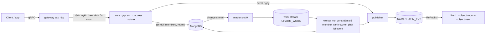
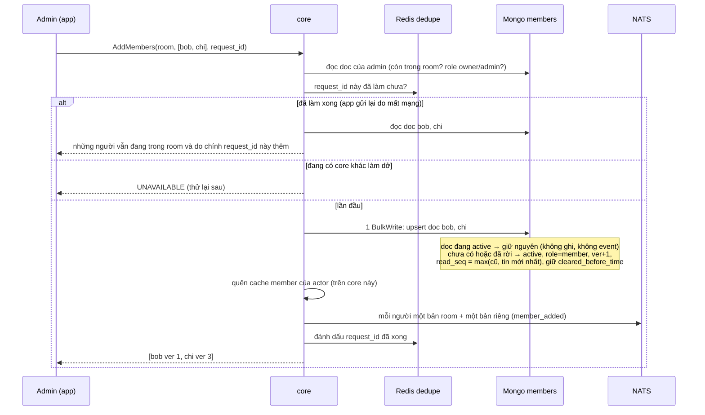
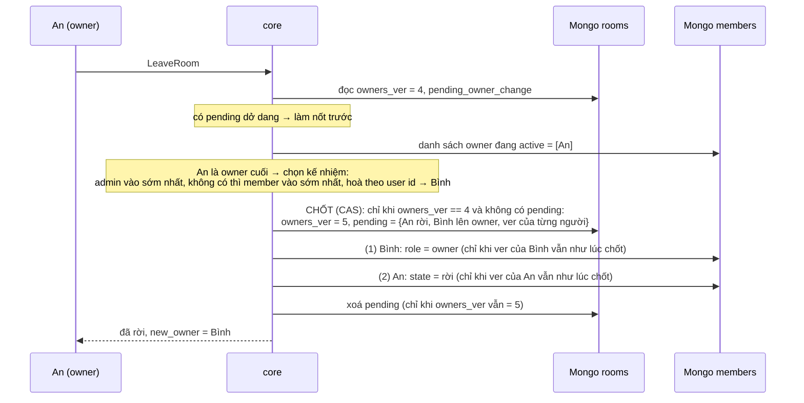
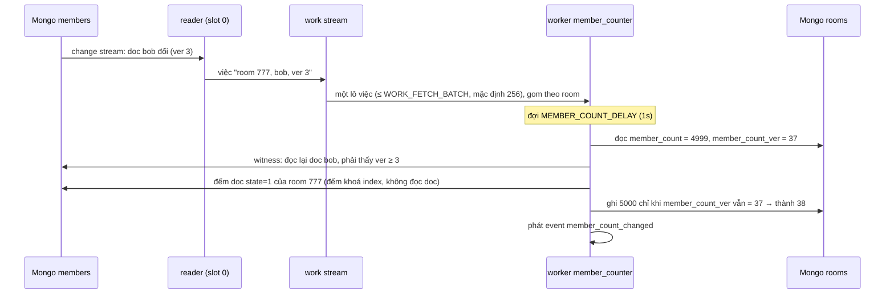

# M2b.4 — Member + vị trí đọc: tóm tắt kỹ thuật cho owner

> Plan chi tiết (cho AI): [2026-10-06-m2b4-members-read.md](2026-10-06-m2b4-members-read.md). Trạng thái: **chờ owner phản biện và duyệt bản này rồi mới thực thi.** Mục 9 liệt kê những điểm đội tự chọn để anh phản biện.
>
> Lưu ý: bản plan M2b.4 trước (đánh số liên tục `mv`) đã **huỷ hoàn toàn**. Số quyết định D96–D107 được dùng lại cho thiết kế mới này với nghĩa khác.

## 0. Thuật ngữ dùng trong bản này

| Từ | Nghĩa |
|---|---|
| CAS (ghi có điều kiện) | Ghi chỉ khi một giá trị vẫn như lúc mình đọc, ví dụ "chỉ ghi nếu `owners_ver` vẫn là 4". Hai bên ghi cùng lúc thì chỉ một bên thắng; bên thua đọc lại rồi thử lại |
| tombstone | Doc không bị xoá mà chỉ đánh dấu "đã rời" (`state = 2`), để giữ lịch sử và các bộ đếm |
| change stream / oplog | Nhật ký thay đổi của Mongo; core đọc nó để biết doc nào vừa đổi và làm việc chạy nền |
| work stream / worker / Nak | Hàng đợi việc chạy nền trên NATS (M2b.1). Worker ở mọi core lấy việc ra làm; làm chưa được thì trả lại (Nak) để lát nữa làm lại |
| RePublish | Luật của NATS chép event từ stream lưu trữ sang subject `live.*` để gateway nghe |
| witness | Bước kiểm "đã thấy đúng thay đổi vừa ghi chưa" trước khi đếm (mục 3.7) |
| P8 | Nguyên tắc trong thiết kế: kết nối lại thì lấy trạng thái mới nhất, không phát lại event cũ |

## 1. Bức tranh chung

M2b.4 gồm hai phần:
1. **Đổi tên field** của mọi collection đã làm (trừ `messages`) sang tiếng Anh đầy đủ, và đổi mốc "xoá lịch sử phía tôi" sang thời gian.
2. **Thành viên và vị trí đọc** theo nguyên tắc **không đánh số liên tục**: mỗi (room, user) là một doc riêng, có bộ đếm riêng. Thêm hay xoá **những người khác nhau** trong cùng room chạy song song, không tranh nhau.

- Lệnh của client tới core giữ slot của room. Core kiểm quyền, ghi doc, phát event rồi trả lời ngay.
- Mọi thay đổi trên Mongo đi qua change stream, rồi work stream, rồi worker (engine M2b.1 đang chạy).
- Worker làm phần chậm: đếm lại số member, canh luật owner, phát lại event bị mất.

## 2. Dữ liệu và tên field

### 2.1 Đổi tên các collection đã có (task đầu tiên, sau đó reset dữ liệu dev)

| Collection | Tên cũ → tên mới |
|---|---|
| `rooms` | `t`→`tenant`, `ty`→`type`, `n`→`name`, `cb`→`created_by`, `ca`→`created_at`, `mc`→`member_count`, `ls`→`last_seq`, `lm`→`last_message_at`, `lc`→`last_change_at`, `ab`→`activity_bucket`, `pv`→`pin_ver`; phần tử `pins` thành `{thread_root, seq, pinned_by, pinned_at, pin_ver}` |
| `members` | `r`→`room_id`, `u`→`user_id`, `t`→`tenant`, `ro`→`role`, `ja`→`joined_at`, `cb` (seq) → `cleared_before_time` (thời gian) |
| `message_edits` | `r`→`room_id`, `t`→`tenant`, `k`→`kind`, `by`→`created_by`, `x`→`text`, `p`→`previous_text`, `ts`→`created_at` |
| `hidden` | `u`→`user_id`, `r`→`room_id`, `th`→`thread_root`, `s`→`seq` |
| `reactions` | `k`→`message_key`, `r`→`room_id`, `t`→`tenant`, `u`→`user_id`, `e`→`emoji`, `pe`→`previous_emoji`, `n`→`ver`, `ts`→`updated_at` |
| `pin_actions` | `r`→`room_id`, `t`→`tenant`, `op`→`action`, `th`→`thread_root`, `s`→`seq`, `by`→`created_by`, `ts`→`created_at` |
| `reconciler_state` | `token`→`resume_token`, `at`→`cluster_time` |

`messages` giữ tên ngắn (owner chốt). Bảng tra:

| Tên ngắn | Nghĩa |
|---|---|
| `t` | tenant |
| `f` | người gửi |
| `k` | loại tin |
| `x` | text |
| `c` | cid |
| `ts` | lúc gửi (created_at) |
| `v` | version sửa |
| `d` | đã xoá |
| `ea` | lúc sửa cuối |
| `rx` | số reaction |

### 2.2 Doc `members` mới: mỗi (room, user) một doc

`_id` ghép từ room id (8 byte) và user id, giống reaction. Nhờ vậy change stream biết ngay doc thuộc room nào, user nào.

| Field | Nghĩa | Ví dụ |
|---|---|---|
| `room_id`, `tenant`, `user_id` | Room, tenant, user | 777, acme, bob |
| `role` | owner / admin / member | member |
| `state` | 1 = đang trong room, 2 = đã rời hoặc bị xoá. Luôn ghi rõ; doc không bao giờ bị xoá (tombstone) | 1 |
| `joined_at` | Lúc vào (hoặc vào lại) gần nhất; dùng để chọn người kế nhiệm owner | 2026-10-07 09:00 |
| `ver` | Số lần trạng thái thành viên của người này đổi (vào, rời, vào lại, đổi role). Chỉ tăng, có lỗ không sao | vào = 1, bị xoá = 2, thêm lại = 3 |
| `previous_role`, `previous_state` | Trạng thái ngay trước lần đổi cuối, để event biết đây là "vào", "rời" hay "đổi role" | member, 1 |
| `request_id` | Lệnh đã gây ra lần đổi cuối; dùng chống gửi lại và gộp tin hệ thống "A thêm X và 499 người khác" | `req-7f3a…` |
| `updated_at`, `updated_by` | Lúc nào, ai làm lần đổi cuối | 09:00, alice |
| `cleared_before_time` | Mốc "xoá lịch sử phía tôi": tin gửi trước hoặc đúng mốc này bị ẩn với riêng người này | 2026-10-07 10:05:03.120 |
| `read_seq` | Đã đọc tới tin số mấy | 500 |
| `read_ver` | Số lần vị trí đọc đổi, để hai thiết bị biết bản nào mới hơn | 12 |

Index:
- `{room_id, state, role, joined_at, user_id}`: dùng chung cho đếm số member đang ở room, tìm owner và chọn người kế nhiệm.
- `{tenant, user_id, state, room_id}`: "các room user đang ở", chuẩn bị cho M3 và gateway.

### 2.3 Field mới trên `rooms`

| Field | Nghĩa | Ví dụ |
|---|---|---|
| `member_count` | Số member đang ở room; worker ghi, trễ khoảng 1s | 5000 |
| `member_count_ver` | Số lần `member_count` được ghi lại; chặn lượt đếm cũ ghi đè số mới | 37 |
| `owners_ver` | Số lần danh sách owner đổi; hai lệnh đổi owner chạy cùng lúc thì chỉ một lệnh thắng | 4 |
| `pending_owner_change` | Thay đổi owner đã chốt nhưng chưa ghi xong: ai, làm gì, ai lên thay, kèm `ver` của từng người lúc chốt. Dùng để làm nốt nếu core chết giữa chừng | `{action: leave, user_id: an, successor_id: binh}` |

## 3. Luồng xử lý

### 3.1 Thêm người (`AddMembers`)

1. **Kiểm đầu vào:**
   - `request_id` bắt buộc.
   - User id hợp lệ; trùng thì **tự gộp**.
   - Danh sách rỗng hoặc vượt `MEMBER_BATCH_MAX` (mặc định 500) → `INVALID_ARGUMENT`.
   - Room là DM → `FAILED_PRECONDITION`.
   - Người gọi không phải owner/admin đang trong room → `PERMISSION_DENIED`.
2. **Chống gửi lại bằng `request_id`:** dùng lại cơ chế chống trùng `cid` của tin nhắn (RAM của core, rồi Redis dedupe), giữ `CID_COMMITTED_TTL` (mặc định 15 phút).
   - Gửi lại cùng `request_id` thì trả lại kết quả, không ghi lại. Vì vậy lần gửi lại muộn **thường** không thể thêm lại người vừa bị xoá.
   - **Chỉ trong 15 phút:** sau `CID_COMMITTED_TTL`, gửi lại cùng `request_id` được coi là lệnh mới và **có thể thêm lại** người đã bị xoá. App không nên tự gửi lại một lệnh thêm người đã quá vài phút.
   - **Giới hạn:** Redis dedupe không lưu xuống đĩa, và tự xoá khoá cũ khi đầy bộ nhớ. Nếu Redis lỗi hoặc khoá bị xoá sớm, chỉ còn RAM của từng core chống trùng. Khi đó lần gửi lại tới **core khác** vẫn có thể thêm lại người đó (giống giới hạn của tin nhắn, CD2).
   - **`request_id` phải mới cho mỗi lệnh.** Dùng lại một `request_id` với danh sách người khác thì lệnh không thêm ai mà vẫn báo thành công.
   - Ghi thất bại thì khoá `request_id` được nhả để thử lại được.
3. **Ghi:** một lệnh `BulkWrite` cho k người, mỗi người một upsert lọc đúng `_id`.
   - Thêm những người khác nhau không bao giờ tranh nhau.
   - Hai lệnh cùng thêm Bob: khoá `_id` bảo đảm chỉ một lần ghi đổi doc; lần kia thấy Bob đã active nên không làm gì.
4. **Người vào lại** luôn có role `member`, không lấy lại role cũ. Vị trí đọc không bao giờ lùi.
5. **Số member** không cập nhật trong lệnh; worker ghi sau khoảng 1s (mục 3.7).
6. **Lỗi khi phát event** ở bước này được bỏ qua (lệnh vẫn thành công); worker phát bù sau.

### 3.2 Xoá người, rời room, đổi role giữa member và admin (không đụng owner)

- Một lệnh update trên đúng doc của người đó, có điều kiện "`ver` vẫn như lúc tôi đọc". Đổi `state` (xoá hoặc rời) hoặc `role`, rồi `ver+1`.
- Trượt nghĩa là có người vừa đổi doc này: đọc lại **cả người gọi lẫn người đích**, kiểm lại quyền, thử tối đa 3 lần, hết thì `UNAVAILABLE`.
- Không đụng doc người khác, không đụng doc room.
- **Quyền mặc định** (owner chốt 2026-10-06):
  - owner làm mọi việc;
  - admin chỉ **thêm người** và **xoá người có role member**; admin không xoá được admin hay owner;
  - **chỉ owner đổi role**;
  - ai cũng tự rời được.
- **Quyền được hỏi trước khi trả lời về người đích**, nên member thường không dò được ai từng ở room.

| Trường hợp | Kết quả |
|---|---|
| Xoá chính mình | `INVALID_ARGUMENT` (muốn rời dùng `LeaveRoom`) |
| Owner/admin xoá người chưa từng là member | `NOT_FOUND` |
| Xoá người đã rời | Thành công, không đổi gì |
| Đổi role người đã rời hoặc chưa từng là member | `NOT_FOUND` |
| Người chưa từng là member gọi rời | `PERMISSION_DENIED` (không cho dò room) |
| Người đã rời gọi rời lần nữa | Thành công, không đổi gì |

### 3.3 Lệnh đụng owner: owner rời, xoá owner, hạ owner, nâng ai lên owner

Đây là chỗ duy nhất các lệnh trong cùng room **tranh nhau** trên một doc chung (doc room). Không có hàng đợi: lệnh thua đọc lại, thử tối đa 3 lần, hết thì trả `UNAVAILABLE` để app thử lại. Lệnh owner hiếm nên gần như không tranh.

**Vì sao đúng:**
- **Chốt trước, ghi sau.** Bước "CHỐT" là một lần ghi có điều kiện trên doc room, nên tại một thời điểm chỉ một thay đổi owner được chốt.
- **Hai owner rời cùng lúc.** An và Bình là hai owner cuối, cùng bấm rời. Cả hai đọc `owners_ver = 4`, chỉ An chốt được (thành 5). Bình chốt trượt, đọc lại: lúc này An đã rời, Bình là owner cuối, nên lệnh của Bình chọn người kế nhiệm (ví dụ Chi) rồi mới cho Bình rời.
- **Nâng trước, hạ sau.** Người kế nhiệm thành owner trước khi người cũ bị hạ hoặc rời, nên giữa hai lần ghi vẫn có ít nhất một owner.
- **Bất biến chính xác: group còn member đang ở thì luôn còn owner.** Owner cuối rời khi không còn ai khác thì group rỗng, không owner.
- **Người kế nhiệm vừa bị đổi giữa lúc chốt và lúc nâng** (ví dụ vừa tự rời): bỏ pending, không hạ người cũ, trả `UNAVAILABLE`; app thử lại thì chọn người kế nhiệm khác.
- **Core chết sau khi đã ghi ít nhất một doc member, trước khi xong:** `pending_owner_change` còn trên doc room.
  - Lệnh owner kế tiếp thấy nó thì làm nốt trước.
  - Nếu không có lệnh nào, worker `owner_guard` (sau `RECONCILE_DELAY`, khoảng 5s) thấy thay đổi member trên change stream và làm nốt, rồi tăng metric `owner_repaired_total` (alert `ChatimOwnerRepaired`).
  - Mỗi bước ghi kèm điều kiện `ver` lưu trong pending, nên chạy lại không làm sai.
- **Core chết ngay sau bước chốt, chưa ghi doc member nào:**
  - Chưa ai bị đổi (An vẫn là owner), nên luật vẫn đúng.
  - Không có doc member nào đổi, nên change stream không báo và worker không biết.
  - Phần dở dang được làm nốt khi An bấm rời lần nữa (app tự thử lại khi nhận lỗi), hoặc khi có lệnh owner tiếp theo trong room.
- **`owner_guard` còn tự sửa khi room không còn owner** mà vẫn có member (chỉ xảy ra khi có lỗi bất thường): tự chọn người kế nhiệm theo đúng luật và nâng lên owner (`updated_by` rỗng), có metric và alert. Không chạy cho DM.
- **Đường thường không thể hạ owner.** Lệnh xoá/rời/đổi role thường chỉ ghi khi đã kiểm người đích không phải owner, và ghi theo đúng `ver` đã kiểm.
- **Owner cuối tự hạ role** → `FAILED_PRECONDITION`.

### 3.4 Người bị xoá mất quyền ngay

- Mọi lệnh (gửi tin, đọc lịch sử, đọc tin, các lệnh member) kiểm quyền bằng doc `members`; `state = 2` thì `PERMISSION_DENIED`.
- Việc gửi tin đi qua actor của room, mà actor có cache danh sách member. Hai cơ chế giữ cache đúng:
  - **Trên core xử lý lệnh xoá:** actor quên cache ngay.
  - **Trên core khác** (lệnh xoá không chạy ở đó, và worker cũng không xoá được cache của core khác): mỗi mục cache tự hết hạn sau 10 giây.
- Vì vậy người bị xoá có thể gửi thêm **tối đa 10 giây** qua core khác. Đọc lịch sử thì bị chặn ngay.

### 3.5 Đọc tin và đánh dấu chưa đọc

1. `MarkRead(seq)` chỉ nâng: ghi khi `read_seq < seq`, đặt `read_seq = seq` và `read_ver + 1`.
   - Seq lớn hơn tin cuối thật thì kẹp về tin cuối; seq 0 nghĩa là "đọc hết".
2. `MarkUnread(seq)` chỉ hạ: `read_seq = seq − 1`, `read_ver + 1`. Seq 0 → `INVALID_ARGUMENT`.
3. Chỉ member đang ở room được gọi. Lệnh dùng toán tử ghi thường, **không bao giờ** đụng `ver`. Change stream chỉ lấy thay đổi có `ver`, nên đọc tin **không** sinh việc chạy nền; itest chứng minh điều này. Đọc tin vẫn ghi vào oplog của Mongo.
4. Đổi xong thì đưa cho `readcast` (mục 3.6).

### 3.6 "Đã xem" (`read_updated`)

- `readcast` là một goroutine trong core.
- Lần đổi đầu tiên của (room, user) gửi ngay. Các lần sau trong cửa sổ `READ_RECEIPT_WINDOW` (mặc định 1 giây, cho chỉnh 1–2s) chỉ giữ bản mới nhất; hết cửa sổ thì gửi.
- **Gửi đi đâu:**
  - DM, hoặc group có `member_count ≤ READ_RECEIPT_MAX_MEMBERS` (mặc định 20, trần cứng 50): gửi ra subject của room, mọi người thấy "đã xem".
  - Group lớn hơn: **chỉ** gửi về subject riêng của user (`evt.{tenant}.user.{uid}.read_updated`), để đồng bộ thiết bị của chính người đó. Không bao giờ phát ra room.
- **Ngưỡng 20 so với `member_count`**, mà số này cập nhật trễ khoảng 1s. Group vừa vượt 20 người thì trong 1 giây đó "đã xem" có thể vẫn phát ra room.
- **Bộ gộp có giới hạn 65.536 cặp (room, user).** Khi đầy, lần đổi mới được gửi thẳng, không gộp, và đếm vào `read_events_unbatched_total`.
- Best-effort: mất thì lần đọc sau gửi vị trí mới. Khi tắt core có một bước 1 giây để xả phần đang gộp. Tổng thời gian tắt core lên 27,2s trên ngân sách 28s.

### 3.7 Đếm số member (hội tụ sau khoảng 1s)

- **Một room một lần đếm mỗi lô.** 1000 người vào một channel trong 1 giây vẫn chỉ khoảng 1 lần đếm mỗi giây.
- **Chi phí đếm (ước tính, chưa đo):** đếm khoá trên index `{room_id, state}`. Group 5K khoảng 1ms, channel 200K khoảng 20–60ms CPU của Mongo.
- **Witness:** trước khi đếm, đọc lại (majority) doc của những người vừa đổi để chắc đã thấy đúng `ver` trong việc. Chưa thấy (ví dụ Mongo vừa đổi primary) thì trả việc lại (Nak) để làm lại sau. Nhờ vậy không bao giờ đếm thiếu người vừa vào.
- **Ghi có điều kiện** `member_count_ver` không đổi; đếm ra bằng số cũ thì không ghi. Ghi trượt 3 lần liền thì trả việc lại.
- **Ràng buộc cấu hình:** `MEMBER_COUNT_DELAY` phải ≤ `RECONCILE_DELAY`.
- **Chưa dùng bucket.** Chỉ khi đo prod-like thấy nặng mới chia member theo `hash(user) % K`. Bước đầu tiên khi cần là tăng delay cho room rất lớn.

### 3.8 Tạo room (`CreateRoom`)

- Ghi doc room, rồi doc từng member ban đầu (`ver = 1`, `request_id = {room}-created`).
- Giới hạn mỗi lệnh `MEMBER_BATCH_MAX` (mặc định 500). Bỏ giới hạn cứng 5000 member cũ; core không giới hạn tổng số member.
- Phát `room_created`, và **bản riêng** `member_added` cho từng người để gateway biết họ vừa vào room mới. Không phát bản room, để tránh 500 event cùng lúc.

### 3.9 Xoá lịch sử phía tôi (đổi sang thời gian)

- `ClearHistory`: `cleared_before_time = max(cũ, giờ server lúc nhận lệnh)`. Chỉ member đang ở room được gọi.
- Khi đọc lịch sử, tin có thời điểm gửi (`ts` trong `messages`) ≤ mốc bị ẩn với riêng người đó, trên mọi timeline (kể cả thread sau này).
- Chấp nhận lệch vài mili-giây với tin gửi sát lúc bấm. Tin gửi **cùng mili-giây** với lúc bấm cũng bị ẩn.
- **Thay đổi API (breaking):** bỏ tham số `up_to_seq` (đánh dấu `reserved`), nên app không còn chọn mốc theo số tin. Kết quả trả `cleared_before_time`. `corecli clear` bỏ cờ `-up-to`.

## 4. Event và nơi nhận

| Event | Id (chống trùng) | Gửi tới | Phát lại khi mất |
|---|---|---|---|
| `member_added`, `member_removed` (lý do: bị xoá / tự rời), `member_role_changed` | Bản room `{room}-mb-{user}-v{ver}`; bản user `{room}-mb-{user}-v{ver}-u` | Mỗi thay đổi có 2 bản: subject room (bỏ khi tạo room) và subject riêng `evt.{tenant}.user.{user}.…` | Có, nhưng chỉ cho **trạng thái hiện tại** của doc |
| `member_count_changed` | `{room}-members-v{member_count_ver}` | Subject room | Có (worker đếm phát) |
| `read_updated` | `{room}-rd-{user}-v{read_ver}` | Subject room (DM / ≤ 20) hoặc subject user | Không (best-effort) |

- **Envelope** thêm field `recipient`: có giá trị thì publisher gửi tới subject user.
- **Luật RePublish** của stream mở rộng từ `evt.*.room.*.*` thành `evt.*.*.*.*`, để subject user cũng tới `live.*`. NATS 2.15 nhận đổi luật trên stream có sẵn; đã thử thật khi viết plan.
- **Thứ tự:** hai event về cùng một người thì `ver` lớn hơn là mới hơn, client bỏ event cũ. Event về hai người khác nhau không cần thứ tự. Mất kết nối lâu thì client tải lại danh sách member (P8).
- **Event trung gian có thể mất hẳn:** worker chỉ phát lại event của trạng thái hiện tại. Ví dụ Bob được thêm (ver 1) rồi bị xoá ngay (ver 2), và event "được thêm" bị rớt ở đường nhanh: worker chỉ phát "bị xoá". Trạng thái cuối luôn đúng.
- **`new_owner`:** người kế nhiệm owner nhận event `member_role_changed` của chính họ, nên event `member_removed` của người rời không mang `new_owner`. Phản hồi của lệnh `LeaveRoom` vẫn trả `new_owner`.

## 5. Thư viện và hạ tầng

- **MongoDB (mongo-driver v2):**
  - collection clustered theo `_id`;
  - `BulkWrite` không thứ tự với upsert dạng pipeline `$cond`: doc đang active giữ nguyên, không sinh oplog;
  - `UpdateOne` / `FindOneAndUpdate` có điều kiện (CAS) cho xoá, đổi role, chốt owner, đếm;
  - đếm phủ index trong causal session (đọc witness rồi đếm cùng phiên);
  - change stream lọc theo `updateDescription.updatedFields.ver`.
- **Redis dedupe:** dùng lại script Lua và batcher chống trùng `cid` sẵn có, với namespace mới `chatim:req:{room}:{user}:{request_id}`.
- **NATS JetStream:**
  - `Nats-Msg-Id` chống trùng event (cửa sổ 5 phút);
  - RePublish ra `live.*`;
  - work stream `CHATIM_WORK` cho việc chạy nền.
- **Go:** `testing/synctest` và goleak cho thành phần có goroutine (`readcast`, cache actor). Package mới:
  - `ownership`: luật owner, làm nốt, tự sửa;
  - `readcast`: gộp "đã xem";
  - `pkg/lru`: cache dùng chung, chuyển từ actor.

## 6. Quyết định kỹ thuật và phương án đã loại

| # | Quyết định | Phương án bị loại | Lý do |
|---|---|---|---|
| D96 | Tên field đầy đủ, trừ `messages` | Giữ tên ngắn; hoặc tên đầy đủ cả `messages` | Owner đọc được thiết kế. `messages` giữ ngắn vì trong RAM cache Mongo doc không nén, tên dài làm cache chứa ít tin hơn (theo phân tích lúc owner chọn; chưa đo) |
| D97 | Xoá lịch sử theo thời gian | Theo số tin | Một mốc dùng cho mọi timeline kể cả thread; chấp nhận lệch vài ms |
| D98 | Mỗi (room, user) một doc, `ver` riêng | Nhật ký thay đổi member đánh số liên tục cho cả room (plan cũ) | Số liên tục bắt mọi thay đổi trong room tranh một số, khoảng 100–200 lệnh/s mỗi room (ước tính của reviewer khi đánh giá plan cũ) |
| D99 | `AddMembers` có `request_id`, chống gửi lại `CID_COMMITTED_TTL` | Không chống | Gửi lại muộn có thể thêm lại người vừa bị xoá |
| D100 | Lệnh đụng owner: chốt trên doc room, nâng trước hạ sau | Ghi member trước rồi kiểm; hoặc khoá chung mọi lệnh member | Kiểm sau không cứu được ca hai owner rời cùng lúc; khoá chung lại thành tranh nhau |
| D101 | Quyền mặc định như mục 3.2; DM cố định; mã lỗi như các bảng trên | — | Owner chốt 2026-10-06 |
| D102 | Số member do worker đếm lại, hội tụ ~1s | Cập nhật ngay trong lệnh (`$inc`) | `$inc` lệch vĩnh viễn khi lỗi (D67) và tranh nhau trên doc room |
| D103 | Change stream chỉ lấy thay đổi member có `ver`; việc có đuôi user | Lấy mọi update | Đọc tin sinh rất nhiều update, không được vào work stream |
| D104 | Event có bản room và bản user; không có bản room khi tạo room | Chỉ bản room | Người vừa được thêm chưa nghe room nên phải nhận qua kênh riêng |
| D105 | "Đã xem" chỉ ra room khi DM hoặc ≤ 20 người (trần 50) | ≤ 100 | Group 100 người, mỗi người đọc khoảng 3 giây một lần, mỗi lần giao tới 100 người: khoảng 3.300 lần giao mỗi giây mỗi room |
| D106 | Cache member của actor: quên ngay + hết hạn 10s | Không cache; cache mãi | Không cache thì mỗi tin gửi thêm một lần đọc DB; cache mãi thì người bị xoá vẫn gửi được |
| D107 | Giới hạn mỗi lệnh 500 (2..1000), bỏ trần 5000 | Trần tổng số member | Owner chốt không giới hạn tổng; 1 sẽ chặn mọi DM |
| D108 | Guarantee OW1 "còn member thì có owner" + metric + alert (17 luật) | Không đo | Quy tắc dự án: guarantee mới phải có detector |
| — | Bỏ `user_rooms` ở M2b.4 | Làm ngay | Chưa shard thì index trên `members` đủ dùng |
| — | Ghim giữ đánh số liên tục `pin_ver` | Đổi sang mỗi tin ghim một doc | Owner chốt: ghim rất hiếm, giữ giới hạn 50 chính xác |

## 7. Chi phí và tải

| Lệnh | Đọc | Ghi | Event |
|---|---|---|---|
| Thêm k người | 2 (kiểm quyền) + 1 Redis + 1 (tin cuối) + 1 (đọc lại k doc) | 1 BulkWrite k doc | 2k ngay (bản room + bản user); worker phát lại, stream bỏ trùng |
| Xoá / rời / đổi role thường | 3 | 1 | 2 |
| Lệnh owner | khoảng 5 | 1 chốt + 2–3 doc + 1 xoá pending | 2–4 |
| Đọc / chưa đọc | 2 (+1 nếu kẹp) | 1 | ≤ 2 mỗi cửa sổ mỗi (room, user) |
| Đếm số member (worker) | witness k + đếm index ≤ N khoá | ≤ 1 | 1 |

- Group 5K: mọi lệnh O(1) hoặc O(k); đếm khoảng 1ms (ước tính).
- Channel 200K: đếm 20–60ms (ước tính), tối đa khoảng 1 lần/s mỗi room nóng.
- Thêm/xoá member song song, giới hạn chỉ là sức Mongo. Lệnh owner tranh nhau theo room nhưng hiếm.

## 8. Rủi ro và giới hạn còn lại

- **10 giây ở core khác:** người bị xoá còn gửi được tối đa 10 giây qua core không xử lý lệnh xoá. Đọc lịch sử và mọi lệnh khác bị chặn ngay.
- **Chống gửi lại chỉ có hiệu lực trong 15 phút,** và Redis dedupe lỗi hoặc tự xoá khoá thì lần gửi lại `AddMembers` tới core khác có thể thêm lại người vừa bị xoá.
- **Khe "kiểm rồi mới ghi":** admin bị hạ đúng lúc đang xoá một người thì lệnh xoá đã được duyệt vẫn ghi. Không chặn tuyệt đối được nếu không dùng transaction nhiều doc (bị cấm vì sharding).
- **Thêm 500 người sinh 1.000 event** (500 bản room + 500 bản user). Tin hệ thống gộp nhờ `request_id`.
- **Event trung gian của một người có thể mất hẳn;** chỉ trạng thái cuối được phát lại.
- **Không có thứ tự chung** của các thay đổi member trong room, chỉ có thứ tự theo từng người.
- **Thay đổi owner kẹt** nếu core chết ngay sau bước chốt: được làm nốt ở lần thử lại hoặc lệnh owner kế tiếp, không phải ở worker.
- **Đọc tin vẫn ghi oplog** (không vào work stream). Cần số thật để định cỡ oplog.
- **Nâng cấp:**
  - Đổi tên field và đổi khoá `members` nên không có đường nâng cấp tại chỗ. Prod chưa chạy, nên go-live thẳng từ bản này.
  - Dev phải `make infra-reset` hai lần: sau task đổi tên, và sau task `members`. Giữa hai lần đó `members` tạm chưa clustered.
  - Mọi core phải nâng cùng lúc: core cũ khởi động lại sẽ ghi đè luật RePublish (event subject user ngừng tới `live.*`) và trả lại việc loại mới.
- **API thay đổi:**
  - `ClearHistory` bỏ `up_to_seq`; corecli bỏ `-up-to`.
  - Field proto đã có đổi tên theo quy tắc `ver`/`_ver` (chỉ đổi tên, giữ số field, nên tương thích wire): `version` → `ver`, `base_version` → `base_ver`, `after_version` → `after_ver`, `pin_version` → `pin_ver`.
- **Bỏ đường đọc vị trí feed cũ** `_id: "messages"` trong `reconciler_state` (không dùng từ M2b.1).

## 9. Điểm đội tự chọn, mời owner phản biện

| Điểm | Giá trị chọn | Lý do |
|---|---|---|
| TTL cache member của actor | 10 giây | Cân bằng giữa đọc DB khi gửi tin và độ trễ chặn người bị xoá ở core khác |
| Cửa sổ gộp "đã xem" | 1 giây (cho chỉnh 1–2s) | Owner nói 1–2s |
| Ngưỡng "đã xem" ra room | 20, trần cứng 50 | Theo lưu ý của owner |
| Delay đếm số member | 1 giây | Owner chấp nhận hội tụ khoảng 1s |
| Giới hạn mỗi lệnh thêm | 500, cho chỉnh 2..1000 | Suy luận của đội: giữ lệnh trong hạn 3 giây của một request (`CORE_REQUEST_DEADLINE`); 1 sẽ chặn DM |
| `request_id` cho xoá / rời / đổi role | Server tự sinh, client không gửi | Các lệnh này là "trạng thái mong muốn", gửi lại không gây hại |
| Luật chọn người kế nhiệm | Admin vào sớm nhất → member vào sớm nhất → user id nhỏ nhất | Owner chốt 2026-10-06 |
| Người vào lại | Luôn role `member`; giữ mốc xoá lịch sử của họ | Không vô tình trả lại quyền admin cũ |
| Tự sửa owner (`owner_guard`) | Tự nâng người kế nhiệm khi room còn member mà không còn owner | Giữ luật owner khi có sự cố; có alert báo |
| Alert mới | `ChatimOwnerRepaired` (17 luật) | Mỗi lần phải tự sửa owner là dấu hiệu core chết giữa chừng |

## 10. Kiểm thử, mỗi mục chứng minh gì

- **Unit:**
  - luật quyền mặc định;
  - chọn người kế nhiệm;
  - owner cuối không tự hạ;
  - gộp "đã xem": gửi ngay lần đầu, giữ bản mới nhất, xả khi tắt;
  - cache actor hết hạn và bị quên;
  - chống gửi lại `request_id`, kể cả khi core khởi động lại;
  - ca chạy đua: hai owner rời cùng lúc (24 room, mỗi room hai goroutine thật), admin bị hạ đúng lúc đang xoá.
- **Contract store** (chạy trên cả bộ nhớ và Mongo thật): thêm, xoá, đổi role, chốt và làm nốt owner, đếm có witness, đọc / chưa đọc, xoá lịch sử theo thời gian.
- **Itest trên hạ tầng thật:**
  - hai owner rời cùng lúc: luôn còn owner;
  - core chết sau khi đã ghi một phần thay đổi owner: worker làm nốt và metric tăng;
  - room còn member mà không còn owner: worker tự nâng người kế nhiệm;
  - người bị xoá gửi tin và đọc lịch sử bị từ chối;
  - gửi lại `AddMembers` cùng `request_id` sau khi người đó bị xoá: không thêm lại;
  - đọc, chưa đọc, xoá lịch sử **không** vào work stream (nghe trực tiếp subject của work stream);
  - số member hội tụ;
  - event tới subject user qua RePublish.
- **E2e trên cụm hai core:**
  - thêm người: họ nhận event riêng, thấy lịch sử, không có tin chưa đọc;
  - đổi role;
  - đọc và chưa đọc: DM thấy "đã xem" trên room, group 22 người chỉ trên kênh riêng;
  - xoá người: họ không gửi hay đọc được nữa;
  - gửi lại cùng `request_id`: không thêm lại;
  - owner cuối rời: quyền owner chuyển;
  - DM từ chối mọi lệnh member;
  - xoá lịch sử theo thời gian;
  - kill một core: không mất, không trùng tin.
