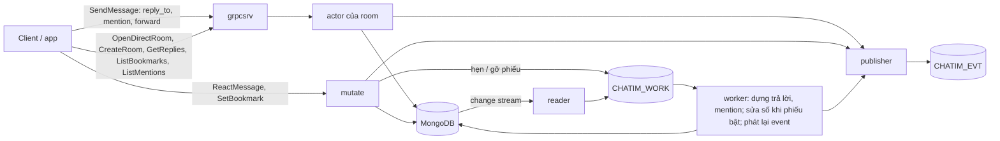
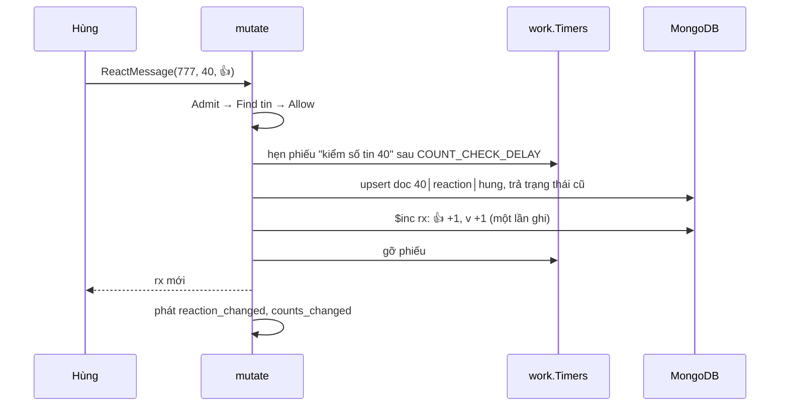

# M2c — Tương tác với tin, mention, forward, tạo room: tóm tắt kỹ thuật

> Trạng thái: **chờ owner duyệt, chưa thực thi**. Nhánh `feat/m2c`. Plan execute cho AI viết sau khi duyệt, ở `.claude/plans/2026-10-10-m2c-threads-mentions.md` (local). Quyết định mới ghi vào Decision Log của [thiết kế](../designs/261005-chatim-architecture.md) từ D112.

## 1. Thuật ngữ

| Từ | Nghĩa |
|---|---|
| tương tác | Người khác làm gì đó **với** một tin: react, trả lời, lưu (bookmark) |
| mention | Người gửi **chỉ định** user, nhóm hoặc `@all` ngay trong tin |
| trả lời có trích | Tin bình thường ở timeline chính, trỏ tới tin được trả lời (tin cha); client hiện ô trích phía trên. Không có nhánh chat riêng |
| số trên tin | Số hiện dưới tin: reaction theo emoji (`rx`), số trả lời (`rc`) |
| phiếu hẹn sinh tồn | Message hẹn giờ của NATS, đặt **trước** hai lần ghi không nguyên khối, gỡ **sau** khi xong; không bị gỡ thì tự bật và sửa (thiết kế §7.1, D111) |
| tombstone | Doc không xoá mà chuyển `state = 2` (đã gỡ) |
| sổ DM | Bảng tra "cặp user → room DM" (`room_dms`); `rooms` vẫn là gốc |

## 2. Bức tranh chung

### 2.1 Phạm vi

| Tính năng | Người dùng thấy |
|---|---|
| Trả lời có trích | Bấm "Trả lời" trên một tin; tin mới có ô trích; dưới tin cha hiện "2 trả lời", bấm vào xem các trả lời |
| Reaction | Như M2b.3 (một emoji mỗi người mỗi tin); chỉ đổi chỗ lưu và cách đếm |
| Bookmark | "Lưu tin", màn "Đã lưu" |
| Mention | Nhắc `@user`, `@nhóm`, `@all`; màn "Tôi được nhắc tới" |
| Forward | "Chuyển tiếp từ Hùng" kèm ô ghi chú "Lan: Báo giá 100 triệu" |
| Mở DM | Bấm vào một người luôn ra đúng một cuộc trò chuyện với họ |
| Tạo group | Như hiện tại, thêm chống tạo trùng khi gửi lại |
| Việc tồn đọng R1–R5 | Không thấy gì; sửa cơ chế bên trong (mục 4.7) |

Ngoài phạm vi (M3): danh sách "trao đổi gần đây của room" (`ListThreads`), số tin/mention chưa đọc.

### 2.2 Mô hình: hai dạng liên kết + một bộ đếm

| | Dạng 1: tương tác | Dạng 2: mention |
|---|---|---|
| Gồm | reaction, trả lời, bookmark | user, nhóm, `@all` |
| Lưu | collection `message_interactions`, loại (`kind`) nằm trong khoá | collection `mentions` |
| Ai ghi | reaction, bookmark: lệnh của người dùng; trả lời: worker dựng từ tin trả lời | worker dựng từ tin mới/sửa/xoá |
| Số trên tin | `rx`, `rc` | không |
| Đọc | các trả lời của một tin (`GetReplies`); tin tôi đã lưu (`ListBookmarks`) | tin nhắc tôi (`ListMentions`) |

**Mọi bộ đếm dùng một cơ chế** (đang dùng cho `member_count` từ M2b.4): cộng/trừ (`$inc`) ngay khi ghi tương tác, bọc bởi phiếu hẹn sinh tồn. Máy chết giữa hai lần ghi thì phiếu bật, đếm lại cho đúng. Không đếm lại sau mỗi tương tác.



**Ví dụ.** Lan trả lời tin 40 của room 777 bằng "ok @minh @team-design" (tin mới 57). Hùng 👍 tin 40.
1. Core ghi tin 57 (`reply_to = 40`, hai đích mention), trả ack, phát `msg_created`.
2. Worker nhận phiếu tin 57: ghi doc "57 trả lời 40", `rc` của tin 40 +1 (bọc phiếu hẹn), phát `counts_changed`; ghi 2 doc `mentions`.
3. Hùng react: lệnh ghi doc reaction, `rx` của tin 40 thêm 👍 +1 (bọc phiếu hẹn), trả Hùng số mới ngay, phát `reaction_changed` và `counts_changed`.
4. Màn lịch sử hiện tin 40 với "👍 1 · 2 trả lời"; Minh thấy tin 57 trong "Tôi được nhắc tới".

## 3. Dữ liệu

### 3.1 Field mới trên `messages` (tên ngắn, D96)

| Field | Nghĩa | Ví dụ |
|---|---|---|
| `rp` | Tin cha cùng room `{th, s}` (`th` luôn 0) | `{th: 0, s: 40}` |
| `rc` | Số trả lời còn sống `{n, v}`; `v` tăng mỗi lần số đổi | `{n: 2, v: 2}` |
| `fw` | Nguồn forward: tin gốc đầu tiên và tác giả gốc `{r, th, s, f, ts}` | `{r: 555, th: 0, s: 9, f: "lan", ts: …}` |
| `mt` | Đích mention, tối đa 50: `[{k: user\|group, i}]` | `[{k: "user", i: "minh"}]` |
| `ma` | Có `@all` | `true` |

`rx` (reaction) giữ dạng M2b.3 `{c: [{e, n}], v}`. `thread_root` vẫn trong khoá nhưng luôn 0. Dòng `message_edits` thêm `mention_targets`, `mention_all`.

### 3.2 `message_interactions` (dạng 1)

`_id` (clustered) = `khoá tin (24 byte) │ kind (1 byte) │ phần riêng`: user với reaction và bookmark; `thread│seq` (16 byte) của tin trả lời với reply. `kind` nằm trong khoá nên change feed biết loại mà không cần đọc doc; các doc reply của một tin dài bằng nhau nên quét theo tiền tố ra đúng danh sách trả lời theo thứ tự.

| Field | Nghĩa |
|---|---|
| `message_key`, `room_id`, `tenant` | Tin, room, tenant |
| `kind` | `reaction` \| `reply` \| `bookmark` |
| `actor_id` | Người react / người trả lời / người lưu |
| `value`, `previous_value` | Emoji hiện tại và trước đó (chỉ reaction) |
| `reply_seq` | Seq tin trả lời (chỉ reply) |
| `state` | 1 còn, 2 đã gỡ (bỏ react, gỡ lưu, tin trả lời bị xoá) |
| `ver` | Số lần doc đổi |
| `created_at`, `updated_at` | |

Ví dụ tin 40:

| `_id` | kind | actor_id | value | state |
|---|---|---|---|---|
| 40 │ reaction │ hung | reaction | hung | 👍 | 1 |
| 40 │ bookmark │ minh | bookmark | minh | | 1 |
| 40 │ reply │ 0│41 | reply | minh | | 1 |
| 40 │ reply │ 0│57 | reply | lan | | 1 |
| 40 │ reply │ 0│60 | reply | hung | | 2 |

Index: `{message_key, kind, state, value}` (đếm lại khi sửa, đếm trả lời còn sống lúc xoá tin cha); `{tenant, actor_id, kind, state, updated_at: -1}` (`ListBookmarks`); `{room_id, kind, updated_at}` (resync).

Collection `reactions` của M2b.3 bỏ; reaction chuyển sang đây (dữ liệu chỉ có ở dev, reset là xong). Hành vi, event và id reaction không đổi với client.

### 3.3 `mentions` (dạng 2)

`_id` (clustered) = `khoá tin │ loại đích │ id đích`. Field: `message_key`, `room_id`, `tenant`, `target` (`user:minh`, `group:team-design`, `all:777`), `sender_id`, `state`, `message_ver`, `created_at`, `updated_at`. Index `{tenant, target, state, created_at: -1}` (`ListMentions`), `{room_id, updated_at}` (resync). Mỗi đích một doc: `@all` ở room 200K người vẫn 1 doc. Core không bung nhóm; nơi xử lý mention tự bung.

### 3.4 `room_dms` (sổ DM)

`_id` = `tenant│user nhỏ│user lớn` (user id chỉ gồm `[A-Za-z0-9_-]` nên `│` không lẫn), field `room_id`, `created_at`. `rooms` thêm `dm_key` (không unique) để kiểm room đúng là DM của cặp đó.

### 3.5 Config và khoá mới

| Tên | Mặc định | Nghĩa |
|---|---|---|
| `MENTION_TARGETS_MAX` | `50` | Đích mention mỗi tin (A6) |
| `MENTION_GROUPS_MAX` | `100` | Nhóm truyền vào `ListMentions` |
| `COUNT_CHECK_DELAY` | `5s` | Hạn phiếu hẹn của số trên tin (như `MEMBER_COUNT_CHECK_DELAY`) |
| `chatim:req:create:{tenant}:{user}:{request_id}` | TTL 15 phút | Chống tạo group trùng (Redis dedupe) |

## 4. Luồng xử lý

### 4.1 Gửi tin có trả lời, mention, forward

Mọi kiểm tra cần đọc DB làm ở `grpcsrv` trước khi vào actor (actor chạy tuần tự theo room, không được chờ đọc).
- **Trả lời:** đọc tin cha theo khoá; không có → `NOT_FOUND`. Tin cha đã xoá vẫn cho trả lời (ô trích hiện "đã xoá"). Trả lời một tin trả lời được.
- **Mention:** kiểm định dạng, bỏ trùng, ≤ 50 đích; không kiểm user có trong room. `@all` qua policy `mention_all` (mặc định cho mọi người).
- **Forward:** đọc room nguồn, member của người forward, tin nguồn, `hidden`; tin phải chưa xoá, chưa ẩn, sau `cleared_at` của người forward; policy `forward_message`. Text chép từ nguồn; `fw` = `fw` của nguồn nếu nguồn cũng là forward, không thì trỏ tin nguồn. Không giữa tenant. Lỗi: `NOT_FOUND` / `PERMISSION_DENIED` / `FAILED_PRECONDITION` (nguồn đã xoá).
- Sau đó actor ghi tin như thường, phát `msg_created` (mang `reply_to`, `forward_from`, mention). Va seq với core khác lúc chuyển slot → `UNAVAILABLE` và nhường room ngay (R5).

### 4.2 Reaction và bộ đếm



- Chuyển đổi → cộng/trừ: chưa có → +1 emoji mới; đổi emoji → −1 cũ, +1 mới; gỡ → −1; như cũ → không ghi gì (doc giữ nguyên, D89), không phiếu, không event.
- Hẹn phiếu lỗi → `UNAVAILABLE`, chưa ghi gì. `$inc` lỗi sau khi ghi doc → lệnh vẫn thành công, phiếu giữ nguyên và sẽ bật.
- **Phiếu bật** (worker): đọc số + `v`, đếm lại doc còn sống theo index `{message_key, kind, state, value}`, ghi có điều kiện `v` không đổi; `v` đã đổi (đang có tương tác mới) → Nak, thử lại sau. Như `member_count_repair`.

### 4.3 Trả lời: số, danh sách, chặn xoá

- **Worker dựng trả lời** (từ phiếu tin có `rp`): hẹn phiếu → upsert doc reply → **chỉ khi doc mới được tạo** thì `rc` +1 → gỡ phiếu → `counts_changed`. Phiếu việc chạy lại sau sự cố không cộng lần hai (doc đã có); nếu lần trước chết trước khi cộng thì phiếu hẹn bật và đếm lại.
- **Tin trả lời bị xoá** (phiếu sửa loại xoá): doc reply `state = 2` → `rc` −1, cùng cách bọc phiếu.
- **`GetReplies(room, seq, after, limit ≤ 50)`:** quét `_id` theo tiền tố `tin cha│reply`, bỏ `state = 2`, lấy tin, áp view (xoá, ẩn, `cleared_at`).
- **Chặn xoá tin còn trả lời:** `DeleteMessage` đếm thẳng doc reply còn sống của tin (đọc majority); còn ≥ 1 → `FAILED_PRECONDITION`.

### 4.4 Bookmark

- `SetBookmark(room, seq, on)`: `Admit`, tin phải tồn tại; một upsert doc `tin│bookmark│user`; như cũ → không ghi, không event; gỡ → `state = 2`. Phát `bookmark_changed`. Không giới hạn số lượng (chống lạm dụng bằng rate limit ở gateway/app). Không ghi chú.
- `ListBookmarks(before, limit ≤ 50)`: index theo user → tin → view; rời room hay tin đã xoá thì vẫn trong danh sách, hiện "không còn xem được".

### 4.5 Mention

- Worker `mention_index` (từ phiếu tin mới/sửa/xoá): upsert doc mỗi đích; đích bị sửa bỏ hoặc tin bị xoá → `state = 2`; chỉ ghi khi `message_ver` của phiếu ≥ doc hiện có. Sửa tin: mention có đổi thì client gửi danh sách mới, không gửi = giữ nguyên.
- `ListMentions(groups[{id, since?}], before, limit ≤ 50)`: người gọi truyền các nhóm của user (và mốc `since` nếu muốn); core thêm `user:{mình}` và `all:{room}` của các room user đang là member, rồi chạy **một** truy vấn "đích thuộc danh sách", mới nhất trước, 50 doc; bỏ doc trước `since`; lấy tin; áp view. Số đích bị giới hạn (`MENTION_GROUPS_MAX` + số room của user).

### 4.6 Tạo room

```mermaid
sequenceDiagram
  participant L as Lan
  participant G as grpcsrv
  participant T as work.Timers
  participant DB as MongoDB
  L->>G: OpenDirectRoom(minh)
  G->>DB: room_dms upsert _id acme│lan│minh, $setOnInsert room 8812
  DB-->>G: room 8812 (của mình hoặc của người mở trước)
  alt room và 2 member đã có
    G-->>L: {8812, created false}
  else còn thiếu
    G->>T: hẹn phiếu số member
    G->>DB: rooms (dm_key); members 2 người role member, request_id 8812-created
    G->>T: gỡ phiếu
    G-->>L: {8812, created true}; room_created, member_added ×2, member_count_changed
  end
```

- **`OpenDirectRoom`**: hai người mở cùng lúc ra cùng room (Mongo bảo đảm `_id` duy nhất); core chết giữa chừng thì lần mở sau làm nốt. DM không có owner. Nhắn chính mình → `INVALID_ARGUMENT`. Policy `open_direct`. Link dễ nhớ do app làm bằng cặp username.
- **`CreateRoom`** chỉ cho group/channel: `request_id` bắt buộc (gửi lại trong 15 phút trả room cũ); room id ngẫu nhiên một lần, trùng → `UNAVAILABLE`; phiếu hẹn quanh room + member.

### 4.7 Việc tồn đọng

- **R1:** ghim còn một lượt (append trùng `pin_ver` → `UNAVAILABLE`; projection trượt → fast path trả fold cục bộ, worker Nak). Phần "đếm reaction" của R1 không còn vì bộ đếm đổi sang `$inc` + phiếu hẹn.
- **R2:** `Config.LogValue` log mọi field không bí mật; review `GetEditHistory` (khe giữa fact xoá và projection), sửa hoặc ghi lý do giữ.
- **R3:** effect `room_created` chỉ đếm PubAck không trùng.
- **R4:** giải bằng `room_dms` và `CreateRoom` một lần.
- **R5:** actor không gán lại seq.

## 5. Đúng đắn và chạy đua

| Ca | Kết quả | Vì sao |
|---|---|---|
| Core chết giữa ghi tương tác và `$inc` | Số đúng sau `COUNT_CHECK_DELAY` | Phiếu hẹn bật, đếm lại |
| Hai người react cùng tin cùng lúc | Số cộng đủ | `$inc` không mất cập nhật |
| Phiếu bật đúng lúc có react mới | Không ghi đè số mới | Ghi có điều kiện trên `v`; trượt thì Nak |
| Phiếu việc reply chạy hai lần | Cộng một lần | Chỉ cộng khi doc mới được tạo |
| Xoá tin cha còn trả lời | `FAILED_PRECONDITION` | Đếm thẳng doc reply lúc xoá |
| Sửa tin bỏ mention, phiếu đến lệch thứ tự | `mentions` theo phiên bản mới nhất | So `message_ver` |
| Hai người mở DM cùng lúc | Một room | `_id` của `room_dms` duy nhất |
| Gửi lại `CreateRoom` | Room cũ (trong 15 phút) | `request_id` |
| Hai core cùng ghi một room lúc chuyển slot | Một tin thắng; bên thua `UNAVAILABLE`, client gửi lại cùng cid | `_id` unique |

Không thêm số đánh liên tục hay khoá chung nào. Chỗ xếp hàng duy nhất vẫn là actor của room.

## 6. Event và subject

| Subject | Kind | Id | |
|---|---|---|---|
| `message` | `msg_created` | `{room}-{thread}-{seq}` | thêm `reply_to`, `forward_from`, mention |
| `message` | `reaction_changed` | `{room}-{thread}-{seq}-{user}-n{ver}` | như cũ |
| `message` | `counts_changed` | `{room}-{thread}-{seq}-{reactions\|replies}-v{v}` | phát mỗi lần số đổi; worker phát lại số hiện tại khi mất |
| `member` | `bookmark_changed` (mới) | `{room}-bm-{thread}-{seq}-{user}-v{ver}` | riêng tư theo user như `message_hidden` |
| `room`, `member` | `room_created`, `member_added`, `member_count_changed` | | đường DM phát như CreateRoom |

Feed: thay đổi của `message_interactions` → loại đọc từ khoá: reaction, bookmark sinh phiếu việc; reply không (worker dựng lại từ tin). `mentions` không vào feed.

## 7. Thư viện và hạ tầng

Không thư viện mới. Mongo: collection clustered, upsert `$setOnInsert`, pipeline update (`$inc` theo emoji trong mảng `rx`), truy vấn `$in` trên index. NATS: message schedule (phiếu hẹn) đã có. Bootstrap tạo `message_interactions`, `mentions`, `room_dms`, bỏ `reactions`. Resync quét `message_interactions` (reaction, bookmark) theo room; reply, mention và số trên tin dựng lại từ phiếu tin.

## 8. Quyết định

| Quyết định | Phương án loại | Lý do |
|---|---|---|
| Liên kết gắn vào tin chia hai dạng; tương tác chung một collection | Mỗi loại một collection riêng | Một chỗ lưu, một bộ index, một lần resync |
| Mention collection riêng, lưu theo đích | Lưu từng người nhận (tin × người) | `@all` room 200K sẽ là 200K doc mỗi tin |
| Mọi số trên tin: `$inc` + phiếu hẹn sinh tồn (thay D90) | Đếm lại sau mỗi tương tác | Tin nóng tốn theo số tương tác; `$inc` + phiếu đã dùng cho `member_count` |
| "Thread" = trả lời có trích ở timeline chính | Nhánh chat riêng | Owner không cần nhánh riêng |
| Chặn xoá tin còn trả lời | Cho xoá, để chỗ "đã xoá" | Owner chốt |
| DM qua sổ `room_dms`; room id vẫn ngẫu nhiên 63-bit | Id DM tính từ cặp user | Băm cặp user có thể trùng (lộ DM); ghép chuỗi không vừa khoá 8 byte |
| `OpenDirectRoom` riêng, `CreateRoom` chỉ group | Tạo DM ngầm khi gửi tin đầu | Gửi tin cần room id trước để định tuyến và chống trùng |
| Kiểm trả lời/forward ở `grpcsrv` | Kiểm trong actor | Không làm nghẽn hàng đợi của room |
| Không `@here`, không alias room, không giới hạn bookmark | | Owner chốt |

## 9. Chi phí

| Thao tác | Ghi | Đọc | NATS | Event |
|---|---|---|---|---|
| Gửi tin trả lời | 1 insert; worker 1 upsert + 1 `$inc` | +1 đọc tin cha | worker hẹn + gỡ phiếu | `msg_created`, `counts_changed` |
| React | 1 upsert + 1 `$inc` | 1 đọc tin | hẹn + gỡ phiếu | `reaction_changed`, `counts_changed` |
| Bookmark | 1 upsert | 1 đọc tin | | `bookmark_changed` |
| Tin có mention | worker ≤51 upsert | | | |
| Forward | như gửi tin | +4 đọc theo khoá | | `msg_created` |
| `GetHistory` 1 trang | | +1 `$in` (xem trước tin được trích) | | |
| `GetReplies`, `ListBookmarks`, `ListMentions` | | 1 truy vấn index + 1 `$in` lấy tin | | |
| Mở DM đã có / mới | 0 / sổ + room + 2 member | 1 đọc | 0 / hẹn + gỡ | 0 / 4 |

## 10. Rủi ro

| Rủi ro | Là gì | Đánh đổi | Nên làm |
|---|---|---|---|
| Thêm 2 thao tác NATS mỗi lệnh react | Hẹn và gỡ phiếu, ~1–2ms | Số luôn đúng và có ngay | Chấp nhận; như lệnh member hiện nay |
| Tin rất nóng: nhiều `counts_changed` | Mỗi react một event số | Số tới client ngay | Đủ cho group ≤5K; milestone Channel gom event |
| Phiếu sửa bị "đói" ở tin rất nóng | Tương tác liên tục làm `v` đổi mãi, phiếu Nak nhiều lần | Không ghi đè số mới | Chỉ xảy ra khi đã có lỗi trước đó; theo dõi metric sửa số |
| Gửi lại `CreateRoom` sau 15 phút | Có thể ra 2 group | Nhớ bằng Redis rẻ, như cid | Chấp nhận; client gửi lại trong vài giây |
| User id bị cấp lại cho người khác | Người mới vào DM cũ, đọc tin cũ | | Luật tích hợp: không bao giờ cấp lại user id |
| `ListMentions` cho user ở rất nhiều room | Danh sách đích dài | Ghi rẻ, đọc gom nhiều đích | Giới hạn số đích; đo ở PoC prod-like |
| Chuyển reaction sang collection mới | Đụng phần M2b.3 | Thống nhất chỗ lưu | Chạy lại toàn bộ test reaction; reset dữ liệu dev |

## 11. Điểm owner đã xác nhận

1. Hai dạng liên kết; tương tác chung `message_interactions`; mention riêng, lưu theo đích, không `@here`.
2. Bộ đếm `$inc` + phiếu hẹn sinh tồn cho mọi số trên tin.
3. Trả lời có trích, không nhánh riêng; danh sách chỉ trả lời trực tiếp; số không tính trả lời đã xoá; chặn xoá tin còn trả lời.
4. `@all` mặc định cho mọi người, chặn qua policy; sửa tin chỉ gửi mention khi đổi.
5. Forward hiện người forward, tác giả và nội dung gốc.
6. Bookmark không giới hạn, không ghi chú, giữ cả khi không còn xem được.
7. `OpenDirectRoom` + `room_dms`; `CreateRoom` chỉ group, có `request_id`; không alias; user id không cấp lại.
8. `ListBookmarks`, `ListMentions` ở M2c; `ListThreads` để M3.

## 12. Kiểm thử

| Test | Chứng minh |
|---|---|
| storetest `message_interactions` (mem + Mongo), ba kind trên một tin | Khoá không lẫn loại; quét trả lời đúng thứ tự |
| Bộ test reaction M2b.3 trên collection mới | Hành vi reaction không đổi |
| React: thêm, đổi, gỡ, như cũ; chết giữa ghi doc và `$inc` | Số đúng; phiếu bật sửa số |
| Phiếu bật khi đang có react mới | Không ghi đè; Nak |
| Worker trả lời chạy hai lần; tin trả lời bị xoá | `rc` cộng một lần; trừ khi xoá |
| Xoá tin còn / hết trả lời | `FAILED_PRECONDITION` / cho xoá |
| Trả lời tin không có, đã xoá, room khác | Mã lỗi đúng |
| Forward: không member nguồn, nguồn ẩn/xoá, khác tenant, forward của forward | Mã lỗi đúng; `fw` giữ tác giả gốc |
| `mention_index` sửa bỏ mention, phiếu lệch thứ tự | Theo phiên bản mới nhất |
| `ListMentions` nhiều đích, `since`, room đã rời | Một truy vấn, che và thứ tự đúng |
| `GetReplies`, `ListBookmarks` với tin xoá/ẩn/`cleared_at` | Che đúng |
| `OpenDirectRoom` song song, chết giữa bước; `CreateRoom` gửi lại, gửi loại DM | Một room; không trùng; DM bị từ chối |
| R1, R3, R5 | Một lượt rồi `UNAVAILABLE`/Nak; `room_created` không đếm trùng; actor không gán lại seq |
| e2e phase 6 | Mở DM hai lần ra một room; react; trả lời + số + `GetReplies` + chặn xoá; mention + `ListMentions`; forward; bookmark + `ListBookmarks`; event đủ id, kind, subject |
