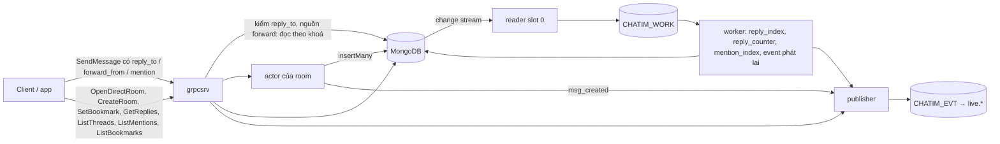
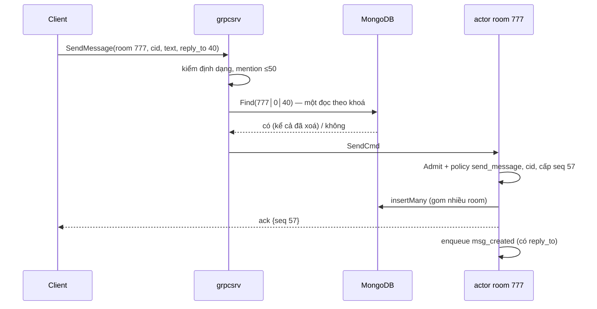
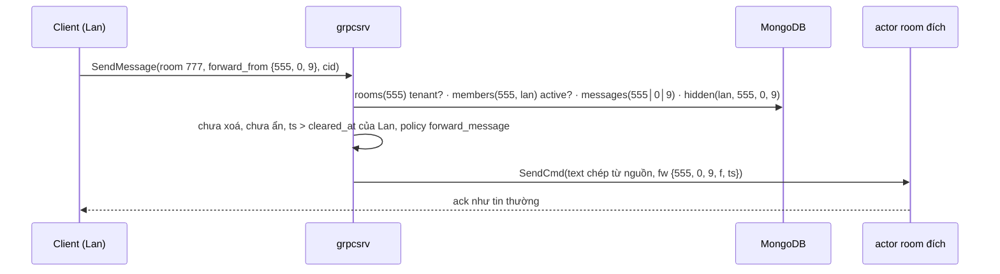
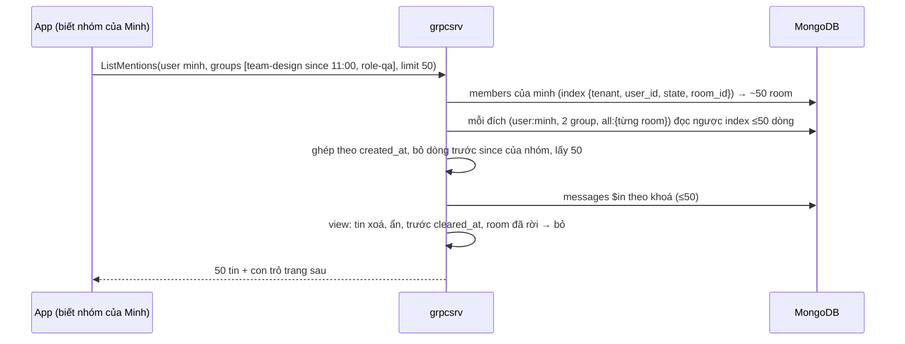

# M2c — Trả lời, mention, forward, bookmark, hai đường tạo room: tóm tắt kỹ thuật

> Trạng thái: **bản để owner duyệt, chưa thực thi** (viết 2026-10-10, sửa cùng ngày theo phản biện của owner, nhánh chung `feat/m2c`). Hướng đi chốt qua brainstorm 2026-10-09 → 2026-10-10 (decision log local `.claude/plans/m2c-threads-mentions_design.md`, 2 reviewer độc lập + 1 research). Plan execute cho AI viết sau khi bản này được duyệt, ở `.claude/plans/2026-10-10-m2c-threads-mentions.md`. Gồm cả việc tồn đọng R1–R5 ([roadmap](../roadmap.md#việc-tồn-đọng-đưa-vào-m2c-owner-chốt-2026-10-09)). Quyết định mới ghi vào Decision Log của [thiết kế](../designs/261005-chatim-architecture.md) từ D112.
>
> **[owner chốt]** là điểm owner đã quyết. Mọi điểm mặc định đã được owner xác nhận ngày 2026-10-10 (mục 11).

## 1. Thuật ngữ

| Từ | Nghĩa |
|---|---|
| trả lời có trích | Tin bình thường ở timeline chính, mang con trỏ `reply_to` tới một tin khác cùng room; client hiện phần trích ở trên. Đây là "thread" của sản phẩm: **không có nhánh chat riêng** **[owner chốt]** |
| tin cha | Tin được trả lời |
| số trả lời | Số tin trả lời trực tiếp một tin cha, không tính trả lời đã xoá ("2 trả lời") |
| forward | Chép một tin từ room nguồn sang room đích, mang con trỏ `forward_from` |
| đích mention | Thứ được nhắc trong tin: một user, một nhóm (`kind` + `id` do app đặt), hoặc `@all` của room |
| projection | Dữ liệu suy ra từ fact, worker ghi lại được bất cứ lúc nào (thiết kế §4). Ở đây: `replies`, `threads`, `mentions` |
| aggregate theo target | Một con số tính từ nhiều fact của một target, đếm lại rồi ghi có điều kiện trên `ver` (như số reaction, D90). Ở đây: số trả lời |
| lớp tập | Mỗi phần tử (vd mỗi (tin, user)) một doc riêng có `ver` riêng; gỡ thì để tombstone (thiết kế §4). Ở đây: bookmark |
| sổ tra DM | Bảng tra cặp user → room id của DM (`room_dms`); `rooms` vẫn là gốc |
| bước "đảm bảo" | Chuỗi ghi chạy lại bao nhiêu lần cũng ra cùng kết quả; core chết giữa chừng thì lần gọi sau làm nốt |
| phiếu hẹn sinh tồn | Message hẹn giờ của NATS đặt trước một cặp ghi không nguyên khối, xoá sau khi xong; không bị xoá thì tự bật và sửa (§7.1, D111) |
| `$max` | Toán tử Mongo: chỉ ghi nếu giá trị mới lớn hơn; nhiều worker ghi theo thứ tự nào cũng ra cùng kết quả |
| worker / Nak | Phần chạy nền ở mọi core, làm phiếu việc từ `CHATIM_WORK`; lỗi thì trả phiếu (Nak) để làm lại |

## 2. Bức tranh chung

Mọi tính năng xếp vào lớp dữ liệu sẵn có (thiết kế §4), không lớp mới:

| Tính năng | Lớp | Ghi ở đâu | Event | Sửa lỗi |
|---|---|---|---|---|
| Trả lời có trích | Fact (tin) | `messages`, field `rp`, qua actor như tin thường | `msg_created` (thêm `reply_to`) | Như tin thường |
| Danh sách trả lời của một tin | Projection | collection mới `replies` | không | Worker dựng lại từ phiếu tin |
| Danh sách tin có trả lời của room | Projection `$max` | collection mới `threads` | không | Như trên |
| Số trả lời | Aggregate (như số reaction) | `messages.rc` | `counts_changed` (counter `replies`) | Worker đếm lại |
| Mention, `@all` | Field trên tin + projection index | `messages` (`mt`, `ma`) + collection mới `mentions` | trong `msg_created` | Worker dựng lại index từ phiếu tin |
| Forward | Field trên tin | `messages`, field `fw` | trong `msg_created` | Như tin thường |
| Bookmark | Tập | collection mới `bookmarks` | `bookmark_changed` | Worker phát lại doc hiện tại |
| Mở DM | Sổ tra + bước "đảm bảo" | collection mới `room_dms`; `rooms`, `members` | `room_created`, `member_added`, `member_count_changed` (đã có) | Gọi lại → làm nốt; phiếu hẹn sửa số member |
| Tạo group | Như CreateRoom hiện tại + `request_id` | `rooms`, `members` | như trên | Như trên |



Ví dụ: Lan trả lời tin seq 40 của room 777 bằng "ok @minh @team-design".
1. `grpcsrv` kiểm tin 40 có trong room 777 (một đọc theo khoá). Actor cấp seq 57 ở timeline chính, ghi tin với `rp = {th 0, s 40}` và đích mention, trả ack, phát `msg_created`.
2. Mongo ghi nhật ký; reader chép thành phiếu `MessageInserted (777, 0, 57)`.
3. Worker:
   - `reply_index`: ghi dòng `replies (777│0│40 │ 57)` và `threads (777│40)` `$max last_reply_seq = 57, last_reply_at`.
   - `mention_index`: ghi 2 dòng `mentions` (`user:minh`, `group:team-design`).
   - `reply_counter`: đếm `replies` của tin 40 được 3, ghi `messages(777│0│40).rc = {n 3, v 3}`, phát `counts_changed` (counter `replies`).
4. Mọi người đang xem room thấy "3 trả lời" dưới tin 40; bấm vào thì `GetReplies` trả 3 tin. Minh mở "Tôi được nhắc tới" thấy tin 57; app thông báo nghe `msg_created` và tự bung `team-design` ra người.

**Package dự kiến đụng tới:** `api/grpcsrv` (RPC mới, kiểm reply/forward), `send/actor` (R5), `send/dedupe` (request id tạo room), `change/mutate` (bookmark, R1), `change/pinproj` và `change/counter` (R1; `counter` dùng chung cho số trả lời), `event/effects` (`reply_index`, `reply_counter`, `mention_index`, `bookmark_event`; R3), `event/work`, `event/reconcile`, `event/resync`, `store/*` (5 collection mới), `model/domain`, `model/pbconv`, `model/access`, `proto/chatim/v1`, `tools/corecli` (e2e phase 6).

## 3. Dữ liệu và tên field

Theo quy tắc tên (D96): `messages` giữ tên ngắn, collection khác dùng tiếng Anh đầy đủ.

**Vì sao số ở `messages`, danh sách ở collection riêng:** `messages` (hàng tỷ tin) không có index phụ; mọi truy vấn phải theo khoá `room│seq`. Số đặt trên tin (`rx` của reaction, `rc` của trả lời) để **hiện ngay khi đọc trang lịch sử**, không tốn thêm truy vấn. Còn câu hỏi ngược "tin nào có trả lời", "các trả lời của tin 40", "tin nào nhắc Minh" thì phải hỏi collection riêng có khoá/index phù hợp (`threads`, `replies`, `mentions`), giống `reactions` đang làm cho reaction.

### 3.1 Field mới trên `messages` (tên ngắn)

| Field | Tên đầy đủ | Nghĩa | Ví dụ | Dùng để |
|---|---|---|---|---|
| `rp` | reply_to | Tin cha, cùng room: `{th, s}` (`th` luôn 0) | `{th: 0, s: 40}` | Hiện trích dẫn; nội dung trích lấy lúc đọc |
| `rc` | reply_count | Số trả lời: `{n, v}`, `v` là version của số (như `rx.v`) | `{n: 3, v: 3}` | Hiện "3 trả lời" trong `GetHistory` |
| `fw` | forward_from | Nguồn gốc: `{r, th, s, f, ts}` = tin đầu tiên (room, thread, seq), tác giả gốc, lúc gửi gốc | `{r: 555, th: 0, s: 9, f: "lan", ts: …}` | Ô ghi chú "Lan: Báo giá 100 triệu"; dòng "chuyển tiếp từ …" là người gửi tin mới |
| `mt` | mention_targets | Đích mention, tối đa 50: `[{k, i}]`, `k` = `user` hoặc `group` | `[{k: "user", i: "minh"}, {k: "group", i: "team-design"}]` | Event, index `mentions` |
| `ma` | mention_all | Có `@all` | `true` | Như trên; quyền dùng do policy |

- Không có nhánh thread: `thread_root` vẫn nằm trong khoá nhưng luôn 0; cổng `ValidateThread` giữ nguyên.
- Sửa tin **[owner chốt]**: mention có đổi thì lệnh sửa gửi danh sách mới (`mt`/`ma`); không gửi nghĩa là giữ nguyên. Dòng `message_edits` lưu `mention_targets`, `mention_all` của phiên bản đó; projection ghi đè `mt`/`ma` khi có đổi. `rp` và `fw` không đổi khi sửa.
- Không có `@here` **[owner chốt]**.

### 3.2 Collection mới `replies` (danh sách trả lời của một tin)

`_id` = `khoá tin cha (24 byte) │ seq tin trả lời (8 byte)`, clustered, dài cố định 32 byte nên quét khoảng theo `_id` đúng thứ tự.

| Field | Nghĩa | Ví dụ |
|---|---|---|
| `room_id`, `tenant` | Room, tenant | `777`, `acme` |
| `parent_seq` | Seq tin cha | `40` |
| `reply_seq` | Seq tin trả lời | `57` |
| `sender_id` | Người trả lời | `lan` |
| `state` | 1 còn, 2 tin trả lời đã bị xoá | `1` |
| `created_at`, `updated_at` | Lúc trả lời, lúc đổi `state` | |

Không index phụ: "các trả lời của tin 40" = quét khoảng `_id` có tiền tố `777│0│40`; số trả lời = số dòng `state = 1` trong khoảng này. Tin trả lời bị xoá thì dòng chuyển `state = 2`, **không tính** vào số và không hiện trong danh sách **[owner chốt]**.

### 3.3 Collection mới `threads` (tin có trả lời của room)

`_id` = `room│seq tin cha` (16 byte, clustered). Mỗi tin có ít nhất một trả lời một doc.

| Field | Nghĩa | Ví dụ |
|---|---|---|
| `room_id`, `tenant` | | `777`, `acme` |
| `parent_seq` | Seq tin cha | `40` |
| `last_reply_seq` | Seq trả lời mới nhất | `57` |
| `last_reply_at` | Lúc trả lời mới nhất | `2026-10-10T09:15:02Z` |
| `created_at`, `updated_at` | | |

Index `{room_id, last_reply_at}`: màn "trao đổi gần đây của room" (`ListThreads`) và resync. **Không** giữ số trả lời (nguồn duy nhất là `rc` trên tin, để khỏi lệch); màn liệt kê lấy số bằng một `$in` vào `messages`.

### 3.4 Collection mới `mentions` (index mention)

`_id` = `khoá tin │ loại đích │ id đích` (clustered; chỉ đọc/ghi theo khoá).

| Field | Nghĩa | Ví dụ |
|---|---|---|
| `target` | Đích dạng chuỗi: `user:{id}`, `group:{id}`, `all:{room}` | `group:team-design` |
| `tenant`, `room_id`, `thread_root`, `seq` | Vị trí tin | `acme`, `777`, `0`, `57` |
| `sender_id` | Người gửi | `lan` |
| `created_at` | Lúc gửi tin | |
| `state` | 1 còn, 2 đã gỡ (sửa bỏ mention, tin bị xoá) | `1` |
| `message_ver` | Phiên bản tin đã dựng dòng này | `2` |
| `updated_at` | | |

Index `{tenant, target, state, created_at: -1}` (màn mention) và `{room_id, updated_at}` (resync). Tin 57 nhắc `@minh`, `@team-design`, `@all` → 3 dòng; room 200K người với `@all` vẫn **1 dòng**.

### 3.5 Collection mới `bookmarks`

`_id` = `khoá tin │ user` (clustered; giống `reactions`, D88).

| Field | Nghĩa | Ví dụ |
|---|---|---|
| `message_key`, `room_id`, `tenant`, `thread_root`, `seq`, `user_id` | Khoá tách ra | |
| `state` | 1 có bookmark, 2 đã gỡ (tombstone) | `1` |
| `ver` | Số lần đổi | `1` |
| `created_at`, `updated_at` | | |

Index `{tenant, user_id, state, updated_at: -1}` (bookmark của tôi) và `{room_id, updated_at}` (resync). Không có ghi chú **[owner chốt]**.

### 3.6 Collection mới `room_dms` (sổ tra DM)

`_id` = chuỗi `tenant│user nhỏ│user lớn` (dấu `│` an toàn vì user id chỉ gồm `[A-Za-z0-9_-]`).

| Field | Nghĩa | Ví dụ |
|---|---|---|
| `room_id` | Room DM của cặp này | `8812…` |
| `created_at` | | |

`rooms` vẫn là gốc: room DM là room bình thường. Trên `rooms` thêm `dm_key` (không unique) để kiểm "room này đúng là DM của cặp này". Index unique `{tenant, dm_key}` dự kiến trong thiết kế §5 **bị bỏ** (không giữ được khi shard `rooms` theo `_id`).

### 3.7 Config, khoá Redis, giới hạn mới

| Tên | Mặc định | Nghĩa |
|---|---|---|
| `MENTION_TARGETS_MAX` | `50` | Số đích mention mỗi tin (A6), đếm user + nhóm |
| `MENTION_GROUPS_MAX` | `100` | Số nhóm người gọi truyền vào `ListMentions` |
| `REPLY_COUNT_DELAY` | `1s` | Delay của worker đếm lại số trả lời (như `REACTION_COUNT_DELAY`) |
| `BOOKMARK_LIMIT` | `1000` | Giới hạn mềm số bookmark mỗi user **[owner chốt]** |
| khoá `chatim:req:create:{tenant}:{user}:{request_id}` | TTL `CID_COMMITTED_TTL` | Chống tạo group trùng khi retry (Redis dedupe) |

## 4. Luồng xử lý

### 4.1 Gửi trả lời có trích



- Tin cha không có → `NOT_FOUND`. Tin cha đã xoá (xoá khi chưa có trả lời) vẫn cho trả lời, ô trích hiện "đã xoá". Trả lời một tin trả lời được phép; danh sách chỉ gồm trả lời **trực tiếp** **[owner chốt]**.
- Kiểm tin cha ở `grpcsrv`, không trong actor, để không làm chậm hàng đợi của room.
- Va seq với core khác lúc chuyển slot: **trả `UNAVAILABLE` và nhường room ngay**, không gán lại seq (R5) **[owner chốt]**; client gửi lại cùng cid.

### 4.2 Đếm và xem các trả lời

Từ phiếu `MessageInserted` có `rp`, và phiếu `EditInserted` loại xoá của một tin trả lời:
1. Effect `reply_index` (delay 0): tin mới → upsert dòng `replies` theo `_id` (`$setOnInsert`, chạy lại không sinh bản thứ hai) và `threads` `$max last_reply_seq`, `$max last_reply_at`; tin trả lời bị xoá → dòng `replies` chuyển `state = 2`.
2. Effect `reply_counter` (delay `REPLY_COUNT_DELAY`, một lần mỗi tin cha mỗi lô): đếm số dòng `state = 1` trong khoảng `replies` của tin cha (đọc majority), bằng `rc` hiện tại thì thôi, khác thì ghi `rc` có điều kiện `rc.v == v` cũ (CAS), phát `counts_changed` (counter `replies`). Trượt CAS → Nak, làm lại sau; không thử lại trong core (R1). Dùng chung package `counter` với số reaction.

Fast path không cập nhật số: client thấy `msg_created` của trả lời và tự cộng tạm trên màn; số đúng tới sau `REPLY_COUNT_DELAY` qua `counts_changed`.

Đọc:
- `GetHistory`: `rc` có sẵn trên tin; thêm **một** `$in` lấy bản xem trước các tin cha được trích trong trang, áp view (xoá → không text, ẩn với người xem → `hidden`).
- `GetReplies(room, seq, after, limit ≤ 50)`: `Admit` → quét `replies` theo tiền tố → `messages` `$in` → view. Tin cha không có → `NOT_FOUND`.
- `ListThreads(room, before, limit ≤ 50)`: `Admit` → index `{room_id, last_reply_at}` → `messages` `$in` (lấy tin cha + `rc`) → view; bỏ tin có `rc.n = 0` (mọi trả lời đã bị xoá) **[owner chốt: làm ở M2c]**.

**Chặn xoá tin còn trả lời [owner chốt].** `DeleteMessage` (sau `Allow`, trước khi ghi fact xoá) đếm trực tiếp số dòng `state = 1` của tin trong `replies` (đọc majority, không dùng `rc` vì `rc` trễ ~1s); còn ≥ 1 → `FAILED_PRECONDITION` (`ErrHasReplies`). Muốn xoá thì phải xoá các trả lời trước. Cửa sổ còn lại: trả lời vừa gửi nhưng worker chưa kịp ghi vào `replies` (độ trễ reader, thường dưới 1 giây) thì lệnh xoá vẫn qua; kết quả là tin "đã xoá" có một trả lời, giống trả lời một tin đã xoá, không mất dữ liệu.

### 4.3 Forward



- Kiểm ở `grpcsrv` trước actor: bốn lần đọc theo khoá, chạy ở core nào cũng được.
- Text lấy từ tin nguồn, client không sửa được; nguồn bị xoá sau đó thì bản forward không đổi (là bản chép). Không forward giữa tenant.
- Hiển thị **[owner chốt]**: Lan viết "Báo giá 100 triệu" ở room A, Minh forward sang B, Hùng forward tiếp sang C. Ở room C: dòng "chuyển tiếp từ Hùng" (Hùng là người gửi tin mới), ô ghi chú "Lan: Báo giá 100 triệu". Forward lại một tin forward thì `fw` chép nguyên từ tin nguồn (vẫn trỏ Lan và tin ở room A); người forward trung gian (Minh) không lưu.
- Lỗi: nguồn không có → `NOT_FOUND`; không phải member hoặc không được đọc → `PERMISSION_DENIED`; nguồn đã xoá → `FAILED_PRECONDITION`.

### 4.4 Mention và màn "Tôi được nhắc tới"

- Gửi: client gửi `mt` (user/nhóm) và `ma`. Core chỉ kiểm định dạng, bỏ trùng, ≤ `MENTION_TARGETS_MAX`; **không** kiểm user có trong room, **không** bung nhóm **[owner chốt]**. `@all` qua policy `mention_all`: mặc định ai cũng dùng được, tenant chặn bằng policy **[owner chốt]**.
- Index: effect `mention_index` (delay 0) từ `MessageInserted`/`EditInserted`: upsert dòng mỗi đích, tombstone đích bị sửa bỏ hoặc khi tin bị xoá; chỉ ghi khi `message_ver` của phiếu ≥ dòng hiện có.
- Đọc: `ListMentions(groups[{id, since?}], before, limit ≤ 50)`.



- App truyền nhóm của user và mốc `since` nếu muốn; core không có model nhóm **[owner chốt]**.
- Số mention chưa đọc tính lúc đọc theo room, làm ở M3.

### 4.5 Bookmark

- `SetBookmark(room, seq, on)`: tin phải tồn tại; người gọi là member active (`Admit`). Một upsert theo `_id`; giống trạng thái cũ → không ghi, không event; gỡ → `state = 2`, `ver + 1`. Event `bookmark_changed`.
- `ListBookmarks(before, limit ≤ 50)`: index `{tenant, user_id, state, updated_at: -1}` → tin → view và quyền hiện tại (rời room hay tin đã xoá thì bookmark vẫn nằm trong danh sách, hiện "không còn xem được") **[owner chốt]**.

### 4.6 Mở DM: `OpenDirectRoom(other_user)` [owner chốt]

```mermaid
sequenceDiagram
  participant C as Lan
  participant G as grpcsrv
  participant T as work.Timers
  participant DB as MongoDB
  C->>G: OpenDirectRoom(minh)
  G->>DB: room_dms FindOneAndUpdate(_id acme│lan│minh, $setOnInsert room 8812, upsert)
  DB-->>G: room 8812 (của mình hoặc của người mở trước)
  alt room 8812 và 2 member đã có
    G-->>C: {room 8812, created false}
  else thiếu phần nào
    G->>T: hẹn phiếu đếm lại member
    G->>DB: rooms insert (dm_key); trùng chỉ chấp nhận khi dm_key khớp
    G->>DB: members BulkWrite 2 người (request_id 8812-created, role member)
    G->>T: gỡ phiếu
    G-->>C: {room 8812, created true}; phát room_created, member_added ×2, member_count_changed
  end
```

- Lan và Minh mở cùng lúc: cả hai nhận room 8812 (filter theo `_id`, Mongo tự xử lý đua), core không thử lại.
- Core chết giữa chừng: lần mở sau của ai cũng làm nốt.
- Hai người đều là `member`, DM không có owner. Nhắn cho chính mình → `INVALID_ARGUMENT`. Policy `open_direct` (mặc định mọi user trong tenant; chặn/block sau này cắm vào đây).
- Room id ngẫu nhiên vô tình trùng một room khác (gần như không xảy ra): ghi sổ sang id mới bằng CAS rồi trả `UNAVAILABLE`, client gọi lại.
- Link DM dễ nhớ do app làm bằng cặp username (`…/dm/lan--minh/120`); không có alias **[owner chốt]**.

### 4.7 Tạo group: `CreateRoom` (chỉ group/channel) [owner chốt]

- Không nhận loại DM nữa (`INVALID_ARGUMENT`).
- `request_id` bắt buộc: dedupe `chatim:req:create:{tenant}:{user}:{request_id}` → đã xong thì trả room cũ; đang chạy ở core khác → `UNAVAILABLE`.
- Room id ngẫu nhiên **một lần**; trùng → `UNAVAILABLE` (bỏ vòng bốc lại 3 lần).
- Hẹn phiếu đếm lại member **trước** khi ghi room, gỡ **sau** khi ghi member (sửa lỗi hiện tại: core chết giữa room và member để `member_count` sai mãi).

### 4.8 Việc tồn đọng R1–R3

- **R1** bỏ vòng thử lại nội bộ: ghim (append trùng `pin_ver` → `UNAVAILABLE` ngay), projection ghim (một lượt; fast path trượt CAS trả fold cục bộ, worker Nak), đếm reaction (touch một lượt, fast path bỏ qua lỗi, worker Nak). Số trả lời theo luôn luật này từ đầu.
- **R2** review `Config.LogValue` (log mọi field không bí mật) và `GetEditHistory` (cửa sổ giữa fact xoá và projection): sửa hoặc ghi lý do giữ.
- **R3** effect `room_created` chỉ đếm PubAck không trùng.

## 5. Cơ chế đúng đắn và các ca chạy đua

| Ca | Kết quả | Vì sao |
|---|---|---|
| Hai core cùng ghi một room lúc chuyển slot | Một tin thắng seq; bên thua `UNAVAILABLE`, nhường room; client gửi lại cùng cid | `_id` unique là CAS; cid chống trùng |
| Phiếu `reply_index` chạy hai lần | Vẫn một dòng `replies`; `threads` không lùi | Upsert theo `_id`; `$max` |
| Hai trả lời cho tin 40 cùng lúc | `rc` cuối = số dòng thật | Đếm lại rồi CAS `rc.v`; bên trượt Nak, lần sau đếm lại |
| Trả lời bị xoá | Số giảm 1, trả lời biến khỏi danh sách | Dòng `replies` chuyển `state = 2`, worker đếm lại |
| Xoá tin cha còn trả lời | `FAILED_PRECONDITION` | Lệnh xoá đếm thẳng `replies`; cửa sổ dưới 1 giây vô hại (mục 4.2) |
| Sửa tin bỏ mention, phiếu sửa đến trước phiếu tin mới | Index đúng phiên bản mới | Chỉ ghi khi `message_ver` ≥ dòng hiện có |
| Lan và Minh mở DM cùng lúc | Cùng một room | `_id` của `room_dms` duy nhất |
| Core chết giữa ghi sổ DM và tạo member | Lần mở sau làm nốt; phiếu hẹn sửa số member | Bước "đảm bảo", D111 |
| Retry `CreateRoom` sau khi lần đầu đã ghi | Trả room cũ (trong 15 phút) | `request_id` |
| Forward tin đúng lúc nó bị xoá ở nguồn | Kiểm sau khi xoá → `FAILED_PRECONDITION`; kiểm trước → bản forward là bản chép hợp lệ | Kiểm theo trạng thái lúc đọc |

**Chỗ phải xếp hàng:** chỉ actor của room (đã có). Không có số đánh liên tục mới, không có khoá chung mới. Số trả lời của một tin nóng là một điểm tranh (CAS `rc.v`), như số reaction; gom W + K để milestone Channel.

## 6. Event và subject

| Subject | Kind | Id | Ghi chú |
|---|---|---|---|
| `message` | `msg_created` (đã có) | `{room}-{thread}-{seq}` | Thêm `reply_to`, `forward_from`, `mention_targets`, `mention_all` |
| `message` | `counts_changed` (đã có, counter mới `replies`) | `{room}-0-{seq}-replies-v{v}` | Số trả lời hiện tại; chỉ trạng thái cuối được bảo đảm |
| `member` | `bookmark_changed` (mới) | `{room}-bm-0-{seq}-{user}-v{ver}` | Riêng tư theo user như `message_hidden`; gateway chỉ gửi cho chính user đó |
| `room`/`member` | `room_created`, `member_added`, `member_count_changed` (đã có) | | Đường DM phát như CreateRoom |

`replies`, `threads`, `mentions` là projection, không có event riêng và không vào feed. Feed thêm thay đổi của `bookmarks` (kind mới); worker phát lại doc hiện tại.

## 7. Thư viện và hạ tầng

- Không thư viện mới. Mongo: collection clustered, `$max`, upsert `$setOnInsert`, `FindOneAndUpdate` upsert, `countDocuments` trên khoảng `_id`. NATS: message schedule đã có.
- 5 collection mới tạo ở bootstrap: `replies`, `threads`, `mentions`, `bookmarks`, `room_dms`. Shard sau này theo `{_id: 1}` (`replies`, `threads`, `mentions`, `bookmarks` bắt đầu bằng room/khoá tin). Truy vấn theo user (`{tenant, user_id, …}`, `{tenant, target, …}`) sẽ scatter-gather khi đã shard, giống "room của user" trên `members`.
- Resync: `replies`, `threads`, `mentions` và số trả lời tự dựng lại từ phiếu tin (resync đã quét timeline chính); thêm quét `bookmarks` theo `updated_at`.

## 8. Quyết định kỹ thuật và phương án đã loại

| Quyết định | Phương án loại | Lý do |
|---|---|---|
| "Thread" = trả lời có trích ở timeline chính + số trả lời + danh sách trả lời | Nhánh chat riêng kiểu Slack/Discord (timeline, seq riêng, theo dõi thread, vị trí đọc thread) | Owner chốt: không làm nhánh riêng. Bỏ seq theo thread trong actor, `thread_subs`, mở cổng `thread_root ≠ 0` |
| Số trả lời = đếm lại + CAS trên `messages.rc` (cùng cơ chế số reaction) | `$max` seq; `$inc` | Trả lời nằm rải ở timeline chính nên seq cuối không phải số trả lời; `$inc` mất/nhân số khi worker chết giữa hai lần ghi |
| `threads` chỉ giữ thời điểm, không giữ số | Lưu số ở cả hai nơi | Một nguồn sự thật, không lệch |
| Chặn xoá tin còn trả lời, đếm thẳng `replies` lúc xoá | Cho xoá, giữ chỗ "tin đã xoá"; dựa vào `rc` | Owner chốt chặn xoá; `rc` trễ ~1s nên đếm thẳng |
| Forward: hiện người forward gần nhất + tác giả, nội dung gốc | Chỉ người forward; không ghi nguồn | Owner chốt |
| Room id giữ số 63-bit ngẫu nhiên; DM qua sổ `room_dms` + bước "đảm bảo" | Id DM = băm(cặp user); ghép chuỗi; ObjectId/ULID | Băm: ~5% có cặp trùng ở 1 tỷ cặp → lộ DM. Ghép chuỗi/ObjectId/ULID không vừa khoá 8 byte, phải viết lại store; id theo thời gian gây điểm nóng khi shard |
| Hai đường tạo room: `OpenDirectRoom`, `CreateRoom` (group) | Index unique `{tenant, dm_key}` trên `rooms`; tạo DM ngầm khi gửi tin đầu | Index unique không giữ được khi shard; core chết giữa chừng làm cặp mắc kẹt. Gửi tin cần room id để định tuyến và chống trùng cid; `room_created` phải trước `msg_created` |
| Mention lưu theo đích, bung nhóm do nơi xử lý | Lưu phẳng tin × người nhận (Zulip, Matrix); bộ đếm trên dòng nhóm; search engine | Phẳng: `@all` room 200K = 200K dòng mỗi tin. Bộ đếm: mỗi người đọc khác nhau. Search engine ngoài Phase 1 |
| Bỏ `@here`; không alias room | | Owner chốt |
| Bookmark clustered `khoá tin│user` | ObjectId + `{tenant, user_id, created_at}` không unique (thiết kế §5 cũ) | Không unique thì ghi không idempotent, resync theo room không được |
| Bỏ vòng gán lại seq của actor (R5) | Giữ làm ngoại lệ | Owner chốt; `_id` CAS đủ đúng, client retry cùng cid |
| Kiểm reply/forward ở `grpcsrv` trước actor | Kiểm trong actor | Actor chạy tuần tự theo room; đọc majority trong actor làm nghẽn room |

## 9. Chi phí và tải

| Thao tác | Ghi | Đọc | Event |
|---|---|---|---|
| Gửi trả lời | 1 insert (gom) + worker: 1 upsert `replies` + 1 `$max` `threads` + ≤1 CAS `rc` | +1 đọc tin cha; worker 1 đếm khoảng nhỏ | `msg_created` + `counts_changed` |
| Tin có mention | + ≤51 upsert `mentions` (worker) | | không thêm |
| `@all` ở channel 200K | + 1 dòng `mentions` | | không thêm |
| `GetHistory` 1 trang | | +1 `$in` (xem trước tin được trích) | |
| `GetReplies` / `ListThreads` | | 1 quét khoảng/index + ≤50 đọc tin | |
| `ListMentions` 1 trang | | ~1 + số nhóm + số room (~50) lượt đọc index, mỗi lượt ≤50 dòng; ≤50 đọc tin | |
| Forward | như gửi tin | +4 đọc theo khoá | `msg_created` |
| Bookmark | 1 upsert | 1 đọc tin | 1 |
| Mở DM đã có | | 1 đọc theo khoá | |
| Mở DM mới | 1 upsert sổ + 1 room + 2 member + phiếu hẹn | | 4 |

- Index mention: ở 10K tin/s, 1% có mention, ~3 đích → ~300 dòng/s × ~200 byte ≈ 5GB/ngày nếu đỉnh kéo dài cả ngày (thực tế thấp hơn nhiều).
- `replies`: một dòng ~150 byte mỗi tin trả lời.
- Băng thông: mỗi trả lời là `msg_created` tới mọi người nghe room; channel 200K là gánh của gateway.

## 10. Rủi ro và giới hạn

- Tin có rất nhiều trả lời: mỗi lần đếm lại O(số trả lời), như reaction; gom W + K ở milestone Channel.
- Số trả lời trễ ~`REPLY_COUNT_DELAY` so với tin trả lời (client tự cộng tạm).
- Chặn xoá tin cha có cửa sổ dưới 1 giây (trả lời chưa vào `replies`).
- Màn mention ghép ~50 room + N nhóm: nhiều lượt đọc mỗi trang; đo ở PoC prod-like, chậm thì gom `all:{room}` bằng `$in`.
- Dedupe `request_id` của `CreateRoom` chỉ giữ 15 phút và khi Redis còn khoá.
- User id bị xoá rồi dùng lại thừa hưởng DM cũ: cấm dùng lại user id hoặc tombstone sổ DM (policy, sau).
- Sửa tin mang cả mention: đổi đường sửa của M2b.2 (`message_edits` thêm field).
- Số mention chưa đọc, unread nói chung: M3.

## 11. Điểm owner đã xác nhận (2026-10-10)

1. Số trả lời không tính trả lời đã xoá; tin còn trả lời thì không cho xoá.
2. Trả lời của một trả lời được phép; danh sách của một tin chỉ gồm trả lời trực tiếp.
3. `ListThreads` làm ở M2c.
4. Sửa tin: mention có đổi thì gửi danh sách mới, không đổi thì không gửi.
5. `@all` mặc định ai cũng dùng được, chặn qua policy.
6. Forward: hiện "chuyển tiếp từ {người forward}", ô ghi chú có tên tác giả gốc và nội dung gốc.
7. Bookmark: tối đa 1000 mỗi user (giới hạn mềm), không ghi chú; rời room hay tin bị xoá thì vẫn trong danh sách, hiện "không còn xem được".
8. `ListBookmarks` và `ListMentions` làm ở M2c.

## 12. Kiểm thử, mỗi mục chứng minh gì

| Test | Chứng minh |
|---|---|
| grpcsrv: trả lời tin không có, tin đã xoá, tin room khác | Mã lỗi đúng; đã xoá vẫn cho trả lời |
| actor: va seq core khác | `UNAVAILABLE` ngay, nhường room, không gán lại (R5) |
| `reply_index` chạy hai lần, lệch thứ tự | Một dòng `replies`; `threads` không lùi |
| `reply_counter` hai trả lời đua, CAS trượt, trả lời bị xoá | Số cuối = số trả lời còn sống; trượt thì Nak, không vòng thử lại |
| `DeleteMessage` tin còn trả lời / hết trả lời | `FAILED_PRECONDITION` / cho xoá |
| `GetReplies`, `ListThreads` với tin xoá/ẩn/`cleared_at` | Che đúng, phân trang đúng |
| `mention_index` sửa bỏ mention, phiếu đến lệch | Index theo phiên bản mới nhất |
| `ListMentions` với `since`, room đã rời, tin xoá/ẩn | Ghép đúng thứ tự, che đúng |
| forward: không member nguồn, nguồn ẩn/xoá, khác tenant; forward của forward | Mã lỗi đúng, text chép từ nguồn, `fw` giữ tác giả gốc |
| `OpenDirectRoom` song song, core chết giữa bước | Một room, lần sau làm nốt, số member đúng |
| `CreateRoom` retry cùng `request_id`; gửi loại DM | Không tạo room thứ hai; DM bị từ chối |
| storetest cho 5 collection mới (mem + Mongo) | Hai adapter cùng hợp đồng |
| resync: trả lời, mention, bookmark trong khoảng mất | Dựng lại đủ |
| R1–R3 | Một lượt rồi `UNAVAILABLE`/Nak; `room_created` không đếm bản trùng |
| e2e phase 6 (corecli) | Mở DM hai lần ra cùng room; trả lời + số trả lời + `GetReplies` + `ListThreads`; mention + `ListMentions`; forward; bookmark; live event đủ id, kind, subject |
