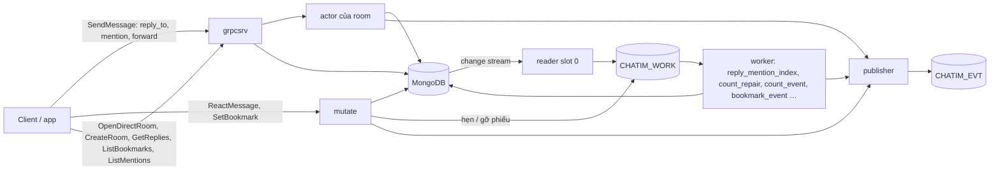
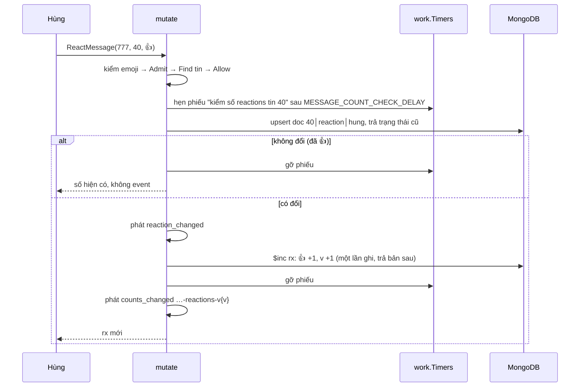

# M2c — Tương tác với tin, mention, forward, tạo room: tóm tắt kỹ thuật

> Trạng thái: **đã xây** (thực thi xong 2026-10-10 trên nhánh chung `feat/m2c`), thành **`dev-done` khi merge** `main` qua một PR. Bản này viết lại từ cái đã thực sự xây: owner duyệt bản trước khi code (commit `1db822c`); mọi chỗ đội làm khác bản đó nằm ở mục 11.2. Plan execute cho AI ở `.claude/plans/2026-10-10-m2c-threads-mentions.md` (local, có mục "Kết quả thực thi" theo từng task). Quyết định D112–D119 nằm trong Decision Log của [thiết kế](../designs/261005-chatim-architecture.md) §17.2; thiết kế là nguồn sự thật hiện hành.

## 1. Thuật ngữ

| Từ | Nghĩa |
|---|---|
| tương tác | Người khác làm gì đó **với** một tin: react, trả lời, lưu (bookmark) |
| mention | Người gửi **chỉ định** user, nhóm hoặc `@all` ngay trong tin |
| trả lời có trích | Tin bình thường ở timeline chính, trỏ tới tin được trả lời (tin cha); client hiện ô trích phía trên. Không có nhánh chat riêng |
| số trên tin | Số hiện dưới tin: reaction theo emoji (`rx`), số trả lời (`rc`) |
| phiếu hẹn sinh tồn | Message hẹn giờ của NATS, đặt **trước** hai lần ghi không nguyên khối, gỡ **sau** khi xong; không bị gỡ thì tự bật và đếm lại (thiết kế §7.1, D111) |
| phiếu việc | Bản ghi ngắn (`work.Record`) reader đẩy vào hàng đợi `CHATIM_WORK` cho mỗi thay đổi; worker ở mọi core lấy ra làm (từ M2b.1) |
| tombstone | Doc không xoá mà chuyển `state = 2` (đã gỡ) |
| sổ DM | Bảng tra "cặp user → room DM" (`room_dms`); `rooms` vẫn là gốc |
| con trỏ trang | Chuỗi client gửi lại để lấy trang kế (`next`); trang rỗng hoặc không có `next` là hết |

## 2. Bức tranh chung

### 2.1 Phạm vi

| Tính năng | Người dùng thấy | RPC |
|---|---|---|
| Trả lời có trích | Bấm "Trả lời"; tin mới có ô trích; dưới tin cha hiện "2 trả lời", bấm vào xem danh sách | `SendMessage(reply_to)`, `GetReplies`; `GetHistory` kèm `reply_preview` |
| Reaction | Như M2b.3 (một emoji mỗi người mỗi tin); đổi chỗ lưu và cách đếm | `ReactMessage` |
| Bookmark | "Lưu tin", màn "Đã lưu" | `SetBookmark`, `ListBookmarks` |
| Mention | Nhắc `@user`, `@nhóm`, `@all`; màn "Tôi được nhắc tới" | `SendMessage(mentions)`, `EditMessage(mentions)`, `ListMentions` |
| Forward | "Chuyển tiếp từ Hùng" | `SendMessage(forward_from)` |
| Mở DM | Bấm vào một người luôn ra đúng một cuộc trò chuyện với họ | `OpenDirectRoom` |
| Tạo group | Như cũ, gửi lại không tạo group thứ hai | `CreateRoom(request_id)` |
| Việc tồn đọng R1–R5 | Không thấy gì; sửa cơ chế bên trong (mục 4.7) | |

Ngoài phạm vi (M3): danh sách "trao đổi gần đây của room" (`ListThreads`), số tin/mention chưa đọc.

### 2.2 Mô hình: hai dạng liên kết + một bộ đếm

| | Dạng 1: tương tác | Dạng 2: mention |
|---|---|---|
| Gồm | reaction, trả lời, bookmark | user, nhóm, `@all` |
| Lưu | `message_interactions`, loại (`kind`) nằm trong khoá | `mentions` |
| Ai ghi | reaction, bookmark: lệnh người dùng; trả lời: worker dựng từ tin trả lời | worker dựng từ tin mới/sửa/xoá |
| Số trên tin | `rx`, `rc` | không |
| Đọc | `GetReplies`, `ListBookmarks` | `ListMentions` |

**Mọi bộ đếm dùng một cơ chế** (như `member_count` từ M2b.4): cộng/trừ (`$inc`) ngay khi ghi tương tác, bọc bởi phiếu hẹn sinh tồn. Máy chết giữa hai lần ghi thì phiếu bật, worker `count_repair` đếm lại cho đúng. Không đếm lại sau mỗi tương tác.



**Ví dụ.** Lan trả lời tin 40 của room 777 bằng "ok @minh @team-design" (tin mới 57). Hùng 👍 tin 40.
1. `grpcsrv` đọc tin 40 (có, cùng room); actor ghi tin 57 với `rp = {0, 40}` và hai đích mention, trả ack, phát `msg_created`.
2. Reader thấy tin 57 trong change stream, gắn cờ "có trả lời, có mention" vào phiếu việc. Worker `reply_mention_index`: hẹn phiếu "kiểm số trả lời tin 40" → ghi doc "57 trả lời 40" → `rc` của tin 40 +1 → phát `counts_changed` `777-0-40-replies-v1` → gỡ phiếu; ghi 2 doc `mentions` (`user:minh`, `group:team-design`).
3. Hùng react: hẹn phiếu → ghi doc reaction → phát `reaction_changed` → `rx` của tin 40 thêm 👍 +1 → gỡ phiếu → phát `counts_changed` `777-0-40-reactions-v1`; Hùng nhận số mới ngay trong trả lời.
4. `GetHistory` hiện tin 40 với "👍 1 · 1 trả lời", tin 57 có ô trích tin 40; Minh thấy tin 57 trong `ListMentions`.

## 3. Dữ liệu

### 3.1 Field mới trên `messages` (tên ngắn, D96)

| Field | Nghĩa | Ví dụ | Dùng để |
|---|---|---|---|
| `rp` | Tin cha cùng room `{th, s}` (`th` luôn 0) | `{th: 0, s: 40}` | ô trích, dựng doc reply |
| `rc` | Số trả lời `{n, v}`; `v` +1 mỗi lần số đổi | `{n: 2, v: 2}` | "2 trả lời"; client bỏ event cũ theo `v` |
| `fw` | Nguồn forward: tin gốc **đầu tiên** và tác giả gốc `{r, th, s, f, ts}` | `{r: 555, th: 0, s: 9, f: "lan", ts: …}` | "Chuyển tiếp từ Lan" |
| `mt` | Đích mention `[{k: user\|group, i}]`, tối đa `MENTION_TARGETS_MAX` (50, A6) | `[{k: "user", i: "minh"}]` | dựng `mentions`, hiện tô đậm |
| `ma` | Có `@all` | `true` | dựng doc `all:{room}` |

- `rx` (reaction) giữ dạng `{c: [{e, n}], v}`. Từ M2c **số lưu không kẹp**: `n` trong `rx.c` và `rc.n` có thể tạm ≤ 0 (lý do ở mục 5). Lúc đọc, core bỏ emoji có `n ≤ 0` và kẹp `rc` về ≥ 0; số âm được đánh dấu "chưa ổn" để `count_repair` ghi lại khi phiếu bật. Một emoji về 0 còn nằm (ẩn) trong mảng tới lần sửa đó, nhiều nhất bằng số emoji cho phép.
- Xoá tin dọn `x` (text), `mt`, `ma`, `fw` (`$unset`); giữ `rp` để ô trích của chính tin đó vẫn biết nó trả lời ai.
- `thread_root` vẫn trong khoá nhưng luôn 0. Dòng `message_edits` thêm `mention_targets`, `mention_all`: mỗi dòng giữ đủ danh sách mention của phiên bản đó.
- Tin cũ không có field mới vẫn đọc được (mọi field `omitempty`).

### 3.2 `message_interactions` (dạng 1)

`_id` (clustered) = `khoá tin (24 byte) │ kind (1 byte: 1 reaction, 2 bookmark, 3 reply) │ phần riêng`: user (1–64 byte) với reaction và bookmark; `thread│seq` (16 byte) của tin trả lời với reply. `kind` nằm trong khoá nên change feed biết loại mà không đọc doc. Mọi doc reply của một tin dài đúng 41 byte nên quét khoảng `_id` (cận dưới và cận trên cũng 41 byte, vì Mongo so BinData theo độ dài trước) ra danh sách trả lời theo seq.

| Field | Nghĩa | Ví dụ |
|---|---|---|
| `message_key` | Khoá tin (24 byte) | tin 40 |
| `room_id`, `tenant` | Room, tenant | `777`, `acme` |
| `kind` | `reaction` \| `bookmark` \| `reply` (chuỗi) | `reaction` |
| `actor_id` | Người react / người lưu / người trả lời | `hung` |
| `value`, `previous_value` | Emoji hiện tại và trước đó (chỉ reaction) | `👍`, `""` |
| `reply_seq` | Seq tin trả lời (chỉ reply) | `57` |
| `state` | 1 còn, 2 đã gỡ (bỏ react, gỡ lưu, tin trả lời bị xoá) | `1` |
| `ver` | Số lần doc đổi | `1` |
| `created_at`, `updated_at` | | |

Ví dụ tin 40:

| `_id` | kind | actor_id | value | state |
|---|---|---|---|---|
| 40 │ 1 │ hung | reaction | hung | 👍 | 1 |
| 40 │ 2 │ minh | bookmark | minh | | 1 |
| 40 │ 3 │ 0│57 | reply | lan | | 1 |
| 40 │ 3 │ 0│60 | reply | hung | | 2 (tin 60 đã xoá) |

Index:
- `{message_key, kind, state, value}`: đếm lại reaction theo emoji, đếm trả lời còn sống lúc xoá tin cha (đếm phủ index).
- `{tenant, actor_id, kind, state, updated_at: -1, message_key: -1}`: `ListBookmarks` (mới lưu trước); `message_key` cuối để hai bookmark cùng mili giây vẫn có thứ tự và con trỏ ổn định, không phải sắp trong RAM.
- `{room_id, kind, updated_at}`: resync.

Collection `reactions` của M2b.3 bỏ hẳn (bootstrap không tạo nữa); dev `make infra-reset`. Hành vi, event và id reaction không đổi với client.

### 3.3 `mentions` (dạng 2)

`_id` (clustered) = `khoá tin │ loại đích (1 user, 2 nhóm, 3 @all) │ id đích` (`@all` không có id: 25 byte, một doc mỗi tin).

| Field | Nghĩa | Ví dụ |
|---|---|---|
| `message_key`, `room_id`, `tenant` | Tin, room, tenant | |
| `target` | Đích dạng chuỗi | `user:minh`, `group:team-design`, `all:777` |
| `sender_id` | Người gửi tin | `lan` |
| `state` | 1 còn, 2 đích bị sửa bỏ hoặc tin bị xoá | `1` |
| `message_ver` | Phiên bản tin đã dựng doc này | `0` |
| `created_at`, `updated_at` | `created_at` = lúc gửi tin | |

Index:
- `{tenant, target, state, created_at: -1, message_key: -1}`: `ListMentions` (mới nhất trước, `message_key` để thứ tự và con trỏ ổn định khi trùng mili giây).
- `{message_key: 1}`: đọc mọi đích hiện có của một tin khi sửa/xoá. Cần vì xoá tin `$unset mt/ma` nên worker không còn biết đích cũ từ tin, và quét `_id` theo tiền tố tin không dùng được (độ dài id đích khác nhau, Mongo so BinData theo độ dài trước).

Không index resync (dựng lại từ phiếu tin), không vào change feed. Mỗi đích một doc: `@all` ở room 200K người vẫn 1 doc. Core không bung nhóm; nơi xử lý mention tự bung.

### 3.4 `room_dms` (sổ DM) và `rooms.dm_key`

`_id` = `tenant│user nhỏ│user lớn` (ký tự `│` U+2502; user id chỉ gồm `[A-Za-z0-9_-]` nên không lẫn), field `room_id`, `created_at`. `rooms` thêm `dm_key` (cùng chuỗi, không unique, không index) để kiểm room đúng là DM của cặp đó. Ví dụ `acme│lan│minh → 8812`.

### 3.5 Config, khoá Redis, proto, phiếu việc

| Tên | Mặc định | Nghĩa |
|---|---|---|
| `MENTION_TARGETS_MAX` | `50` (> 0) | Đích mention mỗi tin và mỗi lần sửa, đếm sau khi bỏ trùng (A6); `@all` không tính |
| `MESSAGE_COUNT_CHECK_DELAY` | `5s` | Hạn phiếu sửa số trên tin; phải > `CORE_REQUEST_DEADLINE`; tách với `MEMBER_COUNT_CHECK_DELAY` |
| `REACTION_COUNT_DELAY` | — | **Bỏ** cùng worker `reaction_counter` |
| `chatim:req:create:{tenant}:{user}:{request_id}` | TTL 15 phút | Chống tạo group trùng (Redis dedupe, shard theo băm tenant+user) |

- Proto: `Message` thêm `reply_to` 15, `forward_from` 16, `mention_targets` 17, `mention_all` 18, `reply_count` 19 (`ReplyCount{count, ver}`), `reply_preview` 20 (`{seq, sender, text, deleted, hidden}`); `SendMessageRequest` thêm `reply_to`, `forward_from`, `mentions`; `EditMessageRequest.mentions` (vắng = giữ, `MentionSet{}` rỗng = xoá hết); `CreateRoomRequest.request_id`; `CountsChanged.reply_count`; event `bookmark_changed`. Service tách sang `core_service.proto`, kiểu liên kết ở `message_links.proto`, request mới ở `replies_bookmarks_mentions.proto` (wire và tên Go không đổi).
- Phiếu việc mới: kind 11 `BookmarkChanged` (id `b:{room}-bm-{thread}-{seq}-{user}-v{ver}`), kind 12 `MessageCountCheck` (chỉ từ phiếu hẹn hoặc resync, id `q:{room}-{thread}-{seq}-{reactions|replies}-{op}`, subject `work.timer.{room}.{thread}.{seq}.{counter}.{op}`). Phiếu `MessageInserted` mang **cờ** trong `Version` (1 có `rp`, 2 có mention); id phiếu không đổi.
- Trang: mọi RPC danh sách (`GetReplies`, `ListBookmarks`, `ListMentions`, như `GetHistory`) dùng chung `domain.PageLimit`: không gửi = 50, tối đa 100, quá → `INVALID_ARGUMENT`. Đây là phân trang, không phải giới hạn dữ liệu. Con trỏ: `GetReplies` là seq trả lời cuối (0 = hết); `ListBookmarks`, `ListMentions` là chuỗi mờ (thời điểm + khoá tin).

## 4. Luồng xử lý

### 4.1 Gửi tin có trả lời, mention, forward

Mọi kiểm tra cần đọc DB làm ở `grpcsrv` trước khi vào actor (actor chạy tuần tự theo room, không được chờ đọc). Tin không có `reply_to`/`forward_from` không tốn thêm lần đọc nào.

- **Trả lời:** `reply_to` kèm `thread_root ≠ 0` → `INVALID_ARGUMENT` (chưa đọc gì). Đọc tin cha theo khoá (thread 0). Có → đi tiếp, actor kiểm membership như mọi tin. Không có → hỏi quyền đọc room trước (người ngoài nhận `PERMISSION_DENIED`, không dò được seq nào tồn tại) rồi `NOT_FOUND`. Tin cha đã xoá vẫn cho trả lời (ô trích hiện "đã xoá"); trả lời một tin trả lời được.
- **Mention:** kiểm định dạng (`[A-Za-z0-9_:-]{1,64}`), bỏ trùng giữ thứ tự, ≤ 50 đích → quá thì `INVALID_ARGUMENT` (gửi quá 4 × 50 bị chặn ngay trước khi bỏ trùng); không kiểm user có trong room. `@all` hỏi policy `mention_all` ngay sau `send_message` (mặc định cho mọi member; từ chối → `PERMISSION_DENIED`).
- **Forward** (+4 lần đọc theo khoá), theo thứ tự:

  | Kiểm | Lỗi |
  |---|---|
  | có cả `reply_to`; nguồn ở thread ≠ 0, seq 0, room id sai | `INVALID_ARGUMENT` |
  | room nguồn không có hoặc khác tenant | `NOT_FOUND` |
  | người forward không là member active của nguồn | `PERMISSION_DENIED` |
  | tin nguồn không có; nguồn trước `cleared_at` hoặc bị ẩn với người forward | `NOT_FOUND` |
  | tin nguồn đã xoá | `FAILED_PRECONDITION` |
  | policy `forward_message` (tác giả và loại của tin nguồn) từ chối | `PERMISSION_DENIED` |

  Text lấy từ bản hiện tại của tin nguồn; text và mention client gửi kèm bị bỏ im lặng. `fw` = `fw` của nguồn nếu nguồn cũng là forward, không thì trỏ tin nguồn. Ví dụ: Hùng forward tin của Lan sang room B, Minh forward tiếp sang room C → tin ở C vẫn ghi "từ Lan".
- Sau đó actor ghi tin như thường, phát `msg_created` (mang `reply_to`, `forward_from`, mention). Gửi lại cùng cid trả tin gốc dù lần gửi lại mang liên kết khác (chống trùng theo (người gửi, cid), như text).

### 4.2 Reaction và bộ đếm



- Chuyển đổi → cộng/trừ: chưa có → +1 emoji mới; đổi emoji → −1 cũ, +1 mới; gỡ → −1. Tin đã xoá chỉ nhận gỡ (đặt → `FAILED_PRECONDITION`).
- Phiếu luôn hẹn **trước** khi ghi, kể cả khi lệnh hoá ra không đổi gì (khi đó gỡ ngay): chỉ sau khi ghi mới biết có đổi không.
- Hẹn phiếu lỗi → `UNAVAILABLE`, chưa ghi gì. Ghi doc lỗi → trả lỗi, **giữ phiếu** (timeout có thể đã ghi). `$inc` lỗi sau khi ghi doc → lệnh vẫn thành công, phiếu giữ nguyên và sẽ bật; trả lời mang số cũ cộng delta, không phát `counts_changed`.
- **Phiếu bật** (worker `count_repair`, delay 0): đọc số + `v` của tin, đếm lại doc `state = 1` theo index; bằng (và không âm) → chỉ phát lại `counts_changed` khi `v ≥ 1`; khác → **hẹn phiếu mới trước**, rồi ghi có điều kiện `v` không đổi; `v` đã đổi (đang có tương tác mới) → Nak, phiếu mới để nguyên. Tin không còn → bỏ, đếm `effect_dropped_total`.
- Worker `count_event` (phiếu `ReactionChanged`, delay `RECONCILE_DELAY`): phát lại `counts_changed` của số hiện tại khi fast path mất event; stream bỏ bản trùng theo id.

### 4.3 Trả lời: số, danh sách, chặn xoá

- **Worker dựng trả lời** (phiếu tin có cờ reply; một `Find $in` mỗi room mỗi lô, tin thường không đọc thêm): hẹn phiếu → upsert doc reply → **chỉ khi doc mới được tạo** thì `rc` +1 → phát `counts_changed` `…-replies-v{v}` → gỡ phiếu. Phiếu việc chạy lại không cộng lần hai (doc đã có); chết trước khi cộng thì phiếu hẹn bật và đếm lại.
- **Tin trả lời bị xoá** (phiếu sửa loại xoá của tin có `rp`): cùng cách bọc phiếu, doc reply `state = 2`, `rc` −1 chỉ khi thực sự chuyển. Phiếu xoá đến trước phiếu thêm (lệch thứ tự) → ghi sẵn tombstone, phiếu thêm tới sau không hồi sinh, không cộng.
- **`GetReplies(room, seq, after)`**: `Admit` → đọc tin cha (không có → `NOT_FOUND`) → policy `read_replies` → quét `_id` doc reply sau `after`, bỏ `state = 2` → `Find` các tin → view (tin xoá/ẩn/trước `cleared_at` thành chỗ trống giữ seq, như `GetHistory`). `next` = seq trả lời cuối, 0 = hết.
- **`GetHistory` kèm xem trước tin được trích:** gom `rp` của cả trang → 0 hoặc 1 `Find $in` → áp view → `reply_preview` (tin cha đã xoá/ẩn thì chỉ còn cờ).
- **Chặn xoá tin còn trả lời:** `DeleteMessage` sau bước nhận diện gửi lại và kiểm "đã xoá"/`base_ver`, trước khi ghi: đếm doc reply còn sống (majority) ≥ 1 → `FAILED_PRECONDITION`. Gửi lại một lệnh xoá đã thành công vẫn `OK`. Sửa tin không bị chặn.

### 4.4 Bookmark

- `SetBookmark(room, seq, on)`: `Admit` → tin phải có (`NOT_FOUND`) → policy `set_bookmark` → bật trên tin đã xoá → `FAILED_PRECONDITION` (tắt luôn được) → một upsert doc `tin│bookmark│user`; như cũ → `changed = false`, không ghi, không event; gỡ → `state = 2`. Đổi thật → `bookmark_changed`. Không giới hạn số lượng, không ghi chú.
- `ListBookmarks(before)`: index theo user (mới lưu trước) → nhóm theo room → mỗi room: quyền đọc hiện tại + `Find $in` + `HiddenIn` → tin không còn xem được (rời room, xoá, ẩn, trước `cleared_at`) vẫn trong danh sách với `available = false`, chỉ còn room/seq, không text.
- Worker `bookmark_event` (`RECONCILE_DELAY`): `ver` của doc bằng phiếu → phát lại doc hiện tại; doc mới hơn → bỏ; cũ hơn → Nak.

### 4.5 Mention

- Worker `reply_mention_index` (phiếu tin mới có cờ mention; mọi phiếu sửa/xoá, sau `edit_projection`): đọc đích hiện có của tin (`{message_key}`), upsert doc mỗi đích mới (`state 1`), đích bị sửa bỏ → `state = 2`, tin bị xoá → mọi doc `state = 2`. Chỉ ghi khi `message_ver` của phiếu ≥ doc, nên phiếu sửa cũ đến sau phiếu mới không đổi gì.
- **Sửa tin:** không gửi `mentions` = giữ danh sách cũ (chép vào fact sửa); gửi rỗng = xoá hết; `@all` mới hỏi `mention_all`. Gửi lại cùng lệnh sửa là gửi lại khi cùng tác giả, loại, text và (nếu có gửi) cùng tập mention.
- **`ListMentions(groups[{id, since?}], before)`:** người gọi truyền các nhóm của user (kèm mốc `since` nếu muốn). Core thêm `user:{mình}` và `all:{room}` cho mọi room user đang là member (index "room của user" của `members`), rồi chạy **một** truy vấn: một nhánh `$in` cho mọi đích không có `since`, mỗi nhóm có `since` thêm một nhánh `created_at ≥ since`; `state 1`, trước con trỏ, mới nhất trước. Explain: Mongo trộn các nhánh đã sắp (`SORT_MERGE`), không sắp chặn trong RAM. Sau đó nhóm theo room, kiểm quyền đọc hiện tại, lấy tin, áp view.
- **Lọc lúc đọc:** room không còn đọc được (đã rời, room mất), tin đã xoá, ẩn, trước `cleared_at` → bỏ khỏi trang; một tin nhắc nhiều đích của mình chỉ hiện một lần. Vì vậy một trang có thể ít hơn `limit` mà vẫn có `next` (con trỏ theo doc mention, không theo tin hiện ra). Ví dụ: 50 doc mới nhất có 3 doc thuộc room Minh đã rời → trang trả 47 tin kèm `next`.
- Không giới hạn số nhóm hay số room (chi phí ở mục 9, rủi ro ở mục 10).

### 4.6 Tạo room

```mermaid
sequenceDiagram
  participant L as Lan
  participant G as grpcsrv
  participant T as work.Timers
  participant DB as MongoDB
  L->>G: OpenDirectRoom(minh)
  G->>DB: room_dms upsert _id acme│lan│minh, $setOnInsert room 8812
  DB-->>G: room 8812 (của mình hoặc của người mở trước)
  alt room có và 2 member active
    G-->>L: {8812, created false}
  else còn thiếu
    G->>T: hẹn phiếu số member
    G->>DB: insert room (dm_key, member_count 0)
    G->>DB: members lan, minh role member, request_id 8812-created
    G->>DB: $inc member_count
    G->>T: gỡ phiếu
    G-->>L: {8812, created true}; room_created, member_added ×2, member_count_changed
  end
```

- **Bước "đảm bảo" chung** (`ensureRoom`, chạy lại được): hẹn phiếu số member (lỗi → `UNAVAILABLE`) → `InsertRoom` (`member_count 0`; trùng: cùng tenant và đúng room của mình → đi tiếp, room khác → `UNAVAILABLE`) → `AddMembers` với `request_id {room}-created` → `$inc member_count` theo số doc thực sự đổi → gỡ phiếu → khi có gì mới: `room_created` (mang số member đã chốt), `member_added` mỗi người, `member_count_changed`. Người lập room nhận `read_ver` 1 như người được thêm (D99), nên `MarkRead` đầu tiên của họ là `-v2`.
- **`OpenDirectRoom(other_user)`**: nhắn chính mình → `INVALID_ARGUMENT`; policy `open_direct`; claim sổ với một id ngẫu nhiên mới (Mongo bảo đảm `_id` duy nhất nên hai người mở cùng lúc ra cùng room). Core chết giữa chừng thì lần mở sau làm nốt. Id rút trúng một room khác (khác tenant hoặc khác `dm_key`) → trỏ sổ sang id mới bằng CAS rồi `UNAVAILABLE`, client gọi lại. DM không có owner (hai người role `member`). Link dễ nhớ do app làm bằng cặp username.
- **`CreateRoom`** chỉ cho group/channel (DM → `INVALID_ARGUMENT`); `request_id` bắt buộc; quá `MEMBER_BATCH_MAX` → `INVALID_ARGUMENT`. Dedupe: đang chạy ở core khác → `UNAVAILABLE`; mới → rút room id ngẫu nhiên **một lần**, trùng → `UNAVAILABLE`; khoá dedupe được **chốt ngay sau khi insert room** (lưu room id). Gửi lại khi đã chốt → trả room cũ, và nếu lần trước dừng giữa chừng thì làm nốt cho các người lập chưa có doc member (người đã bị xoá giữ tombstone, không hồi sinh). Ví dụ: core chết sau khi insert room 9001 mà chưa ghi member; app gửi lại cùng `request_id` → nhận 9001 với đủ member, không có room thứ hai.

### 4.7 Việc tồn đọng

- **R1 (đóng):** ghim một lượt: append trùng `pin_ver` với fact khác → `UNAVAILABLE` ngay; projection một lượt fold + CAS, trượt → fast path trả fold cục bộ, worker `pin_projection` Nak. Phần "đếm reaction" của R1 hết vì bộ đếm đổi sang `$inc` + phiếu hẹn.
- **R2 (đóng):** `Config` khi log liệt kê mọi field không bí mật (duyệt tự động, danh sách field bí mật riêng; test đỏ khi thêm field mới mà chưa log hoặc chưa che); key log lồng theo nhóm (`stream.name` …). `GetEditHistory` đọc fact mới nhất: là fact xoá → trả rỗng, đóng khe giữa fact xoá và projection.
- **R3 (đóng):** `room_created` chỉ đếm PubAck không trùng vào `reconcile_republished_total`.
- **R4 (đóng):** bằng `room_dms` + `OpenDirectRoom` và `CreateRoom` rút id một lần; room id giữ 63-bit ngẫu nhiên.
- **R5 (đóng):** va doc của core khác khi cấp seq → lệnh `UNAVAILABLE` ngay, các lệnh chưa ghi xong trong cùng nhóm cũng `UNAVAILABLE`, actor nhường room một lần; client gửi lại cùng cid tới chủ thật. Không còn gán lại seq, không backoff. Lệnh "chưa kịp gửi" (`ErrNotSent`) có ngân sách riêng, không bị nhóm va chạm kéo theo. Điểm còn hỏi owner (gửi lại khi `Unknown`) ở cuối bản này.

## 5. Đúng đắn và chạy đua

| Ca | Kết quả | Vì sao |
|---|---|---|
| Core chết giữa ghi tương tác và `$inc` | Số đúng sau `MESSAGE_COUNT_CHECK_DELAY` (+≤1s) | Phiếu hẹn bật, `count_repair` đếm lại |
| Hai người react cùng tin cùng lúc | Số cộng đủ | `$inc` không mất cập nhật |
| Hùng 👍 rồi đổi ❤️ liền tay, hai `$inc` tới Mongo lệch thứ tự | Số cuối đúng | Delta lưu **không kẹp**: −1 👍 đến trước +1 👍 làm 👍 tạm = −1 (ẩn khi đọc), cộng đủ thì về 0. Nếu kẹp về 0 thì mất một −1, số sai mãi |
| Phiếu bật đúng lúc có react mới | Không ghi đè số mới | CAS trên `v`; trượt thì Nak, phiếu mới để nguyên |
| Phiếu việc reply chạy hai lần | Cộng một lần | Chỉ cộng khi doc mới được tạo |
| Phiếu xoá tin trả lời đến trước phiếu thêm | Không cộng, không trừ | Tombstone ghi trước, thêm sau không hồi sinh |
| Xoá tin cha còn trả lời | `FAILED_PRECONDITION` | Đếm thẳng doc reply lúc xoá |
| Xoá tin cha ngay sau một trả lời mới (worker chưa dựng doc reply, thường dưới một giây) | Xoá được; ô trích của trả lời hiện "đã xoá" | Doc reply chưa có nên đếm ra 0; giống trả lời một tin đã xoá |
| Sửa tin bỏ mention, phiếu sửa đến lệch thứ tự | `mentions` theo phiên bản mới nhất | So `message_ver` |
| Hai người mở DM cùng lúc (8 lần mở song song trên 2 core trong itest) | Một room | `_id` của `room_dms` duy nhất |
| Core chết giữa `OpenDirectRoom` | Lần mở sau làm nốt | Bước "đảm bảo" chạy lại được |
| Gửi lại `CreateRoom` (trong 15 phút), kể cả sau khi core chết giữa chừng | Cùng room, đủ member | `request_id` chốt ngay sau insert room |
| Hai core cùng ghi một room lúc chuyển slot | Một tin thắng; bên thua `UNAVAILABLE`, client gửi lại cùng cid | `_id` unique (P1) |
| Worker dựng mention trên hai core lúc chuyển slot | Có thể sót một đích cũ còn sống tới lần sửa sau | Mục 10 |

Không thêm số đánh liên tục hay khoá chung nào. Chỗ xếp hàng duy nhất vẫn là actor của room; doc tin nóng chỉ nhận `$inc` (Mongo xếp hàng ở mức doc, không báo lỗi).

## 6. Event và subject

| Subject | Kind | Id | Ghi chú |
|---|---|---|---|
| `message` | `msg_created` | `{room}-{thread}-{seq}` | thêm `reply_to`, `forward_from`, mention |
| `message` | `msg_edited`, `msg_deleted` | `{room}-{thread}-{seq}-v{ver}` | snapshot mang mention mới |
| `message` | `reaction_changed` | `{room}-{thread}-{seq}-{user}-n{ver}` | như cũ |
| `message` | `counts_changed` | `{room}-{thread}-{seq}-reactions-v{v}`, `{room}-{thread}-{seq}-replies-v{v}` | payload mang `reactions` hoặc `reply_count {count, ver}`; client giữ bản `v` lớn nhất |
| `member` | `bookmark_changed` (mới) | `{room}-bm-{thread}-{seq}-{user}-v{ver}` | riêng tư theo user như `message_hidden` |
| `room`, `member` | `room_created`, `member_added`, `member_count_changed` | như M2b.4 | đường DM phát như `CreateRoom` |

**Change feed và worker:**

| Change (kind) | Effect theo thứ tự |
|---|---|
| `MessageInserted` (1, cờ reply/mention) | `room_activity` → `reply_mention_index` (delay 0) → `msg_created` |
| `EditInserted` (3) | `room_activity` → `edit_projection` → `reply_mention_index` → `msg_changed` |
| `ReactionChanged` (4) | `room_activity` → `reaction_event` → `count_event` |
| `BookmarkChanged` (11, mới) | `room_activity` → `bookmark_event` |
| `MessageCountCheck` (12, mới, chỉ từ phiếu hẹn/resync) | `count_repair` |

Feed đọc `message_interactions` (insert/update/replace) và lấy loại từ byte thứ 25 của khoá: reaction → `ReactionChanged`, bookmark → `BookmarkChanged`, reply → bỏ qua (worker dựng lại từ tin). Byte lạ → coi là doc hỏng. `mentions` không vào feed. Bỏ `reaction_counter`.

## 7. Thư viện và hạ tầng

- Không thư viện mới. Mongo: collection clustered, upsert `$setOnInsert`, pipeline update (`$map/$reduce/$filter/$sortArray` cộng emoji trong mảng `rx`, cần Mongo ≥ 5.2; dev chạy 8.2), truy vấn `$or`/`$in` trên index. NATS: message schedule (phiếu hẹn) đã có; bản `work.Timers` thứ hai với `MESSAGE_COUNT_CHECK_DELAY`.
- Bootstrap tạo `message_interactions`, `mentions`, `room_dms`; không tạo `reactions`.
- **Resync** (`/app resync`): phiếu tin tính cờ reply/mention từ doc tin (giống hệt phiếu của feed, vì cùng id `m:` thì JetStream bỏ bản sau); quét `message_interactions` (reaction, bookmark) theo `{room_id, kind, updated_at}` với con trỏ `(updated_at, _id)`; mỗi tin có reaction và mỗi tin cha có doc reply trong khoảng mất nhận một phiếu `MessageCountCheck` để `count_repair` đếm lại. Báo cáo thêm `bookmark_records=`, `count_check_records=`. Reply và mention dựng lại từ phiếu tin.
- **Metric:** nhãn effect mới `reply_mention_index`, `count_repair`, `count_event`, `bookmark_event` (cả `reconcile_republished_total` và `effect_dropped_total`); `counter_repaired_total{counter="reactions"|"replies"|"members"}`; bỏ nhãn `reaction_counter`; `room_yields_total` chỉ đếm lần nhường thật. Không thêm luật alert: `ChatimCounterRepairSurge`, `ChatimEffectDropping` đã phủ (vẫn 16 luật).
- **Công cụ:** `corecli open-dm -other U`, `create-room -request-id`; route client giữ `request_id` khi gửi lại `CreateRoom` (cả timeout, `RESOURCE_EXHAUSTED`, `ABORTED`); e2e phase 6.

## 8. Quyết định

| Quyết định | Phương án loại | Lý do |
|---|---|---|
| Liên kết gắn vào tin chia hai dạng; tương tác chung một collection (D112) | Mỗi loại một collection | Một chỗ lưu, một bộ index, một lần resync |
| Mention collection riêng, lưu theo đích (D115) | Lưu từng người nhận (tin × người) | `@all` room 200K sẽ là 200K doc mỗi tin |
| Mọi số trên tin: `$inc` + phiếu hẹn sinh tồn (D113, thay D90) | Đếm lại sau mỗi tương tác (witness + CAS) | Tin nóng tốn theo số tương tác; mỗi lệnh biết chính xác số đổi; cơ chế đã chạy cho `member_count` |
| Delta lưu không kẹp, lọc lúc đọc (D113) | Kẹp ≥ 0 khi ghi; bỏ phần tử về 0 ngay | Hai `$inc` có thể tới lệch thứ tự; kẹp làm mất một −1 vĩnh viễn |
| "Thread" = trả lời có trích ở timeline chính (D114) | Nhánh chat riêng | Owner không cần nhánh riêng |
| Chặn xoá tin còn trả lời (D114) | Cho xoá, để chỗ "đã xoá" | Owner chốt |
| Một effect `reply_mention_index` cho cả reply và mention, cờ trên phiếu tin | Hai effect; mọi phiếu tin đều đọc tin | Một lần đọc tin mỗi lô; tin thường không tốn thêm |
| `ListMentions` một truy vấn `$or` trên một index (D115) | Một truy vấn mỗi đích, gộp trong app | Một lượt Mongo, Mongo tự trộn thứ tự |
| DM qua sổ `room_dms`; room id vẫn ngẫu nhiên 63-bit (D117) | Id DM tính từ cặp user; unique index `{tenant, dm_key}` | Băm cặp user có thể trùng (lộ DM); ghép chuỗi không vừa 8 byte; unique index phụ không giữ được khi shard |
| `OpenDirectRoom` riêng, `CreateRoom` chỉ group (D117, D118) | Tạo DM ngầm khi gửi tin đầu | Gửi tin cần room id trước để định tuyến và chống trùng |
| `CreateRoom` chốt `request_id` ngay sau insert room, gửi lại thì làm nốt (D118) | Chốt sau khi xong hết | Chốt muộn thì lỗi giữa chừng xoá khoá, gửi lại tạo room thứ hai, room đầu mồ côi không owner |
| Kiểm trả lời/forward ở `grpcsrv` (D114, D116) | Kiểm trong actor | Không làm nghẽn hàng đợi của room |
| Không thử lại nội bộ áp cho ghim và actor (D119) | Giữ gán lại seq ≤3 làm ngoại lệ | Một luật cho mọi lệnh |
| Không `@here`, không alias room, không giới hạn bookmark | | Owner chốt |

## 9. Chi phí

| Thao tác | Ghi | Đọc | NATS | Event |
|---|---|---|---|---|
| Gửi tin trả lời | 1 insert; worker 1 upsert + 1 `$inc` | +1 đọc tin cha; worker 1 `$in` mỗi room mỗi lô | worker hẹn + gỡ phiếu | `msg_created`, `counts_changed` |
| Gửi tin có mention (k đích) | worker 1 đọc đích cũ + ≤ k+1 upsert | | | |
| Forward | như gửi tin | +4 đọc theo khoá | | `msg_created` |
| React (đổi) / react như cũ | 1 upsert + 1 `$inc` / 0 | 3 (quyền + tin) | hẹn + gỡ phiếu (cả khi như cũ) | 2 / 0 |
| Bookmark | 1 upsert | 3 | | `bookmark_changed` |
| Sửa tin | như M2b.2 | | | worker +1 đọc đích mention mỗi phiếu sửa |
| Xoá tin | như M2b.2 + 1 đếm reply (phủ index) | | | |
| `GetHistory` 1 trang | | +0 hoặc 1 `$in` (xem trước trích) | | |
| `GetReplies` | | 3 + 1 quét `_id` + 1 `$in` + view | | |
| `ListBookmarks` | | 1 index + mỗi room ~4 đọc (quyền, `$in`, ẩn); tệ nhất ~200 đọc điểm cho trang 50 room | | |
| `ListMentions` | | 1 đọc "room của user" + 1 truy vấn index (đích = 1 + số nhóm + số room) + mỗi room ~4 đọc | | |
| Mở DM đã có / mới | 0 / sổ + room + 2 member + 1 `$inc` | 1–2 | 0 / hẹn + gỡ | 0 / 4 |
| Phiếu bật (`count_repair`) | 0 (đúng) hoặc 1 CAS + 1 phiếu mới | 1 tin + 1 đếm phủ index | | 1 |

- Group 5K: mọi lệnh O(1); mention O(số đích ≤ 51).
- Mỗi trả lời là một lượt hẹn → ghi → `$inc` → phát → gỡ tuần tự trong worker; chưa đo thông lượng (PoC prod-like).
- Đường gửi tin thường không đổi chi phí: corebench 1000 tin/s ở mục 12.2.

## 10. Rủi ro

| Rủi ro | Là gì, ví dụ | Đánh đổi | Nên làm |
|---|---|---|---|
| `ListMentions` của user có hơn ~200 đích | Minh ở 180 room và truyền 40 nhóm → 221 đích trong một truy vấn. Quá ~200 nhánh, Mongo không trộn thứ tự nữa mà quét mọi doc khớp rồi sắp trong RAM: chậm dần theo số mention của Minh, có thể chạm giới hạn RAM sắp xếp | Một truy vấn, không giới hạn số room/nhóm | Câu hỏi (a) cuối bản này |
| Xoá tin cha lọt khi trả lời vừa gửi | Trong lúc worker chưa dựng doc reply (thường dưới một giây), chặn xoá không thấy trả lời đó | Không thêm index trên `messages` (shard-ready) | Chấp nhận; trả lời vẫn hiện ô trích "đã xoá" |
| Sót một đích mention cũ | Hai worker trên hai core xử lý hai phiếu sửa của cùng tin lúc chuyển slot; đích bị bỏ ở lần sửa này có thể còn `state 1`: người đó vẫn thấy tin trong "Tôi được nhắc tới" tới lần sửa sau | Không khoá chung | Chấp nhận (hiếm: cần sửa tin đúng lúc chuyển slot) |
| Room group dở khi core chết trong khe rất hẹp | Core chết sau insert room nhưng trước khi chốt khoá Redis (một lệnh): khoá pending hết hạn 10s, gửi lại tạo room mới; room đầu có 0 member, không ai thấy | Chốt sau insert là sớm nhất có thể | Chấp nhận; ngoài khe này, room dở được làm nốt |
| Thêm 2 thao tác NATS mỗi react, kể cả react như cũ | Hẹn và gỡ phiếu, ~1–2ms | Số luôn đúng và có ngay | Chấp nhận; như lệnh member |
| Tin rất nóng: nhiều `counts_changed` | Mỗi react một event số | Số tới client ngay | Đủ cho group ≤5K; milestone Channel gom event |
| Phiếu sửa bị "đói" ở tin rất nóng | Tương tác liên tục làm `v` đổi mãi, phiếu Nak nhiều lần | Không ghi đè số mới | Chỉ xảy ra khi đã có lỗi trước đó; theo dõi `counter_repaired_total` |
| Nâng cấp | Collection `reactions` bỏ, kind phiếu 11, 12 mới; core cũ Nak phiếu kind mới | | Dev `make infra-reset`; nâng mọi core cùng lúc (như M2b.3/M2b.4) |
| API đổi | `CreateRoom` bắt buộc `request_id`, không nhận DM; DM qua `OpenDirectRoom` | | Chưa có client ngoài; app mới gọi theo API mới |

**Known issues (Minor, không chặn merge):**
- `msg_created` còn đếm mọi PubAck (cả bản trùng) vào `reconcile_republished_total` như trước M2c; R3 chỉ sửa `room_created`.
- `LockedMessageKinds` trong log config hiện dạng số.
- Sau va seq, các lệnh Duplicate khác trong nhóm vẫn chờ xác nhận tới hạn nhóm; lệnh `Unknown` bị bỏ giữ khoá pending tới `CID_PENDING_TTL`.
- Resync chỉ quét timeline chính; dedupe phiếu đếm lại theo room trong RAM.
- Chưa có itest đầu-cuối "`$inc` lỗi rồi phiếu bật sửa" và "chết giữa `AddReply` và `$inc`" (unit test phủ).
- Mỗi phiếu sửa tốn một lần đọc đích mention, kể cả khi mention không đổi.
- `domain.MsgKey` trùng hình dạng với `store.MsgKey`.

## 11. Điểm owner đã xác nhận

### 11.1 Owner chốt khi duyệt (2026-10-10)

1. Hai dạng liên kết; tương tác chung `message_interactions`; mention riêng, lưu theo đích, không `@here`.
2. Bộ đếm `$inc` + phiếu hẹn sinh tồn cho mọi số trên tin.
3. Trả lời có trích, không nhánh riêng; danh sách chỉ trả lời trực tiếp; số không tính trả lời đã xoá; chặn xoá tin còn trả lời.
4. `@all` mặc định cho mọi người, chặn qua policy; sửa tin chỉ gửi mention khi đổi.
5. Forward hiện người forward, tác giả và nội dung gốc.
6. Bookmark không giới hạn, không ghi chú, giữ cả khi không còn xem được.
7. `OpenDirectRoom` + `room_dms`; `CreateRoom` chỉ group, có `request_id`; không alias.
8. `ListBookmarks`, `ListMentions` ở M2c; `ListThreads` để M3.
9. Không đặt giới hạn dữ liệu nào ngoài yêu cầu có sẵn (≤50 đích mention mỗi tin, A6).
10. Không thử lại nội bộ cho mọi lệnh, kể cả ghim và actor khi va seq (R1, R5).

### 11.2 Đội tự chọn trong lúc xây

Owner xem qua; mỗi dòng đã ghi vào D112–D119 của thiết kế.

| Điểm | Đã xây | Khác bản duyệt ở chỗ |
|---|---|---|
| Effect dựng liên kết | Một effect `reply_mention_index` cho reply và mention; phiếu tin mang cờ để tin thường không đọc thêm | Bản duyệt có `mention_index` riêng |
| Số lưu không kẹp | `rx.c.n`, `rc.n` có thể tạm ≤ 0, lọc khi đọc, `count_repair` ghi lại | Bản duyệt: "về 0 thì bỏ phần tử" |
| React như cũ | Vẫn hẹn rồi gỡ phiếu (2 thao tác NATS thừa) | Bản duyệt: "không phiếu" |
| `$inc` reaction lỗi | Lệnh thành công, trả số cũ + delta, không `counts_changed` | Bản duyệt không nói |
| Index `mentions` | Thêm `message_key: -1` cuối index danh sách và index `{message_key: 1}` | Bản duyệt có một index |
| Index bookmark | Thêm `message_key: -1` cuối | Tie-break, tránh sắp trong RAM |
| Trang | `domain.PageLimit` chung: mặc định 50, tối đa 100 | Bản duyệt ghi "mỗi trang tối đa 50" |
| `ListMentions` | Trang có thể ngắn mà vẫn có `next` (lọc sau truy vấn) | Bản duyệt không nói |
| Forward | Ẩn/clear với người forward → `NOT_FOUND` (không lộ tin tồn tại); mention gửi kèm bỏ im lặng | Bản duyệt gộp chung "lỗi `NOT_FOUND`/`PERMISSION_DENIED`/`FAILED_PRECONDITION`" |
| Bookmark tin đã xoá | Bật → `FAILED_PRECONDITION`; tắt luôn được | Bản duyệt không nói |
| Trả lời trong thread | `reply_to` kèm `thread_root ≠ 0` → `INVALID_ARGUMENT` | Bản duyệt: `th` luôn 0 |
| Người lập room | `read_ver` 1 (như `AddMembers`); `MarkRead` đầu là `-v2`; resync phát `ReadChanged` cho họ | M2b.4: `read_ver` 0 |
| `CreateRoom` | Chốt `request_id` ngay sau insert room; gửi lại làm nốt; `room_created` mang số member đã chốt | Bản duyệt: chốt khi xong |
| `GetEditHistory` (R2) | Fact mới nhất là xoá → rỗng | Bản duyệt: "sửa hoặc ghi lý do" |
| Log config (R2) | Duyệt mọi field tự động, key lồng theo nhóm | Key log đổi tên |
| Proto | `ReplyCount{count, ver}` (client bỏ event muộn); bỏ `SendMessageResponse.thread_root`; `EditMessageRequest.mentions` là message (vắng/rỗng); service tách file | Bản duyệt: `reply_count` là số, có `thread_root` |

## 12. Kiểm thử

### 12.1 Có gì và chứng minh gì

| Test | Chứng minh |
|---|---|
| `pkg/keys`: khoá tương tác, mention | Độ dài và thứ tự byte; mọi doc reply một tin 41 byte, cận quét cũng 41 byte |
| storetest `message_interactions`, `mentions`, `room_dms`, `MessageCounts` (mem + Mongo) | Ba kind không lẫn; quét trả lời theo seq; `AddReply`/`RemoveReply` chỉ một lần có hiệu lực, tombstone trước không hồi sinh; `$inc` emoji thêm/đổi/âm; bookmark như cũ không đổi doc; claim song song ra một room; `ListMentions` đúng thứ tự, `since`, con trỏ; Mongo dùng index (explain) |
| Bộ test reaction M2b.3 trên collection mới | Hành vi reaction không đổi |
| `mutate` react (`TestACountFailureKeepsTheTimerAndStillAcksTheReaction`, `TestAFailedReactionWriteKeepsTheTimerForAnUnknownOutcome`, `TestReactRefusesWithoutWritingWhenTheTimerIsNotArmed` …) | Bốn chuyển đổi cho đúng delta và event; hẹn lỗi không ghi; lỗi sau khi ghi giữ phiếu |
| `count_repair` (`TestADriftedReactionCountIsRewrittenAfterAFollowUpTimer`, `TestACountMovedDuringTheRepairNaksWithoutWriting` …) | Số đúng chỉ phát lại; số sai hẹn phiếu mới rồi CAS; CAS trượt Nak, không ghi |
| `domain` counts | Emoji ≤ 0 ẩn, `rc` kẹp, số âm đánh dấu chưa ổn |
| `reply_mention_index` (`TestAReplyIsCountedOnceAcrossRedeliveries`, `TestAReplyDeletedBeforeItsRecordIsNeverCounted`, `TestAnOldEditRecordAfterANewOneChangesNothing`, `TestOnlyFlaggedRecordsReadMessagesOncePerRoom` …) | Cộng một lần; xoá trừ một lần; phiếu lệch thứ tự; chỉ phiếu có cờ đọc tin |
| `grpcsrv` reply, forward, bookmark, `GetReplies`, `ListMentions`, `CreateRoom`, `OpenDirectRoom` | Mã lỗi từng ca bảng 4.1; forward của forward giữ tác giả gốc; che tin xoá/ẩn/clear; gửi lại `CreateRoom` cùng room và làm nốt, không hồi sinh người bị xoá; id trùng `UNAVAILABLE` không rút lại; mở DM song song, chết giữa chừng |
| actor R5 (`TestSeqContentionFailsAtOnceAndYieldsTheRoom`, `TestResendAbandonedByContentionKeepsItsReservation` …, `-count=5`); competing writers | Va seq `UNAVAILABLE` ngay, nhường room một lần, không mất/nhân đôi tin (~250 lần client gửi lại / 480 tin) |
| R1, R2, R3 | Ghim một lượt; log đủ field, không lộ bí mật; lịch sử sửa của tin đang xoá rỗng; `room_created` không đếm trùng |
| Slot R5 `-count=20` | Soft ownership vẫn đúng sau đổi actor (496s xanh) |
| Itest hạ tầng thật: `TestRealInfraRepliesAreCountedListedAndKeepTheParent`, `TestRealInfraMentionsForwardsAndBookmarksReachTheirLists`, `TestRealInfraConcurrentOpensOfOnePairOnTwoCoresMakeOneDirectRoom`, `TestRealInfraConcurrentReactionsConvergeToExactCounts`, `TestRealInfraResyncDrillRepublishesWritesTheReaderMissed` (thêm reply, mention, bookmark, đếm lại) | Đầu-cuối qua Mongo/NATS/Redis thật, hai core |
| e2e phase 6 (`make e2e`, 9 bước, 22 event live kiểm id/kind/subject/payload) | Mở DM hai lần ra một room; group tạo hai lần cùng `request_id` ra một room; react; hai trả lời → `rc` 2 + `GetReplies`; xoá cha bị từ chối; xoá một trả lời → `rc` 1; mention user + nhóm + `@all` → `ListMentions`; forward; bookmark + `ListBookmarks` |

### 12.2 Kiểm chứng cuối milestone (2026-10-10)

- `fmt-check`, `vet`, `lint` (0 issue), `make test` xanh tại `7fe387c`; `alerts-check` 16 luật.
- `make infra-reset` + `make itest` xanh, `make e2e` PASS cả 6 phase (Task 16, `7fe387c`).
- Corebench 1000 tin/s trong 30s: 30000/30000 ack, 0 lỗi, 0 gửi lại; ack p50 11,4ms, p95 26,9ms, p99 79,6ms, max 303ms; 274/274 event live trên 10 room theo dõi; pacer lag p99 2,6ms, `CPU_Speed_Limit` 100. Số dev, chỉ kiểm công cụ (M2b.4 cùng lệnh: p99 50,0ms).

## Câu hỏi cho owner

**(a) `ListMentions` khi user có hơn ~200 đích.** Ví dụ Minh ở 180 room và app truyền 40 nhóm của Minh → 221 đích. Hiện core gửi một truy vấn; quá ~200 nhánh thì Mongo bỏ cách trộn thứ tự và quét mọi mention khớp rồi sắp trong RAM, nên Minh càng được nhắc nhiều thì màn "Tôi được nhắc tới" càng chậm. Chọn:
1. Giữ một truy vấn, chấp nhận chậm ở user rất nhiều room/nhóm (ít người, đo ở PoC).
2. Chia đích thành lô 200, mỗi lô một truy vấn, app trộn lấy 50 mới nhất: luôn nhanh theo index, đổi lại 221 đích = 2 truy vấn, 1000 đích = 5 truy vấn mỗi trang.

**(b) Gửi lại cùng seq khi insert ra `Unknown` (thiết kế §6.2 bước 5, D31).** Ví dụ: actor ghi tin seq 41, Mongo timeout nên không biết đã ghi hay chưa; actor đọc lại không thấy, nên gửi lại **đúng** doc seq 41 đó, tối đa 3 lần, rồi mới báo lỗi. Đây không phải va chạm CAS: cùng `_id`, ghi hai lần vẫn chỉ một tin, chỉ để giải kết quả chưa rõ trước khi trả lời client. Chọn:
1. Giữ (khuyên): client ít phải gửi lại khi Mongo chậm thoáng qua; không có rủi ro trùng.
2. Bỏ theo luật "không thử lại nội bộ": `Unknown` không thấy → `UNAVAILABLE` ngay, client gửi lại cùng cid.
