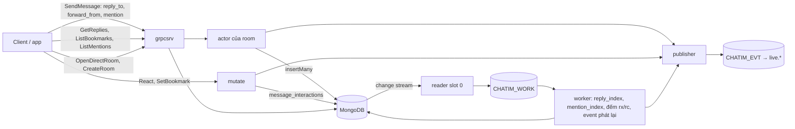
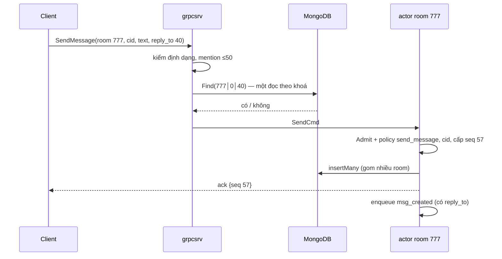
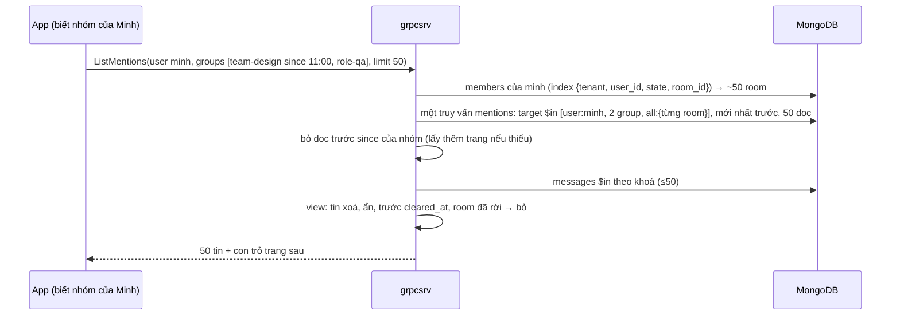
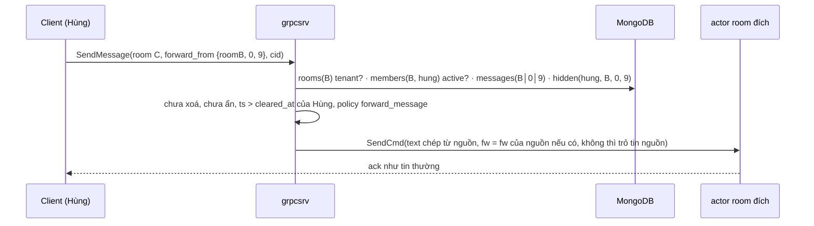

# M2c — Tương tác với tin, mention, forward, hai đường tạo room: tóm tắt kỹ thuật

> Trạng thái: **bản để owner duyệt, chưa thực thi** (viết 2026-10-10, sửa cùng ngày theo các vòng phản biện của owner; nhánh chung `feat/m2c`). Hướng đi chốt qua brainstorm 2026-10-09 → 2026-10-10 (decision log local `.claude/plans/m2c-threads-mentions_design.md`, 2 reviewer độc lập + 1 research). Plan execute cho AI viết sau khi bản này được duyệt, ở `.claude/plans/2026-10-10-m2c-threads-mentions.md`. Gồm việc tồn đọng R1–R5 ([roadmap](../roadmap.md#việc-tồn-đọng-đưa-vào-m2c-owner-chốt-2026-10-09)) và việc chuyển reaction của M2b.3 sang collection chung. Quyết định mới ghi vào Decision Log của [thiết kế](../designs/261005-chatim-architecture.md) từ D112.
>
> **[owner chốt]** là điểm owner đã quyết. Mọi điểm mặc định đã được owner xác nhận (mục 11).

## 1. Thuật ngữ

| Từ | Nghĩa |
|---|---|
| liên kết gắn vào tin | Mọi thứ nối một tin với một người, một tin khác hay một đích: reaction, reply, bookmark, mention. M2c xử lý chúng theo **2 dạng** (mục 2) |
| tương tác | Người khác làm gì đó **với** một tin: react, trả lời, lưu (bookmark). Dạng 1 |
| mention | Người gửi **chỉ định** user, nhóm hoặc `@all` ngay trong nội dung tin. Dạng 2 |
| trả lời có trích (reply) | Tin bình thường ở timeline chính, mang `reply_to` tới một tin khác cùng room; client hiện ô trích ở trên. Đây là "thread" của sản phẩm: **không có nhánh chat riêng** **[owner chốt]** |
| tin cha | Tin được trả lời |
| số trên tin | Con số hiện ngay dưới tin khi đọc lịch sử: reaction theo emoji (`rx`), số trả lời còn sống (`rc`) |
| đếm lại | Cách tính số trên tin: đếm các tương tác còn sống của tin rồi ghi lên tin có điều kiện (CAS trên version của số). Chạy lại bao nhiêu lần cũng đúng; không dùng "+1" vì máy chết giữa chừng sẽ làm số sai mãi |
| projection | Dữ liệu suy ra từ fact, worker dựng lại được bất cứ lúc nào (thiết kế §4) |
| tombstone | Doc không xoá mà chuyển `state = 2` (đã gỡ) |
| sổ tra DM | Bảng tra cặp user → room id của DM (`room_dms`); `rooms` vẫn là gốc |
| bước "đảm bảo" | Chuỗi ghi chạy lại bao nhiêu lần cũng ra cùng kết quả; core chết giữa chừng thì lần gọi sau làm nốt |
| phiếu hẹn sinh tồn | Message hẹn giờ của NATS đặt trước một cặp ghi không nguyên khối, xoá sau khi xong; không bị xoá thì tự bật và sửa (§7.1, D111) |
| worker / Nak | Phần chạy nền ở mọi core, làm phiếu việc từ `CHATIM_WORK`; lỗi thì trả phiếu (Nak) để làm lại |

## 2. Mô hình: 2 dạng liên kết gắn vào tin [owner chốt]

| | Dạng 1: tin nhận tương tác | Dạng 2: mention |
|---|---|---|
| Gồm | reaction, reply, bookmark | nhắc user, nhóm, `@all` |
| Bản chất | Người khác làm gì đó **với** tin | Người gửi **chỉ định** đích trong tin |
| Lưu ở | **một** collection `message_interactions`, phân biệt bằng `kind` | collection `mentions` |
| Mỗi doc là | "user U react/lưu tin X", "tin Y trả lời tin X" | "tin X nhắc đích Y" |
| Đường ghi | reaction, bookmark: lệnh của người dùng ghi một doc theo khoá. reply: worker dựng từ tin trả lời | worker dựng từ tin mới/sửa/xoá |
| Event | `reaction_changed`, `bookmark_changed`; reply nằm trong `msg_created` | nằm trong `msg_created`/`msg_edited` |
| Số trên tin | `rx` (reaction theo emoji), `rc` (số trả lời), **một** cơ chế đếm lại | không |
| Đọc theo tin | "ai react", "các trả lời của tin này" (`GetReplies`) | không cần |
| Đọc theo người/đích trên mọi room | "tin tôi đã lưu" (`ListBookmarks`) | "tin nhắc tôi" (`ListMentions`) |
| Đọc theo room theo thời gian | resync | resync |

Ngoài 2 dạng, M2c còn có: **forward** (field trên tin), **hai đường tạo room** (`OpenDirectRoom` cho DM, `CreateRoom` cho group/channel) và việc tồn đọng **R1–R5**.



Ví dụ một tin đi qua cả 2 dạng: Lan trả lời tin 40 của room 777 bằng "ok @minh @team-design" (tin mới seq 57).
1. `grpcsrv` kiểm tin 40 có trong room. Actor ghi tin 57 với `rp = 40` và đích mention, trả ack, phát `msg_created`.
2. Reader chép thành phiếu `MessageInserted (777, 0, 57)`.
3. Worker:
   - **Dạng 1**: `reply_index` ghi doc `message_interactions` "tin 57 trả lời tin 40"; bộ đếm đếm lại reply còn sống của tin 40 = 2, ghi `rc = {n 2}` lên tin 40, phát `counts_changed`.
   - **Dạng 2**: `mention_index` ghi 2 doc `mentions`: `user:minh`, `group:team-design`.
4. Room thấy "2 trả lời" dưới tin 40; bấm vào → `GetReplies`. Minh mở "Tôi được nhắc tới" thấy tin 57. Sau đó Hùng 👍 tin 40 → doc reaction trong cùng collection, cùng bộ đếm (`rx`).

## 3. Dữ liệu và tên field

Theo quy tắc tên (D96): `messages` giữ tên ngắn, collection khác dùng tiếng Anh đầy đủ.

**Vì sao số nằm trên tin, danh sách nằm ở collection riêng:** `messages` (hàng tỷ tin) không có index phụ, mọi truy vấn phải theo khoá `room│seq`. Số đặt trên tin để **hiện ngay khi đọc lịch sử**. Câu hỏi ngược ("các trả lời của tin 40", "tin tôi đã lưu", "tin nhắc tôi") phải hỏi collection có index phù hợp: `message_interactions`, `mentions`.

### 3.1 Field mới trên `messages` (tên ngắn)

| Field | Tên đầy đủ | Nghĩa | Ví dụ |
|---|---|---|---|
| `rp` | reply_to | Tin cha, cùng room: `{th, s}` (`th` luôn 0) | `{th: 0, s: 40}` |
| `rc` | reply_count | Số trả lời còn sống: `{n, v}`, `v` là version của số (như `rx.v`) | `{n: 2, v: 3}` |
| `fw` | forward_from | Nguồn gốc: `{r, th, s, f, ts}` = tin đầu tiên, tác giả gốc, lúc gửi gốc | `{r: 555, th: 0, s: 9, f: "lan", ts: …}` |
| `mt` | mention_targets | Đích mention, tối đa 50: `[{k, i}]`, `k` = `user` hoặc `group` | `[{k: "user", i: "minh"}, {k: "group", i: "team-design"}]` |
| `ma` | mention_all | Có `@all` | `true` |

- `rx` (số reaction) giữ như M2b.3.
- Không nhánh thread: `thread_root` vẫn trong khoá nhưng luôn 0; cổng `ValidateThread` giữ nguyên.
- Sửa tin **[owner chốt]**: mention có đổi thì lệnh sửa gửi danh sách mới (`mt`/`ma`); không gửi nghĩa là giữ nguyên. Dòng `message_edits` lưu `mention_targets`, `mention_all` của phiên bản đó. `rp` và `fw` không đổi khi sửa.
- Không có `@here` **[owner chốt]**.

### 3.2 Dạng 1: collection `message_interactions`

**Khoá** (clustered): `_id = khoá tin (24 byte) │ kind (1 byte) │ phần riêng`

| kind | Phần riêng | Nghĩa của một doc | Ai ghi |
|---|---|---|---|
| `reaction` | user (1..64 byte) | User react tin bằng một emoji (mỗi (tin, user) một reaction, D88/D89) | Lệnh `ReactMessage` |
| `bookmark` | user | User lưu tin | Lệnh `SetBookmark` |
| `reply` | `thread│seq` của tin trả lời (16 byte, dài cố định) | Tin trả lời tin cha | Worker `reply_index` |

- `kind` nằm trong `_id` nên change feed biết loại từ khoá, không cần đọc doc.
- Mọi doc reply của một tin dài bằng nhau, nên quét khoảng `_id` theo tiền tố `khoá tin│reply` ra đúng danh sách trả lời theo thứ tự seq.

**Field** (chung cho mọi kind):

| Field | Nghĩa | reaction | bookmark | reply |
|---|---|---|---|---|
| `message_key`, `room_id`, `tenant` | Tin, room, tenant | ✓ | ✓ | ✓ |
| `kind` | Loại | `reaction` | `bookmark` | `reply` |
| `actor_id` | Ai làm | người react | người lưu | người trả lời |
| `value` | Giá trị | emoji | rỗng | rỗng |
| `previous_value` | Giá trị trước (cho event) | emoji cũ | | |
| `reply_seq` | Seq tin trả lời | | | `57` |
| `state` | 1 còn, 2 đã gỡ | bỏ react | gỡ lưu | tin trả lời bị xoá |
| `ver` | Số lần đổi (chỉ tăng) | ✓ | ✓ | ✓ |
| `created_at`, `updated_at` | | ✓ | ✓ | ✓ |

**Ví dụ** tin 777│0│40 có 2 reaction, 1 bookmark, 2 reply:

| `_id` | kind | actor | value | state |
|---|---|---|---|---|
| 777│0│40 │ reaction │ hung | reaction | hung | 👍 | 1 |
| 777│0│40 │ reaction │ lan | reaction | lan | ❤️ | 1 |
| 777│0│40 │ bookmark │ minh | bookmark | minh | | 1 |
| 777│0│40 │ reply │ 0│41 | reply | minh | | 1 |
| 777│0│40 │ reply │ 0│57 | reply | lan | | 1 |

**3 index dùng chung:**

| Index | Dùng cho |
|---|---|
| `{message_key, kind, state, value}` | Đếm reaction theo emoji (phủ index), đếm reply còn sống, "ai react tin này" |
| `{tenant, actor_id, kind, state, updated_at: -1}` | "Tin tôi đã lưu" (`ListBookmarks`) |
| `{room_id, kind, updated_at}` | Resync từng kind |

**Chuyển reaction của M2b.3 sang đây** (thuộc M2c):
- Collection `reactions` bị bỏ; dữ liệu reaction hiện chỉ có ở dev (xoá bằng `make infra-reset` hoặc drop collection).
- Hành vi giữ nguyên: một emoji mỗi (user, tin), emoji trong `REACTION_EMOJIS`, pipeline `$cond` giữ doc y nguyên khi chọn lại cùng emoji (D89), bộ đếm có witness (D90), event và id `reaction_changed`, `counts_changed` không đổi. Client không thấy khác.
- Đổi: tên field (`emoji` → `value`, `previous_emoji` → `previous_value`, `user_id` → `actor_id`), gỡ reaction là `state = 2` thay cho `emoji: ""`, index đếm thành `{message_key, kind, state, value}`, khoá thêm byte `kind`.
- Thay khoá/collection của D88 bằng quyết định mới (D112+); D89, D90, D93 giữ nghĩa.

### 3.3 Dạng 2: collection `mentions`

`_id` = `khoá tin │ loại đích │ id đích` (clustered; chỉ đọc/ghi theo khoá).

| Field | Nghĩa | Ví dụ |
|---|---|---|
| `message_key`, `room_id`, `tenant` | Tin | |
| `target` | Đích: `user:{id}`, `group:{id}`, `all:{room}` | `group:team-design` |
| `sender_id` | Người gửi tin | `lan` |
| `state` | 1 còn, 2 đã gỡ (sửa bỏ mention, tin bị xoá) | `1` |
| `message_ver` | Phiên bản tin đã dựng doc này | `2` |
| `created_at`, `updated_at` | Lúc gửi tin, lúc đổi | |

Index `{tenant, target, state, created_at: -1}` (`ListMentions`) và `{room_id, updated_at}` (resync). Tin nhắc `@minh`, `@team-design`, `@all` → 3 doc; room 200K người với `@all` vẫn **1 doc**.

### 3.4 Collection mới `room_dms` (sổ tra DM)

`_id` = chuỗi `tenant│user nhỏ│user lớn` (dấu `│` an toàn vì user id chỉ gồm `[A-Za-z0-9_-]`); field `room_id`, `created_at`.

`rooms` vẫn là gốc: room DM là room bình thường. Trên `rooms` thêm `dm_key` (không unique) để kiểm "room này đúng là DM của cặp này". Index unique `{tenant, dm_key}` dự kiến trong thiết kế §5 **bị bỏ** (không giữ được khi shard `rooms` theo `_id`).

### 3.5 Config, khoá Redis, giới hạn mới

| Tên | Mặc định | Nghĩa |
|---|---|---|
| `MENTION_TARGETS_MAX` | `50` | Số đích mention mỗi tin (A6), đếm user + nhóm |
| `MENTION_GROUPS_MAX` | `100` | Số nhóm người gọi truyền vào `ListMentions` |
| `REPLY_COUNT_DELAY` | `1s` | Delay của worker đếm lại số trả lời (như `REACTION_COUNT_DELAY`) |
| khoá `chatim:req:create:{tenant}:{user}:{request_id}` | TTL `CID_COMMITTED_TTL` | Chống tạo group trùng khi retry (Redis dedupe) |

## 4. Luồng xử lý

### 4.1 Dạng 1, nguồn người dùng: reaction và bookmark

- **Reaction** (`ReactMessage`): hành vi như M2b.3, chỉ đổi chỗ lưu. `Admit` → `Find` tin → `Allow` → một `FindOneAndUpdate` upsert theo `_id = khoá tin│reaction│user`; cùng emoji → doc y nguyên (không ghi, không event); khác → `ver + 1`, `previous_value`; gỡ → `state = 2`. Phát `reaction_changed`; số `rx` đếm lại (inline một lượt, lỗi bỏ qua; worker sửa — R1).
- **Bookmark** (`SetBookmark(room, seq, on)`): `Admit` → tin phải tồn tại → upsert theo `_id = khoá tin│bookmark│user`; như cũ → không ghi; gỡ → `state = 2`, `ver + 1`. Phát `bookmark_changed`. Không giới hạn số bookmark mỗi user; chống lạm dụng bằng rate limit ở gateway/app **[owner chốt]**.
- Worker phát lại doc hiện tại cho cả hai (`reaction_event` đã có, `bookmark_event` mới).

### 4.2 Dạng 1, nguồn nội dung tin: reply

**Gửi:**



- Tin cha không có → `NOT_FOUND`. Tin cha đã xoá (xoá lúc chưa có trả lời) vẫn cho trả lời, ô trích hiện "đã xoá". Trả lời một tin trả lời được phép; danh sách chỉ gồm trả lời **trực tiếp** **[owner chốt]**.
- Kiểm tin cha ở `grpcsrv`, không trong actor, để không làm chậm hàng đợi của room.
- Va seq với core khác lúc chuyển slot: **`UNAVAILABLE` và nhường room ngay**, không gán lại seq (R5) **[owner chốt]**; client gửi lại cùng cid.

**Dựng và đếm (worker):** từ phiếu `MessageInserted` có `rp`, và phiếu `EditInserted` loại xoá của một tin trả lời:
1. `reply_index` (delay 0): tin mới → upsert doc `reply` (`$setOnInsert`, chạy lại không sinh bản thứ hai); tin trả lời bị xoá → doc chuyển `state = 2`.
2. Đếm lại (delay `REPLY_COUNT_DELAY`, một lần mỗi tin cha mỗi lô): **cùng package `counter` với reaction**: đếm `{message_key, kind: reply, state: 1}` (phủ index) → bằng `rc` thì thôi → khác thì CAS `rc.v` → `counts_changed` (counter `replies`). Trượt CAS → Nak (R1).

Fast path không cập nhật số trả lời: client thấy `msg_created` và tự cộng tạm; số đúng tới sau `REPLY_COUNT_DELAY`.

**Đọc:**
- `GetHistory`: `rc`, `rx` có sẵn trên tin; thêm **một** `$in` lấy bản xem trước các tin cha được trích trong trang, áp view (xoá → không text, ẩn với người xem → `hidden`).
- `GetReplies(room, seq, after, limit ≤ 50)`: `Admit` → quét `_id` theo tiền tố `khoá tin│reply`, bỏ `state = 2` → `messages` `$in` → view.

**Chặn xoá tin còn trả lời [owner chốt].** `DeleteMessage` (sau `Allow`, trước khi ghi fact xoá) đếm thẳng `{message_key, kind: reply, state: 1}` (đọc majority; không dùng `rc` vì trễ ~1s); còn ≥ 1 → `FAILED_PRECONDITION` (`ErrHasReplies`). Cửa sổ còn lại: trả lời vừa gửi nhưng worker chưa kịp ghi (thường dưới 1 giây) thì lệnh xoá vẫn qua; kết quả là tin "đã xoá" có một trả lời, giống trả lời một tin đã xoá, không mất dữ liệu.

### 4.3 Dạng 1, đọc theo người: `ListBookmarks`

`ListBookmarks(before, limit ≤ 50)`: index `{tenant, actor_id, kind: bookmark, state: 1, updated_at: -1}` → tin `$in` → view và quyền hiện tại; rời room hay tin đã xoá thì bookmark vẫn nằm trong danh sách, hiện "không còn xem được" **[owner chốt]**.

### 4.4 Dạng 2: mention và màn "Tôi được nhắc tới"

- Gửi: client gửi `mt` (user/nhóm) và `ma`. Core chỉ kiểm định dạng, bỏ trùng, ≤ `MENTION_TARGETS_MAX`; **không** kiểm user có trong room, **không** bung nhóm **[owner chốt]**. `@all` qua policy `mention_all`: mặc định ai cũng dùng được, tenant chặn bằng policy **[owner chốt]**.
- Dựng: `mention_index` (delay 0) từ `MessageInserted`/`EditInserted`: upsert doc mỗi đích, `state = 2` cho đích bị sửa bỏ hoặc khi tin bị xoá; chỉ ghi khi `message_ver` của phiếu ≥ doc hiện có.
- Đọc: `ListMentions(groups[{id, since?}], before, limit ≤ 50)`: **một** truy vấn trên index `{tenant, target, state, created_at: -1}` với điều kiện "đích thuộc danh sách" (`$in`), ví dụ `[user:minh, group:team-design, group:role-qa, all:777, all:778, …]`, mới nhất trước, lấy 50; Mongo đọc các khoảng index này trong một lần. Số đích mỗi lần gọi bị giới hạn: `MENTION_GROUPS_MAX` nhóm + các room user đang là member.



- App truyền nhóm của user và mốc `since` nếu muốn; core không có model nhóm **[owner chốt]**. Số mention chưa đọc tính lúc đọc theo room, làm ở M3.

### 4.5 Forward



- Kiểm ở `grpcsrv` trước actor: bốn lần đọc theo khoá, chạy ở core nào cũng được. Text lấy từ tin nguồn, client không sửa được; nguồn bị xoá sau đó thì bản forward không đổi. Không forward giữa tenant.
- Hiển thị **[owner chốt]**: Lan viết "Báo giá 100 triệu" ở room A, Minh forward sang B, Hùng forward tiếp sang C. Ở room C: "chuyển tiếp từ Hùng" (người gửi tin mới), ô ghi chú "Lan: Báo giá 100 triệu". Người forward trung gian (Minh) không lưu.
- Lỗi: nguồn không có → `NOT_FOUND`; không phải member hoặc không được đọc → `PERMISSION_DENIED`; nguồn đã xoá → `FAILED_PRECONDITION`.

### 4.6 Mở DM: `OpenDirectRoom(other_user)` [owner chốt]

```mermaid
sequenceDiagram
  participant C as Lan
  participant G as grpcsrv
  participant T as work.Timers
  participant DB as MongoDB
  C->>G: OpenDirectRoom(minh)
  G->>DB: room_dms FindOneAndUpdate(_id acme│lan│minh, $setOnInsert room 8812, upsert)
  DB-->>G: room 8812 (của mình hoặc của người mở trước)
  alt room 8812 và 2 member đã có
    G-->>C: {room 8812, created false}
  else thiếu phần nào
    G->>T: hẹn phiếu đếm lại member
    G->>DB: rooms insert (dm_key); trùng chỉ chấp nhận khi dm_key khớp
    G->>DB: members BulkWrite 2 người (request_id 8812-created, role member)
    G->>T: gỡ phiếu
    G-->>C: {room 8812, created true}; phát room_created, member_added ×2, member_count_changed
  end
```

- Lan và Minh mở cùng lúc: cả hai nhận room 8812 (filter theo `_id`, Mongo tự xử lý đua), core không thử lại. Core chết giữa chừng: lần mở sau làm nốt.
- Hai người đều là `member`, DM không có owner. Nhắn cho chính mình → `INVALID_ARGUMENT`. Policy `open_direct` (mặc định mọi user trong tenant).
- Room id ngẫu nhiên vô tình trùng room khác (gần như không xảy ra): ghi sổ sang id mới bằng CAS rồi `UNAVAILABLE`, client gọi lại.
- Link DM dễ nhớ do app làm bằng cặp username (`…/dm/lan--minh/120`); không có alias **[owner chốt]**.

### 4.7 Tạo group: `CreateRoom` (chỉ group/channel) [owner chốt]

- Không nhận loại DM (`INVALID_ARGUMENT`).
- `request_id` bắt buộc: dedupe `chatim:req:create:{tenant}:{user}:{request_id}` → đã xong thì trả room cũ; đang chạy ở core khác → `UNAVAILABLE`.
- Room id ngẫu nhiên **một lần**; trùng → `UNAVAILABLE` (bỏ vòng bốc lại 3 lần).
- Hẹn phiếu đếm lại member **trước** khi ghi room, gỡ **sau** khi ghi member (sửa lỗi hiện tại: core chết giữa room và member để `member_count` sai mãi).

### 4.8 Việc tồn đọng R1–R3

- **R1** bỏ vòng thử lại nội bộ: ghim (append trùng `pin_ver` → `UNAVAILABLE` ngay), projection ghim (một lượt; fast path trượt CAS trả fold cục bộ, worker Nak), đếm số trên tin (một lượt; fast path bỏ qua lỗi, worker Nak). Số trả lời theo luôn luật này.
- **R2** review `Config.LogValue` (log mọi field không bí mật) và `GetEditHistory` (cửa sổ giữa fact xoá và projection): sửa hoặc ghi lý do giữ.
- **R3** effect `room_created` chỉ đếm PubAck không trùng.

## 5. Cơ chế đúng đắn và các ca chạy đua

| Ca | Kết quả | Vì sao |
|---|---|---|
| Hai core cùng ghi một room lúc chuyển slot | Một tin thắng seq; bên thua `UNAVAILABLE`, nhường room; client gửi lại cùng cid | `_id` unique là CAS; cid chống trùng |
| User bấm cùng emoji / cùng bookmark hai lần | Không ghi, không event | Pipeline `$cond` giữ doc y nguyên |
| Phiếu `reply_index` hoặc `mention_index` chạy hai lần | Không sinh bản thứ hai | Upsert theo `_id` |
| Hai trả lời (hoặc hai reaction) cho tin 40 cùng lúc | Số cuối = số tương tác còn sống | Đếm lại rồi CAS version; bên trượt Nak, lần sau đếm lại |
| Trả lời bị xoá | Số giảm 1, biến khỏi danh sách | Doc reply `state = 2`, đếm lại |
| Xoá tin cha còn trả lời | `FAILED_PRECONDITION` | Lệnh xoá đếm thẳng doc reply; cửa sổ dưới 1 giây vô hại (4.2) |
| Sửa tin bỏ mention, phiếu sửa đến trước phiếu tin mới | `mentions` đúng phiên bản mới | Chỉ ghi khi `message_ver` ≥ doc hiện có |
| Lan và Minh mở DM cùng lúc | Cùng một room | `_id` của `room_dms` duy nhất |
| Core chết giữa ghi sổ DM và tạo member | Lần mở sau làm nốt; phiếu hẹn sửa số member | Bước "đảm bảo", D111 |
| Retry `CreateRoom` sau khi lần đầu đã ghi | Trả room cũ (trong 15 phút) | `request_id` |
| Forward tin đúng lúc nó bị xoá ở nguồn | Kiểm sau khi xoá → `FAILED_PRECONDITION`; kiểm trước → bản forward là bản chép hợp lệ | Kiểm theo trạng thái lúc đọc |

**Chỗ phải xếp hàng:** chỉ actor của room (đã có). Không có số đánh liên tục mới, không có khoá chung mới. Số trên một tin rất nóng (nhiều reaction/trả lời cùng lúc) là một điểm tranh CAS; gom W + K để milestone Channel (D90).

## 6. Event và subject

| Subject | Kind | Id | Ghi chú |
|---|---|---|---|
| `message` | `msg_created` (đã có) | `{room}-{thread}-{seq}` | Thêm `reply_to`, `forward_from`, `mention_targets`, `mention_all` |
| `message` | `reaction_changed` (đã có, không đổi) | `{room}-{thread}-{seq}-{user}-n{ver}` | |
| `message` | `counts_changed` (đã có, thêm counter `replies`) | `{room}-0-{seq}-{counter}-v{v}` | `reactions` như cũ; `replies` mới |
| `member` | `bookmark_changed` (mới) | `{room}-bm-0-{seq}-{user}-v{ver}` | Riêng tư theo user như `message_hidden`; gateway chỉ gửi cho chính user đó |
| `room`/`member` | `room_created`, `member_added`, `member_count_changed` (đã có) | | Đường DM phát như CreateRoom |

Feed: insert/update/replace của `message_interactions` → kind lấy từ byte thứ 25 của `_id`: reaction → `ReactionChanged` (như cũ), bookmark → `BookmarkChanged` (mới), reply → bỏ qua (projection, dựng lại từ tin). `mentions` không vào feed.

## 7. Thư viện và hạ tầng

- Không thư viện mới. Mongo: collection clustered, upsert `$setOnInsert`, pipeline `$cond`, `FindOneAndUpdate` upsert, đếm phủ index. NATS: message schedule đã có.
- Collection mới tạo ở bootstrap: `message_interactions`, `mentions`, `room_dms`; bỏ `reactions`. Shard sau này theo `{_id: 1}` (`message_interactions`, `mentions` bắt đầu bằng khoá tin). Truy vấn theo user/đích (`{tenant, actor_id, …}`, `{tenant, target, …}`) sẽ scatter-gather khi đã shard, giống "room của user" trên `members`.
- Resync: quét `message_interactions` theo `{room_id, kind, updated_at}` cho reaction và bookmark; reply, mention và số trên tin tự dựng lại từ phiếu tin (resync đã quét timeline chính).

## 8. Quyết định kỹ thuật và phương án đã loại

| Quyết định | Phương án loại | Lý do |
|---|---|---|
| Liên kết gắn vào tin chia 2 dạng: tương tác (reaction, reply, bookmark) và mention | Thiết kế từng loại riêng | Owner chốt: thống nhất, không chắp vá; mỗi dạng một đường ghi, một kiểu đọc, một cơ chế đếm |
| Dạng 1 một collection `message_interactions`, `kind` trong khoá; chuyển reaction M2b.3 sang | Mỗi loại một collection cùng khuôn | Owner chốt: một chỗ lưu, một index set, một lần resync; reaction mới chỉ có dữ liệu dev |
| Mention là collection riêng | Gom mention vào `message_interactions` | Mention là chỉ định của người gửi, khoá theo đích (không theo user tương tác), đọc theo đích trên mọi room |
| "Thread" = trả lời có trích ở timeline chính | Nhánh chat riêng kiểu Slack/Discord (timeline, seq riêng, theo dõi thread, vị trí đọc thread) | Owner chốt: không làm nhánh riêng; bỏ collection `threads`, `thread_subs`, seq theo thread trong actor |
| Số trả lời = đếm lại + CAS trên `messages.rc`, cùng cơ chế số reaction | `$max` seq; `$inc` | Trả lời rải ở timeline chính nên seq cuối không phải số trả lời; `$inc` sai số khi worker chết giữa hai lần ghi |
| Chặn xoá tin còn trả lời, đếm thẳng lúc xoá | Cho xoá, giữ chỗ "tin đã xoá"; dựa vào `rc` | Owner chốt chặn xoá; `rc` trễ ~1s |
| Mention lưu theo đích, bung nhóm do nơi xử lý | Lưu phẳng tin × người nhận (Zulip, Matrix); search engine | Phẳng: `@all` room 200K = 200K doc mỗi tin. Search engine ngoài Phase 1 |
| Room id giữ số 63-bit ngẫu nhiên; DM qua sổ `room_dms` + bước "đảm bảo" | Id DM = băm(cặp user); ghép chuỗi; ObjectId/ULID | Băm: ~5% có cặp trùng ở 1 tỷ cặp → lộ DM. Ghép chuỗi/ObjectId/ULID không vừa khoá 8 byte; id theo thời gian gây điểm nóng khi shard |
| Hai đường tạo room: `OpenDirectRoom`, `CreateRoom` (group) | Index unique `{tenant, dm_key}`; tạo DM ngầm khi gửi tin đầu | Index unique không giữ được khi shard; core chết giữa chừng làm cặp mắc kẹt. Gửi tin cần room id để định tuyến và chống trùng cid |
| Forward: hiện người forward + tác giả và nội dung gốc | Chỉ người forward; không ghi nguồn | Owner chốt |
| Bỏ `@here`; không alias room; bỏ vòng gán lại seq (R5) | | Owner chốt |
| Kiểm reply/forward ở `grpcsrv` trước actor | Kiểm trong actor | Actor chạy tuần tự theo room; đọc majority trong actor làm nghẽn room |

## 9. Chi phí và tải

| Thao tác | Ghi | Đọc | Event |
|---|---|---|---|
| Gửi trả lời | 1 insert (gom) + worker: 1 upsert doc reply + ≤1 CAS `rc` | +1 đọc tin cha; worker 1 đếm phủ index | `msg_created` + `counts_changed` |
| React | 1 upsert + ≤1 CAS `rx` (như M2b.3) | như M2b.3 | `reaction_changed` + `counts_changed` |
| Bookmark | 1 upsert | 1 đọc tin | `bookmark_changed` |
| Tin có mention | + ≤51 upsert `mentions` (worker) | | không thêm |
| `@all` ở channel 200K | + 1 doc `mentions` | | không thêm |
| `GetHistory` 1 trang | | +1 `$in` (xem trước tin được trích) | |
| `GetReplies` / `ListBookmarks` | | 1 quét khoảng/index + ≤50 đọc tin | |
| `ListMentions` 1 trang | | 1 truy vấn index (`$in` các đích) + ≤50 đọc tin | |
| Forward | như gửi tin | +4 đọc theo khoá | `msg_created` |
| Mở DM đã có / mới | 0 / 1 upsert sổ + 1 room + 2 member + phiếu hẹn | 1 đọc theo khoá | 0 / 4 |

- `mentions`: ở 10K tin/s, 1% có mention, ~3 đích → ~300 doc/s × ~200 byte ≈ 5GB/ngày nếu đỉnh kéo dài cả ngày (thực tế thấp hơn nhiều). Doc reply ~150 byte mỗi tin trả lời.
- Băng thông: mỗi trả lời là `msg_created` tới mọi người nghe room; channel 200K là gánh của gateway.

## 10. Rủi ro, đánh đổi và việc nên làm

| Rủi ro | Là gì (ví dụ) | Đánh đổi | Nên làm |
|---|---|---|---|
| Tin cực nóng | Mỗi lần có react/trả lời, worker đếm lại **toàn bộ** tương tác của tin. Tin có 10 reaction: đếm 10 dòng. Tin trong channel 200K có 50.000 reaction: mỗi lần đếm 50.000 dòng | Đếm lại thì số luôn đúng, không bao giờ lệch; kiểu "+1" rẻ hơn nhưng có thể lệch vĩnh viễn khi máy chết giữa chừng | M2c không làm gì: group tối đa 5K người (đếm vài ms) và worker gom nhiều tương tác trong một lô thành một lần đếm. Chia nhỏ bộ đếm khi làm milestone Channel |
| Số trả lời trễ ~1 giây | Lan trả lời tin 40; số "2 → 3" do worker cập nhật sau ~1 giây | Gửi tin vẫn nhanh vì không thêm lần ghi nào lúc gửi | Client tự tăng số ngay khi nhận `msg_created` có `reply_to = 40`, rồi để số chính thức (`counts_changed`) ghi đè. Ghi vào hướng dẫn SDK |
| Khe khi chặn xoá tin cha | Trả lời vừa gửi, worker chưa kịp ghi (dưới 1 giây) thì lệnh xoá tin cha vẫn qua | Đếm thẳng lúc xoá thay vì khoá cả room | Chấp nhận: kết quả là tin "đã xoá" có một trả lời, không mất dữ liệu |
| Tạo group trùng | Client gửi lại `CreateRoom` cùng `request_id`; core nhớ `request_id` 15 phút trong Redis. Gửi lại sau 15 phút, hoặc Redis vừa mất khoá → có 2 group giống nhau | Nhớ bằng Redis rẻ, cùng cơ chế chống gửi trùng tin (cid) và thêm member trùng; nhớ mãi phải lưu Mongo | Chấp nhận: client thật gửi lại trong vài giây |
| User id bị cấp lại | Tenant xoá user `minh`, sau này cấp id `minh` cho người khác → Minh mới mở DM với Lan sẽ vào room cũ, đọc được tin nhắn cũ | | **Luật tích hợp**: user id không bao giờ được cấp lại cho người khác (app auth/user giữ luật, core không code) |
| `ListMentions` cho user ở rất nhiều room/nhóm | Danh sách đích trong một truy vấn dài (ví dụ 500 room) | Không bung mention ra từng người lúc ghi (ghi rẻ, ít dữ liệu), đổi lại lúc đọc phải hỏi theo nhiều đích | Một truy vấn `$in` + giới hạn số đích; đo ở PoC prod-like |
| Chuyển reaction sang collection mới | Đụng phần đã xây ở M2b.3 (lưu, feed, đếm, resync, test) | Thống nhất một chỗ lưu cho mọi tương tác | Dữ liệu chỉ có ở dev nên reset là xong; chạy lại toàn bộ bộ test reaction |
| Sửa tin mang cả mention | Đổi đường sửa tin của M2b.2 (`message_edits` thêm field) | | Test sửa tin có/không đổi mention |

### Ngoài phạm vi M2c

- `ListThreads` (các trao đổi gần đây của room): không ưu tiên; phải quét trả lời gần đây rồi lọc tin cha không trùng, tin có nhiều trả lời làm trang quét nhiều. Để M3 nếu cần.
- Số mention chưa đọc, số tin chưa đọc: thuộc phần đọc (M3); M2c đã lưu đủ dữ liệu để M3 tính.

## 11. Điểm owner đã xác nhận (2026-10-10)

1. Liên kết gắn vào tin chia 2 dạng; dạng 1 (reaction, reply, bookmark) một collection `message_interactions`, chuyển reaction M2b.3 sang; dạng 2 là `mentions`.
2. Số trả lời không tính trả lời đã xoá; tin còn trả lời thì không cho xoá.
3. Trả lời của một trả lời được phép; danh sách của một tin chỉ gồm trả lời trực tiếp.
4. `ListBookmarks`, `ListMentions` làm ở M2c; `ListThreads` để M3.
5. Sửa tin: mention có đổi thì gửi danh sách mới, không đổi thì không gửi.
6. `@all` mặc định ai cũng dùng được, chặn qua policy.
7. Forward: hiện "chuyển tiếp từ {người forward}", ô ghi chú có tên tác giả gốc và nội dung gốc.
8. Bookmark: không giới hạn số lượng (chống lạm dụng bằng rate limit ở gateway/app), không ghi chú; rời room hay tin bị xoá thì vẫn trong danh sách, hiện "không còn xem được".
9. Luật tích hợp: user id không bao giờ được cấp lại cho người khác.

## 12. Kiểm thử, mỗi mục chứng minh gì

| Test | Chứng minh |
|---|---|
| storetest `message_interactions` (mem + Mongo): ba kind trên cùng một tin | Khoá không lẫn kind; quét reply đúng thứ tự; đếm theo kind/state/value đúng |
| Bộ test reaction M2b.3 chạy trên collection mới | Hành vi reaction không đổi sau khi chuyển |
| grpcsrv: trả lời tin không có, tin đã xoá, tin room khác | Mã lỗi đúng; đã xoá vẫn cho trả lời |
| actor: va seq core khác | `UNAVAILABLE` ngay, nhường room (R5) |
| `reply_index` / `mention_index` chạy hai lần, lệch thứ tự | Không bản thứ hai; `mentions` theo phiên bản mới nhất |
| Đếm lại `rc` khi hai trả lời đua, trả lời bị xoá | Số = trả lời còn sống; trượt thì Nak |
| `DeleteMessage` tin còn trả lời / hết trả lời | `FAILED_PRECONDITION` / cho xoá |
| `GetReplies`, `ListBookmarks`, `ListMentions` với tin xoá/ẩn/`cleared_at`, room đã rời, `since` | Che đúng, thứ tự và phân trang đúng |
| `ListMentions` với nhiều đích (user, nhiều nhóm, nhiều room) | Một truy vấn, đúng thứ tự thời gian, đúng giới hạn số đích |
| Bookmark bấm hai lần, gỡ | Không event thừa; tombstone |
| forward: không member nguồn, nguồn ẩn/xoá, khác tenant, forward của forward | Mã lỗi đúng; text chép từ nguồn; `fw` giữ tác giả gốc |
| `OpenDirectRoom` song song, core chết giữa bước | Một room, lần sau làm nốt, số member đúng |
| `CreateRoom` retry cùng `request_id`; gửi loại DM | Không tạo room thứ hai; DM bị từ chối |
| Feed: update reaction/bookmark/reply | Kind đọc từ `_id`; reply không sinh phiếu |
| Resync: reaction, bookmark, reply, mention trong khoảng mất | Dựng lại đủ |
| R1–R3 | Một lượt rồi `UNAVAILABLE`/Nak; `room_created` không đếm bản trùng |
| e2e phase 6 (corecli) | Mở DM hai lần ra cùng room; react như cũ; trả lời + số + `GetReplies`; chặn xoá tin còn trả lời; mention + `ListMentions`; forward; bookmark + `ListBookmarks`; live event đủ id, kind, subject |
