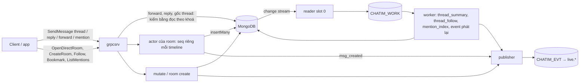
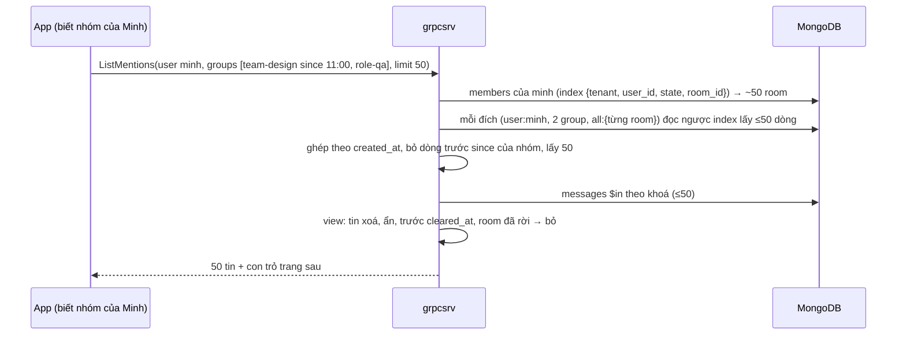

# M2c — Thread, mention, reply/forward, bookmark, hai đường tạo room: tóm tắt kỹ thuật

> Trạng thái: **bản để owner duyệt, chưa thực thi** (viết 2026-10-10 trên nhánh chung `feat/m2c`). Hướng đi đã chốt qua brainstorm 2026-10-09 → 2026-10-10 (decision log local `.claude/plans/m2c-threads-mentions_design.md`, 2 reviewer độc lập + 1 research). Plan execute cho AI sẽ viết sau khi bản này được duyệt, ở `.claude/plans/2026-10-10-m2c-threads-mentions.md`. Gồm cả việc tồn đọng R1–R5 ([roadmap](../roadmap.md#việc-tồn-đọng-đưa-vào-m2c-owner-chốt-2026-10-09)). Quyết định mới sẽ ghi vào Decision Log của [thiết kế](../designs/261005-chatim-architecture.md) từ D112.
>
> Dấu **[owner chốt]** là điểm owner đã quyết trong brainstorm. Dấu **[đề xuất]** là mặc định đội đề xuất, owner chưa phản đối, cần xác nhận khi duyệt bản này (gom lại ở mục 11).

## 1. Thuật ngữ

| Từ | Nghĩa |
|---|---|
| timeline | Một dãy tin có seq riêng. `thread_root = 0` là timeline chính của room; mỗi thread là một timeline riêng, khoá `room│root│seq` |
| tin gốc (root) | Tin ở timeline chính mà thread treo vào; `thread_root` của reply = seq của tin gốc |
| reply trong thread | Tin gửi vào timeline của một thread |
| reply (trích dẫn) | Tin bình thường mang con trỏ `reply_to` tới một tin khác trong cùng room (trả lời có trích) |
| forward | Chép một tin từ room nguồn sang room đích, mang con trỏ `forward_from` |
| đích mention | Thứ được nhắc trong tin: một user, một nhóm (`kind` + `id` do app đặt), hoặc `@all` của room |
| projection | Dữ liệu suy ra từ fact, worker ghi lại được bất cứ lúc nào (thiết kế §4). Ví dụ: tóm tắt thread, index mention |
| lớp tập | Mỗi phần tử (vd mỗi (room, thread, user)) một doc riêng, có `ver` riêng, gỡ thì để tombstone (thiết kế §4) |
| sổ nhận chỗ | Doc có `_id` là khoá tự nhiên (vd cặp user của DM); Mongo bảo đảm `_id` duy nhất nên ai ghi trước thì "nhận chỗ", người sau đọc được kết quả |
| bước "đảm bảo" | Chuỗi ghi chạy lại bao nhiêu lần cũng ra cùng kết quả (idempotent); core chết giữa chừng thì lần gọi sau làm nốt |
| phiếu hẹn sinh tồn | Message hẹn giờ của NATS đặt trước một cặp ghi không nguyên khối, xoá sau khi xong; không bị xoá thì tự bật và sửa (§7.1, D111) |
| `$max` | Toán tử Mongo: chỉ ghi nếu giá trị mới lớn hơn giá trị đang có; nhiều worker ghi theo thứ tự nào cũng ra cùng kết quả |
| worker / Nak | Phần chạy nền ở mọi core, làm phiếu việc từ `CHATIM_WORK`; lỗi thì trả phiếu (Nak) để làm lại |

## 2. Bức tranh chung

M2c thêm sáu nhóm việc, tất cả xếp vào các lớp dữ liệu sẵn có (thiết kế §4), không lớp mới:

| Tính năng | Lớp dữ liệu | Ghi ở đâu | Event | Sửa lỗi |
|---|---|---|---|---|
| Reply trong thread | Fact (tin) | `messages` khoá `room│root│seq`, qua actor như tin thường | `msg_created` (đã có, mang `thread_root`) | Như tin thường |
| Tóm tắt thread (số reply, lúc reply cuối) | Projection `$max` | collection mới `threads` | `thread_updated` | Worker chạy lại từ phiếu tin |
| Theo dõi thread + vị trí đọc thread | Tập + vị trí đọc | collection mới `thread_subs` | `thread_follow_changed`, `thread_read_updated` | Worker phát lại doc hiện tại |
| Mention, `@all` | Field trên tin + projection index | field mới trên `messages` + collection mới `mention_targets` | trong `msg_created`; index không có event riêng | Worker dựng lại index từ phiếu tin |
| Reply có trích, forward | Field trên tin | field mới trên `messages` | trong `msg_created` | Như tin thường |
| Bookmark | Tập | collection mới `bookmarks` | `bookmark_changed` | Worker phát lại doc hiện tại |
| Mở DM / tạo group | Sổ nhận chỗ + bước "đảm bảo" | collection mới `dm_keys`; `rooms`, `members` | `room_created`, `member_added`, `member_count_changed` (đã có) | Gọi lại → làm nốt; phiếu hẹn sửa số member |



Ví dụ một reply trong thread có mention, chạy thế nào:
1. Lan gửi "ok @minh @team-design" vào thread của tin seq 40, room 777. Core kiểm tin 40 có ở timeline chính, actor cấp seq 7 trong timeline `777│40`, ghi tin, trả ack, phát `msg_created` (mang thread 40 và danh sách đích mention).
2. Mongo ghi nhật ký; reader chép thành phiếu `MessageInserted (777, 40, 7)`.
3. Worker làm ba việc: `threads(777│40)` `$max` `last_reply_seq = 7` rồi phát `thread_updated`; Lan, tác giả tin 40 và Minh (đang là member) được tự theo dõi thread; ghi 2 dòng `mention_targets` (`user:minh`, `group:team-design`).
4. Minh mở màn "Tôi được nhắc tới" thì thấy tin này; app thông báo nghe `msg_created` và tự bung `team-design` ra người.

**Package dự kiến đụng tới:** `send/actor` (seq theo timeline, R5), `send/dedupe` (record mang thread, request id của tạo room), `api/grpcsrv` (RPC mới, kiểm forward/reply/gốc thread), `change/mutate` (follow, đọc thread, bookmark, R1), `change/pinproj`, `change/counter` (R1), `event/effects` (4 effect mới, R3), `event/work`, `event/reconcile`, `event/resync`, `store/*` (5 collection mới), `model/domain`, `model/pbconv`, `model/access`, `proto/chatim/v1`, `tools/corecli` (e2e phase 6).

## 3. Dữ liệu và tên field

Theo quy tắc tên (D96): `messages` giữ tên ngắn, collection khác dùng tiếng Anh đầy đủ; bộ đếm thay đổi kết thúc bằng `_ver`/`ver`.

### 3.1 Field mới trên `messages` (tên ngắn)

| Field | Tên đầy đủ | Nghĩa | Ví dụ | Dùng để |
|---|---|---|---|---|
| `rp` | reply_to | Tin được trích, cùng room: `{th, s}` | `{th: 0, s: 120}` | Hiện trích dẫn; nội dung trích lấy lúc đọc |
| `fw` | forward_from | Nguồn forward: `{r, th, s, f, ts}` (room, thread, seq, người gửi gốc, lúc gửi gốc) | `{r: 555, th: 0, s: 9, f: "lan", ts: …}` | Hiện "chuyển tiếp từ Lan"; forward của forward giữ nguồn gốc đầu tiên **[đề xuất]** |
| `mt` | mention_targets | Đích mention, tối đa 50: `[{k, i}]`, `k` = `user` hoặc `group`, `i` = user id hoặc id nhóm do app đặt | `[{k: "user", i: "minh"}, {k: "group", i: "team-design"}]` | Event `msg_created`, index `mention_targets` |
| `ma` | mention_all | Có `@all` | `true` | Như trên; quyền dùng do policy |

- Tin ở thread dùng sẵn `_id = room│root│seq`; không thêm field thread.
- Sửa tin **[đề xuất]**: lệnh sửa gửi lại toàn bộ `mt`/`ma` cùng text (mention là một phần nội dung); dòng `message_edits` lưu `mention_targets`, `mention_all` của phiên bản đó; projection `messages` ghi đè `mt`/`ma`. Sửa bỏ một mention thì index tombstone dòng đó.
- Không có `@here` **[owner chốt]**.

### 3.2 Collection mới `threads` (projection tóm tắt thread)

`_id` = `room│root` (16 byte, clustered).

| Field | Nghĩa | Ví dụ | Dùng để |
|---|---|---|---|
| `room_id`, `tenant` | Room, tenant | `777`, `acme` | Index, kiểm tenant |
| `root_seq` | Seq tin gốc ở timeline chính | `40` | Tra ngược |
| `last_reply_seq` | Seq reply cuối (= số reply đã gửi, kể cả reply đã xoá) | `7` | Hiện "7 trả lời"; `$max` |
| `last_reply_at` | Lúc reply cuối | `2026-10-10T09:15:02Z` | Hiện "trả lời cuối lúc…"; resync; danh sách thread |
| `created_at`, `updated_at` | Lúc tạo doc, lúc ghi cuối | | Vận hành |

Index `{room_id, last_reply_at}` (resync, danh sách thread của room sau này). Số reply **tính cả reply đã xoá** (hiện "đã xoá" như timeline chính) **[đề xuất]**; muốn đếm đúng số reply còn sống thì phải đổi sang lớp đếm lại, chi phí tăng theo độ dài thread (mục 8).

### 3.3 Collection mới `thread_subs` (theo dõi + vị trí đọc thread)

`_id` = `room│thread│user` (16 byte + 1..64 byte user, clustered; như `members`, không range-scan theo `_id`).

| Field | Nghĩa | Ví dụ | Dùng để |
|---|---|---|---|
| `room_id`, `tenant`, `thread_root`, `user_id` | Khoá tự nhiên tách ra | `777`, `acme`, `40`, `minh` | Index |
| `state` | 1 đang theo dõi, 2 không theo dõi (tự tắt hoặc chỉ có vị trí đọc) | `1` | Lọc |
| `reason` | Vì sao theo dõi: `root_author`, `replied`, `mentioned`, `manual` | `mentioned` | Hiện cho user, debug |
| `ver` | Số lần đổi theo dõi (chỉ tăng) | `2` | CAS, event id |
| `read_seq`, `read_ver` | Vị trí đọc trong thread và số lần đổi (giống `members`, D105) | `5`, `3` | Unread thread (M3) |
| `updated_at`, `updated_by`, `last_change_at` | Audit, resync | | |

Index `{tenant, user_id, state, last_change_at: -1}` (thread tôi theo dõi, M3) và `{room_id, last_change_at}` (resync).

Luật **[đề xuất]**: tự theo dõi khi là tác giả tin gốc (lúc có reply đầu), khi trả lời, khi được mention trực tiếp và đang là member active. **Không** tự theo dõi qua `@all` hay nhóm. Doc đã có (kể cả `state = 2` do user tự tắt) thì tự theo dõi **không đụng vào** (không hồi sinh).

### 3.4 Collection mới `mention_targets` (index mention)

`_id` = `khoá tin│đích` (24 byte + 1 byte loại + id, clustered; chỉ dùng đọc/ghi theo khoá).

| Field | Nghĩa | Ví dụ | Dùng để |
|---|---|---|---|
| `target` | Đích dạng chuỗi: `user:{id}`, `group:{id}`, `all:{room}` | `group:team-design` | Index tra "đích X" |
| `tenant`, `room_id`, `thread_root`, `seq` | Vị trí tin | `acme`, `777`, `40`, `7` | Đọc tin, che theo room |
| `sender_id` | Người gửi | `lan` | Hiện, lọc "mention của chính mình" |
| `created_at` | Lúc gửi tin (`ts`) | | Sắp màn mention, lọc `since` |
| `state` | 1 còn, 2 đã gỡ (sửa bỏ mention, tin bị xoá) | `1` | Lọc |
| `message_ver` | Phiên bản tin đã dựng dòng này | `2` | Bỏ qua phiếu cũ đến muộn |
| `updated_at` | | | Resync |

Index `{tenant, target, state, created_at: -1}` (màn mention) và `{room_id, updated_at}` (resync).

Ví dụ: tin 777│40│7 nhắc `@minh`, `@team-design`, `@all` → 3 dòng: `user:minh`, `group:team-design`, `all:777`. Room 200K người với `@all` vẫn **1 dòng**.

### 3.5 Collection mới `bookmarks`

`_id` = `khoá tin│user` (24 byte + 1..64 byte, clustered; giống `reactions`, D88).

| Field | Nghĩa | Ví dụ |
|---|---|---|
| `message_key`, `room_id`, `tenant`, `thread_root`, `seq`, `user_id` | Khoá tách ra | |
| `state` | 1 có bookmark, 2 đã gỡ (tombstone) | `1` |
| `ver` | Số lần đổi | `1` |
| `created_at`, `updated_at` | | |

Index `{tenant, user_id, state, updated_at: -1}` (danh sách bookmark của tôi) và `{room_id, updated_at}` (resync). Không có ghi chú (note) **[đề xuất]**.

### 3.6 Collection mới `dm_keys` (sổ nhận chỗ DM)

`_id` = chuỗi `tenant│user nhỏ│user lớn` (dấu `│` an toàn vì user id chỉ gồm `[A-Za-z0-9_-]`).

| Field | Nghĩa | Ví dụ |
|---|---|---|
| `room_id` | Room id ngẫu nhiên đã nhận chỗ | `8812…` |
| `created_at` | | |

Trên `rooms` thêm `dm_key` (không unique) để kiểm "room này đúng là DM của cặp này". Index unique `{tenant, dm_key}` dự kiến trong thiết kế §5 **bị bỏ** (không giữ được khi shard theo `_id`).

### 3.7 Config, khoá Redis, giới hạn mới

| Tên | Mặc định | Nghĩa |
|---|---|---|
| `MENTION_TARGETS_MAX` | `50` | Số đích mention mỗi tin (A6), đếm user + nhóm |
| `MENTION_GROUPS_MAX` | `100` | Số nhóm người gọi truyền vào `ListMentions` |
| `ACTOR_THREAD_CACHE` | `256` | Số timeline thread mỗi actor giữ seq trong RAM (bỏ bớt cái lâu không dùng) |
| `BOOKMARK_LIMIT` | `1000` | Giới hạn mềm số bookmark mỗi user **[đề xuất]** |
| khoá `chatim:req:create:{tenant}:{user}:{request_id}` | TTL `CID_COMMITTED_TTL` | Chống tạo group trùng khi retry (dedupe Redis) |

Record cid trên Redis (`c:{seq}:{ms}`) thêm thread: `c:{thread}:{seq}:{ms}`; ack trả kèm thread.

## 4. Luồng xử lý

### 4.1 Gửi reply vào thread

```mermaid
sequenceDiagram
  participant C as Client
  participant G as grpcsrv
  participant DB as MongoDB
  participant A as actor room 777
  C->>G: SendMessage(room 777, thread 40, cid, text)
  G->>G: kiểm định dạng, mention ≤50
  A->>A: gốc 40 đã biết? (cache theo thread)
  A->>DB: nếu chưa: Find(777│0│40) — một đọc theo khoá
  DB-->>A: có (kể cả đã xoá) / không
  A->>A: Admit + policy send_message; cid theo room; cấp seq trong timeline 777│40
  A->>DB: insertMany (gom nhiều room)
  A-->>C: ack {thread 40, seq 7}
  A->>A: enqueue msg_created
```

- Gốc không có → `NOT_FOUND`; gốc nằm trong thread (không phải timeline chính) → `INVALID_ARGUMENT` (thread một cấp **[đề xuất]**).
- Actor giữ seq cuối **riêng mỗi timeline** (tối đa `ACTOR_THREAD_CACHE`, bỏ bớt timeline lâu không dùng; lần sau đọc lại `Last(room, thread)`).
- **cid tính theo room**: cùng cid gửi lại (dù client đổi thread) trả đúng ack cũ, ack mang thread của tin gốc.
- Va seq với core khác (lúc chuyển slot): **trả `UNAVAILABLE` và nhường room ngay**, không gán lại seq (R5) **[owner chốt]**. Client gửi lại cùng cid tới core chủ thật.
- Reply thread không hiện ở timeline chính (T2) **[đề xuất]**.

### 4.2 Tóm tắt thread và tự theo dõi (worker)

Từ phiếu `MessageInserted` có `thread ≠ 0`:
1. Effect `thread_summary` (delay 0): `threads` upsert `$max last_reply_seq`, `$max last_reply_at`; giá trị thực sự tăng thì phát `thread_updated` (id `{room}-0-{root}-thread-s{last_reply_seq}`). Phiếu đến muộn hay chạy hai lần không làm giảm số.
2. Effect `thread_follow` (delay 0): một `BulkWrite` upsert `$setOnInsert` cho người gửi (`replied`), tác giả tin gốc (`root_author`, đọc tin gốc một lần mỗi lô) và người được mention trực tiếp đang là member (`mentioned`); doc mới thì phát `thread_follow_changed`. Doc đã có giữ nguyên.

`GetHistory` timeline chính: mỗi trang thêm **một** truy vấn `$in` vào `threads` theo các tin trong trang → `Message.thread {reply_count, last_reply_at}`.

### 4.3 Reply có trích và forward


- Kiểm ở `grpcsrv` **trước** khi vào actor: bốn lần đọc theo khoá, chạy ở core nào cũng được, không làm nghẽn hàng đợi của room đích.
- Text lấy từ tin nguồn, client không sửa được. Nguồn bị xoá sau đó thì bản forward không đổi (là bản chép). Không forward giữa tenant. Lỗi: nguồn không có → `NOT_FOUND`; không phải member/không được đọc → `PERMISSION_DENIED`; nguồn đã xoá → `FAILED_PRECONDITION`.
- Reply có trích: `reply_to` phải cùng room (timeline nào cũng được **[đề xuất]**), kiểm tin tồn tại bằng một đọc theo khoá ở `grpcsrv`; tin được trích đã xoá vẫn cho trích. `GetHistory` thêm một truy vấn `$in` lấy bản xem trước của các tin được trích trong trang, áp view (xoá → không text, ẩn với người xem → `hidden`).

### 4.4 Mention và màn "Tôi được nhắc tới"

- Gửi: client gửi `mt` (user/nhóm) và `ma`. Core chỉ kiểm định dạng, bỏ trùng, ≤ `MENTION_TARGETS_MAX`; **không** kiểm user có trong room, **không** bung nhóm **[owner chốt]**. `@all` cần policy `mention_all` (mặc định owner/admin) **[đề xuất]**.
- Index: effect `mention_index` (delay 0) từ `MessageInserted`/`EditInserted`: upsert dòng cho mỗi đích, tombstone đích bị sửa bỏ hoặc khi tin bị xoá; chỉ ghi khi `message_ver` của phiếu ≥ dòng hiện có.
- Đọc: `ListMentions(groups[{id, since?}], before, limit ≤ 50)`.



- App truyền nhóm của user và mốc `since` (vào nhóm lúc nào) nếu muốn; core không có model nhóm **[owner chốt]**.
- Số mention chưa đọc tính lúc đọc theo room, làm ở M3.

### 4.5 Theo dõi thread, đọc thread

- `FollowThread`/`UnfollowThread(room, thread)`: upsert pipeline như `AddMembers` (giá trị như cũ thì doc giữ nguyên, không ghi, không event), `ver + 1` khi đổi; event `thread_follow_changed`. Thread không có → `NOT_FOUND`.
- `MarkThreadRead(room, thread, seq)`: như `MarkRead` (D105) trên doc `thread_subs` (chưa có thì tạo với `state = 2`, không đổi theo dõi), `read_ver + 1`, event `thread_read_updated`.

### 4.6 Bookmark

- `SetBookmark(room, thread, seq, on)`: tin phải tồn tại; người gọi phải là member active (`Admit`) **[đề xuất]**. Một upsert theo `_id`; giống trạng thái cũ → không ghi, không event; gỡ → `state = 2`. Event `bookmark_changed`.
- `ListBookmarks(before, limit ≤ 50)`: đọc index `{tenant, user_id, state, updated_at: -1}`, lấy tin, áp view và quyền hiện tại (đã rời room hay tin đã xoá thì vẫn giữ bookmark, chỉ che nội dung) **[đề xuất]**.

### 4.7 Mở DM: `OpenDirectRoom(other_user)` [owner chốt]

```mermaid
sequenceDiagram
  participant C as Lan
  participant G as grpcsrv
  participant T as work.Timers
  participant DB as MongoDB
  C->>G: OpenDirectRoom(minh)
  G->>DB: dm_keys FindOneAndUpdate(_id acme│lan│minh, $setOnInsert room 8812, upsert)
  DB-->>G: room 8812 (của mình hoặc của người thắng)
  alt room 8812 và 2 member đã có
    G-->>C: {room 8812, created false}
  else thiếu phần nào
    G->>T: hẹn phiếu đếm lại member
    G->>DB: rooms insert (dm_key); trùng chỉ chấp nhận khi dm_key khớp
    G->>DB: members BulkWrite 2 người (request_id 8812-created, role member)
    G->>T: gỡ phiếu
    G-->>C: {room 8812, created true}; phát room_created, member_added ×2, member_count_changed
  end
```

- Lan và Minh mở cùng lúc: cả hai nhận room 8812 (filter bằng `_id`, Mongo tự xử lý đua), không vòng thử lại trong core.
- Core chết giữa chừng: lần mở sau của ai cũng làm nốt các bước còn thiếu.
- Hai người đều là `member`, DM không có owner. Nhắn cho chính mình → `INVALID_ARGUMENT`. Policy `open_direct` (mặc định cho mọi user trong tenant; chặn/block sau này cắm vào đây).
- Room id ngẫu nhiên vô tình trùng một room khác (gần như không xảy ra): ghi lại sổ sang id mới bằng CAS rồi trả `UNAVAILABLE`, client gọi lại.
- Link DM dễ nhớ do app làm bằng cặp username (`…/dm/lan--minh/120`), core không có alias **[owner chốt]**.

### 4.8 Tạo group: `CreateRoom` (chỉ group/channel) [owner chốt]

- Không nhận loại DM nữa (`INVALID_ARGUMENT`).
- Thêm `request_id` bắt buộc: dedupe `chatim:req:create:{tenant}:{user}:{request_id}` → đã xong thì trả room cũ; đang chạy ở core khác → `UNAVAILABLE`.
- Room id ngẫu nhiên **một lần**; trùng → `UNAVAILABLE` (bỏ vòng bốc lại 3 lần).
- Hẹn phiếu đếm lại member **trước** khi ghi room, gỡ **sau** khi ghi member (sửa lỗi hiện tại: core chết giữa room và member để `member_count` sai mãi).

### 4.9 Thread và các lệnh đã có

Mở cổng `ValidateThread` có chủ đích cho: `GetHistory(thread)`, `GetEditHistory`, sửa/xoá, ẩn, reaction, ghim **trên tin trong thread**. Mỗi đường có test riêng. Xoá lịch sử (`cleared_at`) đã áp cho mọi timeline. Ghim vẫn đếm `PIN_LIMIT` chung cho cả room.

### 4.10 Việc tồn đọng R1–R3

- **R1** bỏ vòng thử lại nội bộ: ghim (append trùng `pin_ver` → `UNAVAILABLE` ngay), projection ghim (một lượt; fast path trượt CAS trả fold cục bộ, worker Nak), đếm reaction (touch một lượt, fast path bỏ qua lỗi, worker Nak).
- **R2** review `Config.LogValue` (log mọi field không bí mật) và `GetEditHistory` (cửa sổ giữa fact xoá và projection): sửa hoặc ghi lý do giữ.
- **R3** effect `room_created` chỉ đếm PubAck không trùng (`countStored`).

## 5. Cơ chế đúng đắn và các ca chạy đua

| Ca | Kết quả | Vì sao |
|---|---|---|
| Hai core cùng ghi một thread lúc chuyển slot | Một tin thắng seq; bên thua trả `UNAVAILABLE`, nhường room; client gửi lại cùng cid | `_id` unique là CAS; cid chống trùng |
| Cùng cid gửi vào thread rồi gửi lại | Ack cũ, kèm thread | cid theo room, record Redis mang thread |
| Hai phiếu `thread_summary` của cùng thread đến lệch thứ tự | Số cuối = seq lớn nhất | `$max` giao hoán, không cần CAS |
| Worker tự theo dõi chạy sau khi user tự tắt theo dõi | Giữ "không theo dõi" | `$setOnInsert`: doc đã có thì không đụng |
| Sửa tin bỏ mention, phiếu sửa đến trước phiếu tin mới | Index đúng phiên bản mới | Chỉ ghi khi `message_ver` ≥ dòng hiện có |
| Lan và Minh mở DM cùng lúc | Cùng một room | `_id` của `dm_keys` duy nhất |
| Core chết giữa nhận chỗ và tạo member | Lần mở sau làm nốt; phiếu hẹn sửa số member | Bước "đảm bảo" chạy lại được, D111 |
| Retry `CreateRoom` sau khi lần đầu đã ghi | Trả room cũ (trong 15 phút) | `request_id` dedupe |
| Forward tin vừa bị xoá ở room nguồn | `FAILED_PRECONDITION` nếu kiểm sau khi xoá; nếu kiểm trước thì bản forward vẫn là bản chép hợp lệ | Kiểm theo trạng thái lúc đọc |

**Chỗ phải xếp hàng:** chỉ có actor của room (đã có): mọi timeline của một room đi qua cùng một actor, nên thread rất nóng chia lượt với timeline chính. Không có số đánh liên tục mới, không có khoá chung mới; `threads` dùng `$max`, `thread_subs`/`bookmarks`/`mention_targets` mỗi doc độc lập.

## 6. Event và subject

| Subject | Kind | Id | Ghi chú |
|---|---|---|---|
| `message` | `msg_created` (đã có) | `{room}-{thread}-{seq}` | Thêm `reply_to`, `forward_from`, `mention_targets`, `mention_all` |
| `message` | `thread_updated` (mới) | `{room}-0-{root}-thread-s{last_reply_seq}` | Tóm tắt hiện tại; chỉ trạng thái cuối được bảo đảm |
| `member` | `thread_follow_changed` (mới) | `{room}-tf-{thread}-{user}-v{ver}` | Riêng tư theo user như `message_hidden`; gateway chỉ gửi cho chính user đó |
| `member` | `thread_read_updated` (mới) | `{room}-trd-{thread}-{user}-v{read_ver}` | Như `read_updated` |
| `member` | `bookmark_changed` (mới) | `{room}-bm-{thread}-{seq}-{user}-v{ver}` | Riêng tư |
| `room`/`member` | `room_created`, `member_added`, `member_count_changed` (đã có) | | Đường DM mới phát như CreateRoom |

Index `mention_targets` không có event (projection). Feed thêm kind mới: thay đổi `thread_subs` (theo dõi, đọc) và `bookmarks`; `threads` và `mention_targets` không vào feed (projection, giống activity của `rooms`). Mỗi event mới có worker phát lại doc hiện tại (luật "mọi thay đổi đều phát").

## 7. Thư viện và hạ tầng

- Không thư viện mới. Mongo: collection clustered, `$max`, `BulkWrite` upsert `$setOnInsert`, `FindOneAndUpdate` upsert. NATS: message schedule (phiếu hẹn) đã có.
- 5 collection mới tạo ở bước bootstrap. Index như mục 3. Shard sau này: `threads`, `thread_subs`, `bookmarks`, `mention_targets` theo `{_id: 1}` (bắt đầu bằng room hoặc khoá tin); `dm_keys` theo `{_id: 1}`. Truy vấn theo user (`{tenant, user_id, …}`, `{tenant, target, …}`) sẽ scatter-gather khi đã shard, giống "room của user" trên `members`.
- Resync thêm: quét `threads` theo `last_reply_at` trong khoảng rồi quét ngược timeline của từng thread; `thread_subs` theo `last_change_at`; `bookmarks` theo `updated_at`. Index mention và tóm tắt thread tự dựng lại từ phiếu tin.

## 8. Quyết định kỹ thuật và phương án đã loại

| Quyết định | Phương án loại | Lý do |
|---|---|---|
| Room id giữ số 63-bit ngẫu nhiên; DM qua sổ `dm_keys` + bước "đảm bảo" | Id DM = băm(cặp user); ghép chuỗi; ObjectId/ULID | Băm: ~5% có cặp trùng ở 1 tỷ cặp → lộ DM. Ghép chuỗi/ObjectId/ULID không vừa khoá 8 byte, phải viết lại store; id theo thời gian gây điểm nóng khi shard |
| Hai đường tạo room: `OpenDirectRoom`, `CreateRoom` (group) | Index unique `{tenant, dm_key}` trên `rooms`; tạo DM ngầm khi gửi tin đầu | Index unique không giữ được khi shard theo `_id`, core chết giữa chừng làm cặp mắc kẹt. Gửi tin cần room id trước để định tuyến và chống trùng cid; `room_created` phải trước `msg_created` |
| Mention lưu theo đích, bung nhóm do nơi xử lý | Lưu phẳng tin × người nhận (Zulip, Matrix); bộ đếm mention trên dòng nhóm; search engine | Phẳng: `@all` room 200K = 200K dòng mỗi tin. Bộ đếm: mỗi người đọc khác nhau. Search engine ngoài Phase 1 |
| Bỏ `@here` | Lưu `@here`, không hiện ở màn mention | Owner chốt |
| Tóm tắt thread = projection `$max` trong `threads` | `thread_count` đếm lại (D67); để trên tin gốc | Đếm lại tốn O(độ dài thread) mỗi reply; collection riêng có index cho resync và giữ ghi nóng ngoài `messages` |
| Theo dõi thread = lớp tập clustered `room│thread│user` | ObjectId + unique `{room_id, thread_root, user_id}` (thiết kế §5 cũ) | Unique phụ không giữ được khi shard; thiếu `ver`/tombstone của lớp tập |
| Bookmark clustered `khoá tin│user` | ObjectId + `{tenant, user_id, created_at}` không unique (thiết kế §5 cũ) | Không unique thì ghi không idempotent, resync theo room không được |
| Bỏ vòng gán lại seq của actor (R5) | Giữ làm ngoại lệ | Owner chốt; `_id` CAS đủ đúng, client retry cùng cid |
| Forward kiểm ở `grpcsrv` trước actor | Kiểm trong actor | Actor chạy tuần tự theo room; 4 lần đọc majority trong actor làm nghẽn room đích |
| Không alias cho room | Sổ alias như `dm_keys` | Owner chốt; DM dùng cặp username làm link |

## 9. Chi phí và tải

Ước tính theo thao tác (group 5K, channel 200K):

| Thao tác | Ghi | Đọc | Event |
|---|---|---|---|
| Reply trong thread | 1 insert (gom) + worker: 1 `$max` + 1 `BulkWrite` theo dõi (≤52 doc) | ≤1 đọc tin gốc (cache) + worker 1 đọc tin gốc mỗi lô | `msg_created` + `thread_updated` + ≤52 `thread_follow_changed` |
| Tin có mention | + ≤51 upsert index (worker) | | Không thêm |
| `@all` ở channel 200K | + 1 dòng index | | Không thêm |
| `ListMentions` 1 trang | | ~1 + số nhóm + số room (~50) lượt đọc index, mỗi lượt ≤50 dòng; ≤50 đọc tin | |
| Forward | như gửi tin | +4 đọc theo khoá | `msg_created` |
| `GetHistory` timeline chính | | +2 truy vấn `$in` (tóm tắt thread, bản xem trước reply) mỗi trang | |
| Bookmark / theo dõi | 1 upsert | 1 đọc tin | 1 |
| Mở DM đã có | | 1 đọc theo khoá | |
| Mở DM mới | 1 upsert sổ + 1 room + 2 member + phiếu hẹn | | 4 |

- Lưu trữ index mention: ở 10K tin/s, 1% có mention, ~3 đích → ~300 dòng/s × ~200 byte ≈ 5GB/ngày lúc đỉnh liên tục (thực tế thấp hơn nhiều).
- Băng thông: mỗi reply thread vẫn là `msg_created` tới mọi người nghe room; channel 200K là gánh của gateway, không của core.

## 10. Rủi ro và giới hạn

- Màn mention ghép ~50 room + N nhóm: nhiều lượt đọc mỗi trang; cần đo ở PoC prod-like; nếu chậm thì gom `all:{room}` theo lô `$in`.
- Thread rất nóng chung actor với timeline chính của room.
- Bộ nhớ actor: seq theo thread, giới hạn `ACTOR_THREAD_CACHE`.
- Dedupe `request_id` của `CreateRoom` chỉ giữ 15 phút và khi Redis còn khoá.
- User id bị xoá rồi dùng lại thừa hưởng DM cũ: cấm dùng lại user id hoặc tombstone sổ DM (policy, sau).
- Sửa tin giờ mang cả mention: thay đổi đường sửa của M2b.2 (dòng `message_edits` thêm field).
- Mở cổng thread cho mọi lệnh cũ: rủi ro sót kiểm; mỗi đường có test.
- Số mention chưa đọc, unread thread, danh sách thread của room, thread tôi theo dõi: M3.

## 11. Điểm cần owner xác nhận khi duyệt

1. Thread một cấp; gốc phải ở timeline chính; gốc đã xoá vẫn nhận reply.
2. Reply thread không hiện ở timeline chính (không có "gửi kèm ra room").
3. Số reply tính cả reply đã xoá.
4. Tự theo dõi: tác giả gốc, người trả lời, người được mention trực tiếp; không qua `@all`/nhóm; đã tắt thì không tự bật lại.
5. Sửa tin gửi lại toàn bộ mention; mention là một phần nội dung tin.
6. `@all` mặc định chỉ owner/admin.
7. Forward chép text, giữ nguồn gốc đầu tiên khi forward lại, mang id người gửi gốc.
8. `reply_to` trỏ được tới tin ở timeline khác trong cùng room.
9. Bookmark không có ghi chú; giới hạn mềm 1000 mỗi user; rời room vẫn giữ bookmark, chỉ che nội dung.
10. `ListBookmarks` và `ListMentions` làm ở M2c; danh sách thread và unread thread để M3.

## 12. Kiểm thử, mỗi mục chứng minh gì

| Test | Chứng minh |
|---|---|
| actor: hai thread và timeline chính gửi xen kẽ | Seq độc lập từng timeline, settle không nhầm khoá |
| actor: va seq core khác | Trả `UNAVAILABLE` ngay, nhường room, không gán lại (R5) |
| dedupe: cùng cid khác thread | Ack cũ mang thread gốc |
| `thread_summary` chạy hai lần, lệch thứ tự | Số không giảm, event không lặp id |
| `thread_follow` sau khi user tắt | Không hồi sinh |
| `mention_index` sửa bỏ mention, phiếu đến lệch | Index theo phiên bản mới nhất |
| `ListMentions` với `since`, room đã rời, tin xoá/ẩn | Ghép đúng thứ tự, che đúng |
| forward: không member nguồn, nguồn ẩn/xoá, khác tenant | Mã lỗi đúng, text chép từ nguồn |
| `OpenDirectRoom` song song, core chết giữa bước | Một room, lần sau làm nốt, số member đúng |
| `CreateRoom` retry cùng `request_id` | Không tạo room thứ hai |
| storetest cho 5 collection mới (mem + Mongo) | Hai adapter cùng hợp đồng |
| resync: thread, theo dõi, bookmark trong khoảng mất | Phát lại đủ |
| R1–R3 | Một lượt rồi `UNAVAILABLE`/Nak; `room_created` không đếm bản trùng |
| e2e phase 6 (corecli) | Mở DM hai lần ra cùng room; thread reply + tóm tắt + theo dõi; mention + màn mention; forward; bookmark; live event đủ id, kind, subject |
